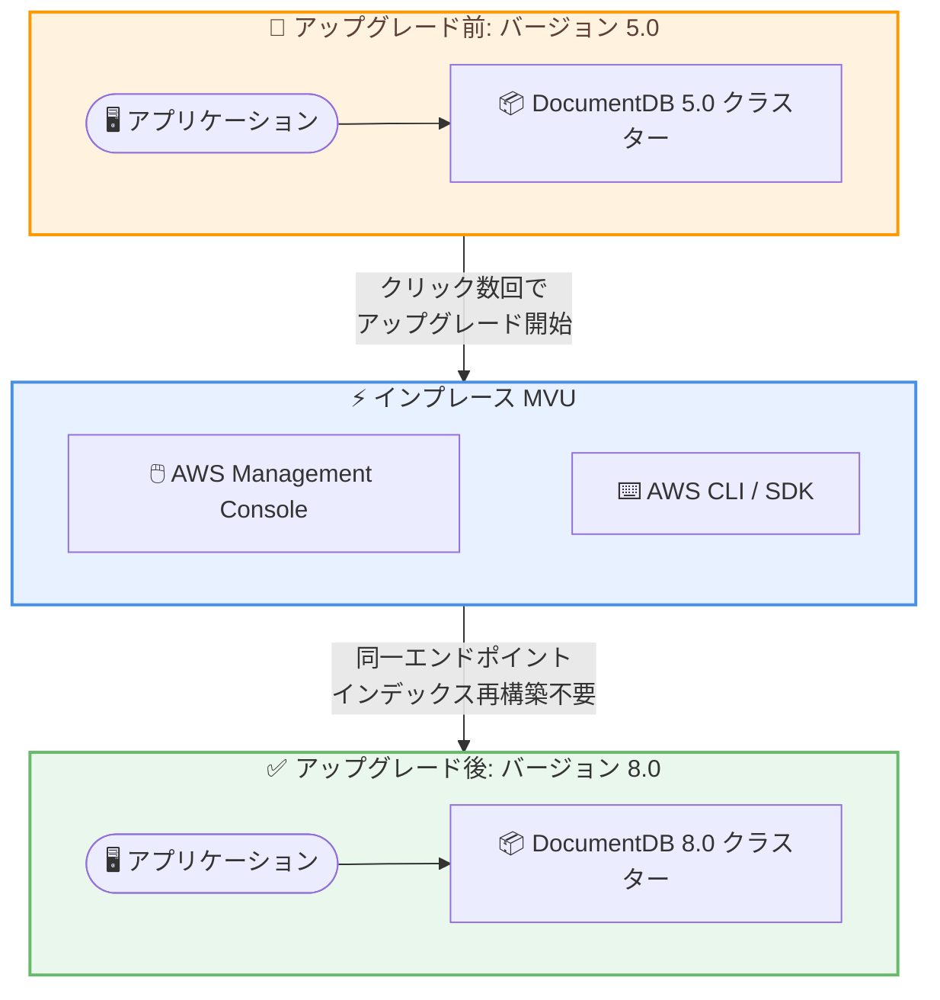

# Amazon DocumentDB - バージョン 5.0 から 8.0 へのインプレースメジャーバージョンアップグレード

**リリース日**: 2026 年 4 月 20 日
**サービス**: Amazon DocumentDB (with MongoDB compatibility)
**機能**: In-place Major Version Upgrade (MVU) from version 5.0 to 8.0

📊 [このアップデートのインフォグラフィックを見る](https://takech9203.github.io/aws-news-summary/20260420-amazon-documentdb-mongodb-in-place-version-upgrade-5-0-to-8-0.html)

## 概要

Amazon DocumentDB (with MongoDB compatibility) が、バージョン 5.0 から 8.0 へのインプレースメジャーバージョンアップグレード (MVU) をサポートしました。AWS Management Console から数回のクリックで、または AWS SDK や AWS CLI を使用してアップグレードを実行できます。新しいクラスターの作成、エンドポイントの変更、インデックスの再構築は不要です。

バージョン 8.0 へのアップグレードにより、クエリレイテンシーが最大 7 倍改善され、ストレージ圧縮が最大 5 倍向上します。これにより、アプリケーションはより少ないストレージでより高速に動作し、コスト削減につながります。さらに、コレーション、ビュー、新しい集約ステージおよびオペレーター、テキストインデックス v2 による強化されたテキスト検索、最大 30 倍高速なベクトルインデックスビルドなど、多数の新機能が追加されています。

**アップデート前の課題**

- DocumentDB 5.0 から 8.0 へアップグレードするには、新しいクラスターを作成してデータを移行する必要があり、ダウンタイムやエンドポイントの変更が発生していた
- メジャーバージョンアップグレードではインデックスの再構築が必要になる場合があり、大規模データベースでは長時間の作業が必要だった
- バージョン 5.0 ではクエリパフォーマンスやストレージ効率に制限があり、大規模ワークロードでのコスト最適化が難しかった

**アップデート後の改善**

- インプレースアップグレードにより、既存のクラスターをそのまま 8.0 に移行でき、エンドポイント変更やデータ移行が不要になった
- インデックスの再構築が不要なため、アップグレード時間が大幅に短縮された
- クエリレイテンシー最大 7 倍改善、ストレージ圧縮最大 5 倍向上により、パフォーマンスとコスト効率が大幅に改善された

## アーキテクチャ図



インプレースメジャーバージョンアップグレードにより、既存のクラスターを新しいバージョンへ直接アップグレードできます。エンドポイントの変更やインデックスの再構築は不要です。

## サービスアップデートの詳細

### 主要機能

1. **インプレースメジャーバージョンアップグレード (MVU)**
   - バージョン 5.0 から 8.0 への直接アップグレードをサポート
   - AWS Management Console、AWS SDK、AWS CLI からアップグレードを実行可能
   - 新しいクラスターの作成が不要
   - エンドポイントの変更が不要
   - インデックスの再構築が不要

2. **パフォーマンス改善**
   - クエリレイテンシーが最大 7 倍改善
   - ストレージ圧縮が最大 5 倍向上
   - ベクトルインデックスビルドが最大 30 倍高速化

3. **新機能の追加 (バージョン 8.0)**
   - コレーション (collation) のサポート
   - ビュー (views) のサポート
   - 新しい集約ステージおよびオペレーター
   - テキストインデックス v2 による強化されたテキスト検索
   - 高速なベクトルインデックスビルド

## 技術仕様

### パフォーマンス比較

| 項目 | バージョン 5.0 | バージョン 8.0 | 改善率 |
|------|---------------|---------------|--------|
| クエリレイテンシー | ベースライン | 最大 7 倍高速 | 最大 7x |
| ストレージ圧縮 | ベースライン | 最大 5 倍効率的 | 最大 5x |
| ベクトルインデックスビルド | ベースライン | 最大 30 倍高速 | 最大 30x |

### バージョン 8.0 の新機能

| 機能 | 説明 |
|------|------|
| コレーション | 言語固有のソートルールによる文字列比較のサポート |
| ビュー | 保存されたクエリに基づく仮想コレクションの作成 |
| 集約ステージ / オペレーター | 新しいデータ処理パイプラインの追加 |
| テキストインデックス v2 | 強化されたフルテキスト検索機能 |
| ベクトルインデックス | 高速なインデックスビルドによる AI/ML ワークロード対応 |

## 設定方法

### 前提条件

1. Amazon DocumentDB バージョン 5.0 のクラスターが稼働していること
2. AWS Management Console、AWS CLI、または AWS SDK へのアクセス権限があること
3. アップグレード前にクラスターのスナップショットを取得することを推奨

### 手順

#### ステップ 1: アップグレード前の準備

```bash
# クラスターの現在のバージョンを確認
aws docdb describe-db-clusters \
  --db-cluster-identifier my-docdb-cluster \
  --query "DBClusters[0].EngineVersion"
```

現在のクラスターがバージョン 5.0 であることを確認します。

#### ステップ 2: スナップショットの取得

```bash
# アップグレード前にスナップショットを作成
aws docdb create-db-cluster-snapshot \
  --db-cluster-identifier my-docdb-cluster \
  --db-cluster-snapshot-identifier my-docdb-cluster-pre-upgrade-snapshot
```

万が一のロールバックに備えて、アップグレード前にスナップショットを取得します。

#### ステップ 3: インプレースアップグレードの実行

```bash
# バージョン 8.0 へのインプレースアップグレードを実行
aws docdb modify-db-cluster \
  --db-cluster-identifier my-docdb-cluster \
  --engine-version 8.0.0 \
  --apply-immediately
```

`--apply-immediately` を指定すると即時アップグレードが開始されます。指定しない場合は次のメンテナンスウィンドウでアップグレードが実行されます。

#### ステップ 4: アップグレード状況の確認

```bash
# クラスターのステータスとバージョンを確認
aws docdb describe-db-clusters \
  --db-cluster-identifier my-docdb-cluster \
  --query "DBClusters[0].[Status, EngineVersion]"
```

ステータスが `available` に戻り、エンジンバージョンが 8.0 に更新されたことを確認します。

## メリット

### ビジネス面

- **コスト削減**: ストレージ圧縮が最大 5 倍向上することで、ストレージコストを大幅に削減可能
- **運用負荷の軽減**: インプレースアップグレードにより、データ移行やエンドポイント変更の作業が不要になり、運用チームの負担が軽減
- **ダウンタイムの最小化**: クラスターの再作成やデータ移行が不要なため、アップグレードに伴うサービス停止時間を最小化

### 技術面

- **パフォーマンス向上**: クエリレイテンシー最大 7 倍改善により、アプリケーションのレスポンス時間が大幅に短縮
- **AI/ML ワークロード対応**: ベクトルインデックスビルドが最大 30 倍高速化し、ベクトル検索を活用した AI アプリケーションの構築が容易に
- **高度なクエリ機能**: コレーション、ビュー、新しい集約オペレーターにより、複雑なデータ処理が可能に

## デメリット・制約事項

### 制限事項

- インプレース MVU はバージョン 5.0 から 8.0 への直接アップグレードに限定される (他のバージョンの組み合わせについては公式ドキュメントを確認)
- アップグレード中はクラスターが一時的に利用不可になる可能性があるため、メンテナンスウィンドウの計画が必要
- Amazon DocumentDB 8.0 が利用可能なリージョンでのみサポート

### 考慮すべき点

- アップグレード前にアプリケーションの互換性テストを実施し、バージョン 8.0 の新しい動作がアプリケーションに影響しないことを確認すること
- 本番環境でのアップグレード前に、開発環境やステージング環境で事前にテストすることを推奨
- アップグレード前にスナップショットを取得し、ロールバック手段を確保しておくこと

## ユースケース

### ユースケース 1: 大規模 EC サイトのデータベースアップグレード

**シナリオ**: 数百万件の商品カタログを管理する EC サイトが DocumentDB 5.0 を使用しており、検索パフォーマンスの改善とストレージコストの削減を求めている。

**実装例**:
```bash
# メンテナンスウィンドウを設定してアップグレード
aws docdb modify-db-cluster \
  --db-cluster-identifier ecommerce-catalog-cluster \
  --engine-version 8.0.0 \
  --preferred-maintenance-window "sun:03:00-sun:05:00"
```

**効果**: クエリレイテンシーが最大 7 倍改善され、商品検索のレスポンスが向上。ストレージ圧縮により月額ストレージコストが削減される。エンドポイント変更不要のため、アプリケーション側の修正は不要。

### ユースケース 2: AI アプリケーションのベクトル検索最適化

**シナリオ**: ベクトル検索を活用したレコメンデーションエンジンを運用しており、ベクトルインデックスの構築時間がボトルネックになっている。

**実装例**:
```bash
# インプレースアップグレードでベクトルインデックス性能を向上
aws docdb modify-db-cluster \
  --db-cluster-identifier recommendation-cluster \
  --engine-version 8.0.0 \
  --apply-immediately
```

**効果**: ベクトルインデックスビルドが最大 30 倍高速化し、新しいデータの取り込みからベクトル検索が可能になるまでの時間が大幅に短縮される。

### ユースケース 3: 多言語対応アプリケーションの機能強化

**シナリオ**: 多言語対応のコンテンツ管理システムで、言語固有のソートや検索機能が必要になっている。

**実装例**:
```javascript
// バージョン 8.0 のコレーション機能を使用した言語固有のソート
db.articles.find().collation({ locale: "ja" }).sort({ title: 1 })

// テキストインデックス v2 による強化された全文検索
db.articles.createIndex(
  { content: "text", title: "text" },
  { textIndexVersion: 2 }
)
```

**効果**: コレーション機能により日本語を含む多言語データの適切なソートが可能になり、テキストインデックス v2 により全文検索の精度と性能が向上する。

## 料金

インプレースメジャーバージョンアップグレード自体に追加料金は発生しません。通常の Amazon DocumentDB の料金体系が適用されます。

バージョン 8.0 のストレージ圧縮改善 (最大 5 倍) により、同じデータ量でもストレージ使用量が削減され、結果としてストレージコストの削減が期待できます。

### 料金構成要素

| 項目 | 説明 |
|------|------|
| インスタンス料金 | 使用するインスタンスクラスに基づく時間課金 |
| ストレージ料金 | 使用したストレージ容量に基づく GB 単位の課金 |
| I/O 料金 | 読み取り/書き込みリクエストに基づく課金 |
| バックアップストレージ | バックアップ保持期間を超えるストレージの課金 |

## 利用可能リージョン

Amazon DocumentDB 8.0 が利用可能なすべての AWS リージョンでインプレース MVU がサポートされています。具体的なリージョン一覧については、[Amazon DocumentDB のリージョン別利用可能状況](https://docs.aws.amazon.com/documentdb/latest/developerguide/regions-and-azs.html)を参照してください。

## 関連サービス・機能

- **Amazon DocumentDB 5.0 LTS**: バージョン 5.0 の長期サポートリリース。安定性を重視する場合は LTS を継続利用し、新機能やパフォーマンス改善が必要な場合は 8.0 へアップグレードを検討
- **AWS Database Migration Service (DMS)**: インプレースアップグレードが利用できない場合のデータ移行手段として活用可能
- **Amazon CloudWatch**: アップグレード前後のパフォーマンスメトリクスの監視やクエリレイテンシーの比較に使用

## 参考リンク

- 📊 [インフォグラフィック](https://takech9203.github.io/aws-news-summary/20260420-amazon-documentdb-mongodb-in-place-version-upgrade-5-0-to-8-0.html)
- [公式発表 (What's New)](https://aws.amazon.com/about-aws/whats-new/2026/04/amazon-documentdb-mongodb-in-place-version-upgrade-5-0-to-8-0/)
- [インプレース MVU ドキュメント](https://docs.aws.amazon.com/documentdb/latest/developerguide/db-cluster-update-major-version.html)
- [Amazon DocumentDB 8.0 ドキュメント](https://docs.aws.amazon.com/documentdb/latest/developerguide/what-is.html)
- [Amazon DocumentDB 料金ページ](https://aws.amazon.com/documentdb/pricing/)

## まとめ

Amazon DocumentDB のインプレースメジャーバージョンアップグレードにより、バージョン 5.0 から 8.0 への移行が大幅に簡素化されました。クエリレイテンシー最大 7 倍改善、ストレージ圧縮最大 5 倍向上、ベクトルインデックスビルド最大 30 倍高速化という大幅なパフォーマンス改善に加え、コレーションやビュー、テキストインデックス v2 など多数の新機能が利用可能になります。DocumentDB 5.0 を運用中のお客様は、エンドポイント変更やインデックス再構築が不要なインプレースアップグレードを活用して、早期にバージョン 8.0 のメリットを享受することを推奨します。
