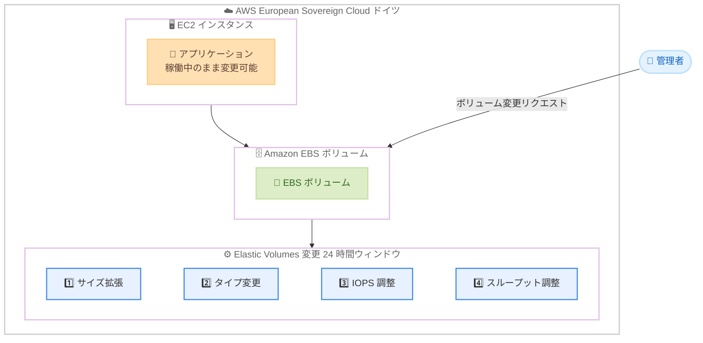

# Amazon EBS - Elastic Volumes 変更回数の拡張が AWS European Sovereign Cloud リージョンに対応

**リリース日**: 2026 年 4 月 20 日
**サービス**: Amazon Elastic Block Store (Amazon EBS)
**機能**: Elastic Volumes の 24 時間あたり最大 4 回の変更が AWS European Sovereign Cloud (ドイツ) リージョンで利用可能

📊 [このアップデートのインフォグラフィックを見る](https://takech9203.github.io/aws-news-summary/20260420-amazon-ebs-four-volume-modifications-european-sovereign-region.html)

## 概要

Amazon EBS の Elastic Volumes 機能が強化され、AWS European Sovereign Cloud (ドイツ) リージョンにおいて、1 つのボリュームに対してローリング 24 時間ウィンドウ内で最大 4 回のボリューム変更が可能になりました。Elastic Volumes を使用すると、ボリュームのサイズ拡張、タイプ変更、パフォーマンス (IOPS やスループット) の調整を、ボリュームをデタッチしたりインスタンスを再起動したりすることなく実行できます。

この機能強化により、前回の変更が完了すれば、過去 24 時間以内の変更回数が 4 回未満である限り、すぐに次の変更を開始できます。突然のデータ増加や予期しないワークロードスパイクに対して、ストレージ容量のスケーリングやパフォーマンスの調整を即座に行えるため、運用のアジリティが大幅に向上します。

この拡張は、AWS European Sovereign Cloud (ドイツ) リージョンで自動的に利用可能であり、既存のワークフローを変更する必要はありません。

**アップデート前の課題**

- AWS European Sovereign Cloud (ドイツ) リージョンでは、24 時間あたりのボリューム変更回数に制限があり、連続的なストレージ調整が困難だった
- ワークロードの急激な変動に対して迅速にボリューム構成を調整できず、運用の俊敏性に制約があった
- 変更回数の制限により、段階的なストレージスケーリングやパフォーマンスチューニングの柔軟性が不足していた

**アップデート後の改善**

- 24 時間以内に最大 4 回までボリューム変更が可能になり、急なワークロード変動への対応力が向上した
- 前回の変更が完了次第、すぐに次の変更を開始でき、連続的なストレージ最適化が実現可能になった
- 既存のワークフローを変更することなく、European Sovereign Cloud リージョンで自動的にこの機能強化が適用される

## アーキテクチャ図



AWS European Sovereign Cloud (ドイツ) リージョンにおける Elastic Volumes の変更フローを示しています。24 時間のローリングウィンドウ内で最大 4 回の変更を、インスタンスを停止せずに実行できます。

## サービスアップデートの詳細

### 主要機能

1. **24 時間あたり最大 4 回のボリューム変更**
   - ローリング 24 時間ウィンドウ内で 1 つのボリュームに対して最大 4 回の変更が可能
   - 前回の変更が完了状態 (completed) になれば、すぐに次の変更を開始可能
   - 制限を超過した場合、次の変更が可能になるタイミングを示すエラーメッセージが表示される

2. **対応する変更操作**
   - ボリュームサイズの拡張 (縮小は不可)
   - ボリュームタイプの変更 (gp2 から gp3 への変更など)
   - IOPS やスループットなどのパフォーマンスパラメータの調整

3. **無停止での変更**
   - ボリュームをデタッチしたりインスタンスを再起動する必要がない
   - アプリケーションは稼働し続け、パフォーマンスへの影響は最小限
   - ボリュームが in-use または available 状態であれば変更可能

## 技術仕様

### Elastic Volumes 変更の制限事項

| 項目 | 詳細 |
|------|------|
| 24 時間あたりの最大変更回数 | 4 回 (ローリングウィンドウ) |
| 変更の前提条件 | 前回の変更が completed 状態であること |
| サイズ変更 | 拡張のみ (縮小は不可) |
| 対象ボリューム状態 | in-use または available |
| 変更にかかる時間 | 数分から数時間 (1 TiB のボリュームで最大 6 時間が目安) |
| 変更のキャンセル | 送信後のキャンセルは不可 |

### ボリュームタイプごとの変更可能な項目

| ボリュームタイプ | サイズ変更 | タイプ変更 | IOPS 調整 | スループット調整 |
|-----------------|-----------|-----------|----------|----------------|
| gp3 | 可 | 可 | 可 | 可 |
| gp2 | 可 | 可 | N/A (サイズ連動) | N/A |
| io2 | 可 | 可 | 可 | N/A |
| io1 | 可 | 可 | 可 | N/A |
| st1 | 可 | 可 | N/A | N/A |
| sc1 | 可 | 可 | N/A | N/A |

### ボリュームの変更

```bash
# ボリュームサイズの拡張 (100 GiB から 200 GiB へ)
aws ec2 modify-volume \
  --volume-id vol-xxxxxxxxxxxxxxxxx \
  --size 200

# ボリュームタイプの変更 (gp2 から gp3 へ)
aws ec2 modify-volume \
  --volume-id vol-xxxxxxxxxxxxxxxxx \
  --volume-type gp3

# gp3 ボリュームの IOPS とスループットの調整
aws ec2 modify-volume \
  --volume-id vol-xxxxxxxxxxxxxxxxx \
  --iops 10000 \
  --throughput 400
```

## 設定方法

### 前提条件

1. AWS European Sovereign Cloud (ドイツ) リージョンへのアクセスが有効であること
2. 対象の EBS ボリュームが in-use または available 状態であること
3. 前回のボリューム変更が completed 状態であること

### 手順

#### ステップ 1: ボリュームの現在の状態を確認

```bash
# ボリュームの詳細を確認
aws ec2 describe-volumes \
  --volume-ids vol-xxxxxxxxxxxxxxxxx \
  --query 'Volumes[0].{VolumeId:VolumeId,Size:Size,VolumeType:VolumeType,Iops:Iops,Throughput:Throughput,State:State}'
```

変更対象のボリュームの現在のサイズ、タイプ、IOPS、スループット、および状態を確認します。

#### ステップ 2: ボリューム変更の実行

```bash
# ボリュームサイズの拡張とタイプ変更を同時に実行
aws ec2 modify-volume \
  --volume-id vol-xxxxxxxxxxxxxxxxx \
  --size 500 \
  --volume-type gp3 \
  --iops 6000 \
  --throughput 250
```

サイズ、タイプ、IOPS、スループットを同時に変更できます。これらは 1 回の変更操作としてカウントされます。

#### ステップ 3: 変更の進捗を監視

```bash
# ボリューム変更の進捗を確認
aws ec2 describe-volumes-modifications \
  --volume-ids vol-xxxxxxxxxxxxxxxxx \
  --query 'VolumesModifications[0].{ModificationState:ModificationState,Progress:Progress,OriginalSize:OriginalSize,TargetSize:TargetSize}'
```

変更の状態 (modifying, optimizing, completed) と進捗率を確認します。サイズの拡張は optimizing 状態に到達した時点で有効になります。

#### ステップ 4: ファイルシステムの拡張 (サイズ変更の場合)

```bash
# Linux の場合: ファイルシステムの拡張
# ext4 ファイルシステム
sudo resize2fs /dev/xvdf

# XFS ファイルシステム
sudo xfs_growfs /mount-point
```

ボリュームサイズを拡張した場合、OS 側のファイルシステムも拡張する必要があります。

## メリット

### ビジネス面

- **データ主権の確保**: AWS European Sovereign Cloud (ドイツ) リージョンで欧州のデータレジデンシー要件を満たしながら、柔軟なストレージ管理が可能になる
- **運用のアジリティ向上**: 突然のデータ増加やワークロードスパイクに対して、24 時間以内に最大 4 回の変更で迅速に対応できる
- **ダウンタイムの排除**: ボリューム変更時にインスタンスの停止が不要であり、ビジネスの継続性が維持される

### 技術面

- **段階的な最適化**: 複数回の変更を活用して、ストレージ構成を段階的にチューニングできる
- **ワークフロー変更不要**: 既存の自動化スクリプトや運用手順をそのまま使用可能
- **即座の適用**: リージョンで自動的に利用可能であり、追加設定やオプトインが不要

## デメリット・制約事項

### 制限事項

- 24 時間あたり 4 回を超えるボリューム変更はできない
- ボリュームサイズの縮小はサポートされない (拡張のみ)
- 変更リクエストの送信後にキャンセルすることはできない
- マルチアタッチが有効な io2 ボリュームではボリュームタイプの変更ができない
- マルチアタッチが有効な io1 ボリュームではタイプ、サイズ、Provisioned IOPS の変更ができない

### 考慮すべき点

- ボリューム変更の完了には数分から数時間かかる場合があり、1 TiB のボリュームで最大 6 時間程度が目安
- 完全に初期化されていないボリュームでは変更時間が長くなる可能性がある
- gp2 から gp3 に変更する際に IOPS やスループットを指定しない場合、自動的に同等以上のパフォーマンスがプロビジョニングされる
- ルートボリューム (io1, io2, gp2, gp3, standard) を st1 または sc1 に変更することはできない

## ユースケース

### ユースケース 1: 欧州のデータ主権要件に対応した段階的ストレージ拡張

**シナリオ**: ドイツを拠点とする金融機関が、欧州のデータ主権要件を満たしながら、月末の決算処理に伴うデータ増加に対応するためストレージを段階的に拡張したい。

**実装例**:
```bash
# 1 回目: ボリュームサイズを 500 GiB から 750 GiB に拡張
aws ec2 modify-volume --volume-id vol-xxx --size 750

# 2 回目: IOPS を 3000 から 6000 に引き上げ
aws ec2 modify-volume --volume-id vol-xxx --iops 6000

# 3 回目: 処理完了後、スループットを最適化
aws ec2 modify-volume --volume-id vol-xxx --throughput 400
```

**効果**: データ主権を維持しながら、24 時間以内に 3 段階のストレージ最適化を無停止で実行でき、決算処理のパフォーマンス要件を満たせる。

### ユースケース 2: ワークロードスパイクへの緊急対応

**シナリオ**: European Sovereign Cloud で運用している SaaS アプリケーションが予期しないトラフィック急増に直面し、データベースのストレージ性能を緊急に引き上げる必要がある。

**実装例**:
```bash
# 1 回目: ボリュームタイプを gp3 から io2 に変更して高 IOPS を確保
aws ec2 modify-volume \
  --volume-id vol-xxx \
  --volume-type io2 \
  --iops 32000

# 2 回目: 状況に応じてさらに IOPS を引き上げ
aws ec2 modify-volume \
  --volume-id vol-xxx \
  --iops 64000
```

**効果**: アプリケーションを停止することなく、緊急のパフォーマンス要件に段階的に対応でき、ユーザー影響を最小限に抑えられる。

### ユースケース 3: 開発環境のボリューム構成テスト

**シナリオ**: European Sovereign Cloud の開発環境で、本番環境のストレージ構成を検証するために、異なるボリューム設定を短時間で試したい。

**実装例**:
```bash
# 1 回目: gp3 でベースライン性能を測定
aws ec2 modify-volume --volume-id vol-xxx --volume-type gp3 --iops 3000

# 2 回目: gp3 で高 IOPS を測定
aws ec2 modify-volume --volume-id vol-xxx --iops 10000

# 3 回目: io2 に変更して性能を測定
aws ec2 modify-volume --volume-id vol-xxx --volume-type io2 --iops 32000

# 4 回目: io2 で最大 IOPS を測定
aws ec2 modify-volume --volume-id vol-xxx --iops 64000
```

**効果**: 24 時間以内に最大 4 パターンのストレージ構成をテストでき、本番環境に最適な構成を迅速に特定できる。

## 料金

Elastic Volumes のボリューム変更操作自体には追加料金は発生しません。変更後の新しいボリューム構成に基づく料金が、変更開始時点から適用されます。

EBS ボリュームの料金はボリュームタイプ、プロビジョニングされたサイズ、IOPS、スループットによって異なります。

### 料金例

| ボリュームタイプ | 課金項目 |
|-----------------|---------|
| gp3 | ストレージ容量 (GiB/月) + ベースライン超過分の IOPS + ベースライン超過分のスループット |
| io2 | ストレージ容量 (GiB/月) + プロビジョニング IOPS |
| gp2 | ストレージ容量 (GiB/月) |

詳細は [Amazon EBS 料金ページ](https://aws.amazon.com/ebs/pricing/) を参照してください。

## 利用可能リージョン

今回のアップデートは、AWS European Sovereign Cloud (ドイツ) リージョンで利用可能です。Elastic Volumes の 24 時間あたり最大 4 回の変更機能は、他のリージョンでも既に提供されています。

## 関連サービス・機能

- **Amazon EC2**: EBS ボリュームがアタッチされる EC2 インスタンスは、ボリューム変更中も稼働を継続でき、アプリケーションへの影響を最小限に抑える
- **Amazon CloudWatch**: EBS ボリュームのパフォーマンスメトリクス (IOPS、スループット、レイテンシ) を監視し、ボリューム変更の判断材料を提供する
- **AWS CloudTrail**: ボリューム変更操作の監査ログを記録し、コンプライアンス要件に対応する
- **Amazon EBS Snapshots**: ボリューム変更前のスナップショットを取得してバックアップを確保する手段として活用可能

## 参考リンク

- 📊 [インフォグラフィック](https://takech9203.github.io/aws-news-summary/20260420-amazon-ebs-four-volume-modifications-european-sovereign-region.html)
- [公式発表 (What's New)](https://aws.amazon.com/about-aws/whats-new/2026/04/amazon-ebs-four-volume-modifications-european-sovereign-region/)
- [ドキュメント - Elastic Volumes を使用した EBS ボリュームの変更](https://docs.aws.amazon.com/ebs/latest/userguide/ebs-modify-volume.html)
- [Amazon EBS 料金ページ](https://aws.amazon.com/ebs/pricing/)

## まとめ

Amazon EBS の Elastic Volumes 変更回数の拡張が AWS European Sovereign Cloud (ドイツ) リージョンに対応したことで、欧州のデータ主権要件を満たしながら、24 時間あたり最大 4 回のボリューム変更を無停止で実行できるようになりました。この機能強化は既存のワークフローを変更することなく自動的に適用されるため、European Sovereign Cloud を利用している、または利用を検討しているお客様は、ストレージの運用計画においてこの柔軟性を活用することを推奨します。
