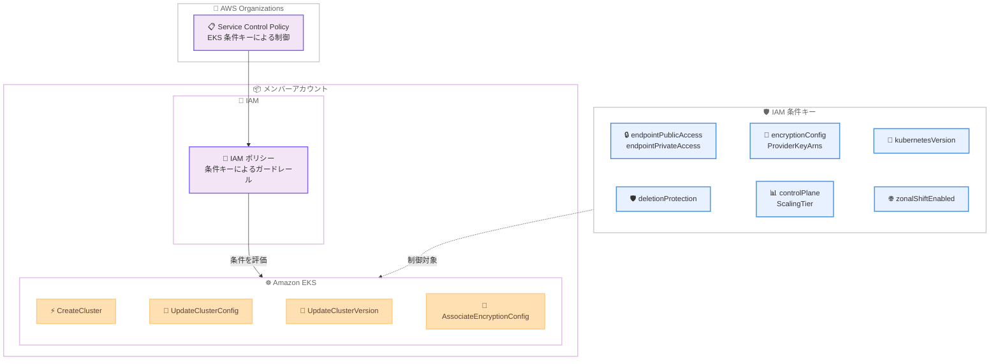

# Amazon EKS - IAM 条件キーによるクラスターガバナンスの強化

**リリース日**: 2026 年 4 月 20 日
**サービス**: Amazon Elastic Kubernetes Service (EKS)
**機能**: クラスター作成・設定 API 向けの 7 つの新しい IAM 条件キー

[このアップデートのインフォグラフィックを見る](https://takech9203.github.io/aws-news-summary/20260420-amazon-eks-iam-condition-keys.html)

## 概要

Amazon EKS がクラスター作成および設定 API に対して 7 つの新しい IAM 条件キーをサポートしました。これにより、IAM ポリシーおよび Service Control Policies (SCPs) を通じたガバナンス制御が強化され、マルチアカウント環境における EKS クラスターの構成を一元的に管理できるようになります。

今回追加された条件キーにより、エンドポイントのアクセス制御、暗号化設定、Kubernetes バージョンの制限、削除保護の強制、コントロールプレーンのスケーリングティア指定、ゾーナルシフトの有効化といった幅広い構成要素をポリシーベースで制御できます。従来は手動確認やデプロイ後のチェックに頼っていたクラスター構成の標準化を、IAM ポリシーレベルでプロアクティブに強制できるようになった点が大きな価値です。

**アップデート前の課題**

- EKS クラスターの構成 (パブリックエンドポイントの有効/無効、暗号化設定など) を IAM ポリシーで細かく制御する手段が限定的だった
- マルチアカウント環境でクラスター構成の標準化を強制するには、手動プロセスやデプロイ後の AWS Config ルールなどリアクティブな仕組みに依存していた
- SCP でクラスター作成自体の許可/拒否は可能だったが、クラスターの個別設定パラメータに対する条件付き制御ができなかった

**アップデート後の改善**

- 7 つの新しい IAM 条件キーにより、クラスター作成時および設定変更時の構成パラメータを IAM ポリシーレベルで制御可能になった
- AWS Organizations の SCP と組み合わせることで、組織全体のクラスター構成ガバナンスをプロアクティブに強制できるようになった
- 手動確認やデプロイ後のチェックが不要になり、ポリシー違反のクラスターが作成される前にブロック可能になった

## アーキテクチャ図



AWS Organizations の SCP および IAM ポリシーで新しい条件キーを使用し、EKS クラスターの作成・設定 API に対するガバナンスを適用するフローを示しています。条件キーにより、クラスター構成の各パラメータをポリシーレベルで制御します。

## サービスアップデートの詳細

### 主要機能

1. **エンドポイントアクセス制御**
   - `eks:endpointPublicAccess`: クラスター API エンドポイントのパブリックアクセスを条件として制御
   - `eks:endpointPrivateAccess`: クラスター API エンドポイントのプライベートアクセスを条件として制御
   - これらを組み合わせることで、プライベート専用エンドポイントの強制が可能

2. **暗号化設定の強制**
   - `eks:encryptionConfigProviderKeyArns`: Kubernetes シークレットの暗号化に使用する KMS キーの ARN を条件として指定
   - カスタマーマネージド KMS キーの使用を強制し、AWS マネージドキーのみの利用を防止可能

3. **Kubernetes バージョンの制限**
   - `eks:kubernetesVersion`: 使用可能な Kubernetes バージョンを条件として制限
   - 組織で承認済みのバージョンのみにクラスター作成・アップグレードを限定可能

4. **削除保護の強制**
   - `eks:deletionProtection`: クラスターの削除保護設定を条件として制御
   - 本番環境ワークロード向けクラスターの誤削除を防止

5. **コントロールプレーンスケーリングティアの指定**
   - `eks:controlPlaneScalingTier`: コントロールプレーンのスケーリングティアを条件として指定
   - ワークロード要件に応じた適切なティアの使用を強制可能

6. **ゾーナルシフトの強制**
   - `eks:zonalShiftEnabled`: ゾーナルシフト機能の有効/無効を条件として制御
   - 高可用性が求められるワークロードに対してゾーナルシフトの有効化を強制可能

## 技術仕様

### 条件キーの一覧

| 条件キー | 型 | 対象 API | 説明 |
|---------|-----|---------|------|
| `eks:endpointPublicAccess` | Bool | CreateCluster, UpdateClusterConfig | パブリック API エンドポイントの許可/拒否 |
| `eks:endpointPrivateAccess` | Bool | CreateCluster, UpdateClusterConfig | プライベート API エンドポイントの許可/拒否 |
| `eks:encryptionConfigProviderKeyArns` | ARN | CreateCluster, AssociateEncryptionConfig | シークレット暗号化用 KMS キー ARN |
| `eks:kubernetesVersion` | String | CreateCluster, UpdateClusterVersion | Kubernetes バージョン |
| `eks:deletionProtection` | String | CreateCluster, UpdateClusterConfig | 削除保護の有効/無効 |
| `eks:controlPlaneScalingTier` | String | CreateCluster, UpdateClusterConfig | コントロールプレーンスケーリングティア |
| `eks:zonalShiftEnabled` | Bool | CreateCluster, UpdateClusterConfig | ゾーナルシフトの有効/無効 |

### 対象 API

| API | 説明 |
|-----|------|
| `CreateCluster` | 新しい EKS クラスターの作成 |
| `UpdateClusterConfig` | 既存クラスターの設定変更 |
| `UpdateClusterVersion` | クラスターの Kubernetes バージョン更新 |
| `AssociateEncryptionConfig` | クラスターへの暗号化設定の関連付け |

### IAM ポリシーでの条件キー使用例

```json
{
    "Version": "2012-10-17",
    "Statement": [
        {
            "Sid": "EnforcePrivateEndpoint",
            "Effect": "Deny",
            "Action": [
                "eks:CreateCluster",
                "eks:UpdateClusterConfig"
            ],
            "Resource": "*",
            "Condition": {
                "Bool": {
                    "eks:endpointPublicAccess": "true"
                }
            }
        }
    ]
}
```

## 設定方法

### 前提条件

1. AWS Organizations が有効化されていること (SCP を使用する場合)
2. IAM ポリシーの作成・編集権限があること
3. EKS クラスターの管理権限があること

### 手順

#### ステップ 1: プライベートエンドポイントを強制する SCP の作成

```json
{
    "Version": "2012-10-17",
    "Statement": [
        {
            "Sid": "DenyPublicEKSEndpoint",
            "Effect": "Deny",
            "Action": [
                "eks:CreateCluster",
                "eks:UpdateClusterConfig"
            ],
            "Resource": "*",
            "Condition": {
                "Bool": {
                    "eks:endpointPublicAccess": "true"
                }
            }
        },
        {
            "Sid": "RequirePrivateEKSEndpoint",
            "Effect": "Deny",
            "Action": [
                "eks:CreateCluster",
                "eks:UpdateClusterConfig"
            ],
            "Resource": "*",
            "Condition": {
                "Bool": {
                    "eks:endpointPrivateAccess": "false"
                }
            }
        }
    ]
}
```

この SCP は、パブリックエンドポイントが有効なクラスターの作成・設定変更を拒否し、プライベートエンドポイントが無効なクラスターの作成・設定変更を拒否します。結果として、プライベート専用エンドポイントのみを許可します。

#### ステップ 2: カスタマーマネージド KMS キーを強制する SCP の作成

```json
{
    "Version": "2012-10-17",
    "Statement": [
        {
            "Sid": "RequireCustomerManagedKMSKey",
            "Effect": "Deny",
            "Action": [
                "eks:CreateCluster",
                "eks:AssociateEncryptionConfig"
            ],
            "Resource": "*",
            "Condition": {
                "ForAllValues:ArnNotLike": {
                    "eks:encryptionConfigProviderKeyArns": "arn:aws:kms:*:*:key/*"
                }
            }
        }
    ]
}
```

この SCP は、カスタマーマネージド KMS キーが指定されていないクラスターの作成および暗号化設定の関連付けを拒否します。

#### ステップ 3: Kubernetes バージョンと削除保護を強制する SCP の作成

```json
{
    "Version": "2012-10-17",
    "Statement": [
        {
            "Sid": "RestrictKubernetesVersion",
            "Effect": "Deny",
            "Action": [
                "eks:CreateCluster",
                "eks:UpdateClusterVersion"
            ],
            "Resource": "*",
            "Condition": {
                "StringNotEquals": {
                    "eks:kubernetesVersion": [
                        "1.31",
                        "1.32"
                    ]
                }
            }
        },
        {
            "Sid": "RequireDeletionProtection",
            "Effect": "Deny",
            "Action": [
                "eks:CreateCluster",
                "eks:UpdateClusterConfig"
            ],
            "Resource": "*",
            "Condition": {
                "StringNotEquals": {
                    "eks:deletionProtection": "ENABLED"
                }
            }
        }
    ]
}
```

この SCP は、承認済みの Kubernetes バージョン (1.31 または 1.32) 以外でのクラスター作成・バージョン更新を拒否し、削除保護が有効でないクラスターの作成・設定変更を拒否します。

#### ステップ 4: SCP をOrganizations の OU にアタッチ

```bash
# SCP を作成
aws organizations create-policy \
  --name "EKS-Governance-Policy" \
  --description "Enforce EKS cluster governance with IAM condition keys" \
  --type SERVICE_CONTROL_POLICY \
  --content file://eks-governance-scp.json

# SCP を OU にアタッチ
aws organizations attach-policy \
  --policy-id p-xxxxxxxxxxxx \
  --target-id ou-xxxx-xxxxxxxx
```

作成した SCP を AWS Organizations の組織単位 (OU) にアタッチすることで、OU 配下のすべてのアカウントに対してポリシーが適用されます。

## メリット

### ビジネス面

- **コンプライアンスの自動化**: IAM ポリシーレベルでクラスター構成を強制することで、手動レビューやデプロイ後の監査に依存しない自動化されたコンプライアンス体制を構築可能
- **マルチアカウントガバナンスの強化**: SCP と組み合わせることで、組織全体のすべてのアカウントに対して一貫したクラスター構成ポリシーを適用可能
- **運用リスクの軽減**: 削除保護の強制やパブリックエンドポイントの制限により、人的ミスによるセキュリティインシデントや本番環境の誤削除を予防

### 技術面

- **プロアクティブなポリシー適用**: クラスター作成時点で構成違反をブロックできるため、後からの修正コストが不要
- **きめ細かいアクセス制御**: 7 つの条件キーにより、エンドポイント、暗号化、バージョン、可用性など多角的な構成要素を個別に制御可能
- **既存の IAM インフラとの統合**: 新しいツールやサービスの導入が不要であり、既存の IAM ポリシーと SCP の仕組みをそのまま活用可能

## デメリット・制約事項

### 制限事項

- 条件キーは対象 API (CreateCluster, UpdateClusterConfig, UpdateClusterVersion, AssociateEncryptionConfig) に対してのみ適用され、既存クラスターの構成を自動修正する機能はない
- 既にデプロイ済みのクラスターには遡及適用されないため、既存クラスターの構成適合性は別途確認が必要
- SCP の最大文字数制限 (5,120 文字) があるため、多数の条件キーを含む複雑なポリシーでは分割が必要になる場合がある

### 考慮すべき点

- 複数の条件キーを組み合わせる場合、ポリシーの論理構造 (AND/OR の組み合わせ) を慎重に設計する必要がある
- 条件キーの値が API リクエストに含まれない場合の挙動 (条件の評価結果) を理解した上でポリシーを設計する必要がある
- 既存クラスターの構成適合性を確認するには、AWS Config のカスタムルールや EKS API の DescribeCluster を使用した別途の監査が必要

## ユースケース

### ユースケース 1: 金融機関のセキュアクラスター強制

**シナリオ**: 金融機関が複数の AWS アカウントで EKS クラスターを運用しており、すべてのクラスターでプライベートエンドポイント、カスタマーマネージド KMS キーによるシークレット暗号化、削除保護を必須とするセキュリティポリシーがある。

**実装例**:
```json
{
    "Version": "2012-10-17",
    "Statement": [
        {
            "Sid": "DenyPublicEndpoint",
            "Effect": "Deny",
            "Action": ["eks:CreateCluster", "eks:UpdateClusterConfig"],
            "Resource": "*",
            "Condition": {
                "Bool": {
                    "eks:endpointPublicAccess": "true"
                }
            }
        },
        {
            "Sid": "RequireKMSEncryption",
            "Effect": "Deny",
            "Action": ["eks:CreateCluster", "eks:AssociateEncryptionConfig"],
            "Resource": "*",
            "Condition": {
                "Null": {
                    "eks:encryptionConfigProviderKeyArns": "true"
                }
            }
        },
        {
            "Sid": "RequireDeletionProtection",
            "Effect": "Deny",
            "Action": ["eks:CreateCluster", "eks:UpdateClusterConfig"],
            "Resource": "*",
            "Condition": {
                "StringNotEquals": {
                    "eks:deletionProtection": "ENABLED"
                }
            }
        }
    ]
}
```

**効果**: 組織全体のすべてのアカウントで、セキュリティ要件を満たさない EKS クラスターの作成が自動的にブロックされ、コンプライアンス違反を未然に防止できる。

### ユースケース 2: 標準化された Kubernetes バージョン管理

**シナリオ**: 大規模な組織でプラットフォームチームが、すべての開発チームが使用する Kubernetes バージョンを組織承認済みのバージョンに制限し、サポート切れのバージョンでのクラスター作成を防止したい。

**実装例**:
```json
{
    "Version": "2012-10-17",
    "Statement": [
        {
            "Sid": "RestrictToApprovedVersions",
            "Effect": "Deny",
            "Action": [
                "eks:CreateCluster",
                "eks:UpdateClusterVersion"
            ],
            "Resource": "*",
            "Condition": {
                "StringNotEquals": {
                    "eks:kubernetesVersion": [
                        "1.31",
                        "1.32"
                    ]
                }
            }
        }
    ]
}
```

**効果**: 組織で承認されたバージョンのみでクラスターが作成・更新されるため、セキュリティパッチの適用状況やサポートライフサイクルの一元管理が容易になる。

### ユースケース 3: 本番環境の高可用性ガードレール

**シナリオ**: 本番環境の OU に属するアカウントでは、すべての EKS クラスターにゾーナルシフトの有効化と削除保護を強制し、障害時の可用性と誤操作防止を確保したい。

**実装例**:
```json
{
    "Version": "2012-10-17",
    "Statement": [
        {
            "Sid": "RequireZonalShift",
            "Effect": "Deny",
            "Action": ["eks:CreateCluster", "eks:UpdateClusterConfig"],
            "Resource": "*",
            "Condition": {
                "Bool": {
                    "eks:zonalShiftEnabled": "false"
                }
            }
        },
        {
            "Sid": "RequireDeletionProtection",
            "Effect": "Deny",
            "Action": ["eks:CreateCluster", "eks:UpdateClusterConfig"],
            "Resource": "*",
            "Condition": {
                "StringNotEquals": {
                    "eks:deletionProtection": "ENABLED"
                }
            }
        }
    ]
}
```

**効果**: 本番環境のクラスターには必ずゾーナルシフトと削除保護が有効化されるため、AZ 障害時の自動フェイルオーバーと誤削除防止のガードレールが確立される。

## 料金

新しい IAM 条件キーの使用に追加料金は発生しません。Amazon EKS の既存の料金体系がそのまま適用されます。

### 料金例

| 項目 | 料金 |
|------|------|
| EKS クラスター | $0.10/時間 |
| IAM 条件キー | 追加料金なし |
| SCP | 追加料金なし |

## 利用可能リージョン

Amazon EKS が利用可能なすべての AWS リージョンで、新しい IAM 条件キーを利用できます。

## 関連サービス・機能

- **AWS Organizations / SCP**: 条件キーを SCP に組み込むことで、マルチアカウント環境全体にガバナンスポリシーを適用可能
- **AWS IAM**: 条件キーは IAM ポリシーの Condition 要素で使用し、きめ細かいアクセス制御を実現
- **AWS KMS**: `eks:encryptionConfigProviderKeyArns` 条件キーと組み合わせて、カスタマーマネージド KMS キーによる暗号化を強制
- **AWS Config**: 既存クラスターの構成適合性を監視するカスタムルールと組み合わせて包括的なガバナンスを実現
- **Amazon Route 53 Application Recovery Controller**: ゾーナルシフト機能と連携し、AZ 障害時の高可用性を確保

## 参考リンク

- [インフォグラフィック](https://takech9203.github.io/aws-news-summary/20260420-amazon-eks-iam-condition-keys.html)
- [公式発表 (What's New)](https://aws.amazon.com/about-aws/whats-new/2026/04/amazon-eks-iam-condition-keys/)
- [Amazon EKS ユーザーガイド - IAM 条件キー](https://docs.aws.amazon.com/eks/latest/userguide/security_iam_service-with-iam.html)
- [Amazon EKS のサービス認可リファレンス](https://docs.aws.amazon.com/service-authorization/latest/reference/list_amazonelastickubernetesservice.html)
- [AWS Organizations - SCP ドキュメント](https://docs.aws.amazon.com/organizations/latest/userguide/orgs_manage_policies_scps.html)
- [Amazon EKS 料金ページ](https://aws.amazon.com/eks/pricing/)

## まとめ

Amazon EKS が 7 つの新しい IAM 条件キーをサポートし、クラスター作成・設定 API に対するガバナンス制御が大幅に強化されました。エンドポイントアクセス、暗号化、Kubernetes バージョン、削除保護、コントロールプレーンスケーリング、ゾーナルシフトといった構成要素を IAM ポリシーおよび SCP レベルでプロアクティブに制御できるようになったことで、マルチアカウント環境でのセキュリティとコンプライアンスの自動化が実現します。既存の IAM インフラをそのまま活用できるため、EKS クラスターを運用するすべての組織で、SCP への条件キー追加を検討することを推奨します。
