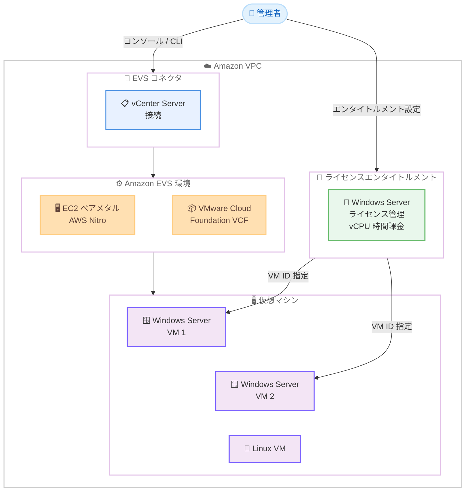

# Amazon EVS - Microsoft Windows Server ライセンスの提供開始

**リリース日**: 2026 年 4 月 20 日
**サービス**: Amazon Elastic VMware Service (Amazon EVS)
**機能**: Microsoft Windows Server ライセンスエンタイトルメント

📊 [このアップデートのインフォグラフィックを見る](https://takech9203.github.io/aws-news-summary/20260420-amazon-evs-windows-server-licensing.html)

## 概要

Amazon Elastic VMware Service (Amazon EVS) が Microsoft Windows Server ライセンスエンタイトルメントの提供を開始しました。これにより、EVS 環境内で Windows Server OS を実行する仮想マシン (VM) を移行または新規作成し、AWS から直接 Windows Server ライセンスを取得できるようになります。

Amazon EVS は、Amazon VPC 内の EC2 ベアメタルインスタンス上で VMware Cloud Foundation (VCF) を直接実行できるサービスです。AWS Nitro によって駆動されるこのサービスに、今回 Windows Server ライセンスの管理機能が追加されました。EVS コネクタを VMware vCenter Server に設定し、Amazon EVS コンソールまたは AWS CLI を使用してエンタイトルメント対象の Windows Server VM の VM ID を指定するだけで、ライセンスを取得できます。料金は vCPU 時間単位の従量課金制で、エンタイトルメントはいつでも追加・削除が可能です。

**アップデート前の課題**

- EVS 環境で Windows Server VM を実行する場合、ユーザーが別途 Windows Server ライセンスを調達・管理する必要があった
- オンプレミスの VMware 環境から Windows Server ワークロードを EVS に移行する際、ライセンスの持ち込み (BYOL) やライセンスの再取得が必要だった
- Windows Server ライセンスの管理が EVS とは別のプロセスとなり、運用が複雑化していた

**アップデート後の改善**

- EVS コンソールまたは AWS CLI から直接 Windows Server ライセンスエンタイトルメントを取得・管理できるようになった
- vCPU 時間単位の従量課金制により、使用した分だけの支払いで済むようになった
- エンタイトルメントをいつでも追加・削除でき、柔軟なライセンス管理が可能になった

## アーキテクチャ図



Amazon EVS 環境における Windows Server ライセンスエンタイトルメントの構成を示しています。管理者は EVS コネクタを通じて vCenter Server に接続し、個々の Windows Server VM に対してエンタイトルメントを設定します。

## サービスアップデートの詳細

### 主要機能

1. **Windows Server ライセンスエンタイトルメント**
   - EVS 環境内の Windows Server VM に対して AWS から直接ライセンスを取得可能
   - VM 単位でエンタイトルメントを付与し、vCPU 時間ベースで課金される
   - エンタイトルメントはいつでも追加・削除が可能で、柔軟な管理を実現

2. **EVS コネクタ**
   - VMware vCenter Server への接続を確立するコネクタ機能
   - コネクタを通じて vCenter 上の VM 情報を取得し、エンタイトルメント対象の VM を指定可能
   - Amazon EVS コンソールまたは AWS CLI から設定可能

3. **従量課金制のライセンスモデル**
   - vCPU 時間単位の課金により、使用した分だけの支払いで済む
   - 長期のライセンス契約や事前購入が不要
   - VM の起動・停止に応じてライセンスコストが自動的に調整される

## 技術仕様

### ライセンス管理の概要

| 項目 | 詳細 |
|------|------|
| 対象 OS | Microsoft Windows Server |
| 課金単位 | vCPU 時間 |
| 管理インターフェース | Amazon EVS コンソール、AWS CLI |
| 接続方式 | EVS コネクタ経由で vCenter Server に接続 |
| エンタイトルメント管理 | VM ID を指定して個別に付与・削除 |
| 基盤インフラ | EC2 ベアメタルインスタンス (AWS Nitro) |
| VMware 基盤 | VMware Cloud Foundation (VCF) |

### API 変更履歴

| 日付 | サービス | 変更内容 |
|------|----------|----------|
| 2026/04/20 | [Amazon Elastic VMware Service](https://awsapichanges.com/archive/changes/20bd7a-evs.html) | 7 new 3 updated api methods - vCenter アプライアンスへのコネクタ作成と EVS 環境内の VM に対する Windows Server エンタイトルメント作成が可能に |

### IAM ポリシーの例

```json
{
  "Version": "2012-10-17",
  "Statement": [
    {
      "Effect": "Allow",
      "Action": [
        "evs:CreateConnector",
        "evs:CreateEntitlement",
        "evs:DeleteEntitlement",
        "evs:ListEntitlements",
        "evs:GetEntitlement",
        "evs:ListConnectors",
        "evs:GetConnector"
      ],
      "Resource": "*"
    }
  ]
}
```

## 設定方法

### 前提条件

1. Amazon EVS 環境が構築済みで、VMware Cloud Foundation (VCF) が稼働している
2. vCenter Server がアクセス可能な状態である
3. Windows Server VM が EVS 環境内で作成済みまたは移行済みである
4. 適切な IAM 権限が付与されている

### 手順

#### ステップ 1: EVS コネクタの作成

```bash
# EVS コネクタを作成して vCenter Server に接続
aws evs create-connector \
  --vcenter-url "https://vcenter.example.com" \
  --environment-id env-xxxxxxxxxxxxxxxxx \
  --name "my-vcenter-connector"
```

EVS コネクタを作成し、VMware vCenter Server への接続を確立します。これにより、vCenter 上の VM 情報を EVS から参照できるようになります。

#### ステップ 2: Windows Server VM の確認

```bash
# コネクタ経由で利用可能な VM を一覧表示
aws evs list-connectors \
  --environment-id env-xxxxxxxxxxxxxxxxx
```

作成したコネクタの情報を確認し、vCenter Server に正常に接続されていることを検証します。

#### ステップ 3: Windows Server エンタイトルメントの作成

```bash
# Windows Server VM にエンタイトルメントを付与
aws evs create-entitlement \
  --environment-id env-xxxxxxxxxxxxxxxxx \
  --vm-id vm-xxxxxxxxxxxxxxxxx \
  --entitlement-type WINDOWS_SERVER
```

対象の Windows Server VM の VM ID を指定して、ライセンスエンタイトルメントを作成します。エンタイトルメントが付与されると、vCPU 時間ベースの課金が開始されます。

#### ステップ 4: エンタイトルメントの確認

```bash
# エンタイトルメントの一覧を確認
aws evs list-entitlements \
  --environment-id env-xxxxxxxxxxxxxxxxx
```

作成したエンタイトルメントが正しく設定されていることを確認します。

## メリット

### ビジネス面

- **ライセンス調達の簡素化**: AWS から直接 Windows Server ライセンスを取得でき、個別のライセンス契約や調達プロセスが不要になる
- **コスト最適化**: vCPU 時間単位の従量課金により、実際の使用量に基づいた支払いが可能になり、未使用ライセンスのコストを削減できる
- **VMware 移行の加速**: オンプレミスの VMware 環境から Windows Server ワークロードを EVS に移行する際のライセンス関連の障壁が低減される

### 技術面

- **統合管理**: EVS コンソールまたは AWS CLI から VM の管理とライセンスの管理を一元的に行える
- **柔軟なスケーリング**: エンタイトルメントをいつでも追加・削除でき、ワークロードの変化に迅速に対応できる
- **API による自動化**: AWS CLI および API を通じたエンタイトルメント管理により、Infrastructure as Code での自動化が可能

## デメリット・制約事項

### 制限事項

- Windows Server ライセンスエンタイトルメントは EVS 環境内の VM にのみ適用され、他の EC2 インスタンスには使用できない
- 既存の BYOL (Bring Your Own License) ライセンスとの併用に関する制約がある場合がある
- vCPU 時間単位の課金は、常時稼働する大規模 VM では長期ライセンスと比較してコストが高くなる可能性がある

### 考慮すべき点

- EVS コネクタの設定には vCenter Server への適切なアクセス権限が必要である
- エンタイトルメントの追加・削除は即座に反映されるが、課金の開始・停止タイミングについて正確な仕様を確認することが推奨される
- Windows Server のバージョンごとのサポート状況について、最新のドキュメントを確認する必要がある

## ユースケース

### ユースケース 1: オンプレミス VMware 環境からの移行

**シナリオ**: オンプレミスの VMware 環境で多数の Windows Server VM を運用している企業が、インフラストラクチャの近代化のために AWS に移行したい。

**実装例**:
```bash
# 1. EVS 環境にコネクタを作成
aws evs create-connector \
  --vcenter-url "https://vcenter.example.com" \
  --environment-id env-xxxxxxxxxxxxxxxxx \
  --name "migration-connector"

# 2. 移行した Windows Server VM にエンタイトルメントを付与
aws evs create-entitlement \
  --environment-id env-xxxxxxxxxxxxxxxxx \
  --vm-id vm-migrated-001 \
  --entitlement-type WINDOWS_SERVER
```

**効果**: 既存の VMware ツールとワークフローを維持しながら AWS に移行でき、Windows Server ライセンスも AWS から直接取得できるため、移行に伴うライセンス調達の手間が大幅に削減される。

### ユースケース 2: 開発・テスト環境の柔軟な構築

**シナリオ**: ソフトウェア開発チームが Windows Server 上で動作するアプリケーションの開発・テスト環境を必要に応じて構築・削除したい。

**実装例**:
```bash
# 開発環境の Windows Server VM にエンタイトルメントを追加
aws evs create-entitlement \
  --environment-id env-xxxxxxxxxxxxxxxxx \
  --vm-id vm-dev-windows-01 \
  --entitlement-type WINDOWS_SERVER

# テスト完了後にエンタイトルメントを削除
aws evs delete-entitlement \
  --environment-id env-xxxxxxxxxxxxxxxxx \
  --entitlement-id ent-xxxxxxxxxxxxxxxxx
```

**効果**: vCPU 時間単位の従量課金により、使用しない期間のライセンスコストを削減でき、開発・テストサイクルに合わせた柔軟なライセンス管理が可能になる。

### ユースケース 3: ハイブリッドクラウド環境での Windows ワークロード運用

**シナリオ**: オンプレミスと AWS の両方に VMware 環境を持つ企業が、ワークロードの負荷に応じて Windows Server VM をクラウドにバーストさせたい。

**実装例**:
```bash
# 需要増加時に追加の Windows Server VM にエンタイトルメントを付与
for vm_id in vm-burst-001 vm-burst-002 vm-burst-003; do
  aws evs create-entitlement \
    --environment-id env-xxxxxxxxxxxxxxxxx \
    --vm-id $vm_id \
    --entitlement-type WINDOWS_SERVER
done
```

**効果**: 需要のピーク時のみ EVS 環境で Windows Server VM を稼働させ、従量課金のライセンスモデルによりコストを最適化しながらハイブリッドクラウドの柔軟性を活用できる。

## 料金

Windows Server ライセンスエンタイトルメントは vCPU 時間単位の従量課金制です。VM が使用する vCPU 数に基づいて課金され、エンタイトルメントの追加・削除はいつでも可能です。別途 Amazon EVS の基盤となる EC2 ベアメタルインスタンスや VMware Cloud Foundation のコストが発生します。

詳細な料金については [Amazon EVS 料金ページ](https://aws.amazon.com/evs/pricing/) を参照してください。

### 料金例

| 項目 | 課金体系 |
|------|----------|
| Windows Server ライセンス | vCPU 時間単位の従量課金 |
| EVS 基盤 (EC2 ベアメタル) | インスタンス時間単位 |
| VMware Cloud Foundation | EVS 料金に含まれる |

## 利用可能リージョン

Amazon EVS が利用可能なすべてのリージョンで Windows Server ライセンスエンタイトルメントを利用できます。リージョンの最新情報については [AWS リージョン別サービス提供状況](https://aws.amazon.com/about-aws/global-infrastructure/regional-product-services/) を参照してください。

## 関連サービス・機能

- **Amazon EVS**: VMware Cloud Foundation を Amazon VPC 内の EC2 ベアメタルインスタンス上で実行するサービス。今回の Windows Server ライセンス機能の基盤となる
- **VMware Cloud Foundation (VCF)**: EVS 上で稼働する VMware の統合プラットフォーム。vSphere、vSAN、NSX を含み、VM のライフサイクル管理を担う
- **AWS Migration Hub**: オンプレミスから AWS への移行を追跡・管理するサービス。VMware ワークロードの移行計画に活用できる
- **AWS Nitro System**: EVS の基盤となるハードウェアセキュリティと仮想化技術。EC2 ベアメタルインスタンスの高いパフォーマンスを実現する

## 参考リンク

- 📊 [インフォグラフィック](https://takech9203.github.io/aws-news-summary/20260420-amazon-evs-windows-server-licensing.html)
- [公式発表 (What's New)](https://aws.amazon.com/about-aws/whats-new/2026/04/amazon-evs-windows-server-licensing/)
- [AWS Blog - What's New: Amazon EVS Now Offers Windows Server Licensing for Your VMware Migrations](https://aws.amazon.com/blogs/migration-and-modernization/whats-new-amazon-evs-now-offers-windows-server-licensing-for-your-vmware-migrations/)
- [Amazon EVS ドキュメント](https://docs.aws.amazon.com/evs/)
- [Amazon EVS 料金ページ](https://aws.amazon.com/evs/pricing/)

## まとめ

Amazon EVS での Microsoft Windows Server ライセンスエンタイトルメントの提供開始は、VMware 環境から AWS への Windows Server ワークロード移行を大幅に簡素化するアップデートです。vCPU 時間単位の従量課金制により、ライセンスコストの最適化と柔軟な管理が実現されます。オンプレミスの VMware 環境で Windows Server を運用しているお客様は、EVS への移行を検討する際にこの新しいライセンスオプションを活用することで、移行の複雑さとコストを削減できます。
