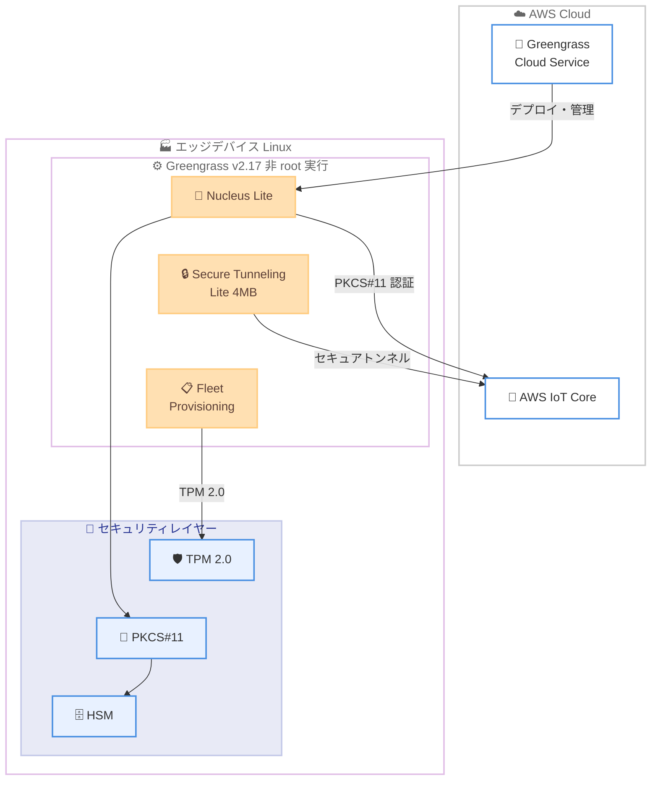

# AWS IoT Greengrass v2.17 - 非 root インストールと軽量コンポーネントの導入

**リリース日**: 2026 年 4 月 20 日
**サービス**: AWS IoT Greengrass
**機能**: 非 root ユーザーでのインストール・実行、軽量コンポーネント

📊 [このアップデートのインフォグラフィックを見る](https://takech9203.github.io/aws-news-summary/20260420-aws-iot-greengrass-v217.html)

## 概要

AWS IoT Greengrass v2.17 がリリースされ、Linux システム上でエッジランタイムを非 root ユーザーとして実行できるようになりました。また、メモリ使用量を大幅に削減した軽量コンポーネントが導入されています。AWS IoT Greengrass は、エッジデバイス上でソフトウェアを構築、デプロイ、管理するための IoT エッジランタイムおよびクラウドサービスです。

今回のリリースでは、エンタープライズや規制環境において root アクセスが禁止されているケースに対応するため、非 root ユーザーでのインストールと実行をサポートしました。さらに、コンポーネントの削除時に自動的に起動するアンインストールライフサイクル機能が追加され、依存関係管理が簡素化されています。加えて、Nucleus Lite コンポーネント群にメモリ消費を削減する複数の機能強化が行われています。

**アップデート前の課題**

- AWS IoT Greengrass の Linux へのインストールと実行には root 権限が必要であり、セキュリティポリシーで root アクセスが制限された環境では導入が困難だった
- コンポーネントの削除時にクリーンアップ処理を手動で実行する必要があり、依存関係の管理が煩雑だった
- Secure Tunneling コンポーネントが 36MB のメモリを消費し、リソースが限られたエッジデバイスでの運用に制約があった
- TPM 2.0 を利用した暗号化操作やデバイス ID 管理がフリートプロビジョニングでサポートされていなかった
- HSM に保存された鍵や証明書を使用した AWS IoT Core への認証が Nucleus Lite では困難だった

**アップデート後の改善**

- 非 root ユーザーで AWS IoT Greengrass をインストール・実行できるようになり、root アクセスが禁止された環境でも導入可能になった
- アンインストールライフサイクル機能により、コンポーネント削除時のクリーンアップが自動化された
- Secure Tunneling Lite コンポーネントのメモリ使用量が 36MB から 4MB に削減され、リソース制約のあるデバイスでも利用可能になった
- Fleet Provisioning コンポーネントが TPM 2.0 をサポートし、ハードウェアベースのセキュリティが強化された
- PKCS#11 インターフェースにより、HSM に保存された鍵・証明書を使用した認証が Nucleus Lite で可能になった

## アーキテクチャ図



この図は、AWS IoT Greengrass v2.17 のエッジデバイス上での構成を示しています。非 root ユーザーで実行される Nucleus Lite を中心に、Secure Tunneling Lite や Fleet Provisioning コンポーネントが動作し、HSM/TPM 2.0 と PKCS#11 を介して AWS IoT Core と安全に通信します。

## サービスアップデートの詳細

### 主要機能

1. **非 root ユーザーでのインストールと実行**
   - Linux システム上で AWS IoT Greengrass v2.17 を非 root ユーザーとしてインストール・実行可能
   - エンタープライズや規制環境において root アクセスが禁止されているケースに対応
   - 最小権限の原則に基づいたセキュリティモデルを実現

2. **アンインストールライフサイクル機能**
   - コンポーネントをデバイスから削除する際に自動的にアクティブ化
   - 一時ファイルや設定の自動クリーンアップにより依存関係管理を簡素化
   - デバイスの状態管理が容易になり、運用負荷を軽減

3. **Secure Tunneling Lite コンポーネント**
   - メモリ使用量を 36MB から 4MB に大幅削減 (約 89% 削減)
   - リソースが限られたエッジデバイスでもセキュアトンネリング機能を利用可能
   - Nucleus Lite エコシステムの一部として提供

4. **Fleet Provisioning の TPM 2.0 サポート**
   - Trusted Platform Module (TPM) 2.0 による暗号化操作をサポート
   - ハードウェアベースのデバイス ID 管理によりセキュリティを強化
   - デバイスのフリートプロビジョニングプロセスの信頼性向上

5. **PKCS#11 インターフェース**
   - Nucleus Lite コンポーネントが PKCS#11 を介して AWS IoT Core と認証可能
   - Hardware Security Module (HSM) に保存された鍵や証明書を利用
   - ハードウェアレベルのセキュリティにより、秘密鍵の漏洩リスクを低減

## 技術仕様

### コンポーネントのメモリ使用量比較

| コンポーネント | v2.17 以前 | v2.17 Lite | 削減率 |
|----------------|-----------|-----------|--------|
| Secure Tunneling | 36MB | 4MB | 約 89% |

### セキュリティ機能

| 機能 | 説明 |
|------|------|
| 非 root 実行 | Linux システムで非 root ユーザーとしてインストール・実行 |
| TPM 2.0 | Fleet Provisioning でのハードウェアベース暗号化操作 |
| PKCS#11 | HSM に保存された鍵・証明書による AWS IoT Core 認証 |
| アンインストールライフサイクル | コンポーネント削除時の自動クリーンアップ |

### 対応プラットフォーム

| 項目 | 詳細 |
|------|------|
| OS | Linux (非 root インストール対応) |
| ランタイム | AWS IoT Greengrass v2.17 |
| セキュリティモジュール | TPM 2.0、HSM (PKCS#11 対応) |

## 設定方法

### 前提条件

1. Linux ベースのエッジデバイス
2. AWS アカウントおよび AWS IoT Core の設定済み環境
3. 非 root ユーザーアカウント (非 root インストールを行う場合)
4. TPM 2.0 対応ハードウェア (Fleet Provisioning TPM 機能を使用する場合)
5. PKCS#11 対応 HSM (HSM 認証を使用する場合)

### 手順

#### ステップ 1: 非 root ユーザーの準備

```bash
# Greengrass 用の非 root ユーザーを作成
sudo useradd --system --create-home ggc_user

# 必要なディレクトリの権限を設定
sudo mkdir -p /greengrass/v2
sudo chown -R ggc_user:ggc_user /greengrass/v2
```

Greengrass を実行するための専用の非 root ユーザーを作成し、インストールディレクトリの所有権を設定します。

#### ステップ 2: AWS IoT Greengrass v2.17 のインストール

```bash
# 非 root ユーザーとして Greengrass Core ソフトウェアをダウンロード
su - ggc_user
curl -s https://d2s8p88vqu9w66.cloudfront.net/releases/greengrass-nucleus-latest.zip > greengrass-nucleus-latest.zip
unzip greengrass-nucleus-latest.zip -d GreengrassInstaller

# 非 root ユーザーとしてインストーラーを実行
java -Droot="/greengrass/v2" \
  -jar ./GreengrassInstaller/lib/Greengrass.jar \
  --aws-region us-east-1 \
  --thing-name MyGreengrassCore \
  --component-default-user ggc_user:ggc_user \
  --provision true
```

非 root ユーザーとして Greengrass Core ソフトウェアをダウンロードしてインストールします。`--component-default-user` オプションで実行ユーザーを指定します。

#### ステップ 3: Lite コンポーネントのデプロイ

AWS IoT コンソールまたは AWS CLI を使用して、Secure Tunneling Lite コンポーネントをデバイスにデプロイします。

```bash
# AWS CLI でデプロイメントを作成
aws greengrassv2 create-deployment \
  --target-arn "arn:aws:iot:us-east-1:123456789012:thing/MyGreengrassCore" \
  --components '{
    "aws.greengrass.SecureTunnelingLite": {
      "componentVersion": "2.17.0"
    }
  }'
```

Secure Tunneling Lite コンポーネントをデバイスにデプロイするコマンドです。通常の Secure Tunneling と比較して約 89% 少ないメモリで動作します。

## メリット

### ビジネス面

- **規制環境への対応**: root アクセスが禁止されたエンタープライズや規制環境でも AWS IoT Greengrass を導入でき、ビジネス機会が拡大
- **運用コスト削減**: 軽量コンポーネントにより低スペックのエッジデバイスでも運用可能になり、ハードウェアコストを削減
- **コンプライアンス強化**: TPM 2.0 や HSM との統合により、セキュリティコンプライアンス要件を満たしやすくなる

### 技術面

- **最小権限の原則**: 非 root 実行により攻撃対象領域が縮小し、セキュリティが向上
- **リソース効率の向上**: Secure Tunneling Lite は 4MB のメモリで動作し、リソース制約のあるデバイスでの利用が可能
- **自動化されたライフサイクル管理**: アンインストールライフサイクルにより、コンポーネント削除時のクリーンアップが自動化
- **ハードウェアセキュリティの統合**: PKCS#11 と TPM 2.0 のサポートにより、ハードウェアレベルのセキュリティを実現

## デメリット・制約事項

### 制限事項

- 非 root インストールは現時点で Linux システムのみ対応 (Windows には非対応)
- Lite コンポーネントは Nucleus Lite と組み合わせて使用する必要があり、従来の Nucleus との互換性に注意が必要
- TPM 2.0 や HSM を利用するには対応ハードウェアが必要

### 考慮すべき点

- 非 root ユーザーでの実行に移行する場合、既存のファイル権限やディレクトリ構造の見直しが必要
- Lite コンポーネントは標準コンポーネントと機能セットが異なる可能性があるため、移行前に機能要件の確認が推奨される
- HSM/TPM 2.0 の設定には、デバイスレベルでのハードウェア構成が前提となる

## ユースケース

### ユースケース 1: 製造業の規制環境でのエッジ処理

**シナリオ**: 製造業の工場で、セキュリティポリシーにより root アクセスが禁止されている環境で、品質検査用の画像分析をエッジで実行する場合。

**実装例**:
1. セキュリティチームが承認した非 root ユーザーで Greengrass v2.17 をインストール
2. Nucleus Lite でリソース消費を最小化
3. 推論コンポーネントをデプロイして画像分析を実行

**効果**: root 権限なしで IoT エッジランタイムを導入でき、既存のセキュリティポリシーに準拠しながらエッジ AI 処理を実現。

### ユースケース 2: リソース制約のある IoT ゲートウェイ

**シナリオ**: メモリが 64MB 程度の小型 IoT ゲートウェイで、リモートアクセスのためのセキュアトンネリングを必要とする場合。

**実装例**:
1. Secure Tunneling Lite コンポーネントをデプロイ (4MB のメモリ使用量)
2. 残りのメモリをアプリケーションロジックに活用
3. リモートからデバイスに安全にアクセス

**効果**: メモリ使用量が 36MB から 4MB に削減されたことで、小型デバイスでもリモートアクセス機能を提供可能。

### ユースケース 3: 金融機関のセキュアなデバイス管理

**シナリオ**: 金融機関の支店に設置された IoT デバイスを、TPM 2.0 と HSM を活用して厳格なセキュリティ要件の下で管理する場合。

**実装例**:
1. TPM 2.0 対応の Fleet Provisioning で安全にデバイスを登録
2. PKCS#11 インターフェースで HSM に保存された証明書を使用
3. 非 root ユーザーで Greengrass を実行し、最小権限を維持

**効果**: ハードウェアレベルのセキュリティにより秘密鍵の漏洩リスクを最小化し、金融規制に準拠したデバイス管理を実現。

## 料金

AWS IoT Greengrass の料金体系は、デバイスあたりの月額利用料金に基づきます。v2.17 の新機能 (非 root インストール、Lite コンポーネント) に対する追加料金はありません。

| 項目 | 料金 |
|------|------|
| Greengrass Core デバイス | デバイスの接続とクラウドとの通信に基づく |
| Lite コンポーネント | 追加料金なし (Greengrass 利用料金に含まれる) |

詳細な料金については、[AWS IoT Greengrass の料金ページ](https://aws.amazon.com/greengrass/pricing/)をご確認ください。

## 利用可能リージョン

AWS IoT Greengrass v2.17 は、AWS IoT Greengrass が提供されているすべての AWS リージョンで利用可能です。

## 関連サービス・機能

- **AWS IoT Core**: IoT デバイスとクラウド間の安全な通信を提供するサービス。Greengrass デバイスのクラウド側の接続先
- **AWS IoT Device Management**: IoT デバイスのフリート管理、リモート操作、デバイスモニタリングを提供
- **AWS IoT Greengrass Nucleus Lite**: 軽量なエッジランタイムコア。リソース制約のあるデバイス向けに最適化
- **AWS Systems Manager**: Secure Tunneling と連携し、エッジデバイスへのリモートアクセスを実現

## 参考リンク

- 📊 [インフォグラフィック](https://takech9203.github.io/aws-news-summary/20260420-aws-iot-greengrass-v217.html)
- [公式発表 (What's New)](https://aws.amazon.com/about-aws/whats-new/2026/04/aws-iot-greengrass-v217/)
- [AWS IoT Greengrass ドキュメント](https://docs.aws.amazon.com/greengrass/v2/developerguide/)
- [Getting Started ガイド](https://docs.aws.amazon.com/greengrass/v2/developerguide/getting-started.html)
- [AWS IoT Greengrass 料金ページ](https://aws.amazon.com/greengrass/pricing/)

## まとめ

AWS IoT Greengrass v2.17 は、非 root ユーザーでのインストール・実行サポートと軽量コンポーネントの導入により、エンタープライズや規制環境でのエッジコンピューティング導入障壁を大幅に低減するアップデートです。Secure Tunneling Lite による約 89% のメモリ削減、TPM 2.0 および PKCS#11 サポートによるハードウェアセキュリティ統合は、セキュリティ要件が厳しい環境やリソース制約のあるデバイスを運用する組織にとって特に価値があります。既存の Greengrass 環境をお持ちの場合は、非 root 実行への移行と Lite コンポーネントの活用を検討することをお勧めします。
