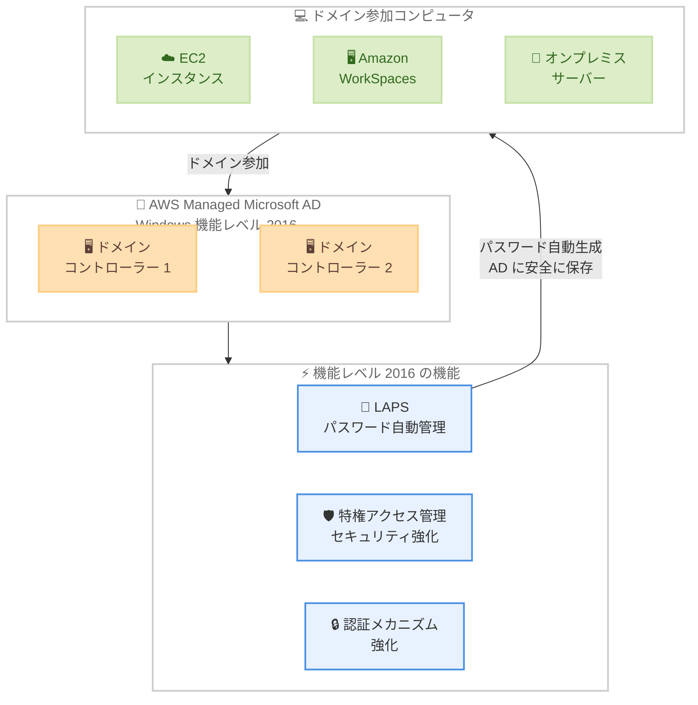

# AWS Managed Microsoft AD - Windows 機能レベル 2016 への自動アップグレード

**リリース日**: 2026 年 4 月 20 日
**サービス**: AWS Directory Service for Microsoft Active Directory (AWS Managed Microsoft AD)
**機能**: Windows 機能レベル 2016 への自動アップグレード

[このアップデートのインフォグラフィックを見る](https://takech9203.github.io/aws-news-summary/20260420-aws-managed-microsoft-ad-2016-functional-level.html)

## 概要

AWS Directory Service for Microsoft Active Directory (AWS Managed Microsoft AD) のすべてのディレクトリが Windows 機能レベル 2016 で動作するようになりました。このアップグレードは既存のすべてのディレクトリに自動的に適用されており、ユーザー側での操作は不要です。

Windows 機能レベル 2016 への移行により、認証メカニズムの強化、特権アクセス管理 (PAM) のセキュリティ向上、そして LAPS (Local Administrator Password Solution) のサポートが追加されました。特に LAPS はドメイン参加コンピュータのローカル管理者パスワードを自動的に生成・管理する機能であり、セキュリティ体制の大幅な強化につながります。

**アップデート前の課題**

- AWS Managed Microsoft AD のディレクトリは以前の機能レベルで動作しており、Windows Server 2016 で導入されたセキュリティ機能が利用できなかった
- ドメイン参加コンピュータのローカル管理者パスワードを一元管理する標準的な仕組みがなく、同一パスワードの使い回しや手動管理が必要だった
- 特権アクセス管理の高度な機能や最新の認証メカニズムを利用するためには、機能レベルの手動アップグレードが課題となっていた

**アップデート後の改善**

- すべてのディレクトリが自動的に Windows 機能レベル 2016 にアップグレードされ、最新のセキュリティ機能を即座に利用可能になった
- LAPS によりローカル管理者パスワードの自動生成・一元管理が可能になり、パスワード管理の運用負荷が大幅に軽減された
- 強化された認証メカニズムと特権アクセス管理により、Active Directory 環境全体のセキュリティが向上した

## アーキテクチャ図



AWS Managed Microsoft AD が Windows 機能レベル 2016 にアップグレードされたことで、LAPS によるローカル管理者パスワードの自動管理、特権アクセス管理の強化、認証メカニズムの改善がドメイン参加コンピュータ全体に適用されます。

## サービスアップデートの詳細

### 主要機能

1. **LAPS (Local Administrator Password Solution)**
   - ドメイン参加コンピュータのローカル管理者パスワードを自動的に生成
   - 一意で複雑なパスワードを各コンピュータに設定
   - パスワードを Active Directory に安全に保存し、権限を持つ管理者のみがアクセス可能
   - パスワードの定期的な自動ローテーションにより、セキュリティリスクを低減

2. **強化された認証メカニズム**
   - Windows Server 2016 で導入されたセキュリティ強化を活用
   - Kerberos プロトコルの改善による認証の安全性向上
   - スマートカード認証やマルチファクター認証との互換性強化

3. **特権アクセス管理 (PAM) の改善**
   - 特権アカウントのセキュリティ強化
   - 時間制限付きのグループメンバーシップをサポート
   - Just-In-Time アクセスの概念に基づく特権の一時付与が可能

4. **自動アップグレード**
   - 既存のすべてのディレクトリに自動適用済み
   - ダウンタイムやユーザー側の操作は不要
   - 新規作成されるディレクトリも自動的に機能レベル 2016 で作成

## 技術仕様

### Windows 機能レベルの比較

| 項目 | 以前の機能レベル | 機能レベル 2016 |
|------|-----------------|----------------|
| LAPS サポート | なし | あり |
| 特権アクセス管理 | 基本機能のみ | 時間制限付きグループメンバーシップ対応 |
| 認証メカニズム | 標準 Kerberos | 強化された Kerberos |
| パスワード管理 | 手動管理 | 自動生成・ローテーション |

### LAPS の主要設定項目

| 項目 | 詳細 |
|------|------|
| パスワード複雑性 | 大文字、小文字、数字、特殊文字を含む一意のパスワード |
| パスワード長 | グループポリシーで設定可能 |
| ローテーション間隔 | グループポリシーで設定可能 |
| 保存場所 | Active Directory のコンピュータオブジェクト属性 |
| アクセス制御 | ACL により権限を持つ管理者のみ参照可能 |

## 設定方法

### 前提条件

1. AWS Managed Microsoft AD ディレクトリが作成済みであること (自動アップグレード済み)
2. ドメイン参加コンピュータが存在すること
3. LAPS を使用する場合、対象コンピュータに LAPS クライアントがインストール済みであること

### 手順

#### ステップ 1: 機能レベルの確認

```powershell
# PowerShell でドメインの機能レベルを確認
Get-ADDomain | Select-Object DomainMode
```

ドメインの機能レベルが "Windows2016Domain" と表示されることを確認します。今回のアップデートにより自動的にアップグレードされているため、通常はこの値が返されます。

#### ステップ 2: LAPS の有効化

```powershell
# LAPS のスキーマ拡張を確認
Get-ADObject "CN=ms-Mcs-AdmPwd,CN=Schema,CN=Configuration,DC=example,DC=com"

# LAPS のグループポリシーを設定
# グループポリシー管理コンソールで以下を設定
# Computer Configuration > Policies > Administrative Templates > LAPS
```

LAPS のスキーマが Active Directory に存在することを確認し、グループポリシーを通じて LAPS を有効化します。

#### ステップ 3: LAPS のアクセス権限設定

```powershell
# 特定の OU に LAPS パスワードの読み取り権限を付与
Set-AdmPwdReadPasswordPermission -OrgUnit "OU=Servers,DC=example,DC=com" -AllowedPrincipals "Domain Admins"

# LAPS パスワードのリセット権限を付与
Set-AdmPwdResetPasswordPermission -OrgUnit "OU=Servers,DC=example,DC=com" -AllowedPrincipals "IT-Admins"
```

LAPS で管理されるパスワードにアクセスできるユーザーやグループを制限します。最小権限の原則に従い、必要な管理者のみに権限を付与します。

## メリット

### ビジネス面

- **運用コストの削減**: LAPS によるパスワードの自動管理により、手動でのパスワード管理やローテーション作業が不要になり、IT 管理者の工数を削減
- **コンプライアンス対応の強化**: ローカル管理者パスワードの一元管理と監査ログにより、PCI DSS、HIPAA、SOC 2 などのコンプライアンス要件への対応が容易に
- **ゼロダウンタイムでの移行**: 自動アップグレードにより、計画停止やマイグレーションプロジェクトのコストが不要

### 技術面

- **パスワードの使い回し防止**: LAPS が各コンピュータに一意の複雑なパスワードを自動生成するため、横移動攻撃 (Lateral Movement) のリスクを大幅に低減
- **特権アクセスの時間制限**: 時間制限付きグループメンバーシップにより、必要な期間のみ特権を付与する Just-In-Time アクセスを実現
- **認証セキュリティの向上**: Kerberos プロトコルの強化により、パスワードベース認証の安全性が向上

## デメリット・制約事項

### 制限事項

- Middle East (UAE) および Middle East (Bahrain) リージョンでは現時点で利用不可
- LAPS の利用にはドメイン参加コンピュータへの LAPS クライアントのインストールが別途必要
- 既存の LAPS 以外のパスワード管理ソリューションを使用している場合、移行計画の策定が必要

### 考慮すべき点

- 自動アップグレードにより機能レベルが 2016 に変更されているため、以前の機能レベルに依存する設定やスクリプトがある場合は動作確認を推奨
- LAPS のパスワードアクセス権限は適切に設定する必要があり、権限の設定ミスにより管理者がパスワードにアクセスできなくなるリスクがある
- グループポリシーの変更はドメイン全体に影響するため、テスト OU で検証してから本番環境に適用することを推奨

## ユースケース

### ユースケース 1: EC2 インスタンスのローカル管理者パスワード管理

**シナリオ**: 多数の Windows EC2 インスタンスがドメインに参加しており、すべてのインスタンスで同一のローカル管理者パスワードが使用されているためセキュリティリスクとなっている。

**実装例**:
```powershell
# LAPS グループポリシーで EC2 インスタンスの OU を対象に設定
# パスワード長: 20 文字、ローテーション間隔: 30 日
Set-AdmPwdComputerSelfPermission -OrgUnit "OU=EC2Instances,DC=example,DC=com"

# 管理者が特定インスタンスのパスワードを取得
Get-AdmPwdPassword -ComputerName "EC2-WEBSERVER-01"
```

**効果**: 各 EC2 インスタンスに一意のローカル管理者パスワードが自動設定され、1 台のインスタンスが侵害されても他のインスタンスへの横移動攻撃を防止できる。

### ユースケース 2: Amazon WorkSpaces 環境のセキュリティ強化

**シナリオ**: Amazon WorkSpaces で仮想デスクトップ環境を運用しており、ローカル管理者権限の管理とパスワードのセキュリティを強化したい。

**実装例**:
```powershell
# WorkSpaces の OU に LAPS を適用
Set-AdmPwdComputerSelfPermission -OrgUnit "OU=WorkSpaces,DC=example,DC=com"

# パスワードのローテーション間隔を 14 日に設定
# グループポリシーで設定
# Password Settings > Password Age Days: 14
```

**効果**: WorkSpaces の各デスクトップにおけるローカル管理者パスワードが自動管理され、エンドユーザー環境のセキュリティが向上する。

### ユースケース 3: 特権アクセスの時間制限付き管理

**シナリオ**: 運用チームのメンバーが緊急メンテナンス時にのみ Domain Admins 権限を必要とするが、常時付与はセキュリティリスクとなる。

**実装例**:
```powershell
# 4 時間限定で Domain Admins グループにメンバーを追加
Add-ADGroupMember -Identity "Domain Admins" `
    -Members "maintenance-admin" `
    -MemberTimeToLive (New-TimeSpan -Hours 4)
```

**効果**: 機能レベル 2016 の時間制限付きグループメンバーシップにより、必要な期間のみ特権を付与し、作業完了後に自動的に権限が失効する Just-In-Time アクセスを実現できる。

## 料金

Windows 機能レベル 2016 へのアップグレード自体に追加料金は発生しません。AWS Managed Microsoft AD の既存の料金体系がそのまま適用されます。

### 料金例

| エディション | 料金 |
|-------------|------|
| Standard Edition | $0.073/時間 (約 $54/月) |
| Enterprise Edition | $0.146/時間 (約 $108/月) |
| 追加ドメインコントローラー | エディションに応じた時間単価/台 |

## 利用可能リージョン

AWS Managed Microsoft AD が提供されているすべての AWS リージョンで利用可能です。ただし、以下のリージョンは現時点で対象外です。

- Middle East (UAE)
- Middle East (Bahrain)

## 関連サービス・機能

- **AWS Directory Service**: AWS Managed Microsoft AD の基盤サービスであり、AD 対応のアプリケーションやワークロードを AWS 上で実行するためのマネージドサービス
- **Amazon WorkSpaces**: AWS Managed Microsoft AD と統合してユーザー認証とデスクトップ管理を実現。LAPS によるセキュリティ強化の恩恵を受ける
- **Amazon EC2 (Windows)**: ドメイン参加した Windows EC2 インスタンスが LAPS による自動パスワード管理の対象
- **AWS IAM Identity Center**: AWS Managed Microsoft AD と統合して AWS アカウントへのシングルサインオンを提供
- **Amazon RDS for SQL Server**: Windows 認証に AWS Managed Microsoft AD を利用する場合、機能レベル 2016 の認証強化が適用される

## 参考リンク

- [インフォグラフィック](https://takech9203.github.io/aws-news-summary/20260420-aws-managed-microsoft-ad-2016-functional-level.html)
- [公式発表 (What's New)](https://aws.amazon.com/about-aws/whats-new/2026/04/aws-managed-microsoft-ad-2016-functional-level/)
- [AWS Managed Microsoft AD ドキュメント](https://docs.aws.amazon.com/directoryservice/latest/admin-guide/directory_microsoft_ad.html)
- [AWS Directory Service 料金ページ](https://aws.amazon.com/directoryservice/pricing/)

## まとめ

AWS Managed Microsoft AD のすべてのディレクトリが Windows 機能レベル 2016 に自動的にアップグレードされました。最も注目すべき機能は LAPS (Local Administrator Password Solution) のサポートであり、ドメイン参加コンピュータのローカル管理者パスワードを自動的に生成・管理することで、パスワードの使い回しによる横移動攻撃のリスクを大幅に低減できます。自動アップグレードによりユーザー側の操作は不要であるため、既存のディレクトリ利用者は LAPS や時間制限付きグループメンバーシップなどの新機能を今すぐ活用開始することを推奨します。
