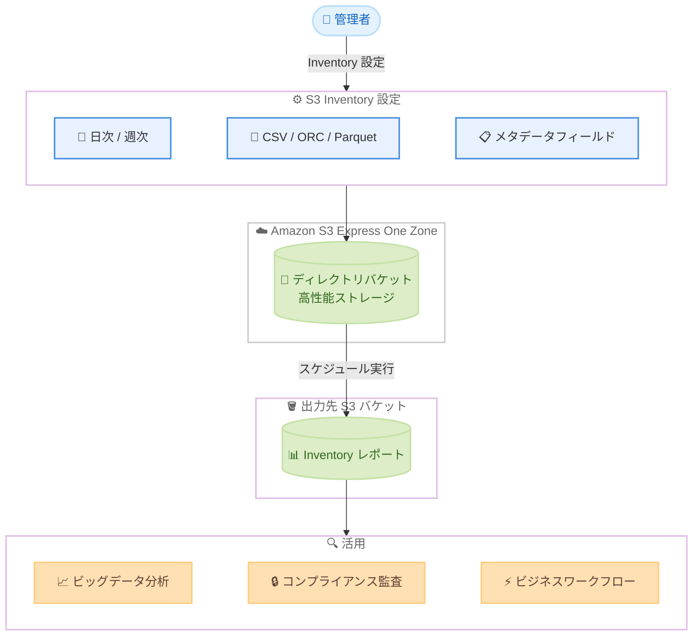

# Amazon S3 Express One Zone - S3 Inventory サポート

**リリース日**: 2026 年 4 月 20 日
**サービス**: Amazon S3
**機能**: S3 Express One Zone ストレージクラスにおける S3 Inventory のサポート

📊 [このアップデートのインフォグラフィックを見る](https://takech9203.github.io/aws-news-summary/20260420-s3-express-one-zone-supports-s3-inventory.html)

## 概要

Amazon S3 Express One Zone は、レイテンシが重要なアプリケーション向けの高性能ストレージクラスです。今回のアップデートにより、S3 Express One Zone のディレクトリバケットで S3 Inventory が利用可能になりました。S3 Inventory は、S3 の同期的な List API に代わるスケジュールベースの代替手段であり、日次または週次でオブジェクトの一覧レポートを自動生成できます。

S3 Inventory を使用すると、ディレクトリバケット内のすべてのオブジェクト、または特定のプレフィックスに一致するオブジェクトについて、メタデータや暗号化ステータスを含むレポートを生成できます。レポートの出力形式は CSV、ORC、Parquet から選択可能です。これにより、ビジネスワークフローやビッグデータジョブの効率化、およびコンプライアンス・規制要件に基づく暗号化ステータスの検証が容易になります。

設定には AWS CLI、AWS SDK、または S3 API を使用でき、レポートの出力先バケット、出力形式、取得するメタデータフィールドを柔軟に指定できます。

**アップデート前の課題**

- S3 Express One Zone のディレクトリバケットでは S3 Inventory が利用できず、オブジェクト一覧の取得には同期的な List API を使用する必要があった
- 大量のオブジェクトが格納されたディレクトリバケットに対して List API を繰り返し実行すると、コストとレイテンシが増大していた
- ディレクトリバケット内のオブジェクトの暗号化ステータスを一括で確認する手段がなく、コンプライアンス監査に手間がかかっていた

**アップデート後の改善**

- S3 Express One Zone のディレクトリバケットで S3 Inventory を設定し、日次または週次でオブジェクトレポートを自動生成できるようになった
- List API を繰り返し呼び出す必要がなくなり、大規模なオブジェクト一覧の取得が効率化された
- 暗号化ステータスを含むメタデータレポートにより、コンプライアンス・規制要件への対応が容易になった

## アーキテクチャ図



S3 Express One Zone のディレクトリバケットに対して S3 Inventory を設定し、スケジュールに基づいてオブジェクトレポートを自動生成するフローを示しています。生成されたレポートは、分析やコンプライアンス監査に活用できます。

## サービスアップデートの詳細

### 主要機能

1. **スケジュールベースのオブジェクトレポート生成**
   - 日次または週次のスケジュールで Inventory レポートを自動生成
   - ディレクトリバケット内のすべてのオブジェクト、または特定のプレフィックスに一致するオブジェクトを対象に設定可能
   - S3 の同期的な List API を繰り返し呼び出す必要がなくなり、大規模バケットの管理が効率化

2. **柔軟な出力形式**
   - CSV、ORC、Parquet の 3 種類の出力形式をサポート
   - ビッグデータ分析ツールとの連携に適した列指向形式 (ORC、Parquet) を選択可能
   - 出力先として任意の S3 バケットを指定可能

3. **豊富なメタデータフィールド**
   - オブジェクト名、サイズ、最終更新日、ストレージクラス、マルチパートアップロードフラグ、暗号化ステータスを取得可能
   - ビジネスアプリケーションに必要なメタデータフィールドを選択して設定可能
   - 暗号化ステータスの確認により、コンプライアンス要件への対応を支援

## 技術仕様

### S3 Inventory のメタデータフィールド

| フィールド | 説明 |
|-----------|------|
| オブジェクト名 | オブジェクトのキー名 |
| サイズ | オブジェクトのバイト単位のサイズ |
| 最終更新日 | オブジェクトが最後に変更された日時 |
| ストレージクラス | オブジェクトのストレージクラス |
| マルチパートアップロードフラグ | マルチパートアップロードで作成されたかどうか |
| 暗号化ステータス | サーバーサイド暗号化の適用状態 |

### 出力形式の比較

| 形式 | 特徴 | 適したユースケース |
|------|------|------------------|
| CSV | テキストベースで汎用的 | 簡易的な確認、スプレッドシートでの分析 |
| ORC | 列指向形式、高圧縮率 | Hive、Spark などでの大規模データ分析 |
| Parquet | 列指向形式、幅広いツールサポート | Athena、Redshift Spectrum での分析 |

### IAM ポリシー例

```json
{
  "Version": "2012-10-17",
  "Statement": [
    {
      "Effect": "Allow",
      "Action": [
        "s3express:PutInventoryConfiguration",
        "s3express:GetInventoryConfiguration",
        "s3express:ListBucketInventoryConfigurations",
        "s3express:DeleteInventoryConfiguration"
      ],
      "Resource": "arn:aws:s3express:*:*:bucket/*--x-s3"
    },
    {
      "Effect": "Allow",
      "Action": [
        "s3:PutObject"
      ],
      "Resource": "arn:aws:s3:::destination-bucket/inventory/*"
    }
  ]
}
```

## 設定方法

### 前提条件

1. S3 Express One Zone のディレクトリバケットが作成済みであること
2. Inventory レポートの出力先となる S3 バケットが存在すること
3. 出力先バケットに対して S3 Inventory がオブジェクトを書き込むための適切なバケットポリシーが設定されていること

### 手順

#### ステップ 1: 出力先バケットのバケットポリシーを設定

```json
{
  "Version": "2012-10-17",
  "Statement": [
    {
      "Sid": "InventoryPolicy",
      "Effect": "Allow",
      "Principal": {
        "Service": "s3.amazonaws.com"
      },
      "Action": "s3:PutObject",
      "Resource": "arn:aws:s3:::destination-bucket/inventory/*",
      "Condition": {
        "StringEquals": {
          "aws:SourceAccount": "123456789012"
        }
      }
    }
  ]
}
```

S3 Inventory サービスが出力先バケットにレポートを書き込めるようにするためのバケットポリシーを設定します。

#### ステップ 2: S3 Inventory の設定を作成

```bash
# S3 Inventory の設定を作成
aws s3api put-bucket-inventory-configuration \
  --bucket my-directory-bucket--usw2-az1--x-s3 \
  --id my-inventory-config \
  --inventory-configuration '{
    "Id": "my-inventory-config",
    "IsEnabled": true,
    "Destination": {
      "S3BucketDestination": {
        "Bucket": "arn:aws:s3:::destination-bucket",
        "Format": "Parquet",
        "Prefix": "inventory"
      }
    },
    "Schedule": {
      "Frequency": "Daily"
    },
    "IncludedObjectVersions": "Current",
    "OptionalFields": [
      "Size",
      "LastModifiedDate",
      "StorageClass",
      "IsMultipartUploaded",
      "EncryptionStatus"
    ]
  }'
```

ディレクトリバケットに対して S3 Inventory の設定を作成します。スケジュール頻度、出力形式、取得するメタデータフィールドを指定しています。

#### ステップ 3: Inventory 設定の確認

```bash
# 設定内容を確認
aws s3api get-bucket-inventory-configuration \
  --bucket my-directory-bucket--usw2-az1--x-s3 \
  --id my-inventory-config
```

作成した Inventory 設定の内容を確認します。レポートは設定後、最初のスケジュール実行時から生成が開始されます。

## メリット

### ビジネス面

- **コンプライアンス対応の効率化**: 暗号化ステータスを含むレポートを定期的に自動生成でき、規制やコンプライアンス要件への対応を省力化できる
- **運用コストの削減**: List API の繰り返し呼び出しが不要になり、大規模バケットのオブジェクト管理にかかる API コストを削減できる
- **ビジネスワークフローの加速**: スケジュールベースのレポート生成により、ビッグデータジョブやビジネスワークフローの入力データを自動的に準備できる

### 技術面

- **大規模バケットの管理効率化**: 数百万から数十億のオブジェクトを持つディレクトリバケットでも、List API を使わずにオブジェクト一覧を取得できる
- **分析ツールとの統合**: ORC や Parquet 形式での出力により、Amazon Athena、Amazon Redshift Spectrum、Apache Spark などの分析ツールと直接連携できる
- **プレフィックスベースのフィルタリング**: 特定のプレフィックスに一致するオブジェクトのみを対象にレポートを生成でき、必要な情報に絞り込める

## デメリット・制約事項

### 制限事項

- Inventory レポートの生成は日次または週次のスケジュールに限定され、リアルタイムでの取得はできない
- レポートの出力先はディレクトリバケットではなく、汎用バケットを指定する必要がある
- 最初の Inventory レポートが生成されるまでに最大 48 時間かかる場合がある

### 考慮すべき点

- Inventory レポートの生成はバケット内のオブジェクト数に応じて時間がかかるため、大規模バケットでは遅延が発生する可能性がある
- レポートはある時点のスナップショットであり、レポート生成中に追加・削除されたオブジェクトは反映されない場合がある
- Inventory レポートの保存にはストレージ料金が発生するため、保存期間やライフサイクルポリシーの設定を検討する必要がある

## ユースケース

### ユースケース 1: 暗号化コンプライアンス監査

**シナリオ**: 金融機関が S3 Express One Zone に格納したリアルタイム取引データについて、すべてのオブジェクトがサーバーサイド暗号化されていることを定期的に確認する必要がある。

**実装例**:
```bash
# 日次で暗号化ステータスを含む Inventory レポートを生成
aws s3api put-bucket-inventory-configuration \
  --bucket trading-data--usw2-az1--x-s3 \
  --id encryption-audit \
  --inventory-configuration '{
    "Id": "encryption-audit",
    "IsEnabled": true,
    "Destination": {
      "S3BucketDestination": {
        "Bucket": "arn:aws:s3:::audit-reports-bucket",
        "Format": "CSV",
        "Prefix": "encryption-audit"
      }
    },
    "Schedule": {
      "Frequency": "Daily"
    },
    "IncludedObjectVersions": "Current",
    "OptionalFields": ["EncryptionStatus", "LastModifiedDate"]
  }'
```

**効果**: 日次レポートにより暗号化されていないオブジェクトを迅速に検出でき、コンプライアンス違反のリスクを最小化できる。

### ユースケース 2: ビッグデータ分析パイプラインの入力データ準備

**シナリオ**: 機械学習チームが S3 Express One Zone に格納された大量のトレーニングデータのカタログを管理し、定期的にデータセットの構成を把握したい。

**実装例**:
```bash
# 週次で Parquet 形式のレポートを生成し Athena で分析
aws s3api put-bucket-inventory-configuration \
  --bucket ml-training-data--use1-az1--x-s3 \
  --id ml-data-catalog \
  --inventory-configuration '{
    "Id": "ml-data-catalog",
    "IsEnabled": true,
    "Destination": {
      "S3BucketDestination": {
        "Bucket": "arn:aws:s3:::analytics-bucket",
        "Format": "Parquet",
        "Prefix": "ml-inventory"
      }
    },
    "Schedule": {
      "Frequency": "Weekly"
    },
    "IncludedObjectVersions": "Current",
    "OptionalFields": ["Size", "LastModifiedDate", "StorageClass"]
  }'
```

**効果**: Parquet 形式のレポートを Amazon Athena で直接クエリすることで、データセットのサイズ分布や更新頻度を効率的に分析できる。

### ユースケース 3: ストレージ使用量の可視化とコスト最適化

**シナリオ**: SaaS プロバイダーが S3 Express One Zone に格納されたテナントごとのデータ量を把握し、使用量に基づく課金やコスト最適化を行いたい。

**実装例**:
```bash
# テナントプレフィックスごとに Inventory レポートを生成
aws s3api put-bucket-inventory-configuration \
  --bucket saas-data--apne1-az1--x-s3 \
  --id tenant-usage \
  --inventory-configuration '{
    "Id": "tenant-usage",
    "IsEnabled": true,
    "Filter": {
      "Prefix": "tenants/"
    },
    "Destination": {
      "S3BucketDestination": {
        "Bucket": "arn:aws:s3:::billing-reports",
        "Format": "ORC",
        "Prefix": "tenant-inventory"
      }
    },
    "Schedule": {
      "Frequency": "Daily"
    },
    "IncludedObjectVersions": "Current",
    "OptionalFields": ["Size", "LastModifiedDate"]
  }'
```

**効果**: テナントごとのストレージ使用量を自動的に集計でき、正確な従量課金とコスト最適化の判断材料を得られる。

## 料金

S3 Inventory の料金は、レポートに含まれるオブジェクトの数に基づいて課金されます。S3 Express One Zone のストレージ料金とは別に、Inventory のリスト対象オブジェクト 100 万件あたりの料金が適用されます。

また、生成された Inventory レポートの保存には、出力先バケットのストレージ料金が発生します。

### 料金例

| 項目 | 料金 |
|------|------|
| S3 Inventory リスト対象オブジェクト | 100 万オブジェクトあたりの料金が適用 |
| レポートの保存 | 出力先バケットのストレージクラスに応じた料金 |
| S3 Express One Zone ストレージ | 別途 GB あたりの月額料金が適用 |

詳細は [Amazon S3 料金ページ](https://aws.amazon.com/s3/pricing/) を参照してください。

## 利用可能リージョン

S3 Inventory for S3 Express One Zone は、S3 Express One Zone ストレージクラスが利用可能なすべての AWS リージョンで利用できます。利用可能なリージョンの一覧は [S3 Express One Zone エンドポイントのドキュメント](https://docs.aws.amazon.com/AmazonS3/latest/userguide/s3-express-Endpoints.html) を参照してください。

## 関連サービス・機能

- **Amazon Athena**: S3 Inventory の Parquet または ORC 形式のレポートに対して SQL クエリを実行し、オブジェクトメタデータの分析や暗号化ステータスの確認ができる
- **Amazon S3 Express One Zone**: レイテンシが重要なアプリケーション向けの高性能ストレージクラスで、1 桁ミリ秒のデータアクセスを提供する
- **S3 Storage Lens**: S3 のストレージ使用量とアクティビティの可視化ツールであり、S3 Inventory と組み合わせて包括的なストレージ管理が可能
- **AWS KMS**: S3 オブジェクトのサーバーサイド暗号化に使用するキー管理サービスであり、Inventory レポートで暗号化ステータスを確認する際に関連する

## 参考リンク

- 📊 [インフォグラフィック](https://takech9203.github.io/aws-news-summary/20260420-s3-express-one-zone-supports-s3-inventory.html)
- [公式発表 (What's New)](https://aws.amazon.com/about-aws/whats-new/2026/04/s3-express-one-zone-supports-s3-inventory/)
- [ドキュメント - S3 Inventory の設定](https://docs.aws.amazon.com/AmazonS3/latest/userguide/configure-inventory.html)
- [S3 Express One Zone エンドポイント](https://docs.aws.amazon.com/AmazonS3/latest/userguide/s3-express-Endpoints.html)
- [Amazon S3 料金ページ](https://aws.amazon.com/s3/pricing/)

## まとめ

Amazon S3 Express One Zone で S3 Inventory がサポートされたことにより、ディレクトリバケット内のオブジェクトメタデータや暗号化ステータスを日次・週次で自動的にレポート生成できるようになりました。高性能ストレージを活用しながらも、List API の繰り返し呼び出しに依存せずにオブジェクト管理を効率化でき、コンプライアンス監査やビッグデータ分析のワークフローにおいて大きな恩恵があります。S3 Express One Zone をご利用のお客様は、Inventory の設定を検討し、オブジェクト管理の効率化と暗号化コンプライアンスの強化に活用することを推奨します。
