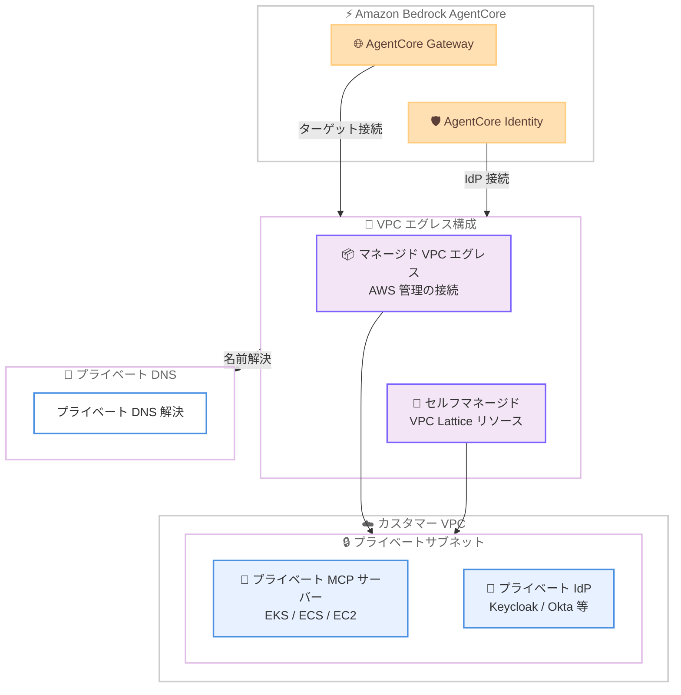

# Amazon Bedrock AgentCore - Gateway および Identity の VPC エグレスサポート

**リリース日**: 2026年4月24日
**サービス**: Amazon Bedrock AgentCore
**機能**: Gateway および Identity の VPC エグレス

📊 [このアップデートのインフォグラフィックを見る](https://takech9203.github.io/aws-news-summary/20260424-agentcore-gateway-identity-vpc.html)

## 概要

Amazon Bedrock AgentCore の Gateway および Identity が、Virtual Private Cloud (VPC) エグレストラフィック管理をサポートしました。これにより、AgentCore Gateway のターゲットおよび Identity のクレデンシャルプロバイダーが VPC 内のプライベートリソースと安全に通信できるようになります。マネージド構成とセルフマネージド構成の両方が提供され、さまざまなネットワーク要件に対応します。

このアップデートにより、EKS でホストされたプライベート MCP サーバーや VPC 内で稼働する ID プロバイダー (IdP) に対して、パブリックインターネットを経由せずに AgentCore から直接アクセスすることが可能になります。マネージド VPC エグレスは大多数のユースケースをカバーし、より複雑なネットワーク構成が必要な場合は VPC Lattice リソースを自分で設定するセルフマネージドオプションを利用できます。

**アップデート前の課題**

- AgentCore Gateway からプライベートリソースへのアクセスにはパブリックエンドポイントの公開が必要だった
- VPC 内のプライベート MCP サーバーに AgentCore Gateway から直接接続する手段がなかった
- VPC 内で稼働する ID プロバイダーとの連携には、パブリックインターネット経由の通信が必要で、セキュリティリスクがあった
- プライベート DNS 解決が AgentCore のマネージドリソースでサポートされていなかった

**アップデート後の改善**

- AgentCore Gateway から VPC 内のプライベートリソースへ直接アクセスが可能になった
- マネージド VPC エグレスにより、インフラ管理の負担を最小化しつつプライベート接続を実現できるようになった
- VPC 内の IdP に対するインバウンドアクセストークン検証およびアウトバウンドトークン取得が可能になった
- プライベート DNS 解決がマネージド VPC エグレスリソースでサポートされた
- セルフマネージド VPC Lattice 構成により、複雑なネットワーク要件にも対応可能になった

## アーキテクチャ図



AgentCore Gateway と Identity が VPC エグレスを通じてカスタマー VPC 内のプライベートリソースに接続する構成を示しています。マネージド構成では AWS が接続インフラを管理し、セルフマネージド構成では VPC Lattice を使用して柔軟なネットワーク設定が可能です。

## サービスアップデートの詳細

### 主要機能

1. **Gateway VPC エグレス**
   - AgentCore Gateway ターゲットに `privateEndpoint` 設定を追加し、VPC 内のプライベートリソースを直接呼び出し可能
   - EKS でホストされたプライベート MCP サーバーなど、パブリックエンドポイントを持たないリソースへの接続をサポート
   - `managedVpcResource` と `selfManagedLatticeResource` の 2 つの構成オプションを提供

2. **Identity VPC エグレス**
   - VPC 内で稼働するプライベート ID プロバイダー (IdP) への接続をサポート
   - インバウンドアクセストークンの検証: プライベート IdP が発行したトークンの検証が可能
   - アウトバウンドリクエスト認証: プライベート IdP からトークンを取得し、送信リクエストの認証に使用可能
   - OAuth2 クレデンシャルプロバイダーにもプライベートエンドポイント設定を追加

3. **プライベート DNS 解決**
   - マネージド VPC エグレスリソースに対してプライベート DNS 解決をサポート
   - Gateway と Identity の両方で利用可能
   - `routingDomain` パラメータによるカスタムドメインルーティングに対応

4. **マネージド VPC エグレス構成**
   - AWS が VPC 接続インフラを自動管理
   - VPC 識別子、サブネット ID、セキュリティグループ ID を指定するだけで設定可能
   - IPv4 および IPv6 アドレスタイプをサポート
   - 大多数のユースケースに対応

5. **セルフマネージド VPC Lattice 構成**
   - `selfManagedLatticeResource` で VPC Lattice のリソース設定識別子を指定
   - 複雑なネットワーク構成や高度なルーティング要件に対応
   - 既存の VPC Lattice インフラストラクチャとの統合が可能

## 技術仕様

### VPC エグレス構成オプション

| 項目 | マネージド VPC エグレス | セルフマネージド VPC Lattice |
|------|------------------------|----------------------------|
| 管理者 | AWS が自動管理 | ユーザーが設定・管理 |
| 設定の複雑さ | 低い | 高い |
| 必要なパラメータ | VPC ID、サブネット ID、セキュリティグループ ID | VPC Lattice リソース設定識別子 |
| IP アドレスタイプ | IPv4 / IPv6 | VPC Lattice 設定に依存 |
| プライベート DNS | サポート | VPC Lattice 設定に依存 |
| 推奨ユースケース | 標準的な VPC 内リソースへの接続 | 複雑なネットワーク構成、マルチアカウント |

### 対応 API メソッド

| API メソッド | 変更内容 |
|-------------|----------|
| `CreateGatewayTarget` | `privateEndpoint` パラメータ追加 |
| `UpdateGatewayTarget` | `privateEndpoint` パラメータ追加 |
| `GetGatewayTarget` | `privateEndpoint` 情報の取得に対応 |
| `CreateGateway` | `authorizerConfiguration.customJWTAuthorizer.privateEndpoint` 追加 |
| `UpdateGateway` | `authorizerConfiguration.customJWTAuthorizer.privateEndpoint` 追加 |
| `CreateAgentRuntime` | `authorizerConfiguration.customJWTAuthorizer.privateEndpoint` 追加 |
| `CreateOauth2CredentialProvider` | `privateEndpoint` パラメータ追加 |
| `CreateRegistry` | `authorizerConfiguration.customJWTAuthorizer.privateEndpoint` 追加 |
| `CreateHarness` | `authorizerConfiguration.customJWTAuthorizer.privateEndpoint` 追加 |

### API 変更履歴

| 日付 | サービス | 変更内容 |
|------|----------|----------|
| 2026/04/24 | [Amazon Bedrock AgentCore Control](https://awsapichanges.com/archive/changes/435c9a-bedrock-agentcore-control.html) | 20 updated api methods - VPC 内のプライベート IdP および AgentCore リソースに対する安全なネットワーク接続の設定サポートを追加 |

### privateEndpoint 構成例

```json
{
  "privateEndpoint": {
    "managedVpcResource": {
      "vpcIdentifier": "vpc-0123456789abcdef0",
      "subnetIds": [
        "subnet-0123456789abcdef0",
        "subnet-0123456789abcdef1"
      ],
      "endpointIpAddressType": "IPV4",
      "securityGroupIds": [
        "sg-0123456789abcdef0"
      ],
      "routingDomain": "internal.example.com",
      "tags": {
        "Environment": "Production"
      }
    }
  }
}
```

### セルフマネージド VPC Lattice 構成例

```json
{
  "privateEndpoint": {
    "selfManagedLatticeResource": {
      "resourceConfigurationIdentifier": "rcfg-0123456789abcdef0"
    }
  }
}
```

## 設定方法

### 前提条件

1. Amazon Bedrock AgentCore が有効化されていること
2. VPC、サブネット、セキュリティグループが作成済みであること
3. 適切な IAM ロールおよびポリシーが設定されていること
4. マネージド構成の場合: プライベートサブネットに対象リソースがデプロイされていること
5. セルフマネージド構成の場合: VPC Lattice リソース設定が作成済みであること

### 手順

#### ステップ 1: Gateway ターゲットにプライベートエンドポイントを設定

```bash
aws bedrock-agentcore-control create-gateway-target \
  --gateway-identifier "gw-0123456789abcdef0" \
  --name "private-mcp-target" \
  --target-configuration '{
    "mcp": {
      "mcpServer": {
        "endpoint": "https://internal.example.com:8443"
      }
    }
  }' \
  --private-endpoint '{
    "managedVpcResource": {
      "vpcIdentifier": "vpc-0123456789abcdef0",
      "subnetIds": ["subnet-0123456789abcdef0", "subnet-0123456789abcdef1"],
      "endpointIpAddressType": "IPV4",
      "securityGroupIds": ["sg-0123456789abcdef0"],
      "routingDomain": "internal.example.com"
    }
  }'
```

AgentCore Gateway のターゲットとしてプライベート MCP サーバーを登録し、マネージド VPC エグレスを使用して接続します。`routingDomain` にはプライベート DNS で解決するドメイン名を指定します。

#### ステップ 2: Identity のプライベート IdP 接続を設定

```bash
aws bedrock-agentcore-control create-gateway \
  --name "my-gateway" \
  --protocol-type "MCP" \
  --role-arn "arn:aws:iam::123456789012:role/AgentCoreGatewayRole" \
  --authorizer-type "CUSTOM_JWT" \
  --authorizer-configuration '{
    "customJWTAuthorizer": {
      "discoveryUrl": "https://idp.internal.example.com/.well-known/openid-configuration",
      "allowedAudience": ["my-audience"],
      "privateEndpoint": {
        "managedVpcResource": {
          "vpcIdentifier": "vpc-0123456789abcdef0",
          "subnetIds": ["subnet-0123456789abcdef0"],
          "endpointIpAddressType": "IPV4",
          "securityGroupIds": ["sg-0123456789abcdef0"]
        }
      }
    }
  }'
```

Gateway の認証設定にプライベートエンドポイントを指定し、VPC 内の IdP に対するトークン検証を有効にします。

#### ステップ 3: OAuth2 クレデンシャルプロバイダーのプライベート接続設定

```bash
aws bedrock-agentcore-control create-oauth2-credential-provider \
  --name "private-idp-provider" \
  --credential-provider-vendor "CustomOauth2" \
  --oauth2-provider-config-input '{
    "customOauth2ProviderConfig": {
      "oauthDiscovery": {
        "discoveryUrl": "https://idp.internal.example.com/.well-known/openid-configuration"
      },
      "clientId": "my-client-id",
      "clientSecret": "my-client-secret",
      "privateEndpoint": {
        "managedVpcResource": {
          "vpcIdentifier": "vpc-0123456789abcdef0",
          "subnetIds": ["subnet-0123456789abcdef0"],
          "endpointIpAddressType": "IPV4",
          "securityGroupIds": ["sg-0123456789abcdef0"]
        }
      }
    }
  }'
```

OAuth2 クレデンシャルプロバイダーにプライベートエンドポイントを設定し、VPC 内の IdP からアウトバウンドリクエスト用のトークンを取得できるようにします。

## メリット

### ビジネス面

- **セキュリティ態勢の向上**: パブリックインターネットを経由せずにプライベートリソースへアクセスすることで、データ漏洩やネットワーク攻撃のリスクを低減
- **コンプライアンス対応の簡素化**: 規制要件でプライベートネットワーク通信が求められる業界 (金融、医療等) において、要件を満たしやすくなる
- **運用コストの削減**: マネージド VPC エグレスにより、NAT Gateway やプロキシサーバーの構築・管理が不要になるケースがある

### 技術面

- **ネットワーク構成の柔軟性**: マネージドとセルフマネージドの 2 つの構成により、シンプルな要件から複雑なマルチアカウント構成まで対応可能
- **プライベート DNS サポート**: VPC 内のプライベートホスト名を直接解決できるため、エンドポイント設定が簡素化される
- **既存インフラとの統合**: VPC Lattice との統合により、既存のサービスメッシュやネットワーク構成を活用可能
- **IPv4/IPv6 デュアルスタック**: 両方の IP アドレスタイプをサポートし、モダンなネットワーク環境に対応

## デメリット・制約事項

### 制限事項

- マネージド VPC エグレスの場合、AgentCore が VPC 内にリソースを作成するため、VPC 内のリソースクォータに影響する可能性がある
- セルフマネージド構成では VPC Lattice の設定・管理に関する知識が必要
- プライベートエンドポイントの作成には追加の IAM 権限が必要

### 考慮すべき点

- セキュリティグループの設定が適切でない場合、接続に失敗する可能性がある。必要なポートとプロトコルを正確に許可する必要がある
- マネージド VPC エグレスとセルフマネージド構成は同一ターゲットで排他的であり、どちらか一方を選択する必要がある
- `privateEndpointOverrides` を使用することで、ドメインごとに異なるプライベートエンドポイント設定を指定可能。複数の IdP ドメインを使用する場合に活用できる

## ユースケース

### ユースケース 1: プライベート MCP サーバーへのアクセス

**シナリオ**: EKS クラスター上でプライベート MCP サーバーを運用しており、AgentCore Gateway 経由で AI エージェントからアクセスさせたい場合

**実装例**:
```json
{
  "targetConfiguration": {
    "mcp": {
      "mcpServer": {
        "endpoint": "https://mcp.internal.eks-cluster.example.com:8443"
      }
    }
  },
  "privateEndpoint": {
    "managedVpcResource": {
      "vpcIdentifier": "vpc-eks-cluster",
      "subnetIds": ["subnet-private-1a", "subnet-private-1c"],
      "endpointIpAddressType": "IPV4",
      "securityGroupIds": ["sg-mcp-access"]
    }
  }
}
```

**効果**: MCP サーバーをパブリックに公開することなく、AgentCore Gateway から安全にツール呼び出しが可能になる。EKS の Internal LoadBalancer と組み合わせることで、完全なプライベートアクセスを実現

### ユースケース 2: オンプレミス IdP との連携

**シナリオ**: 企業内のオンプレミス ID プロバイダー (Keycloak 等) を VPC 経由で AWS に接続しており、AgentCore の認証にこの IdP を使用したい場合

**実装例**:
```json
{
  "customJWTAuthorizer": {
    "discoveryUrl": "https://keycloak.corp.example.com/realms/agents/.well-known/openid-configuration",
    "allowedAudience": ["agentcore-api"],
    "privateEndpoint": {
      "managedVpcResource": {
        "vpcIdentifier": "vpc-hybrid",
        "subnetIds": ["subnet-transit-1a"],
        "endpointIpAddressType": "IPV4",
        "securityGroupIds": ["sg-idp-access"]
      }
    }
  }
}
```

**効果**: VPN や Direct Connect 経由で接続されたオンプレミス IdP のトークンを AgentCore が直接検証可能。パブリックエンドポイントの公開が不要になり、企業のセキュリティポリシーに準拠

### ユースケース 3: マルチアカウント環境での VPC Lattice 統合

**シナリオ**: 複数の AWS アカウントにまたがるマイクロサービスアーキテクチャで、VPC Lattice を使用してサービスメッシュを構築済み。AgentCore からこれらのサービスにアクセスさせたい場合

**実装例**:
```json
{
  "privateEndpoint": {
    "selfManagedLatticeResource": {
      "resourceConfigurationIdentifier": "rcfg-shared-services"
    }
  }
}
```

**効果**: 既存の VPC Lattice 設定を再利用し、AgentCore から複数アカウントのプライベートサービスにアクセス可能。ネットワークの一元管理と既存のセキュリティポリシーの適用を維持

## 料金

VPC エグレス機能自体の追加料金に関する具体的な情報は公式発表時点では明示されていません。ただし、以下の関連コストが発生する可能性があります。

### 関連する料金要素

| 項目 | 概要 |
|------|------|
| Amazon Bedrock AgentCore | AgentCore の標準利用料金 |
| VPC Lattice | セルフマネージド構成で VPC Lattice を使用する場合の料金 |
| データ転送 | VPC 間のデータ転送料金 |
| NAT Gateway | マネージド VPC エグレスでインターネットアクセスが必要な場合 |

最新の料金情報は [Amazon Bedrock の料金ページ](https://aws.amazon.com/bedrock/pricing/)を確認してください。

## 利用可能リージョン

以下の 14 リージョンで利用可能です。

- 米国東部 (バージニア北部) - us-east-1
- 米国東部 (オハイオ) - us-east-2
- 米国西部 (オレゴン) - us-west-2
- カナダ (中部) - ca-central-1
- アジアパシフィック (ムンバイ) - ap-south-1
- アジアパシフィック (ソウル) - ap-northeast-2
- アジアパシフィック (シンガポール) - ap-southeast-1
- アジアパシフィック (シドニー) - ap-southeast-2
- アジアパシフィック (東京) - ap-northeast-1
- 欧州 (フランクフルト) - eu-central-1
- 欧州 (アイルランド) - eu-west-1
- 欧州 (ロンドン) - eu-west-2
- 欧州 (パリ) - eu-west-3
- 欧州 (ストックホルム) - eu-north-1

## 関連サービス・機能

- **Amazon VPC Lattice**: セルフマネージド VPC エグレス構成で使用。サービス間のネットワーク接続を簡素化するサービス
- **Amazon EKS**: プライベート MCP サーバーのホスティング基盤として使用される代表的なサービス
- **AWS PrivateLink**: VPC エンドポイントを通じたプライベート接続の基盤技術
- **Amazon Bedrock AgentCore Gateway**: AI エージェントと外部ツール・サービスを接続するゲートウェイ機能
- **Amazon Bedrock AgentCore Identity**: エージェントの認証・認可を管理する機能

## 参考リンク

- 📊 [インフォグラフィック](https://takech9203.github.io/aws-news-summary/20260424-agentcore-gateway-identity-vpc.html)
- [公式発表 (What's New)](https://aws.amazon.com/about-aws/whats-new/2024/04/agentcore-gateway-identity-vpc/)
- [Amazon Bedrock AgentCore ドキュメント](https://docs.aws.amazon.com/bedrock/latest/userguide/agentcore.html)
- [Amazon Bedrock 料金ページ](https://aws.amazon.com/bedrock/pricing/)
- [Amazon VPC Lattice ドキュメント](https://docs.aws.amazon.com/vpc-lattice/latest/ug/)

## まとめ

Amazon Bedrock AgentCore Gateway および Identity の VPC エグレスサポートにより、エンタープライズ環境で求められるプライベートネットワーク通信が実現されました。特に、EKS 上のプライベート MCP サーバーへの直接接続や、VPC 内の IdP との安全な認証連携は、セキュリティ要件の厳しい金融・医療業界での AI エージェント導入を加速する重要な機能です。まずはマネージド VPC エグレスで基本的な構成を試し、要件に応じてセルフマネージド VPC Lattice 構成への移行を検討することを推奨します。
