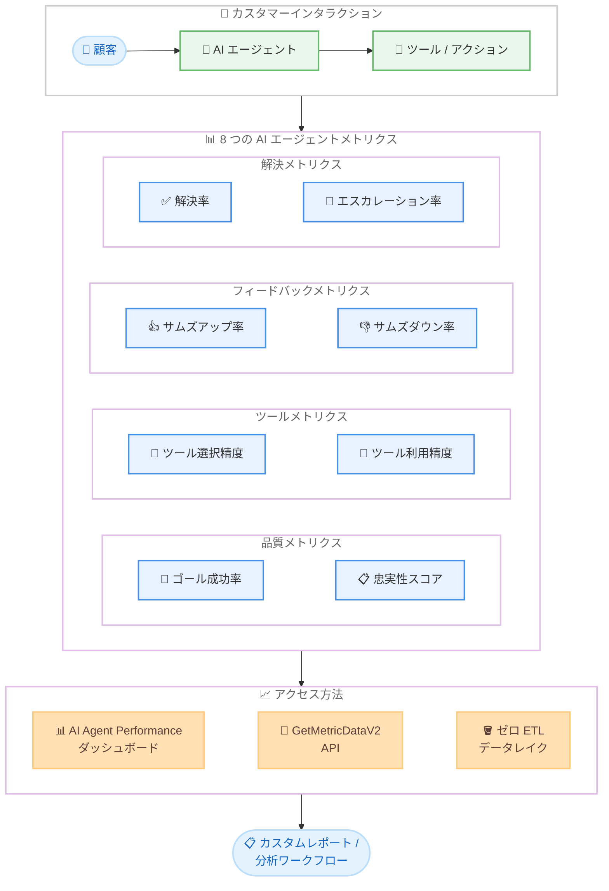

# Amazon Connect - AI エージェントパフォーマンスメトリクス

**リリース日**: 2026 年 4 月 24 日
**サービス**: Amazon Connect
**機能**: AI エージェントパフォーマンス測定用 8 つの新規メトリクス

[このアップデートのインフォグラフィックを見る](https://takech9203.github.io/aws-news-summary/20260424-amazon-connect-ai-agent-metrics.html)

## 概要

Amazon Connect に AI エージェントのパフォーマンスを測定・改善するための 8 つの新しいメトリクスが追加された。ゴール成功率、忠実性スコア、ツール選択精度などを含むこれらのメトリクスにより、AI 駆動のカスタマーインタラクションの品質を可視化し、AI エージェントの成果を継続的に測定・改善できるようになる。

今回のリリースにより、AI エージェントが顧客のリクエストを正常に解決したかどうかの監視、忠実性の評価とコンテキストに基づくハルシネーションの検出、ツール選択と利用精度の評価、さらに有効化時のサムズアップ / サムズダウン評価による顧客フィードバックの取得が可能になる。これらのメトリクスは、Amazon Connect の AI Agent Performance ダッシュボード、GetMetricDataV2 API、またはゼロ ETL データレイクを通じてアクセスでき、カスタムレポートや既存の分析ワークフローとの統合に利用できる。

**アップデート前の課題**

- AI エージェントが顧客の問い合わせを正しく解決できたかどうかを定量的に測定する手段がなかった
- AI エージェントの応答が提供されたコンテキストに忠実かどうか (ハルシネーションの有無) を自動的に評価する仕組みがなかった
- AI エージェントのツール選択の正確性やツール利用状況を体系的にモニタリングすることが困難だった
- 顧客からの直接的なフィードバックを AI エージェントのパフォーマンス評価に組み込む標準的な方法がなかった

**アップデート後の改善**

- 8 つの専用メトリクスにより、AI エージェントのパフォーマンスを多角的かつ定量的に評価できるようになった
- 忠実性スコアによりハルシネーションの検出と応答品質の評価が自動化された
- ツール選択精度メトリクスにより、AI エージェントが適切なツールを選択・利用しているかを継続的にモニタリング可能になった
- AI Agent Performance ダッシュボード、GetMetricDataV2 API、ゼロ ETL データレイクの 3 つのアクセス方法により、柔軟なレポーティングと分析が実現した

## アーキテクチャ図



顧客と AI エージェントのインタラクションから 8 つのメトリクスが収集され、AI Agent Performance ダッシュボード、GetMetricDataV2 API、ゼロ ETL データレイクの 3 つの経路を通じてアクセスできる構成を示している。

## サービスアップデートの詳細

### 8 つの新規メトリクス

1. **ゴール成功率 (Goal Success Rate)**
   - AI エージェントが顧客のリクエストを正常に解決した割合を測定
   - 定義されたゴールに対する達成度をパーセンテージで表示
   - AI エージェントの全体的な有効性を評価する最も重要な指標

2. **忠実性スコア (Faithfulness Score)**
   - AI エージェントの応答が提供されたコンテキストやナレッジベースにどの程度忠実であるかを評価
   - コンテキストに基づくハルシネーションの検出に活用
   - 応答の正確性と信頼性を定量的にスコアリング

3. **ツール選択精度 (Tool Selection Accuracy)**
   - AI エージェントが顧客のリクエストに対して適切なツールを選択した割合を測定
   - 利用可能なツール群から最適なツールが選ばれているかを評価
   - ツール構成やプロンプト設計の改善に活用

4. **ツール利用精度 (Tool Utilization Accuracy)**
   - 選択されたツールが正しいパラメータで正確に実行されたかを評価
   - ツール呼び出しの成功率と正確性を測定
   - ツールの実行品質の継続的な監視に利用

5. **サムズアップ率 (Thumbs Up Rate)**
   - 顧客が AI エージェントの応答にサムズアップ (肯定的) 評価を与えた割合
   - 顧客満足度の直接的な指標として機能
   - 有効化されている場合に顧客フィードバックを自動収集

6. **サムズダウン率 (Thumbs Down Rate)**
   - 顧客が AI エージェントの応答にサムズダウン (否定的) 評価を与えた割合
   - 改善が必要な領域を特定するための指標
   - 否定的なフィードバックのパターン分析に活用

7. **解決率 (Resolution Rate)**
   - AI エージェントが人間のエージェントへのエスカレーションなしに問い合わせを完了した割合
   - セルフサービスの有効性とコスト効率を評価
   - AI エージェントの自律的な問題解決能力の指標

8. **エスカレーション率 (Escalation Rate)**
   - AI エージェントから人間のエージェントへエスカレーションされたインタラクションの割合
   - AI エージェントが処理できなかったケースのパターンを分析
   - AI エージェントの能力拡張や改善の優先順位付けに活用

### アクセス方法

1. **AI Agent Performance ダッシュボード**
   - Amazon Connect コンソール内の専用ダッシュボードで全 8 メトリクスを可視化
   - リアルタイムおよび履歴データの表示に対応
   - フィルタリングやドリルダウン機能でメトリクスの詳細分析が可能

2. **GetMetricDataV2 API**
   - プログラムによるメトリクスデータの取得
   - カスタムダッシュボードやレポートの構築に利用
   - 既存の分析システムとの統合に最適

3. **ゼロ ETL データレイク**
   - Amazon Connect データレイクを通じたメトリクスデータへのアクセス
   - ETL パイプラインの構築不要でデータを直接クエリ可能
   - Amazon Athena や Amazon QuickSight との連携によるカスタム分析

## 技術仕様

### メトリクス一覧

| メトリクス名 | 説明 | 測定単位 |
|-------------|------|---------|
| Goal Success Rate | ゴール達成の成功割合 | パーセンテージ (%) |
| Faithfulness Score | 応答の忠実性スコア | スコア (0-100) |
| Tool Selection Accuracy | ツール選択の正確性 | パーセンテージ (%) |
| Tool Utilization Accuracy | ツール利用の正確性 | パーセンテージ (%) |
| Thumbs Up Rate | 肯定的フィードバック率 | パーセンテージ (%) |
| Thumbs Down Rate | 否定的フィードバック率 | パーセンテージ (%) |
| Resolution Rate | 自律解決率 | パーセンテージ (%) |
| Escalation Rate | エスカレーション率 | パーセンテージ (%) |

### API 変更履歴

| 日付 | サービス | 変更内容 |
|------|----------|----------|
| 2026/04/24 | [Amazon Connect Service](https://awsapichanges.com/archive/changes/435c9a-connect.html) | 3 new api methods - 添付ファイル設定の管理機能追加 |
| 2026/04/16 | [Amazon Connect Service](https://awsapichanges.com/archive/changes/8cde7c-connect.html) | 3 updated api methods - Rules API に OnEmailAnalysisAvailable イベントソース追加 |
| 2026/04/10 | [Amazon Connect Service](https://awsapichanges.com/archive/changes/974e23-connect.html) | 13 updated api methods - メール向け Conversational Analytics 対応 |

### GetMetricDataV2 API によるメトリクス取得

```python
import boto3

client = boto3.client('connect')

response = client.get_metric_data_v2(
    ResourceArn='arn:aws:connect:us-east-1:123456789012:instance/instance-id',
    StartTime='2026-04-24T00:00:00Z',
    EndTime='2026-04-24T23:59:59Z',
    Filters=[
        {
            'FilterKey': 'CHANNEL',
            'FilterValues': ['CHAT']
        }
    ],
    Metrics=[
        {
            'Name': 'AI_AGENT_GOAL_SUCCESS_RATE'
        },
        {
            'Name': 'AI_AGENT_FAITHFULNESS_SCORE'
        },
        {
            'Name': 'AI_AGENT_TOOL_SELECTION_ACCURACY'
        },
        {
            'Name': 'AI_AGENT_TOOL_UTILIZATION_ACCURACY'
        },
        {
            'Name': 'AI_AGENT_THUMBS_UP_RATE'
        },
        {
            'Name': 'AI_AGENT_THUMBS_DOWN_RATE'
        },
        {
            'Name': 'AI_AGENT_RESOLUTION_RATE'
        },
        {
            'Name': 'AI_AGENT_ESCALATION_RATE'
        }
    ]
)

for result in response['MetricResults']:
    for metric in result['Collections']:
        print(f"{metric['Metric']['Name']}: {metric['Value']}")
```

## 設定方法

### 前提条件

1. Amazon Connect インスタンスが作成済みであること
2. AI エージェント (Amazon Q in Connect) が有効化されていること
3. GetMetricDataV2 API を使用する場合、適切な IAM 権限が付与されていること

### 手順

#### ステップ 1: AI Agent Performance ダッシュボードへのアクセス

Amazon Connect コンソールにログインし、対象のインスタンスを選択する。左側のナビゲーションメニューから「Analytics and optimization」を選択し、「AI Agent Performance」ダッシュボードにアクセスする。

#### ステップ 2: メトリクスの確認と分析

ダッシュボード上で 8 つのメトリクスを確認する。期間フィルターを使用してデータの表示期間を調整し、特定の AI エージェントやチャネルでフィルタリングして詳細な分析を行う。

#### ステップ 3: 顧客フィードバックの有効化

サムズアップ / サムズダウン評価を収集するには、AI エージェントのコンタクトフロー設定で顧客フィードバック機能を有効化する必要がある。

#### ステップ 4: API によるカスタムレポーティング

```bash
# AWS CLI を使用したメトリクスデータの取得
aws connect get-metric-data-v2 \
  --resource-arn "arn:aws:connect:us-east-1:123456789012:instance/instance-id" \
  --start-time "2026-04-24T00:00:00Z" \
  --end-time "2026-04-24T23:59:59Z" \
  --metrics '[{"Name":"AI_AGENT_GOAL_SUCCESS_RATE"},{"Name":"AI_AGENT_FAITHFULNESS_SCORE"}]'
```

GetMetricDataV2 API を使用して、プログラムによるメトリクスデータの取得を行う。取得したデータは既存の分析ツールや BI ダッシュボードに統合できる。

#### ステップ 5: ゼロ ETL データレイクの活用

Amazon Connect データレイクにメトリクスデータをエクスポートし、Amazon Athena で直接クエリを実行してカスタム分析を行う。ETL パイプラインの構築は不要である。

## メリット

### ビジネス面

- **AI エージェント品質の可視化**: 8 つのメトリクスにより、AI エージェントのパフォーマンスを多角的に評価し、改善のための具体的なアクションを特定できる
- **カスタマーエクスペリエンスの向上**: 忠実性スコアやフィードバックメトリクスにより、顧客満足度に直接影響する問題を早期に発見・対処できる
- **コスト最適化**: 解決率とエスカレーション率の分析により、AI エージェントの自律解決能力を向上させ、人間のエージェントへの依存を削減できる

### 技術面

- **ハルシネーション検出**: 忠実性スコアにより、AI エージェントのコンテキストベースのハルシネーションを自動的に検出し、応答品質を維持できる
- **柔軟なデータアクセス**: ダッシュボード、API、データレイクの 3 つのアクセス方法により、さまざまな分析ニーズに対応できる
- **継続的改善サイクル**: メトリクスデータに基づく PDCA サイクルを確立し、AI エージェントのプロンプト、ツール構成、ナレッジベースを体系的に改善できる

## デメリット・制約事項

### 制限事項

- Amazon Connect AI Agents がサポートされているリージョンでのみ利用可能
- サムズアップ / サムズダウン評価はコンタクトフローで明示的に有効化する必要がある
- メトリクスの計算ロジックや閾値のカスタマイズに関する詳細は公式ドキュメントの確認が必要

### 考慮すべき点

- 忠実性スコアはコンテキストベースのハルシネーション検出に特化しており、すべての種類の不正確な応答を検出するものではない
- 顧客フィードバック (サムズアップ / サムズダウン) は任意であるため、サンプルバイアスが発生する可能性がある
- メトリクスの解釈にはコンタクトセンターの運用コンテキストを考慮する必要があり、数値だけでの判断は避けるべきである

## ユースケース

### ユースケース 1: AI エージェントの品質改善サイクル

**シナリオ**: コンタクトセンターの管理者が AI エージェントの応答品質を継続的に改善したい場合

**実装例**:
```python
# 週次品質レポートの自動生成
import boto3
from datetime import datetime, timedelta

client = boto3.client('connect')

end_time = datetime.utcnow()
start_time = end_time - timedelta(days=7)

response = client.get_metric_data_v2(
    ResourceArn='arn:aws:connect:us-east-1:123456789012:instance/instance-id',
    StartTime=start_time.isoformat() + 'Z',
    EndTime=end_time.isoformat() + 'Z',
    Metrics=[
        {'Name': 'AI_AGENT_GOAL_SUCCESS_RATE'},
        {'Name': 'AI_AGENT_FAITHFULNESS_SCORE'},
        {'Name': 'AI_AGENT_TOOL_SELECTION_ACCURACY'}
    ]
)

# メトリクスに基づく改善アクションの特定
for result in response['MetricResults']:
    for metric in result['Collections']:
        name = metric['Metric']['Name']
        value = metric['Value']
        if name == 'AI_AGENT_FAITHFULNESS_SCORE' and value < 80:
            print(f"警告: 忠実性スコアが低下しています ({value}%) - ナレッジベースの更新を検討してください")
```

**効果**: メトリクスに基づく体系的な品質改善により、AI エージェントのゴール成功率を向上させ、顧客満足度の継続的な向上を実現

### ユースケース 2: ハルシネーション検出と対策

**シナリオ**: 金融サービス企業が AI エージェントの応答における不正確な情報提供を防止したい場合

**実装例**:
```python
# 忠実性スコアの監視とアラート設定
import boto3

cloudwatch = boto3.client('cloudwatch')

# 忠実性スコアが閾値を下回った場合のアラーム設定
cloudwatch.put_metric_alarm(
    AlarmName='AIAgent-FaithfulnessScore-Low',
    MetricName='AI_AGENT_FAITHFULNESS_SCORE',
    Namespace='AWS/Connect',
    Statistic='Average',
    Period=3600,
    EvaluationPeriods=1,
    Threshold=85.0,
    ComparisonOperator='LessThanThreshold',
    AlarmActions=['arn:aws:sns:us-east-1:123456789012:ai-agent-alerts']
)
```

**効果**: リアルタイムの忠実性スコア監視により、ハルシネーションの発生を早期に検出し、コンプライアンスリスクを最小化

### ユースケース 3: カスタム分析ダッシュボードの構築

**シナリオ**: 複数の Amazon Connect インスタンスを運用する大規模企業が、統合的な AI エージェントパフォーマンスレポートを構築したい場合

**実装例**:
```sql
-- ゼロ ETL データレイクを使用した Athena クエリ
SELECT
    date_trunc('day', interaction_timestamp) AS day,
    ai_agent_id,
    AVG(goal_success_rate) AS avg_goal_success,
    AVG(faithfulness_score) AS avg_faithfulness,
    AVG(tool_selection_accuracy) AS avg_tool_accuracy,
    SUM(CASE WHEN thumbs_up = true THEN 1 ELSE 0 END) * 100.0
        / COUNT(*) AS thumbs_up_pct
FROM connect_ai_agent_metrics
WHERE interaction_timestamp >= date_add('day', -30, current_date)
GROUP BY 1, 2
ORDER BY 1 DESC, avg_goal_success DESC;
```

**効果**: ゼロ ETL データレイクと Amazon Athena の組み合わせにより、ETL パイプラインの構築不要で複数インスタンスにまたがる統合分析を実現

## 料金

AI エージェントパフォーマンスメトリクスの利用料金は、Amazon Connect の標準的な利用料金に含まれる。追加料金の詳細は以下の通りである。

### 料金例

| 項目 | 月額料金 (概算) |
|------|------------------|
| Amazon Connect AI エージェント使用料 | コンタクトあたりの従量課金 |
| GetMetricDataV2 API 呼び出し | Amazon Connect API 呼び出し料金に準拠 |
| ゼロ ETL データレイク | Amazon Connect データレイク料金 + Athena クエリ料金 |

詳細な料金については [Amazon Connect 料金ページ](https://aws.amazon.com/connect/pricing/)を確認することを推奨する。

## 利用可能リージョン

Amazon Connect AI Agents がサポートされているすべての AWS リージョンで利用可能である。最新の対応リージョン一覧については、[Amazon Connect のリージョン別サービス一覧](https://docs.aws.amazon.com/connect/latest/adminguide/regions.html)を参照すること。

## 関連サービス・機能

- **Amazon Q in Connect**: AI エージェントの基盤となるサービスであり、今回のメトリクスの測定対象
- **Amazon Connect Contact Lens**: 会話分析機能を提供し、AI エージェントメトリクスと組み合わせた総合的な品質評価が可能
- **Amazon Connect データレイク**: ゼロ ETL でメトリクスデータにアクセスするためのデータ基盤
- **Amazon QuickSight**: データレイクと組み合わせたカスタムダッシュボード構築に利用可能
- **Amazon CloudWatch**: メトリクスアラームの設定による自動監視・通知

## 参考リンク

- [インフォグラフィック](https://takech9203.github.io/aws-news-summary/20260424-amazon-connect-ai-agent-metrics.html)
- [公式発表 (What's New)](https://aws.amazon.com/about-aws/whats-new/2026/04/amazon-connect-ai-agent-metrics/)
- [Amazon Connect 管理者ガイド](https://docs.aws.amazon.com/connect/latest/adminguide/)
- [Amazon Connect 料金ページ](https://aws.amazon.com/connect/pricing/)
- [GetMetricDataV2 API リファレンス](https://docs.aws.amazon.com/connect/latest/APIReference/API_GetMetricDataV2.html)

## まとめ

Amazon Connect に追加された 8 つの AI エージェントパフォーマンスメトリクスは、AI 駆動のカスタマーサービスの品質管理において重要な機能強化である。ゴール成功率、忠実性スコア、ツール選択精度を含む包括的なメトリクスセットにより、AI エージェントの運用を可視化し、データに基づく継続的な改善が可能になる。AI エージェントを導入済み、または導入を検討しているコンタクトセンターの運用チームは、これらのメトリクスを活用してパフォーマンス改善サイクルを確立することを推奨する。
