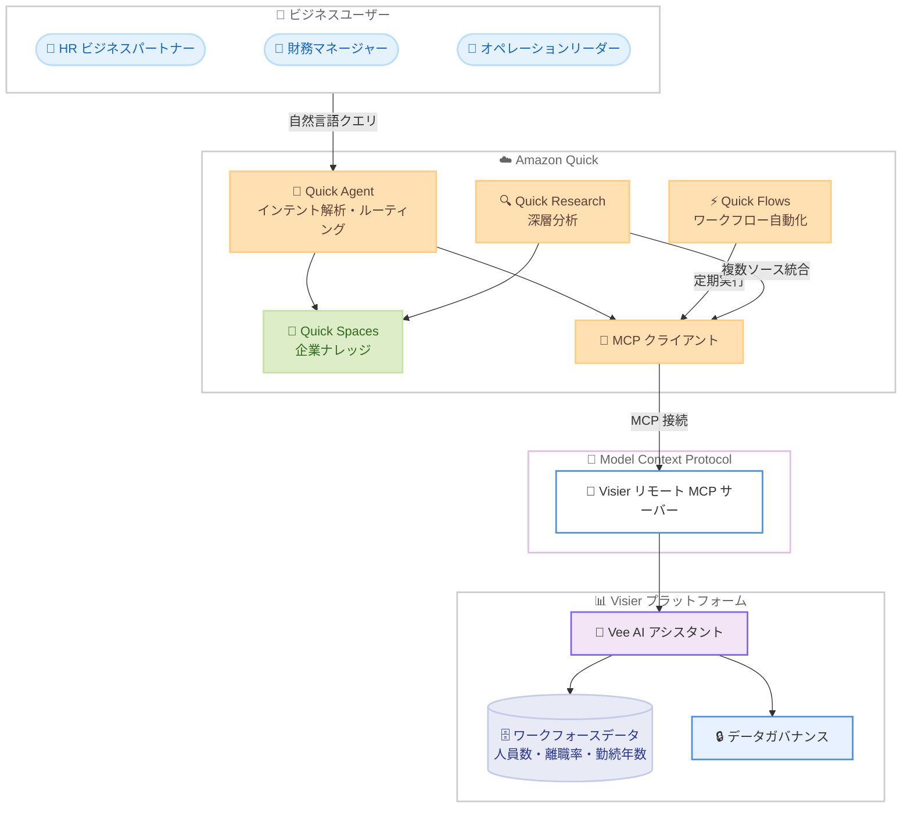

# Amazon Quick - Visier Vee エージェント統合によるワークフォースインテリジェンス

**リリース日**: 2026 年 4 月 24 日
**サービス**: Amazon Quick
**機能**: Visier の AI アシスタント Vee との MCP 統合による人材分析データへのアクセス

📊 [このアップデートのインフォグラフィックを見る](https://takech9203.github.io/aws-news-summary/20260424-amazon-quick-visier-vee.html)

## 概要

Amazon Quick が、Visier のピープルアナリティクスプラットフォームの AI アシスタント「Vee」と Model Context Protocol (MCP) を通じて統合されました。HR ビジネスパートナー、財務マネージャー、オペレーションリーダーが、ツールを切り替えることなく Amazon Quick ワークスペース内から直接 Visier のガバナンス付きワークフォースインテリジェンスにアクセスできるようになります。

Visier のリモート MCP サーバーを使用して Amazon Quick で接続を設定すると、人員数、離職率、勤続年数、オープンポジションなどに関する質問を自然言語で行い、Visier のガバナンス付きワークフォースデータモデルに基づく回答を受け取ることができます。また、Vee は自動化された Quick Flows から呼び出すことも可能で、定期的なワークフォースレビューやドキュメント作成の自動化に活用できます。

Amazon Quick は関連するプロンプトを Vee にインテリジェントにルーティングし、Quick Spaces に保存された予算、ポリシー、計画などの企業ナレッジと合わせてコンテキスト化された回答を返します。これにより、すべての回答が組織全体の状況を反映したものになります。

**アップデート前の課題**

- 人材データと組織コンテキストが異なるシステムに分散しており、統一的なワークフォースビューの取得が困難だった
- HR 担当者や財務担当者がリーダーシップ会議の準備で、スプレッドシートの照合やダッシュボード間の切り替えに数時間を費やしていた
- ワークフォースレビューの実施には手動での反復作業が必要で、定期的なレポート作成に工数がかかっていた
- 人材分析データと社内ポリシーを組み合わせた意思決定が、複数ツールを横断する必要があった

**アップデート後の改善**

- Amazon Quick ワークスペース内から Visier のライブワークフォースデータに自然言語でアクセスできるようになった
- Quick Flows による定期的なワークフォースレビューの自動化が可能になり、手動作業が不要になった
- Visier のライブデータと Quick Spaces の企業ナレッジを統合した回答を単一のインターフェースで取得できるようになった
- MCP による標準化された接続により、カスタム統合をゼロから構築する必要がなくなった

## アーキテクチャ図



ビジネスユーザーが Amazon Quick に自然言語で質問すると、Quick Agent がインテントを解析し、ワークフォースデータが必要な場合は MCP を通じて Visier の Vee エージェントにルーティングします。Vee からのライブデータと Quick Spaces の企業ナレッジを統合した回答がユーザーに返されます。

## サービスアップデートの詳細

### 主要機能

1. **MCP を通じた Visier Vee 統合**
   - Visier がホストするリモート MCP サーバーを通じて、Amazon Quick と Visier のピープルアナリティクス機能を接続
   - Amazon Quick の組み込み MCP クライアントが Visier の MCP サーバーのツールを自動検出し、エージェント、リサーチワークフロー、自動化で利用可能に
   - カスタム統合を構築することなく、標準化されたプロトコルで安全にデータ連携

2. **自然言語によるワークフォースデータアクセス**
   - Quick Agent を通じて会話形式で質問し、Visier のキュレーションされたワークフォースデータに基づく即座の回答を取得
   - 人員数、離職率、勤続年数、オープンポジションなどのワークフォース指標に対応
   - 各回答にはデータソースの帰属情報が付与され、Visier のライブデータか Quick Spaces の社内ドキュメントかを明確に識別

3. **Quick Flows によるワークフロー自動化**
   - 定期的なワークフォースレビュー、しきい値アラート、会議前ブリーフィングを Quick Flows で自動化
   - スケジュール実行により、毎週月曜日の朝に自動でレポートを生成・配信
   - Visier からのライブデータ取得、Quick Spaces のしきい値との比較、複合スコアの算出、フォーマット済みブリーフィングの作成を一連のフローとして実行

4. **Quick Research による深層分析**
   - ユーザーが必要な成果を自然言語で記述すると、Quick Research が自律的に複数のソースを横断してクエリを実行
   - Visier の MCP サーバーからのライブワークフォースデータ、Quick Spaces の社内ポリシー、外部の業界ベンチマークを統合した構造化レポートを生成
   - エグゼクティブサマリー、ベンチマーク比較、ギャップ分析などの形式で出力

5. **ガバナンスとセキュリティ**
   - Visier 側のデータガバナンスポリシーにより、認可されたワークフォースデータのみが Amazon Quick に公開
   - Quick Spaces のエンタープライズナレッジは既存のアクセス制御を維持
   - Amazon CloudWatch によるモニタリング、CloudWatch Logs による監査ログ、AWS CloudTrail による API アクティビティの追跡が可能

## 技術仕様

### 統合アーキテクチャ

| 項目 | 詳細 |
|------|------|
| 接続プロトコル | Model Context Protocol (MCP) |
| サーバー側 | Visier リモート MCP サーバー |
| クライアント側 | Amazon Quick 組み込み MCP クライアント |
| 認証方式 | ユーザー認証、サービス認証、または認証なし |
| データフロー | Amazon Quick → MCP → Visier Vee → ワークフォースデータ |

### 対応するワークフォース指標

| 指標カテゴリ | 具体例 |
|------|------|
| 人員管理 | 総人員数、地域別分布、人員目標との差異 |
| 離職・リテンション | 離職率、リテンション率、離職トレンド |
| 勤続年数 | 平均勤続年数、役職別勤続年数、勤続マイルストーン |
| 採用 | オープンポジション数、充足率 |
| パフォーマンス | ハイパフォーマー比率、パフォーマンストレンド |

### モニタリングと監査

| 項目 | 詳細 |
|------|------|
| メトリクス | Amazon CloudWatch で MCP アクションコネクタの呼び出し回数やエラー率を監視 |
| ログ | CloudWatch Logs でチャットインタラクション、コネクタ呼び出し、引用リソースを記録。Amazon S3 や Amazon Data Firehose へ配信可能 |
| 監査 | AWS CloudTrail で API コール、管理アクション、ユーザーアクティビティを記録 |

## 設定方法

### 前提条件

1. Amazon Quick へのアクセス権限を持つ AWS アカウント
2. アクティブなサブスクリプションを持つ Visier 環境
3. API アクセスと MCP サーバーが有効化された Visier アカウント

### 手順

#### ステップ 1: Visier の MCP サーバーを設定

Visier 管理コンソールにログインし、API & Integrations セクションに移動します。MCP サーバーを有効化し、エンドポイント URL と認証情報を記録します。

#### ステップ 2: Amazon Quick で MCP 統合を追加

1. Amazon Quick のホーム画面からインテグレーション設定に移動
2. Visier の MCP サーバー設定に合致する認証タイプ (ユーザー認証、サービス認証、または認証なし) を選択し、必要な認証情報を入力
3. Amazon Quick が Visier の MCP サーバーが公開するツールを自動検出
4. 他のユーザーとインテグレーションを共有し、設定を完了

#### ステップ 3: Quick Spaces に企業ドキュメントをアップロード

Quick Spaces にワークフォースプランニングドキュメント (人員予算、報酬ガイドラインなど) やポリシードキュメント (承認ワークフロー、コンプライアンス要件など) をアップロードし、Visier のライブデータと組み合わせた回答の精度を向上させます。

#### ステップ 4: Quick Flows で自動化を設定 (オプション)

定期的なワークフォースレビューが必要な場合、Quick Flows でスケジュール実行のフローを作成します。

```
実行スケジュール: 毎週月曜日 8:00 AM

ステップ 1: Visier MCP サーバーから以下の指標を取得
  - 総人員数、米国拠点人員数
  - 平均勤続年数
  - ハイパフォーマー数
  
ステップ 2: Quick Spaces から目標値・しきい値を取得
  - 人員目標、分布目標
  - 勤続年数しきい値
  - ハイパフォーマー比率目標

ステップ 3: ワークフォースヘルススコアを算出
  - 各指標を目標と比較しスコアリング
  - 複合スコアを 100 点満点で算出
  
ステップ 4: ブリーフィングを生成・配信
```

## メリット

### ビジネス面

- **統合ワークフォースインテリジェンス**: Visier のライブ人材データと社内の予算・ポリシー・計画を単一のインターフェースで組み合わせ、どちらか一方のシステムだけでは得られない包括的な回答を取得できる
- **インサイトまでの時間短縮**: スプレッドシートの照合やダッシュボード間の切り替えに費やしていた時間を削減し、単一インターフェースから即座に完全な回答を取得できる
- **部門横断的な意思決定支援**: HR、財務、オペレーションなど、ワークフォースデータと組織コンテキストの統合が必要なあらゆる機能で活用可能

### 技術面

- **標準化された MCP 接続**: Model Context Protocol により、カスタム統合を構築することなく安全で標準化されたデータ連携を実現
- **包括的な監視・監査機能**: CloudWatch メトリクス、CloudWatch Logs、CloudTrail による完全な可観測性と監査証跡を提供
- **ガバナンス付きデータアクセス**: Visier 側のデータガバナンスポリシーと Quick Spaces のアクセス制御により、認可されたデータのみが公開される

## デメリット・制約事項

### 制限事項

- Visier のアクティブなサブスクリプションと API アクセスが別途必要であり、追加コストが発生する
- ワークフォースデータの範囲は Visier プラットフォームに統合されたデータソース (HRIS、給与、タレントマネジメント、採用追跡) に依存する
- MCP 接続のセットアップには Visier 管理コンソールでの設定が必要であり、Visier 側の管理者権限が必要

### 考慮すべき点

- Visier のデータガバナンスポリシーの設定が適切でない場合、意図しないデータが Amazon Quick を通じてアクセス可能になる可能性がある
- Quick Flows による自動化フローの設計には、組織のワークフォース指標と目標値の事前定義が必要
- 大規模な組織では、Quick Spaces にアップロードするドキュメントの管理・更新プロセスの確立が重要

## ユースケース

### ユースケース 1: HR ビジネスパートナーによるワークフォースヘルスブリーフィング

**シナリオ**: HR ビジネスパートナーの Maya がリーダーシップ会議に向けてワークフォースヘルスブリーフィングを準備する。人員数、勤続年数、ハイパフォーマー比率などの指標を社内ポリシーのしきい値と照合する必要がある。

**実装例**:
```
Amazon Quick Agent への質問例:

Q: 「当社のワークフォース全体の平均勤続年数と、
    最も勤続年数が長い役職は何ですか?」
→ Visier からライブデータを取得し、Quick Spaces の
   リテンションポリシーのしきい値と照合して回答

Q: 「リーダーシップブリーフィング用にワークフォースヘルスリスクを
    要約してください」
→ すべてのワークフォースデータをポリシーしきい値と照合し、
   リスク項目と推奨アクションを含むブリーフィングを生成
```

**効果**: 複数システムを横断した手動のデータ収集・分析作業が不要になり、数時間かかっていたブリーフィング準備を短時間で完了できる

### ユースケース 2: 財務マネージャーによる人員予算管理

**シナリオ**: 財務マネージャーの David が人員予算に対する実績を追跡する。ライブの人員数データを承認済みの予算目標と比較し、差異を把握する必要がある。

**実装例**:
```
Amazon Quick Agent への質問例:

Q: 「現在の従業員数と、そのうち米国拠点の人員数は?」
→ Visier MCP 経由でライブの人員データを取得

Q: 「米国の人員数は分布目標と比較してどうですか?」
→ Visier のライブ人員数と Quick Spaces の
   FY26 ワークフォースヘルス目標ドキュメントを照合
```

**効果**: リアルタイムの人員データと予算目標を単一の会話内で比較でき、予算逸脱の早期検知と対応が可能になる

### ユースケース 3: 定期ワークフォースレビューの自動化

**シナリオ**: 組織全体のワークフォースヘルススコアを毎週自動算出し、マネージャーに配信する。手動での反復作業を排除したい。

**実装例**:
```
Quick Flows 自動化:

トリガー: 毎週月曜日 8:00 AM
1. Visier からライブワークフォース指標を取得
2. Quick Spaces から目標値・しきい値を取得  
3. 各指標をスコアリング (On Track / Needs Attention / Below Target)
4. 複合ワークフォースヘルススコアを算出 (100 点満点)
5. 注意が必要な指標のポリシー推奨アクションを取得
6. フォーマット済みブリーフィングを生成し配信
```

**効果**: 毎週の手動レビュー作業が完全に自動化され、一貫した基準でのモニタリングとタイムリーなアラートが実現する

## 料金

Amazon Quick と Visier はそれぞれ独立した料金体系を持つサービスです。

- **Amazon Quick**: Amazon Quick の料金体系に基づく (詳細は Amazon Quick 料金ページを参照)
- **Visier**: Visier プラットフォームのサブスクリプション料金が別途必要
- **MCP 接続**: MCP 統合自体に追加料金は発生しないが、API コール量やデータ転送量に応じた料金が適用される場合がある

## 利用可能リージョン

Visier と Amazon Quick の統合は、Amazon Quick が利用可能なすべての AWS リージョンで利用できます。

## 関連サービス・機能

- **Amazon Quick**: AI エージェント、リサーチ、ビジネスインテリジェンス、ワークフロー自動化を統合するエージェンティック AI ワークスペース
- **Visier**: HRIS、給与、タレントマネジメント、採用追跡を統合するクラウドベースのワークフォース AI プラットフォーム
- **Model Context Protocol (MCP)**: AI エージェントが外部データソースやツールに接続するためのオープンスタンダード
- **Amazon CloudWatch**: MCP コネクタのメトリクスやログの監視・分析
- **AWS CloudTrail**: Amazon Quick 環境全体の API コールおよび管理アクションの監査証跡

## 参考リンク

- 📊 [インフォグラフィック](https://takech9203.github.io/aws-news-summary/20260424-amazon-quick-visier-vee.html)
- [公式発表 (What's New)](https://aws.amazon.com/about-aws/whats-new/2026/04/amazon-quick-visier-vee/)
- [AWS Blog - Building Workforce AI Agents with Visier and Amazon Quick](https://aws.amazon.com/blogs/machine-learning/building-workforce-ai-agents-with-visier-and-amazon-quick/)
- [Amazon Quick ドキュメント](https://docs.aws.amazon.com/quick/)
- [Visier MCP Server ドキュメント](https://docs.visier.com/)
- [Amazon Quick MCP 統合ガイド - Integrate external tools with Amazon Quick Agents using MCP](https://docs.aws.amazon.com/quick/latest/userguide/mcp-integration.html)

## まとめ

Amazon Quick と Visier Vee の MCP 統合は、ワークフォースインテリジェンスと企業ナレッジを単一のエージェンティックワークスペースに統合するパターンを示しています。HR、財務、オペレーション部門のリーダーがツールを切り替えることなく、ライブの人材データと組織コンテキストを組み合わせた意思決定を行えるようになります。この統合パターンは人材分析に留まらず、組織データと業務コンテキストの統合が必要なあらゆるシナリオに適用可能であり、Amazon Quick の MCP 統合機能を活用した外部システム連携の実践的な事例として参考になります。
