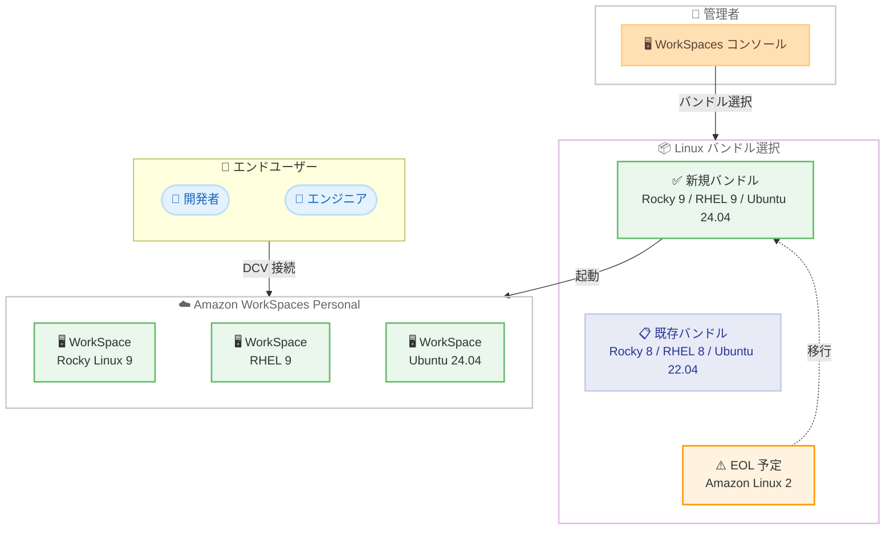

# Amazon WorkSpaces Personal - Rocky Linux 9、RHEL 9、Ubuntu 24.04 バンドル対応

**リリース日**: 2026 年 4 月 24 日
**サービス**: Amazon WorkSpaces Personal
**機能**: Rocky Linux 9、Red Hat Enterprise Linux 9、Ubuntu 24.04 バンドル

📊 [このアップデートのインフォグラフィックを見る](https://takech9203.github.io/aws-news-summary/20260424-amazon-workspaces-rocky9-rhel9-ubuntu24.html)

## 概要

Amazon WorkSpaces Personal が新しい Linux バンドルとして Rocky Linux 9、Red Hat Enterprise Linux (RHEL) 9、Ubuntu 24.04 をサポートしました。これにより、最新のエンタープライズグレード Linux ディストリビューションを基盤とした仮想デスクトップを WorkSpaces 上で起動できるようになります。

これらの新しいバンドルは、最新のソフトウェアエコシステムへのアクセス、セキュリティ体制の強化、各ディストリビューションが提供する長期サポートライフサイクルの延長といったメリットを提供します。従来の Rocky Linux 8、RHEL 8、Ubuntu 22.04 バンドルは引き続き利用可能であり、段階的な移行が可能です。

特に、2026 年 6 月に End of Life を迎える Amazon Linux 2 を使用しているお客様にとって、今回の新バンドルは重要な移行先となります。Amazon WorkSpaces が利用可能なすべての AWS リージョンで提供されています。

**アップデート前の課題**

- WorkSpaces Personal の Linux バンドルは Rocky Linux 8、RHEL 8、Ubuntu 22.04 までの対応に限られていた
- Amazon Linux 2 が 2026 年 6 月に End of Life を迎えるため、利用中のお客様は移行先の検討が必要だった
- 旧バージョンの Linux ディストリビューションでは、最新のパッケージやセキュリティ機能を利用できないケースがあった

**アップデート後の改善**

- Rocky Linux 9、RHEL 9、Ubuntu 24.04 の最新バンドルが利用可能になり、最新のパッケージエコシステムにアクセスできる
- Amazon Linux 2 からの移行パスが明確になり、End of Life に備えた計画的な移行が可能になった
- 各ディストリビューションの長期サポートライフサイクルにより、より長期間にわたる安定運用が実現できる

## アーキテクチャ図



管理者が WorkSpaces コンソールから新しい Linux バンドルを選択して WorkSpace を起動するフローを示しています。Amazon Linux 2 からの移行パスも含まれています。

## サービスアップデートの詳細

### 主要機能

1. **Rocky Linux 9 バンドル**
   - CentOS の後継として広く採用されている Rocky Linux の最新メジャーバージョン
   - RHEL 9 とバイナリ互換であり、エンタープライズ Linux 環境からの移行が容易
   - 2032 年 5 月までのサポートライフサイクルを持ち、長期間の安定運用が可能

2. **Red Hat Enterprise Linux 9 バンドル**
   - エンタープライズ Linux のデファクトスタンダードである RHEL の最新メジャーバージョン
   - Red Hat のサブスクリプションに基づく商用サポートを受けられる
   - SELinux の強化やカーネルライブパッチなどのセキュリティ機能が改善

3. **Ubuntu 24.04 LTS バンドル**
   - Ubuntu 24.04 LTS (Noble Numbat) は 2029 年 4 月まで標準サポート、拡張セキュリティメンテナンスにより最大 12 年間のサポートを提供
   - 最新の開発ツールやパッケージへのアクセスが可能
   - Snap パッケージによるアプリケーション配布の改善

## 技術仕様

### 対応ディストリビューション比較

| 項目 | Rocky Linux 9 | RHEL 9 | Ubuntu 24.04 LTS |
|------|---------------|--------|-------------------|
| カーネルバージョン | 5.14 系 | 5.14 系 | 6.8 系 |
| パッケージ管理 | dnf / RPM | dnf / RPM | apt / deb |
| セキュリティフレームワーク | SELinux | SELinux | AppArmor |
| サポート期限 | 2032 年 5 月 | Red Hat ポリシーに準拠 | 2029 年 4 月 (標準) |
| ライセンス | 無料 | サブスクリプション | 無料 |

### 既存バンドルとの比較

| ディストリビューション | 旧バージョン | 新バージョン | 主な改善点 |
|------------------------|-------------|-------------|-----------|
| Rocky Linux | 8 | 9 | カーネル更新、セキュリティ強化 |
| RHEL | 8 | 9 | カーネルライブパッチ改善、コンテナツール強化 |
| Ubuntu | 22.04 | 24.04 | カーネル 6.8、最新パッケージ |

### API 変更履歴

今回のアップデートに直接対応する API 変更 (OperatingSystemName への `ROCKY_9`、`RHEL_9`、`UBUNTU_24_04` の追加) は、本レポート作成時点で AWS API Changes には反映されていません。近日中に以下の API メソッドが更新される見込みです。

| API メソッド | 想定される変更内容 |
|-------------|-------------------|
| CreateWorkspaces | OperatingSystemName に新しい列挙値を追加 |
| DescribeWorkspaces | レスポンスに新しい OS 名を含む |
| DescribeApplications | 新しい OS 名でのフィルタリングをサポート |
| ModifyWorkspaceProperties | 新しい OS 名の指定をサポート |

参考: 直近の関連する API 変更として、2026 年 3 月 11 日に [WINDOWS_SERVER_2025 の追加](https://awsapichanges.com/archive/changes/537c33-workspaces.html)が行われています。

### プロトコル

| 項目 | 詳細 |
|------|------|
| 接続プロトコル | DCV (旧 WSP) がデフォルト |
| PCoIP | Linux バンドルでは DCV がデフォルトのため指定不要 |

## 設定方法

### 前提条件

1. Amazon WorkSpaces Personal が利用可能なリージョンの AWS アカウント
2. WorkSpaces 用の AWS Directory Service ディレクトリ (AWS Managed Microsoft AD または Simple AD)
3. 適切な IAM 権限

### 手順

#### ステップ 1: WorkSpaces コンソールでバンドルを選択

```bash
# AWS CLI でバンドル一覧を確認し、新しい Linux バンドルを検索
aws workspaces describe-workspace-bundles \
  --query "Bundles[?contains(Name, 'Rocky') || contains(Name, 'RHEL') || contains(Name, 'Ubuntu')].[BundleId, Name, Description]" \
  --output table
```

WorkSpaces コンソールまたは AWS CLI を使用して、利用可能な Linux バンドルの一覧を確認します。Rocky Linux 9、RHEL 9、Ubuntu 24.04 のバンドルが表示されます。

#### ステップ 2: WorkSpace の作成

```bash
# 新しい Linux バンドルを使用して WorkSpace を作成
aws workspaces create-workspaces \
  --workspaces '[{
    "DirectoryId": "d-1234567890",
    "UserName": "user@example.com",
    "BundleId": "<Rocky9/RHEL9/Ubuntu24.04のバンドルID>",
    "WorkspaceProperties": {
      "RunningMode": "AUTO_STOP",
      "RunningModeAutoStopTimeoutInMinutes": 60,
      "RootVolumeSizeGib": 80,
      "UserVolumeSizeGib": 50
    }
  }]'
```

選択したバンドル ID を指定して、新しい WorkSpace を作成します。Linux バンドルでは DCV プロトコルがデフォルトで使用されるため、プロトコルの明示的な指定は不要です。

#### ステップ 3: 接続確認

WorkSpace のステータスが AVAILABLE になったら、WorkSpaces クライアントアプリケーションまたは Web Access を使用して接続を確認します。

## メリット

### ビジネス面

- **長期運用の安定性**: 各ディストリビューションの長期サポートにより、頻繁な OS 移行が不要になり運用コストを削減
- **Amazon Linux 2 移行の明確化**: 2026 年 6 月の End of Life に向けた移行先が明確になり、計画的な移行が可能
- **コンプライアンス対応**: 最新のセキュリティパッチやカーネル更新により、セキュリティ基準への準拠が容易

### 技術面

- **最新パッケージエコシステム**: 最新バージョンの開発ツール、ライブラリ、ランタイムにアクセス可能
- **セキュリティ強化**: 最新のカーネルセキュリティ機能、SELinux / AppArmor の改善、脆弱性修正の迅速な提供
- **コンテナ対応の強化**: Podman、Buildah などの最新コンテナツールが標準で利用可能 (RHEL 9 / Rocky Linux 9)

## デメリット・制約事項

### 制限事項

- 旧バージョンのバンドルから新バージョンへのインプレースアップグレードはサポートされない (新規作成が必要)
- RHEL 9 バンドルは Red Hat サブスクリプションのコストが追加で発生する可能性がある
- 一部のレガシーアプリケーションは新しい OS バージョンとの互換性検証が必要

### 考慮すべき点

- Amazon Linux 2 から移行する場合、パッケージ管理システムの違い (yum から dnf、または apt) への対応が必要
- カスタムイメージを使用している場合は、新しい OS バージョンで再作成が必要
- SELinux (Rocky 9 / RHEL 9) と AppArmor (Ubuntu 24.04) のセキュリティポリシーの違いを考慮した設計が必要

## ユースケース

### ユースケース 1: Amazon Linux 2 からの移行

**シナリオ**: 2026 年 6 月の Amazon Linux 2 End of Life に備えて、現在 Amazon Linux 2 ベースの WorkSpaces を運用しているチームが移行先を選定する。

**実装例**:
```bash
# 現在の Amazon Linux 2 WorkSpaces を確認
aws workspaces describe-workspaces \
  --query "Workspaces[?WorkspaceProperties.OperatingSystemName=='AMAZON_LINUX_2'].[WorkspaceId, UserName]" \
  --output table

# Rocky Linux 9 バンドルで新しい WorkSpace を作成
aws workspaces create-workspaces \
  --workspaces '[{
    "DirectoryId": "d-1234567890",
    "UserName": "user@example.com",
    "BundleId": "<Rocky9のバンドルID>",
    "WorkspaceProperties": {
      "RunningMode": "AUTO_STOP"
    }
  }]'
```

**効果**: Amazon Linux 2 の End of Life 前に計画的な移行を完了し、継続的なセキュリティサポートを確保

### ユースケース 2: エンタープライズ Linux 標準化

**シナリオ**: 社内で RHEL を標準 Linux ディストリビューションとして採用している企業が、リモートワーク環境でも同一の OS を使用したい。

**実装例**:
```bash
# RHEL 9 バンドルを使用して WorkSpace を一括作成
aws workspaces create-workspaces \
  --workspaces '[
    {"DirectoryId": "d-1234567890", "UserName": "dev1@example.com", "BundleId": "<RHEL9のバンドルID>"},
    {"DirectoryId": "d-1234567890", "UserName": "dev2@example.com", "BundleId": "<RHEL9のバンドルID>"},
    {"DirectoryId": "d-1234567890", "UserName": "dev3@example.com", "BundleId": "<RHEL9のバンドルID>"}
  ]'
```

**効果**: オンプレミスとクラウドデスクトップの OS を統一し、運用管理の標準化とセキュリティポリシーの一貫性を確保

### ユースケース 3: 開発環境の最新化

**シナリオ**: ソフトウェア開発チームが最新の開発ツールチェインを必要としており、Ubuntu 24.04 LTS の最新パッケージを活用したい。

**実装例**:
```bash
# Ubuntu 24.04 バンドルで開発者用 WorkSpace を作成
aws workspaces create-workspaces \
  --workspaces '[{
    "DirectoryId": "d-1234567890",
    "UserName": "developer@example.com",
    "BundleId": "<Ubuntu24.04のバンドルID>",
    "WorkspaceProperties": {
      "RunningMode": "ALWAYS_ON",
      "RootVolumeSizeGib": 80,
      "UserVolumeSizeGib": 100
    }
  }]'
```

**効果**: 最新の開発ツール、ライブラリ、コンテナランタイムをすぐに利用でき、開発生産性が向上

## 料金

Amazon WorkSpaces Personal の料金は、選択するバンドルのコンピューティングタイプと課金モデル (月額または時間課金) によって異なります。新しい Linux バンドルの追加料金はありませんが、RHEL 9 バンドルについては Red Hat のライセンスコストが含まれる場合があります。

### 料金例

| バンドルタイプ | 月額料金 (概算、東京リージョン) | 時間課金 (概算) |
|--------------|-------------------------------|----------------|
| Value (Linux) | 約 $25/月 | 約 $7.25/月 + $0.26/時間 |
| Standard (Linux) | 約 $32/月 | 約 $9.75/月 + $0.30/時間 |
| Performance (Linux) | 約 $48/月 | 約 $13.00/月 + $0.46/時間 |
| Power (Linux) | 約 $69/月 | 約 $17.00/月 + $0.66/時間 |

※ 料金は目安です。最新の料金は [Amazon WorkSpaces 料金ページ](https://aws.amazon.com/workspaces/pricing/) を参照してください。

## 利用可能リージョン

Amazon WorkSpaces が利用可能なすべての AWS リージョンで提供されています。主なリージョンは以下の通りです。

- US East (N. Virginia)
- US West (Oregon)
- Canada (Central)
- Europe (Ireland, Frankfurt, London)
- Asia Pacific (Tokyo, Singapore, Sydney, Mumbai, Seoul)
- South America (Sao Paulo)
- Africa (Cape Town)
- Israel (Tel Aviv)
- AWS GovCloud (US-West, US-East)

## 関連サービス・機能

- **Amazon WorkSpaces Personal**: 個人ユーザー向けのフルマネージド仮想デスクトップサービス。今回の Linux バンドル追加の対象サービス
- **AWS Directory Service**: WorkSpaces のユーザー認証に使用するディレクトリサービス。Linux WorkSpaces でも Active Directory 連携が可能
- **Amazon WorkSpaces Thin Client**: WorkSpaces に接続するための低コストデバイス。新しい Linux バンドルの WorkSpaces にも接続可能
- **Amazon Linux 2**: 2026 年 6 月に End of Life を迎える AWS 独自の Linux ディストリビューション。今回の新バンドルが移行先として推奨される

## 参考リンク

- 📊 [インフォグラフィック](https://takech9203.github.io/aws-news-summary/20260424-amazon-workspaces-rocky9-rhel9-ubuntu24.html)
- [公式発表 (What's New)](https://aws.amazon.com/about-aws/whats-new/2026/06/amazon-workspaces-rocky9-rhel9-ubuntu24/)
- [Amazon WorkSpaces ドキュメント](https://docs.aws.amazon.com/workspaces/)
- [Amazon WorkSpaces Linux バンドルガイド](https://docs.aws.amazon.com/workspaces/latest/adminguide/amazon-workspaces-linux.html)
- [Amazon WorkSpaces 料金](https://aws.amazon.com/workspaces/pricing/)

## まとめ

Amazon WorkSpaces Personal が Rocky Linux 9、RHEL 9、Ubuntu 24.04 をサポートしたことで、エンタープライズグレードの最新 Linux ディストリビューションを仮想デスクトップ環境で利用できるようになりました。特に 2026 年 6 月に End of Life を迎える Amazon Linux 2 を使用しているお客様は、早期に移行計画を策定し、新しいバンドルでの動作検証を開始することを推奨します。既存の Rocky Linux 8、RHEL 8、Ubuntu 22.04 バンドルも引き続き利用可能なため、段階的な移行が可能です。
