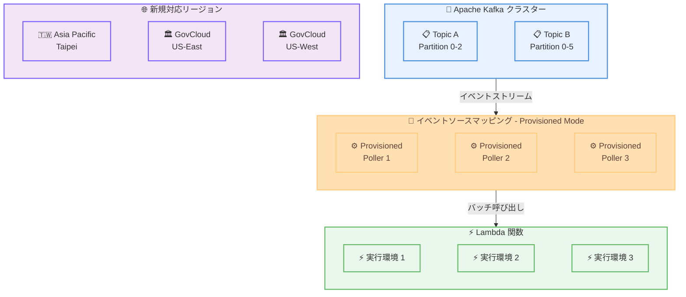

# AWS Lambda - Kafka イベントソースマッピング向け Provisioned Mode のリージョン拡大

**リリース日**: 2026 年 4 月 24 日
**サービス**: AWS Lambda
**機能**: Kafka イベントソースマッピング (ESM) 向け Provisioned Mode

📊 [このアップデートのインフォグラフィックを見る](https://takech9203.github.io/aws-news-summary/20260424-aws-Lambda-provisioned-esm-region-expansion.html)

## 概要

AWS Lambda の Kafka イベントソースマッピング (ESM) 向け Provisioned Mode が、Asia Pacific (Taipei)、AWS GovCloud (US-East)、AWS GovCloud (US-West) の 3 つのリージョンで新たに利用可能になりました。これにより、これらのリージョンでも Kafka ベースのイベント駆動型アプリケーションにおいて、プロビジョニング済みのイベントポーリングリソースを活用したスループット最適化が可能になります。

Provisioned Mode は、Apache Kafka イベントソースに対する ESM のイベントポーリングリソースを事前にプロビジョニングしておくことで、突発的なトラフィックスパイクに即座に対応できる機能です。通常のオンデマンドモードでは、トラフィック増加時にポーリングリソースのスケールアップに時間がかかる場合がありますが、Provisioned Mode を使用することで、常に十分なポーリングリソースが準備された状態を維持できます。厳格なパフォーマンス要件を持つ高応答性でスケーラブルなイベント駆動型 Kafka アプリケーションの構築に最適です。

**アップデート前の課題**

- Asia Pacific (Taipei) や AWS GovCloud リージョンで Kafka ESM の Provisioned Mode を利用できなかった
- これらのリージョンでは、Kafka からのトラフィックスパイクに対してポーリングリソースのスケールアップが自動的にしか行われず、応答時間に遅延が生じる可能性があった
- GovCloud 環境で厳格なパフォーマンス要件を持つ Kafka アプリケーションを構築する際に、スループット最適化の選択肢が限られていた

**アップデート後の改善**

- Asia Pacific (Taipei)、AWS GovCloud (US-East)、AWS GovCloud (US-West) で Provisioned Mode が利用可能になった
- これらのリージョンでもイベントポーリングリソースを事前にプロビジョニングし、突発的なトラフィックスパイクに即座に対応できるようになった
- GovCloud 環境を含む、より多くのリージョンで高パフォーマンスな Kafka イベント処理アーキテクチャを構築できるようになった

## アーキテクチャ図



この図は、Kafka クラスターからイベントソースマッピングの Provisioned Mode を経由して Lambda 関数にイベントが配信される流れを示しています。プロビジョニング済みのポーラーがトラフィックスパイクに備えて常時待機し、新たに対応した 3 つのリージョンで利用可能です。

## サービスアップデートの詳細

### 主要機能

1. **Provisioned Mode によるスループット最適化**
   - Kafka ESM のイベントポーリングリソースを事前にプロビジョニングすることで、一定のスループット容量を確保します
   - 突発的なトラフィックスパイクに対して、ポーリングリソースのスケールアップを待つことなく即座に対応できます
   - Minimum Provisioned Pollers (MinimumPollers) パラメータにより、常時稼働するポーラーの最小数を指定できます

2. **Apache Kafka イベントソースとの統合**
   - Amazon Managed Streaming for Apache Kafka (Amazon MSK) および自己管理型 Kafka クラスターの両方に対応しています
   - Kafka トピックのパーティションからイベントをポーリングし、Lambda 関数にバッチで配信します
   - VPC 内の Kafka クラスターへの接続もサポートしています

3. **GovCloud リージョンへの対応**
   - AWS GovCloud (US-East) および AWS GovCloud (US-West) で利用可能になりました
   - 政府機関や規制産業のワークロードにおいて、Kafka ベースのイベント駆動型アーキテクチャを高パフォーマンスで運用できます
   - FedRAMP High の認定を受けた環境での利用が可能です

## 技術仕様

### Provisioned Mode の設定パラメータ

| 項目 | 詳細 |
|------|------|
| 対象イベントソース | Apache Kafka (Amazon MSK、自己管理型 Kafka) |
| 設定パラメータ | `ProvisionedPollerConfig` |
| 最小ポーラー数 | `MinimumPollers` (1 以上) |
| 最大ポーラー数 | `MaximumPollers` |
| モード切替 | オンデマンドモードと Provisioned Mode の切り替えが可能 |
| 対象 API | `CreateEventSourceMapping`、`UpdateEventSourceMapping` |

### 新規対応リージョン

| リージョン名 | リージョンコード |
|-------------|-----------------|
| Asia Pacific (Taipei) | ap-east-2 |
| AWS GovCloud (US-East) | us-gov-east-1 |
| AWS GovCloud (US-West) | us-gov-west-1 |

### API 変更履歴

| 日付 | サービス | 変更内容 |
|------|----------|----------|
| 2026/04/22 | [AWS Lambda](https://awsapichanges.com/archive/changes/9e0cd6-lambda.html) | 13 updated methods - Ruby 4.0 ランタイムサポート追加 |

### ESM 設定例

```json
{
  "EventSourceArn": "arn:aws:kafka:ap-east-2:123456789012:cluster/my-kafka-cluster/abc123",
  "FunctionName": "arn:aws:lambda:ap-east-2:123456789012:function:my-kafka-processor",
  "Topics": ["my-topic"],
  "SourceAccessConfigurations": [
    {
      "Type": "VPC_SUBNET",
      "URI": "subnet-0123456789abcdef0"
    },
    {
      "Type": "VPC_SECURITY_GROUP",
      "URI": "sg-0123456789abcdef0"
    }
  ],
  "ProvisionedPollerConfig": {
    "MinimumPollers": 2,
    "MaximumPollers": 10
  }
}
```

## 設定方法

### 前提条件

1. AWS アカウントを持っており、対象リージョン (ap-east-2、us-gov-east-1、us-gov-west-1) が有効化されていること
2. Apache Kafka クラスター (Amazon MSK または自己管理型) が稼働していること
3. Lambda 関数が作成済みであること
4. AWS CLI v2 がインストールされていること

### 手順

#### ステップ 1: Lambda 関数の作成

```bash
# Kafka イベントを処理する Lambda 関数を作成
aws lambda create-function \
  --function-name kafka-event-processor \
  --runtime python3.13 \
  --role arn:aws:iam::123456789012:role/lambda-kafka-role \
  --handler lambda_function.handler \
  --zip-file fileb://function.zip \
  --region ap-east-2
```

Kafka イベントを処理する Lambda 関数を、新たに対応した Asia Pacific (Taipei) リージョンに作成します。

#### ステップ 2: Provisioned Mode でイベントソースマッピングを作成

```bash
# Provisioned Mode を有効にした ESM を作成
aws lambda create-event-source-mapping \
  --function-name kafka-event-processor \
  --event-source-arn "arn:aws:kafka:ap-east-2:123456789012:cluster/my-cluster/abc123" \
  --topics "my-topic" \
  --starting-position LATEST \
  --provisioned-poller-config '{"MinimumPollers": 2, "MaximumPollers": 10}' \
  --region ap-east-2
```

`--provisioned-poller-config` パラメータで `MinimumPollers` と `MaximumPollers` を指定し、Provisioned Mode を有効化します。最小 2 ポーラー、最大 10 ポーラーの設定例です。

#### ステップ 3: ESM の状態確認

```bash
# イベントソースマッピングの状態を確認
aws lambda list-event-source-mappings \
  --function-name kafka-event-processor \
  --region ap-east-2
```

作成した ESM の `State` が `Enabled` になっていることを確認します。Provisioned Mode のポーラーが稼働中であることも確認できます。

## メリット

### ビジネス面

- **高可用性の実現**: プロビジョニング済みポーラーにより、トラフィックスパイク時でも安定したイベント処理が可能で、SLA 要件を満たしやすくなります
- **GovCloud 対応**: 政府機関や規制産業のワークロードにおいて、高パフォーマンスな Kafka イベント処理を GovCloud 環境で実現できます
- **台湾リージョンでの低レイテンシー**: Asia Pacific (Taipei) リージョンの利用により、台湾およびその周辺地域のお客様に低レイテンシーなイベント処理を提供できます

### 技術面

- **レイテンシー削減**: ポーリングリソースが事前にプロビジョニングされているため、イベント取得から Lambda 関数呼び出しまでのレイテンシーが安定します
- **スケーラビリティの向上**: `MinimumPollers` と `MaximumPollers` の設定により、ワークロードに応じた柔軟なスケーリングが可能です
- **運用の簡素化**: Provisioned Mode はマネージドサービスとして提供されるため、ポーリングインフラストラクチャの管理が不要です

## デメリット・制約事項

### 制限事項

- Provisioned Mode は Kafka イベントソース (Amazon MSK および自己管理型 Kafka) にのみ対応しており、他のイベントソース (SQS、DynamoDB Streams など) には適用されません
- プロビジョニング済みポーラーは常時稼働するため、トラフィックが低い時間帯でもコストが発生します
- 利用可能なリージョンはまだ限定されており、すべての AWS リージョンで利用できるわけではありません

### 考慮すべき点

- `MinimumPollers` の値を高く設定しすぎると、不必要なコストが発生する可能性があるため、ワークロードのパターンに基づいて適切に設定する必要があります
- 自己管理型 Kafka クラスターを使用する場合、VPC 設定やセキュリティグループの構成が別途必要です
- Provisioned Mode とオンデマンドモードの切り替え時に一時的なイベント処理の遅延が発生する可能性があります

## ユースケース

### ユースケース 1: 金融取引のリアルタイム処理

**シナリオ**: 金融機関が Kafka を使用して取引イベントをストリーミングし、Lambda でリアルタイムに不正検知や取引処理を行う

**実装例**:
```python
import json

def handler(event, context):
    for record in event['records'].values():
        for item in record:
            # Kafka レコードをデコード
            payload = json.loads(
                __import__('base64').b64decode(item['value']).decode('utf-8')
            )
            # 不正検知ロジックを実行
            if detect_fraud(payload):
                alert_security_team(payload)
            # 取引を処理
            process_transaction(payload)
```

**効果**: Provisioned Mode により、市場の急変動時にも安定したスループットで取引イベントを処理でき、不正検知の遅延を最小限に抑えられます

### ユースケース 2: GovCloud での IoT データパイプライン

**シナリオ**: 政府機関が GovCloud 環境で IoT デバイスからの Kafka ストリームを処理し、リアルタイム分析を行う

**実装例**:
```python
import json

def handler(event, context):
    for record in event['records'].values():
        for item in record:
            sensor_data = json.loads(
                __import__('base64').b64decode(item['value']).decode('utf-8')
            )
            # センサーデータの異常検知
            if sensor_data['temperature'] > THRESHOLD:
                trigger_alert(sensor_data)
            # データを分析パイプラインに送信
            send_to_analytics(sensor_data)
```

**効果**: GovCloud 環境で Provisioned Mode を使用することで、FedRAMP 準拠のセキュアな環境で高スループットの IoT データ処理が可能になります

### ユースケース 3: E コマースのイベント駆動型アーキテクチャ

**シナリオ**: E コマースプラットフォームが Kafka を使用して注文イベントを処理し、在庫管理や通知を自動化する

**実装例**:
```python
import json

def handler(event, context):
    for record in event['records'].values():
        for item in record:
            order_event = json.loads(
                __import__('base64').b64decode(item['value']).decode('utf-8')
            )
            # 注文タイプに応じた処理
            if order_event['type'] == 'ORDER_PLACED':
                update_inventory(order_event)
                send_confirmation(order_event)
            elif order_event['type'] == 'ORDER_CANCELLED':
                restore_inventory(order_event)
                send_cancellation_notice(order_event)
```

**効果**: セール期間中のトラフィックスパイクに対して、Provisioned Mode のポーラーが即座に対応し、注文処理の遅延を防止できます

## 料金

Provisioned Mode を使用する場合、プロビジョニング済みポーラーの稼働時間に基づいて料金が発生します。通常の Lambda 実行料金に加えて、ESM のポーラー料金が課金されます。

### 料金例

| 使用量 | 月額料金 (概算) |
|--------|------------------|
| Provisioned Pollers 2 台、24 時間 365 日稼働 | ESM ポーラー料金 + Lambda 実行料金 |
| Provisioned Pollers 5 台、ピーク時間のみ (12 時間/日) | ESM ポーラー料金 + Lambda 実行料金 |

※ 具体的な料金は [AWS Lambda 料金ページ](https://aws.amazon.com/lambda/pricing/) をご確認ください
※ GovCloud リージョンでは、商用リージョンと異なる料金が適用される場合があります

## 利用可能リージョン

今回のアップデートで新たに追加された 3 リージョンを含む、Kafka ESM Provisioned Mode の利用可能リージョンは以下のとおりです。

**今回追加されたリージョン:**
- Asia Pacific (Taipei) - ap-east-2
- AWS GovCloud (US-East) - us-gov-east-1
- AWS GovCloud (US-West) - us-gov-west-1

**既存の対応リージョン:**
- 米国: us-east-1, us-east-2, us-west-1, us-west-2
- 欧州: eu-west-1, eu-west-2, eu-west-3, eu-central-1, eu-north-1
- アジアパシフィック: ap-northeast-1, ap-northeast-2, ap-southeast-1, ap-southeast-2, ap-south-1

※ 最新のリージョン対応状況は AWS ドキュメントをご確認ください

## 関連サービス・機能

- **Amazon Managed Streaming for Apache Kafka (Amazon MSK)**: Lambda ESM と統合してサーバーレスな Kafka コンシューマーを構築できます
- **AWS Lambda Event Source Mapping**: Kafka 以外にも SQS、DynamoDB Streams、Kinesis などのイベントソースに対応した ESM 機能を提供しています
- **Amazon EventBridge Pipes**: Kafka ソースから Lambda を含む複数のターゲットへのイベントルーティングをサポートしています
- **AWS PrivateLink**: VPC 内の自己管理型 Kafka クラスターへのセキュアな接続を提供しています

## 参考リンク

- 📊 [インフォグラフィック](https://takech9203.github.io/aws-news-summary/20260424-aws-Lambda-provisioned-esm-region-expansion.html)
- [公式発表 (What's New)](https://aws.amazon.com/about-aws/whats-new/2026/04/aws-Lambda-provisioned-esm-region-expansion/)
- [ドキュメント - Lambda と Kafka の統合](https://docs.aws.amazon.com/lambda/latest/dg/with-kafka.html)
- [ドキュメント - Lambda ESM Provisioned Mode](https://docs.aws.amazon.com/lambda/latest/dg/kafka-provisioned-mode.html)
- [AWS Lambda 料金ページ](https://aws.amazon.com/lambda/pricing/)

## まとめ

AWS Lambda の Kafka イベントソースマッピング向け Provisioned Mode が Asia Pacific (Taipei)、AWS GovCloud (US-East)、AWS GovCloud (US-West) に拡大されたことで、これらのリージョンでも高パフォーマンスな Kafka イベント処理が可能になりました。特に GovCloud 環境での対応は、政府機関や規制産業のお客様にとって重要なアップデートです。Kafka ベースのイベント駆動型アプリケーションで突発的なトラフィックスパイクへの対応が求められるお客様は、Provisioned Mode の導入を検討することをお勧めします。
