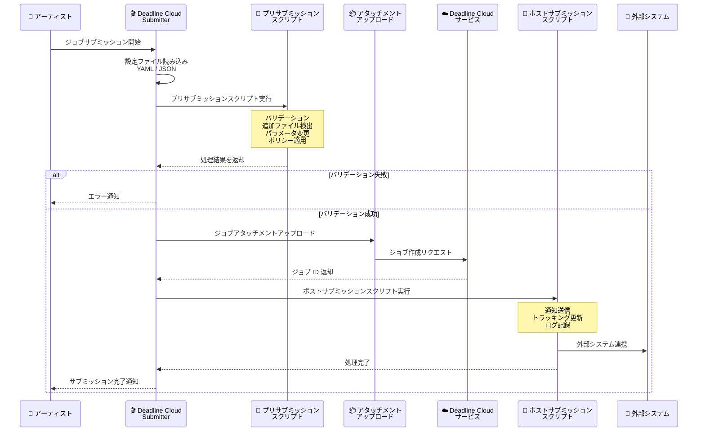

# AWS Deadline Cloud - ジョブサブミッションワークフロー向けカスタムスクリプティング

**リリース日**: 2026 年 4 月 24 日
**サービス**: AWS Deadline Cloud
**機能**: Custom scripting for job submission workflows

📊 [このアップデートのインフォグラフィックを見る](https://takech9203.github.io/aws-news-summary/20260424-aws-deadline-cloud.html)

## 概要

AWS Deadline Cloud に、ジョブサブミッション前後にカスタムスクリプトを実行できる新機能が追加されました。これにより、スタジオは独自のパイプラインをサブミッションワークフローに直接統合できるようになります。AWS Deadline Cloud は、映画、テレビ、Web コンテンツ、デザイン向けのコンピュータ生成グラフィックスおよびビジュアルエフェクトのレンダリング管理を簡素化するフルマネージドサービスです。

新しいサブミッションスクリプティング機能により、すべてのジョブサブミッションの一部として自動的に実行されるスクリプトを構成できます。プリサブミッションスクリプトはジョブアタッチメントのアップロード前に実行され、ポストサブミッションスクリプトはジョブ作成後に実行されます。スクリプトは YAML または JSON 形式の設定ファイルで定義し、ジョブバンドルディレクトリまたは環境変数を使用したスタジオ共有ディレクトリに配置できるため、パイプラインチームがすべてのアーティストに対して標準を適用することが容易になります。

**アップデート前の課題**

- ジョブサブミッション時のバリデーションやポリシー適用を自動化する標準的な仕組みがなく、手動で確認するか、外部ツールに依存する必要があった
- テクスチャやキャッシュなどの追加入力ファイルの自動検出・追加ができず、アーティストが手動で指定する必要があった
- ジョブサブミッション後の通知やトラッキングシステムの更新を自動化するためには、別途カスタムツールの開発が必要だった

**アップデート後の改善**

- プリサブミッションスクリプトにより、ジョブ構成のバリデーション、追加入力ファイルの自動検出、サブミッションパラメータの変更、スタジオポリシーの適用が可能になった
- ポストサブミッションスクリプトにより、通知送信、トラッキングシステムの更新、サブミッション詳細のログ記録が自動化された
- YAML/JSON 設定ファイルと環境変数による共有ディレクトリ指定で、スタジオ全体の標準適用が容易になった

## アーキテクチャ図



ジョブサブミッション時のワークフロー全体を示しています。アーティストがジョブを送信すると、まず設定ファイルが読み込まれ、プリサブミッションスクリプトが実行されます。バリデーション成功後にアタッチメントがアップロードされ、ジョブが作成された後にポストサブミッションスクリプトが実行されます。

## サービスアップデートの詳細

### 主要機能

1. **プリサブミッションスクリプト**
   - ジョブアタッチメントのアップロード前に自動実行
   - ジョブ構成のバリデーション (必須パラメータの確認、値の範囲チェックなど)
   - テクスチャ、キャッシュなどの追加入力ファイルの自動検出と追加
   - サブミッションパラメータの動的な変更
   - スタジオポリシーの適用 (命名規則、優先度制限、リソース上限など)

2. **ポストサブミッションスクリプト**
   - ジョブ作成後に自動実行
   - Slack、Teams、メールなどへの通知送信
   - ShotGrid、ftrack などのプロダクショントラッキングシステムの更新
   - サブミッション詳細のログ記録 (監査証跡の作成)

3. **柔軟な設定管理**
   - YAML または JSON 形式の設定ファイルで定義
   - ジョブバンドルディレクトリにローカル配置可能
   - 環境変数によるスタジオ共有ディレクトリの指定が可能
   - 各スクリプトにタイムアウトの設定が可能
   - スクリプトにはジョブメタデータが自動的に渡される

## 技術仕様

### スクリプト設定

| 項目 | 詳細 |
|------|------|
| 設定ファイル形式 | YAML または JSON |
| 設定ファイル配置場所 | ジョブバンドルディレクトリ、またはスタジオ共有ディレクトリ |
| 共有ディレクトリ指定 | 環境変数による指定 |
| スクリプト実行タイミング | プリサブミッション (アップロード前)、ポストサブミッション (ジョブ作成後) |
| タイムアウト | スクリプトごとに設定可能 |
| 入力データ | ジョブメタデータが自動的に渡される |

### API 変更履歴

| 日付 | サービス | 変更内容 |
|------|----------|----------|
| 2026/04/13 | [AWSDeadlineCloud](https://awsapichanges.com/archive/changes/9b76a6-deadline.html) | 2 new api methods - GetMonitorSettings、UpdateMonitorSettings API を追加。モニター設定のキーバリューペアでの読み書きが可能に |
| 2026/04/06 | [AWSDeadlineCloud](https://awsapichanges.com/archive/changes/0bb499-deadline.html) | 8 new 3 updated api methods - BatchGetJob、BatchGetStep 等の 8 つのバッチ API を追加。Identity Center のクロスリージョンサポート |
| 2026/04/02 | [AWSDeadlineCloud](https://awsapichanges.com/archive/changes/d3423d-deadline.html) | 3 updated api methods - キューごとの設定可能なスケジューリング構成をサポート |

### プリサブミッションスクリプト設定例

```yaml
# submission_scripts.yaml - ジョブバンドルまたは共有ディレクトリに配置
version: "1.0"

pre_submission:
  - name: "validate_job_config"
    script: "scripts/validate_job.py"
    timeout: 30
    description: "ジョブ構成のバリデーション"
  - name: "discover_textures"
    script: "scripts/discover_additional_files.py"
    timeout: 60
    description: "テクスチャとキャッシュファイルの自動検出"
  - name: "enforce_studio_policy"
    script: "scripts/studio_policy.py"
    timeout: 15
    description: "スタジオポリシーの適用"
```

### ポストサブミッションスクリプト設定例

```yaml
# submission_scripts.yaml - 続き
post_submission:
  - name: "notify_team"
    script: "scripts/send_notification.py"
    timeout: 10
    description: "チームへの通知送信"
  - name: "update_tracking"
    script: "scripts/update_shotgrid.py"
    timeout: 30
    description: "ShotGrid トラッキングシステムの更新"
  - name: "log_submission"
    script: "scripts/log_details.py"
    timeout: 10
    description: "サブミッション詳細のログ記録"
```

### JSON 形式の設定例

```json
{
  "version": "1.0",
  "pre_submission": [
    {
      "name": "validate_job_config",
      "script": "scripts/validate_job.py",
      "timeout": 30,
      "description": "Validate job configuration"
    },
    {
      "name": "discover_textures",
      "script": "scripts/discover_additional_files.py",
      "timeout": 60,
      "description": "Discover additional texture and cache files"
    }
  ],
  "post_submission": [
    {
      "name": "notify_team",
      "script": "scripts/send_notification.py",
      "timeout": 10,
      "description": "Send team notification"
    }
  ]
}
```

## 設定方法

### 前提条件

1. AWS Deadline Cloud のファーム、キュー、フリートが設定済みであること
2. Deadline Cloud Submitter がインストールされていること
3. スクリプトの実行に必要な Python 等のランタイムがインストールされていること

### 手順

#### ステップ 1: スクリプトの作成

```python
#!/usr/bin/env python3
# scripts/validate_job.py - プリサブミッションスクリプトの例
import json
import sys

def main():
    # ジョブメタデータは stdin から自動的に渡される
    job_metadata = json.load(sys.stdin)

    job_name = job_metadata.get("name", "")
    priority = job_metadata.get("priority", 50)

    # 命名規則のバリデーション
    if not job_name.startswith(("PROJ_", "TEST_")):
        print("ERROR: ジョブ名は PROJ_ または TEST_ で始まる必要があります",
              file=sys.stderr)
        sys.exit(1)

    # 優先度の範囲チェック
    if priority > 90:
        print("WARNING: 優先度が 90 を超えています。管理者承認が必要です",
              file=sys.stderr)
        sys.exit(1)

    print("バリデーション成功")
    sys.exit(0)

if __name__ == "__main__":
    main()
```

プリサブミッションスクリプトはジョブメタデータを受け取り、バリデーションを実行します。終了コード 0 で成功、非 0 で失敗としてサブミッションがブロックされます。

#### ステップ 2: 設定ファイルの作成

```yaml
# submission_scripts.yaml
version: "1.0"

pre_submission:
  - name: "validate_job_config"
    script: "scripts/validate_job.py"
    timeout: 30

post_submission:
  - name: "notify_slack"
    script: "scripts/notify_slack.py"
    timeout: 10
```

設定ファイルを YAML 形式で作成し、プリサブミッションおよびポストサブミッションスクリプトを定義します。

#### ステップ 3: 設定ファイルの配置

```bash
# オプション A: ジョブバンドルディレクトリに配置
cp submission_scripts.yaml /path/to/job-bundle/

# オプション B: スタジオ共有ディレクトリに環境変数で指定
export DEADLINE_CLOUD_SUBMISSION_SCRIPTS_DIR="/studio/shared/submission-scripts/"
cp submission_scripts.yaml "$DEADLINE_CLOUD_SUBMISSION_SCRIPTS_DIR"
```

ジョブバンドルディレクトリに配置する場合はプロジェクト固有の設定として機能し、環境変数でスタジオ共有ディレクトリを指定する場合はスタジオ全体の標準として適用されます。

## メリット

### ビジネス面

- **パイプライン統合の効率化**: 既存のプロダクションパイプラインをサブミッションワークフローに直接統合でき、手動プロセスを排除
- **品質管理の自動化**: スタジオポリシーの自動適用により、命名規則違反や不正な構成によるレンダリング失敗を未然に防止
- **運用可視性の向上**: ポストサブミッションスクリプトによるトラッキングシステムの自動更新で、プロダクション状況のリアルタイム把握が可能

### 技術面

- **柔軟なスクリプト実行基盤**: Python、Bash、PowerShell など、任意のスクリプト言語で実装可能
- **段階的な導入が容易**: ジョブバンドル単位またはスタジオ全体での適用を選択でき、段階的な展開に対応
- **タイムアウト制御**: スクリプトごとにタイムアウトを設定でき、長時間実行によるサブミッションブロックを防止

## デメリット・制約事項

### 制限事項

- スクリプトのタイムアウトを適切に設定しないと、サブミッションワークフロー全体の遅延につながる可能性がある
- スクリプト内のエラーハンドリングが不十分な場合、意図しないサブミッションのブロックが発生する可能性がある
- スクリプトは各アーティストのローカル環境で実行されるため、ランタイムの依存関係を統一する必要がある

### 考慮すべき点

- プリサブミッションスクリプトが失敗するとジョブサブミッション全体がブロックされるため、十分なテストが必要
- 共有ディレクトリのスクリプト更新時には、全アーティストに影響が及ぶためバージョン管理と段階的なロールアウトを推奨
- ネットワーク依存の外部 API 呼び出しを含むスクリプトは、接続障害時のフォールバック処理を実装すべき

## ユースケース

### ユースケース 1: VFX スタジオのアセットバリデーション

**シナリオ**: VFX スタジオにおいて、アーティストがレンダリングジョブを送信する際に、必要なテクスチャファイルやキャッシュファイルが全て揃っているかを自動的に検証したい。

**実装例**:
```yaml
pre_submission:
  - name: "asset_validator"
    script: "pipeline/validate_assets.py"
    timeout: 120
    description: "シーンファイルを解析し、参照されている全アセットの存在を確認"
```

**効果**: テクスチャやキャッシュの欠落によるレンダリング失敗を事前に防止し、無駄なコンピューティングコストを削減。アセット不足の場合はサブミッション前にアーティストに通知され、即座に修正可能。

### ユースケース 2: プロダクション管理システムとの自動連携

**シナリオ**: アニメーションスタジオが ShotGrid をプロダクション管理に使用しており、ジョブサブミッション時に自動的にタスクステータスを更新し、関連するスーパーバイザーに通知を送信したい。

**実装例**:
```yaml
post_submission:
  - name: "update_shotgrid"
    script: "pipeline/shotgrid_update.py"
    timeout: 30
    description: "ShotGrid のタスクステータスをレンダリング中に更新"
  - name: "notify_supervisor"
    script: "pipeline/notify_supervisor.py"
    timeout: 10
    description: "Slack 経由でスーパーバイザーに通知"
```

**効果**: 手動でのステータス更新が不要になり、プロダクション管理の正確性が向上。スーパーバイザーはリアルタイムでレンダリングの進行状況を把握可能。

### ユースケース 3: スタジオ全体のポリシー適用

**シナリオ**: 大規模スタジオにおいて、全アーティストに対してジョブ命名規則、優先度上限、レンダリング解像度の標準設定を適用したい。

**実装例**:
```yaml
pre_submission:
  - name: "enforce_naming"
    script: "studio/enforce_naming_convention.py"
    timeout: 10
    description: "ジョブ名がスタジオの命名規則に従っているか検証"
  - name: "check_priority"
    script: "studio/check_priority_limits.py"
    timeout: 10
    description: "優先度がチームの上限を超えていないか確認"
  - name: "validate_resolution"
    script: "studio/validate_resolution.py"
    timeout: 10
    description: "レンダリング解像度がプロジェクト設定に一致しているか確認"
```

**効果**: 環境変数によるスタジオ共有ディレクトリ指定で全アーティストに一律適用でき、個別のトレーニングなしにポリシー遵守を実現。

## 料金

AWS Deadline Cloud のサブミッションスクリプティング機能自体に追加料金は発生しません。料金は Deadline Cloud の既存の料金体系に基づきます。

### 料金体系

| 項目 | 詳細 |
|------|------|
| サブミッションスクリプティング機能 | 追加料金なし |
| Deadline Cloud 使用料 | レンダリングワーカーの使用時間に基づく従量課金 |
| 関連ストレージコスト | ジョブアタッチメント用の S3 ストレージ料金 |

## 利用可能リージョン

AWS Deadline Cloud が利用可能なすべてのリージョンでサブミッションスクリプティング機能を使用できます。Deadline Cloud は以下のリージョンで提供されています。

- 米国東部 (バージニア北部) - us-east-1
- 米国西部 (オレゴン) - us-west-2
- 欧州 (アイルランド) - eu-west-1
- 欧州 (フランクフルト) - eu-central-1
- アジアパシフィック (シドニー) - ap-southeast-2
- カナダ (中部) - ca-central-1

## 関連サービス・機能

- **AWS Deadline Cloud Monitor**: ジョブの監視・管理 UI。サブミッションスクリプトで生成されたメタデータをモニターで確認可能
- **Amazon S3**: ジョブアタッチメントのストレージ。プリサブミッションスクリプトで検出された追加ファイルもアタッチメントとしてアップロード
- **AWS IAM**: スクリプト実行時の権限管理。外部サービスへのアクセスに必要な認証情報の管理
- **Amazon CloudWatch**: スクリプト実行のログとメトリクスの記録。実行時間やエラー率の監視に活用

## 参考リンク

- 📊 [インフォグラフィック](https://takech9203.github.io/aws-news-summary/20260424-aws-deadline-cloud.html)
- [公式発表 (What's New)](https://aws.amazon.com/about-aws/whats-new/2026/04/aws-deadline-cloud/)
- [AWS Deadline Cloud ドキュメント](https://docs.aws.amazon.com/deadline-cloud/latest/userguide/)
- [AWS Deadline Cloud 料金ページ](https://aws.amazon.com/deadline-cloud/pricing/)

## まとめ

AWS Deadline Cloud のカスタムスクリプティング機能は、レンダリングパイプラインの自動化と標準化を大幅に向上させるアップデートです。プリサブミッションスクリプトによるバリデーションとポリシー適用、ポストサブミッションスクリプトによる通知と連携の自動化により、VFX やアニメーションスタジオのワークフロー効率が改善されます。特に大規模スタジオでは、環境変数によるスタジオ全体への標準適用が容易であるため、早期の導入検討を推奨します。
