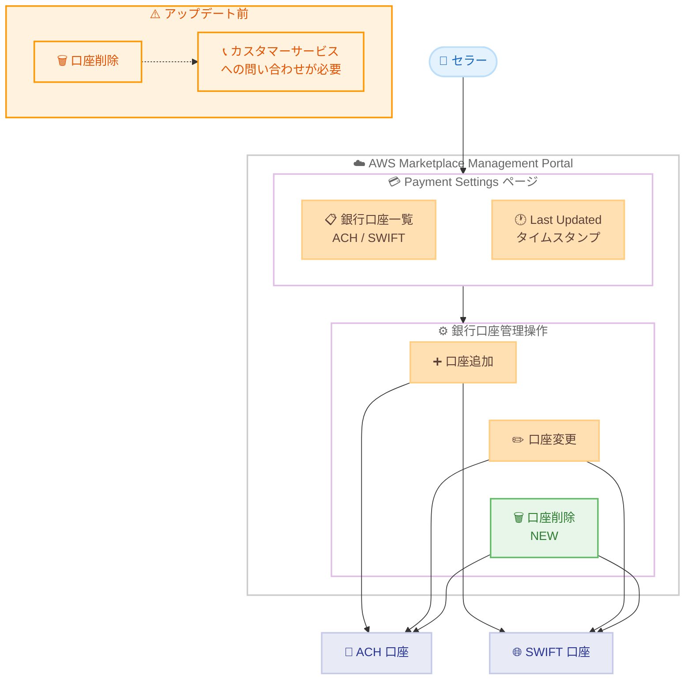

# AWS Marketplace Management Portal - 銀行口座削除機能

**リリース日**: 2026年4月24日
**サービス**: AWS Marketplace
**機能**: Bank Account Deletion in AWS Marketplace Management Portal

📊 [このアップデートのインフォグラフィックを見る](https://takech9203.github.io/aws-news-summary/20260424-aws-marketplace-management-portal.html)

## 概要

AWS Marketplace Management Portal (AMMP) の Payment Settings ページから、セラーが銀行口座を直接削除できるようになりました。これまで銀行口座の削除にはカスタマーサービスへの問い合わせが必要でしたが、今回のアップデートによりセルフサービスで完結できるようになります。

この機能強化は、複数通貨や複数の銀行取引関係を管理するグローバル企業や ISV (独立系ソフトウェアベンダー) にとって特に有益です。ACH タイプおよび SWIFT タイプの銀行口座の両方に対応しており、セラーは支払いアカウント管理を完全にコントロールできるようになりました。

**アップデート前の課題**

- 銀行口座の削除にはカスタマーサービスへの問い合わせが必須であり、対応完了まで時間がかかっていた
- 不要になった銀行口座や失敗した銀行取引関係をセルフサービスで整理する手段がなかった
- 複数通貨を管理するグローバル企業にとって、古い銀行口座が残存することで支払いルーティングのリスクが発生していた
- 銀行口座情報の変更履歴を確認する手段が限定的だった

**アップデート後の改善**

- Payment Settings ページから銀行口座を直接削除できるセルフサービス機能が追加された
- ACH タイプおよび SWIFT タイプの銀行口座の両方を削除可能になった
- カスタマーサービスへの問い合わせが不要になり、即座に銀行口座を整理できるようになった
- Last Updated タイムスタンプにより、変更された銀行口座を容易に識別できるようになった

## アーキテクチャ図

AWS Marketplace Management Portal における銀行口座管理のワークフローを示しています。今回のアップデートにより、口座削除がセルフサービスで完結するようになり、従来のカスタマーサービス経由のプロセスが不要になりました。

## サービスアップデートの詳細

### 主要機能

1. **銀行口座のセルフサービス削除**
   - Payment Settings ページから直接銀行口座を削除可能
   - ACH タイプの銀行口座に対応
   - SWIFT タイプの銀行口座に対応
   - カスタマーサービスへの問い合わせが不要

2. **Last Updated タイムスタンプ**
   - 銀行口座の最終更新日時が表示される
   - 変更された口座と未変更の口座を容易に識別可能
   - 複数の銀行口座を管理する際のトラッキングに有用

3. **支払いアカウントの完全管理**
   - 口座の追加・変更・削除の全操作をセルフサービスで実行可能
   - 支払いルーティングリスクの低減
   - 使用されていない口座や古い口座のクリーンアップが容易

## 技術仕様

### 対応する銀行口座タイプ

| 口座タイプ | 説明 | 削除対応 |
|------|------|------|
| ACH | 米国内の電子送金 (Automated Clearing House) | 対応 |
| SWIFT | 国際送金 (Society for Worldwide Interbank Financial Telecommunication) | 対応 |

### 操作可能な管理アクション

| アクション | アップデート前 | アップデート後 |
|------|------|------|
| 口座追加 | セルフサービス | セルフサービス |
| 口座変更 | セルフサービス | セルフサービス |
| 口座削除 | カスタマーサービスへの問い合わせが必要 | セルフサービス |
| 更新履歴確認 | 限定的 | Last Updated タイムスタンプで確認可能 |

## 設定方法

### 前提条件

1. AWS Marketplace セラーアカウントを保有していること
2. AWS Marketplace Management Portal (AMMP) へのアクセス権限があること
3. Payment Settings ページへのアクセス権限が付与されていること

### 手順

#### ステップ 1: AWS Marketplace Management Portal にアクセス

AWS マネジメントコンソールから AWS Marketplace Management Portal (https://aws.amazon.com/marketplace/management/) にアクセスします。

#### ステップ 2: Payment Settings ページに移動

AMMP のナビゲーションメニューから Payment Settings ページを開きます。登録されている銀行口座の一覧と Last Updated タイムスタンプが表示されます。

#### ステップ 3: 削除する銀行口座を選択

削除対象の銀行口座を特定します。Last Updated タイムスタンプを確認して、対象の口座が正しいことを確認してください。

#### ステップ 4: 銀行口座を削除

対象の銀行口座に対して削除操作を実行します。削除は即座に反映されます。

## メリット

### ビジネス面

- **運用効率の向上**: カスタマーサービスへの問い合わせが不要になり、銀行口座管理にかかる時間を大幅に短縮
- **支払いリスクの低減**: 不要な銀行口座を迅速に削除することで、誤った支払いルーティングのリスクを軽減
- **グローバル展開の支援**: 複数通貨・複数銀行を管理するグローバル企業が、銀行取引関係の変更に迅速に対応可能
- **コンプライアンス強化**: 古い銀行口座情報を適時に削除でき、財務情報の衛生管理が向上

### 技術面

- **セルフサービス完結**: 全ての銀行口座管理操作が AMMP 内で完結し、外部プロセスへの依存を排除
- **監査性の向上**: Last Updated タイムスタンプにより、口座情報の変更履歴を追跡可能
- **ACH / SWIFT 両対応**: 国内送金・国際送金の両方の口座タイプを統一的に管理

## デメリット・制約事項

### 制限事項

- アクティブな支払いルーティングに設定されている銀行口座を削除する場合、代替口座の設定が事前に必要となる可能性がある
- 削除操作は取り消しができないため、誤削除の場合は口座の再登録が必要
- AWS Marketplace Management Portal の UI からの操作に限定される

### 考慮すべき点

- 銀行口座を削除する前に、当該口座に紐づく未処理の支払いがないことを確認することを推奨
- 複数のセラープロファイルを管理している場合、各プロファイルの Payment Settings を個別に確認する必要がある
- 組織内の財務担当者やコンプライアンス担当者と連携し、削除対象の口座を事前に確認することを推奨

## ユースケース

### ユースケース 1: グローバル ISV の銀行口座整理

**シナリオ**: グローバル展開する ISV が、事業撤退した地域の SWIFT 銀行口座を整理する必要がある場合

**効果**: カスタマーサービスへの問い合わせなしに、Payment Settings ページから不要な SWIFT 口座を即座に削除可能。複数通貨の銀行口座管理が効率化され、支払いルーティングの誤配信リスクも低減される。

### ユースケース 2: 銀行取引先の変更対応

**シナリオ**: セラー企業が取引銀行を変更し、旧銀行の ACH 口座を削除して新しい銀行口座に切り替える場合

**効果**: 新しい ACH 口座を追加した後、旧口座をセルフサービスで即座に削除可能。銀行変更に伴う移行期間を最小化し、旧口座への誤送金リスクを排除できる。

### ユースケース 3: テスト口座のクリーンアップ

**シナリオ**: AWS Marketplace への出品準備段階で登録したテスト用銀行口座を、本番運用開始後に整理する場合

**効果**: 不要なテスト口座を Payment Settings ページから直接削除でき、本番環境の銀行口座管理をクリーンな状態に維持できる。Last Updated タイムスタンプにより、テスト段階で登録された口座を容易に特定可能。

## 料金

この機能は AWS Marketplace Management Portal の標準機能として提供されており、銀行口座の削除操作に追加料金は発生しません。AWS Marketplace のセラー向け手数料体系に変更はありません。

## 利用可能リージョン

AWS Marketplace Management Portal はグローバルサービスであり、本機能は全ての AWS Marketplace セラーが利用可能です。

## 関連サービス・機能

- **AWS Marketplace Management Portal**: セラー向けの管理ポータル。製品の出品、価格設定、支払い管理などを一元的に提供
- **AWS Marketplace Seller Reporting**: セラー向けの売上レポート・収益分析機能。銀行口座への支払い状況を確認可能
- **AWS Marketplace Discovery API**: 2026年4月にリリースされた新しい API。マーケットプレイスカタログへのプログラマティックアクセスを提供

## 参考リンク

- 📊 [インフォグラフィック](https://takech9203.github.io/aws-news-summary/20260424-aws-marketplace-management-portal.html)
- [公式発表 (What's New)](https://aws.amazon.com/about-aws/whats-new/2026/04/aws-marketplace-management-portal/)
- [AWS Marketplace Management Portal](https://aws.amazon.com/marketplace/management/)
- [AWS Marketplace セラーガイド](https://docs.aws.amazon.com/marketplace/latest/userguide/what-is-marketplace.html)

## まとめ

AWS Marketplace Management Portal に銀行口座のセルフサービス削除機能が追加されたことで、セラーは支払いアカウント管理を完全にコントロールできるようになりました。特にグローバル展開する企業や複数通貨を管理する ISV にとって、不要な銀行口座の迅速なクリーンアップと支払いルーティングリスクの低減が大きなメリットとなります。AWS Marketplace でセラーとして活動している場合は、Payment Settings ページを確認し、不要な銀行口座の整理を検討することを推奨します。
