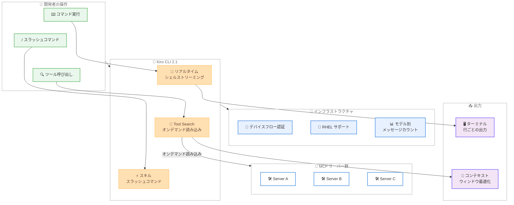

# Kiro CLI 2.1 - リアルタイムシェルストリーミング、Tool Search、スキルスラッシュコマンド

**リリース日**: 2026 年 4 月 24 日
**サービス**: Kiro
**機能**: Real-Time Shell Streaming、Tool Search、Skills as Slash Commands (v2.1.1 含む)

📊 [このアップデートのインフォグラフィックを見る](https://takech9203.github.io/aws-news-summary/20260424-kiro-changelog-2026-04-24.html)

## 概要

Kiro CLI 2.1 がリリースされ、開発者のフローを維持することに重点を置いた複数の重要な機能が追加されました。シェルコマンドの出力がリアルタイムで行ごとにストリーミングされるようになり、Tool Search により MCP ツールがオンデマンドで読み込まれてコンテキストウィンドウを節約し、スキルがスラッシュコマンドとして直接呼び出せるようになりました。

さらに、リモート環境向けのデバイスフロー認証、Red Hat Enterprise Linux (RHEL) サポート、エンタープライズ管理者向けのモデル別メッセージカウント機能が追加されました。パッチ v2.1.1 もあわせてリリースされ、レンダリングと安定性に関する修正が含まれています。

これらのアップデートにより、Kiro CLI はローカル開発からリモート環境、エンタープライズ管理まで幅広いシナリオでの利用体験が大幅に向上しました。

**アップデート前の課題**

- シェルコマンドの出力はプロセス完了まで全てバッファリングされ、ビルドやテストスイートなどの長時間実行コマンドの進捗をリアルタイムで確認できなかった
- MCP サーバーを多数設定している場合、全ツール定義が毎回のリクエストに含まれ、コンテキストウィンドウを圧迫していた
- スキルを利用するにはエージェントの切り替えやプロンプトへの手動コピーが必要だった
- SSH セッション、コンテナ、クラウドワークスペースからの認証にはポートフォワーディングが必要な場合があった
- RHEL 環境ではターミナル UI が完全にサポートされていなかった
- エンタープライズ管理者が AI モデル別の使用状況を把握する手段がなかった

**アップデート後の改善**

- シェル出力が行ごとにリアルタイムストリーミングされ、長時間実行コマンドの進捗を即座に確認可能に
- Tool Search により MCP ツールがオンデマンドで読み込まれ、コンテキストウィンドウの効率的な活用が可能に
- `.kiro/skills/` に定義されたスキルを `/skill-name` スラッシュコマンドとして直接呼び出し可能に
- デバイスフロー認証により、ポートフォワーディングなしでリモート環境から Google や GitHub でサインイン可能に
- RHEL 環境で完全なターミナル UI 体験を提供
- 日次ユーザーアクティビティレポートでモデル別メッセージカウントを確認可能に

## アーキテクチャ図



Kiro CLI 2.1 の主要機能フローを示しています。開発者の操作 (コマンド実行、スラッシュコマンド、ツール呼び出し) が Kiro CLI の 3 つの新機能 (リアルタイムシェルストリーミング、Tool Search、スキルスラッシュコマンド) を通じて処理され、MCP サーバーへのオンデマンド接続やリアルタイム出力を実現する構成を示しています。

## サービスアップデートの詳細

### 主要機能

1. **リアルタイムシェル出力ストリーミング**
   - シェルコマンドの出力がプロセス完了を待たずに、行ごとにリアルタイムでターミナルにストリーミングされるように改善
   - ビルド、テストスイート、デプロイメントなどの長時間実行コマンドの進捗を即座に確認可能
   - 問題の早期検出が可能になり、完了まで待つ必要がなくなった
   - 従来のバッファリング方式から大幅に開発体験が向上

2. **Tool Search -- MCP ツールのオンデマンド読み込み**
   - MCP ツールをリクエストごとに全定義を送信する代わりに、オンデマンドで読み込む仕組み
   - 多数の MCP サーバーを設定している場合でもコンテキストウィンドウを圧迫しない
   - `kiro-cli settings toolSearch.enabled true` で有効化
   - AI モデルが必要なツールを必要な時にだけ検索して利用するため、トークン効率が大幅に向上

3. **スキルスラッシュコマンド**
   - `.kiro/skills/` ディレクトリに定義されたスキルが `/skill-name` スラッシュコマンドとして利用可能に
   - `/` と入力してスキル名を指定するだけで直接呼び出し可能
   - エージェントの切り替えやプロンプトへの手動コピーが不要に
   - 再利用可能なエージェント指示への素早いアクセスを実現

4. **デバイスフロー認証**
   - SSH セッション、コンテナ、クラウドワークスペースからポートフォワーディングなしで認証可能
   - CLI が URL とワンタイムコードを表示し、任意のブラウザで入力するフロー
   - Google および GitHub アカウントでのサインインに対応
   - Builder ID および IAM Identity Center と同じ認証フローを採用

5. **Red Hat Enterprise Linux サポート**
   - Kiro CLI のターミナル UI が RHEL 上で完全に動作するように
   - エンタープライズ Linux 環境でも他の Linux ディストリビューション、macOS、Windows と同等のフル機能ターミナル UI を提供
   - 企業環境での Kiro CLI 導入の障壁を低減

6. **モデル別メッセージカウント (エンタープライズ機能)**
   - 日次ユーザーアクティビティレポートで AI モデル別のメッセージ数の内訳を表示
   - レポート期間中に使用された各モデルに独自のカラムが追加 (例: `Auto_messages`、`Claude_Opus_4.6_messages`)
   - エンタープライズ管理者がモデルの採用状況を追跡し、使用量がどのモデルに対応しているかを把握可能

7. **パッチ v2.1.1**
   - リリースと同日にパッチ v2.1.1 が適用
   - レンダリングおよび安定性に関する修正が含まれる

## 技術仕様

### 新機能一覧

| 機能 | 説明 | 有効化方法 |
|------|------|------|
| リアルタイムシェルストリーミング | コマンド出力を行ごとにストリーム | デフォルトで有効 |
| Tool Search | MCP ツールのオンデマンド読み込み | `kiro-cli settings toolSearch.enabled true` |
| スキルスラッシュコマンド | `.kiro/skills/` のスキルを `/` で呼び出し | `.kiro/skills/` にスキルを配置 |
| デバイスフロー認証 | リモート環境でのブラウザベース認証 | 自動検出 |
| RHEL サポート | RHEL でのターミナル UI | デフォルトで有効 |
| モデル別メッセージカウント | 管理レポートのモデル別内訳 | エンタープライズプランで自動 |

### 対応プラットフォーム

| プラットフォーム | ターミナル UI | 備考 |
|------|------|------|
| macOS | 対応 | 全機能利用可能 |
| Linux (一般) | 対応 | 全機能利用可能 |
| RHEL | 対応 (新規) | v2.1 で追加 |
| Windows 11 | 対応 | v2.0 で追加済み |

### Tool Search の仕組み

| 項目 | 従来の方式 | Tool Search 有効時 |
|------|------|------|
| ツール定義の送信 | 全ツール定義を毎回送信 | 必要なツールのみオンデマンド |
| コンテキストウィンドウへの影響 | MCP サーバー数に比例して増大 | 最小限に抑制 |
| トークン効率 | 低い (多数サーバー設定時) | 高い |
| レスポンス品質 | ツール定義でコンテキストが圧迫される可能性 | コンテキストに余裕が生まれる |

## 設定方法

### 前提条件

1. Kiro CLI がインストール済みであること (v2.0 以上)
2. macOS、Linux (RHEL 含む)、または Windows 11 環境
3. エンタープライズ機能を利用する場合は Enterprise プラン

### 手順

#### ステップ 1: Kiro CLI のアップデート

```bash
kiro-cli update
```

Kiro CLI を最新バージョン (v2.1.1) にアップデートします。自動アップデートが有効な場合は、バックグラウンドで自動的に更新されます。

#### ステップ 2: Tool Search の有効化

```bash
kiro-cli settings toolSearch.enabled true
```

Tool Search を有効にして、MCP ツールのオンデマンド読み込みを設定します。多数の MCP サーバーを利用している場合に特に効果的です。

#### ステップ 3: スキルの配置とスラッシュコマンドの利用

```bash
# スキルディレクトリの確認
ls .kiro/skills/

# Kiro CLI を起動してスラッシュコマンドを使用
kiro-cli
# プロンプトで /skill-name と入力して直接呼び出し
```

`.kiro/skills/` ディレクトリにスキルファイルを配置し、Kiro CLI 内で `/skill-name` と入力してスラッシュコマンドとして呼び出します。

#### ステップ 4: リモート環境でのデバイスフロー認証

```bash
# SSH セッションやコンテナ内から Kiro CLI を起動
kiro-cli

# 表示される URL とワンタイムコードをブラウザに入力
# Google または GitHub アカウントでサインイン
```

ポートフォワーディングが不要で、表示された URL を任意のブラウザで開いてワンタイムコードを入力するだけで認証が完了します。

## メリット

### ビジネス面

- **開発フローの中断を最小化**: リアルタイムストリーミングにより、ビルドやテストの進捗を待つ間も作業を継続でき、開発効率が向上
- **エンタープライズガバナンスの強化**: モデル別メッセージカウントにより、管理者が AI モデルの採用状況とコストを正確に把握可能
- **リモートワーク環境のサポート拡充**: デバイスフロー認証により、リモート開発環境からの安全なアクセスが容易に

### 技術面

- **コンテキストウィンドウの最適化**: Tool Search によりトークン使用量を削減し、AI モデルとのやり取りの品質を向上
- **ワークフローの効率化**: スキルスラッシュコマンドにより、再利用可能な指示を素早く呼び出し可能
- **プラットフォーム対応の拡大**: RHEL サポートにより、エンタープライズ Linux 環境での導入が可能に

## デメリット・制約事項

### 制限事項

- Tool Search はオプトイン機能であり、デフォルトでは無効。手動で有効化する必要がある
- スキルスラッシュコマンドは `.kiro/skills/` にスキルが事前に定義されている必要がある
- モデル別メッセージカウントはエンタープライズプランのみで利用可能

### 考慮すべき点

- Tool Search を有効にした場合、MCP ツールの初回呼び出し時にオンデマンド読み込みの遅延が発生する可能性がある
- リアルタイムストリーミングにより、ターミナルの出力量が増加するため、低帯域のリモート接続では考慮が必要
- RHEL サポートの対象バージョンの詳細については、公式ドキュメントを参照のこと

## ユースケース

### ユースケース 1: 長時間ビルドのリアルタイム監視

**シナリオ**: 大規模プロジェクトのビルドやテストスイートの実行に数分から数十分かかる場合、進捗をリアルタイムで確認しながら問題を早期に検出したい。

**実装例**:
```bash
# Kiro CLI 2.1 ではビルド出力がリアルタイムでストリーミング
kiro-cli
> このプロジェクトをビルドして、テストを実行してください

# 出力が行ごとにリアルタイム表示
# [1/10] Compiling module-a...
# [2/10] Compiling module-b...
# ...
# ERROR: module-c に型エラーが検出されました
# → 問題を即座に確認し、ビルド完了を待たずに修正を開始可能
```

**効果**: プロセス完了を待たずに問題箇所を即座に特定でき、デバッグのターンアラウンドタイムを短縮できる。

### ユースケース 2: 多数の MCP サーバーを利用するプロジェクト

**シナリオ**: データベース、API テスト、ドキュメント検索、コード分析など複数の MCP サーバーを設定しているプロジェクトで、コンテキストウィンドウの効率を改善したい。

**実装例**:
```bash
# Tool Search を有効化
kiro-cli settings toolSearch.enabled true

# 10 以上の MCP サーバーが設定されていても、
# 必要なツールだけがオンデマンドで読み込まれる
kiro-cli
> データベースのスキーマを確認して、API テストを実行してください

# Kiro が必要な MCP ツールのみを検索・読み込み
# コンテキストウィンドウに余裕が生まれ、レスポンス品質が向上
```

**効果**: コンテキストウィンドウの使用量を大幅に削減し、AI モデルのレスポンス品質と精度を向上させる。

### ユースケース 3: リモートコンテナ環境での開発

**シナリオ**: クラウドワークスペースや SSH セッション経由でコンテナ内の開発環境にアクセスし、ポートフォワーディングなしで Kiro CLI を認証して利用したい。

**実装例**:
```bash
# SSH 経由でリモート環境に接続
ssh developer@remote-workspace

# Kiro CLI を起動 (デバイスフロー認証が自動的に開始)
kiro-cli

# 表示された URL をローカルブラウザで開き、ワンタイムコードを入力
# → Please visit https://kiro.dev/auth/device
# → Enter code: ABCD-EFGH
# Google または GitHub アカウントで認証完了

# スキルをスラッシュコマンドで呼び出し
> /deploy-staging
```

**効果**: ポートフォワーディングの設定が不要になり、リモート環境でもシームレスに Kiro CLI の全機能を利用できる。

## 料金

Kiro は 3 つの料金プランを提供しています。

| プラン | 月額料金 | 主な特徴 |
|--------|----------|----------|
| Free | 無料 | 基本的な AI コーディング支援 |
| Pro | $19/月 | 高度な機能、より多くの AI インタラクション |
| Enterprise | 要問合せ | モデル別メッセージカウント、管理機能、SSO |

モデル別メッセージカウントなどのエンタープライズ管理機能は Enterprise プランで利用可能です。最新の料金情報については [Kiro Pricing ページ](https://kiro.dev/pricing/)を参照してください。

## 利用可能リージョン

グローバル -- Kiro はグローバルに利用可能なサービスです。macOS、Linux (RHEL 含む)、Windows 11 の全プラットフォームで同一の機能を提供します。

## 関連サービス・機能

- **Kiro IDE**: AWS が提供する AI 搭載の統合開発環境。Kiro CLI はそのコマンドライン版として、ターミナルから同等の AI 機能を利用可能
- **Kiro MCP Integration**: Model Context Protocol を通じて外部ツールやデータソースを接続する機能。Tool Search により効率的なツール管理が可能に
- **Kiro Skills**: `.kiro/skills/` に定義する再利用可能なエージェント指示。今回のアップデートでスラッシュコマンドとして呼び出し可能に
- **Kiro ヘッドレスモード**: CI/CD パイプラインでの非対話的な自動実行機能 (v2.0 で追加)
- **AWS IAM Identity Center**: エンタープライズ向けのシングルサインオン認証基盤。Kiro のデバイスフロー認証と連携

## 参考リンク

- 📊 [インフォグラフィック](https://takech9203.github.io/aws-news-summary/20260424-kiro-changelog-2026-04-24.html)
- [Kiro Changelog - CLI 2.1](https://kiro.dev/changelog/cli/2-1/)
- [Kiro Changelog](https://kiro.dev/changelog/)
- [Kiro CLI ドキュメント](https://kiro.dev/docs/cli/)
- [Kiro Pricing](https://kiro.dev/pricing/)

## まとめ

Kiro CLI 2.1 は、開発者のフローを維持するための 3 つの主要機能 (リアルタイムシェルストリーミング、Tool Search、スキルスラッシュコマンド) を中心に、リモート環境対応の強化とエンタープライズ管理機能の拡充を実現したリリースです。特に Tool Search による MCP ツールのオンデマンド読み込みは、コンテキストウィンドウの効率を大幅に改善する注目の機能です。Kiro CLI をご利用の方は v2.1.1 へのアップデートを推奨します。多数の MCP サーバーを利用している場合は `kiro-cli settings toolSearch.enabled true` で Tool Search を有効にし、コンテキストウィンドウの最適化を検討してください。
