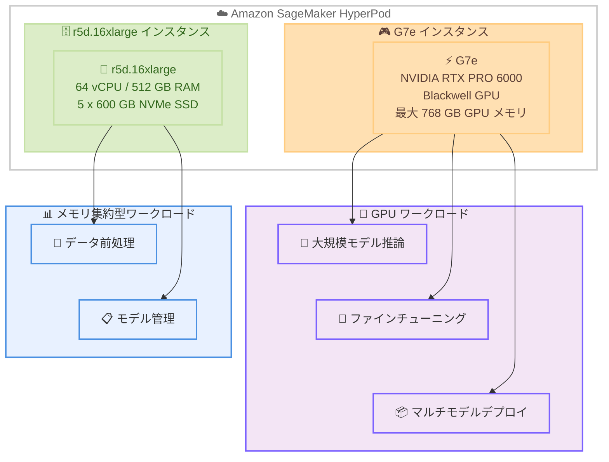

# Amazon SageMaker HyperPod - G7e および r5d.16xlarge インスタンスのサポート

**リリース日**: 2026 年 4 月 27 日
**サービス**: Amazon SageMaker HyperPod
**機能**: G7e および r5d.16xlarge インスタンスタイプのサポート

📊 [このアップデートのインフォグラフィックを見る](https://takech9203.github.io/aws-news-summary/20260427-amazon-sagemaker-hyperpod-g7e-r5d.html)

## 概要

Amazon SageMaker HyperPod が G7e インスタンスおよび r5d.16xlarge インスタンスをサポートしました。SageMaker HyperPod は、基盤モデルの開発、トレーニング、デプロイをスケーラブルに実行するための専用インフラストラクチャです。今回のアップデートにより、GPU ワークロードとメモリ集約型ワークロードの両方に対応する新しいインスタンスタイプが利用可能になりました。

G7e インスタンスは NVIDIA RTX PRO 6000 Blackwell Server Edition GPU を搭載しており、G6e インスタンスと比較して最大 2.3 倍の推論パフォーマンスを実現します。最大 768 GB の合計 GPU メモリを備えており、より大規模な言語モデルのデプロイや、単一エンドポイントでの複数モデルの同時実行が可能です。また、コスト効率の高いシングルノードでのファインチューニングやトレーニングにも適しています。

r5d.16xlarge インスタンスは 64 vCPU、512 GB のメモリ、および 5 x 600 GB の NVMe SSD インスタンスストレージを提供し、データの前処理やモデル管理などのメモリ集約型タスクに最適なインスタンスタイプです。

**アップデート前の課題**

- SageMaker HyperPod で最新世代の GPU インスタンスである G7e が利用できず、推論パフォーマンスに制約があった
- 大規模な言語モデルをデプロイする際に、GPU メモリの制約により単一エンドポイントでの実行が困難だった
- シングルノードでのファインチューニングにおいて、コスト効率の良い GPU 選択肢が限られていた
- メモリ集約型のデータ前処理やモデル管理タスクに適した NVMe SSD 搭載のインスタンスオプションが不足していた

**アップデート後の改善**

- G7e インスタンスの利用により、G6e 比で最大 2.3 倍の推論パフォーマンスが HyperPod 上で実現可能になった
- 最大 768 GB の GPU メモリにより、より大規模なモデルのデプロイや複数モデルの同時実行が可能になった
- コスト効率の高いシングルノードでのファインチューニングやトレーニングが実行可能になった
- r5d.16xlarge の 512 GB メモリと NVMe SSD ストレージにより、データ前処理やモデル管理タスクを効率的に実行できるようになった

## アーキテクチャ図



この図は、SageMaker HyperPod で新たにサポートされた 2 つのインスタンスタイプと、それぞれが対応するワークロードの関係を示しています。G7e インスタンスは GPU 集約型ワークロード、r5d.16xlarge インスタンスはメモリ集約型ワークロードに適しています。

## サービスアップデートの詳細

### 主要機能

1. **G7e インスタンスのサポート**
   - NVIDIA RTX PRO 6000 Blackwell Server Edition GPU を搭載
   - G6e インスタンスと比較して最大 2.3 倍の推論パフォーマンス向上
   - 最大 768 GB の合計 GPU メモリ (GPU あたり 96 GB x 最大 8 基)
   - シングルノードでのファインチューニングやトレーニングに対応

2. **r5d.16xlarge インスタンスのサポート**
   - 64 vCPU による高い並列処理能力
   - 512 GB のシステムメモリ
   - 5 x 600 GB NVMe SSD インスタンスストレージ (合計 3 TB)
   - データ前処理やモデル管理に最適

3. **大規模モデルのデプロイ効率化**
   - 768 GB の GPU メモリにより、大規模言語モデルを単一エンドポイントでデプロイ可能
   - 複数の小規模モデルを 1 つのエンドポイントで同時実行可能
   - コスト効率の高いシングルノードファインチューニング

## 技術仕様

### インスタンスタイプ比較

| 項目 | G7e | r5d.16xlarge |
|------|-----|--------------|
| 用途 | GPU 集約型ワークロード | メモリ集約型ワークロード |
| GPU | NVIDIA RTX PRO 6000 Blackwell (最大 8 基) | なし |
| GPU メモリ | 最大 768 GB (96 GB x 8) | N/A |
| vCPU | 最大 192 | 64 |
| システムメモリ | 最大 1536 GB | 512 GB |
| ストレージ | EBS のみ | 5 x 600 GB NVMe SSD |
| 主な用途 | 推論、ファインチューニング、トレーニング | データ前処理、モデル管理 |

### G7e パフォーマンス比較

| 項目 | G7e | G6e |
|------|-----|-----|
| GPU アーキテクチャ | NVIDIA Blackwell | 前世代 |
| 推論パフォーマンス | 基準 (最大 2.3 倍向上) | G7e の約 43% |
| GPU あたりメモリ | 96 GB | 前世代より少ない |
| 最大合計 GPU メモリ | 768 GB | 前世代より少ない |

### API 変更履歴

| 日付 | サービス | 変更内容 |
|------|----------|----------|
| 2026/04/21 | [Amazon SageMaker Service](https://awsapichanges.com/archive/changes/fd8b31-api.sagemaker.html) | 14 new 10 updated api methods - 生成 AI 推論レコメンデーション機能の追加 |

## 設定方法

### 前提条件

1. AWS アカウントが作成されている
2. SageMaker HyperPod クラスターが構成済みである
3. 適切な IAM 権限 (SageMaker HyperPod の管理権限) が付与されている
4. G7e インスタンスの利用にはサービスクォータの確認・引き上げが必要な場合がある

### 手順

#### ステップ 1: サービスクォータの確認

```bash
aws service-quotas get-service-quota \
  --service-code sagemaker \
  --quota-code <quota-code-for-g7e>
```

G7e インスタンスを使用する前に、対象リージョンでのサービスクォータが十分であることを確認します。必要に応じて Service Quotas コンソールからクォータの引き上げをリクエストしてください。

#### ステップ 2: HyperPod クラスターにインスタンスグループを追加

```bash
aws sagemaker create-cluster \
  --cluster-name my-hyperpod-cluster \
  --instance-groups '[
    {
      "InstanceGroupName": "gpu-group",
      "InstanceType": "ml.g7e.xlarge",
      "InstanceCount": 2,
      "LifeCycleConfig": {
        "SourceS3Uri": "s3://my-bucket/lifecycle-scripts/",
        "OnCreate": "on_create.sh"
      },
      "ExecutionRole": "arn:aws:iam::123456789012:role/SageMakerHyperPodRole"
    },
    {
      "InstanceGroupName": "memory-group",
      "InstanceType": "ml.r5d.16xlarge",
      "InstanceCount": 1,
      "LifeCycleConfig": {
        "SourceS3Uri": "s3://my-bucket/lifecycle-scripts/",
        "OnCreate": "on_create.sh"
      },
      "ExecutionRole": "arn:aws:iam::123456789012:role/SageMakerHyperPodRole"
    }
  ]'
```

このコマンドは、G7e インスタンスと r5d.16xlarge インスタンスを含む HyperPod クラスターを作成します。GPU ワークロード用のインスタンスグループとメモリ集約型ワークロード用のインスタンスグループを分けて構成しています。

#### ステップ 3: クラスターの状態を確認

```bash
aws sagemaker describe-cluster \
  --cluster-name my-hyperpod-cluster
```

クラスターのステータスが `InService` になるまで待機し、インスタンスグループが正常にプロビジョニングされたことを確認します。

## メリット

### ビジネス面

- **推論パフォーマンスの大幅な向上**: G7e インスタンスにより G6e 比で最大 2.3 倍の推論パフォーマンスが得られ、エンドユーザーへのレスポンス時間が短縮される
- **コスト効率の改善**: シングルノードでのファインチューニングが可能になり、マルチノード構成に比べて通信オーバーヘッドとコストを削減できる
- **大規模モデルのデプロイ簡素化**: 768 GB の GPU メモリにより、モデルの分割やマルチインスタンス構成の必要性が減少し、運用コストを削減できる

### 技術面

- **大規模言語モデルのサポート強化**: 最大 768 GB の GPU メモリにより、数百億パラメータ規模のモデルを単一エンドポイントでデプロイ可能
- **マルチモデルデプロイ**: 豊富な GPU メモリを活用して、複数のモデルを 1 つのエンドポイントで同時にホスティングできる
- **高速なローカルストレージ**: r5d.16xlarge の NVMe SSD により、データの読み書きが高速化され、前処理パイプラインのスループットが向上する
- **柔軟なクラスター構成**: GPU インスタンスとメモリ最適化インスタンスを組み合わせたヘテロジニアスクラスターを構築可能

## デメリット・制約事項

### 制限事項

- G7e インスタンスは US East (N. Virginia)、US East (Ohio)、Asia Pacific (Tokyo)、US West (Oregon) の 4 リージョンでのみ利用可能
- G7e インスタンスのサービスクォータがデフォルトでは低い可能性があり、事前に引き上げリクエストが必要な場合がある
- NVIDIA RTX PRO 6000 は、A100 や H100 などのデータセンター向け GPU とは異なるアーキテクチャであり、ワークロードによっては性能特性が異なる

### 考慮すべき点

- G7e インスタンスは高性能な分、オンデマンド料金が高額であるため、Savings Plans やスポットインスタンスの活用を検討すべき
- r5d.16xlarge は GPU を搭載していないため、GPU が必要なトレーニングや推論ワークロードには G7e インスタンスを使用する必要がある
- 既存の HyperPod クラスターに G7e インスタンスを追加する場合、ライフサイクルスクリプトの更新やドライバの互換性確認が必要

## ユースケース

### ユースケース 1: 大規模言語モデルの単一エンドポイント推論

**シナリオ**: 700 億パラメータ規模の LLM を HyperPod 上の G7e インスタンスにデプロイし、単一エンドポイントでリアルタイム推論を実行したい。

**実装例**:
```python
import torch
from transformers import AutoModelForCausalLM, AutoTokenizer

# G7e インスタンス上で大規模モデルをロード
model_name = "meta-llama/Llama-3-70B"
tokenizer = AutoTokenizer.from_pretrained(model_name)
model = AutoModelForCausalLM.from_pretrained(
    model_name,
    torch_dtype=torch.float16,
    device_map="auto"  # 複数 GPU に自動分散
)

# 推論の実行
inputs = tokenizer("AI の未来について", return_tensors="pt").to("cuda")
outputs = model.generate(**inputs, max_new_tokens=256)
print(tokenizer.decode(outputs[0], skip_special_tokens=True))
```

**効果**: 768 GB の GPU メモリにより、700 億パラメータ規模のモデルを単一インスタンスでロードでき、マルチノード推論のオーバーヘッドを排除して低レイテンシな推論を実現できる。

### ユースケース 2: コスト効率の高いシングルノードファインチューニング

**シナリオ**: 社内データを使用して基盤モデルのファインチューニングを行いたいが、マルチノードクラスターのコストを抑えたい。

**実装例**:
```python
from transformers import Trainer, TrainingArguments

training_args = TrainingArguments(
    output_dir="./results",
    per_device_train_batch_size=4,
    gradient_accumulation_steps=8,
    num_train_epochs=3,
    fp16=True,
    save_strategy="epoch",
)

trainer = Trainer(
    model=model,
    args=training_args,
    train_dataset=train_dataset,
    eval_dataset=eval_dataset,
)

trainer.train()
```

**効果**: G7e インスタンスの高い GPU メモリと演算性能により、マルチノード構成なしでファインチューニングを完了でき、ノード間通信コストの削減とインフラコストの最適化を実現できる。

### ユースケース 3: データ前処理パイプラインの高速化

**シナリオ**: トレーニングデータの前処理 (トークン化、データクリーニング、特徴量エンジニアリング) を大量のメモリと高速ストレージで効率的に実行したい。

**実装例**:
```python
import pandas as pd
from datasets import load_dataset

# r5d.16xlarge の大容量メモリを活用して
# 大規模データセットをメモリ上で処理
dataset = load_dataset("my-org/large-training-data", split="train")

# NVMe SSD にキャッシュしながら前処理を実行
processed = dataset.map(
    preprocess_function,
    batched=True,
    batch_size=10000,
    num_proc=32,  # 64 vCPU を活用した並列処理
    cache_file_name="/local/nvme/cache/processed_data"
)

# 前処理済みデータを S3 に保存
processed.save_to_disk("s3://my-bucket/processed-data/")
```

**効果**: r5d.16xlarge の 512 GB メモリと 3 TB の NVMe SSD ストレージにより、大規模データセットの前処理をメモリ内で高速に実行でき、トレーニングパイプライン全体のスループットを向上できる。

## 料金

SageMaker HyperPod の料金は、使用するインスタンスタイプとインスタンス数に基づいて課金されます。

### 料金例

| インスタンスタイプ | 用途 | 課金単位 |
|------------------|------|---------|
| ml.g7e.xlarge | GPU 推論・トレーニング | 時間単位 |
| ml.g7e.2xlarge | GPU 推論・トレーニング | 時間単位 |
| ml.g7e.4xlarge | GPU 推論・トレーニング | 時間単位 |
| ml.g7e.8xlarge | GPU 推論・トレーニング | 時間単位 |
| ml.g7e.16xlarge | GPU 推論・トレーニング | 時間単位 |
| ml.g7e.48xlarge | GPU 推論・トレーニング | 時間単位 |
| ml.r5d.16xlarge | メモリ集約型ワークロード | 時間単位 |

料金の詳細は [Amazon SageMaker 料金ページ](https://aws.amazon.com/sagemaker/pricing/) を参照してください。

## 利用可能リージョン

**G7e インスタンス** は以下のリージョンで利用可能です。

- **US East (N. Virginia)**: us-east-1
- **US East (Ohio)**: us-east-2
- **Asia Pacific (Tokyo)**: ap-northeast-1
- **US West (Oregon)**: us-west-2

**r5d.16xlarge インスタンス** は、Amazon SageMaker HyperPod が利用可能なすべてのリージョンで利用可能です。

## 関連サービス・機能

- **Amazon EC2 G7e インスタンス**: HyperPod で使用される G7e の基盤となる EC2 インスタンスタイプ。NVIDIA RTX PRO 6000 Blackwell Server Edition GPU を搭載
- **Amazon SageMaker AI**: モデルのトレーニング、チューニング、デプロイを統合的に管理するプラットフォーム。HyperPod はそのインフラストラクチャレイヤーとして機能
- **Amazon SageMaker HyperPod Flexible Instance Groups**: 単一のインスタンスグループ内で複数のインスタンスタイプを優先順位付きで構成する機能。G7e と r5d を組み合わせた柔軟なクラスター構成に活用可能
- **Amazon SageMaker HyperPod Gang Scheduling**: 分散トレーニングジョブのスケジューリング機能。G7e インスタンスを使用したマルチノードトレーニングの効率化に活用

## 参考リンク

- 📊 [インフォグラフィック](https://takech9203.github.io/aws-news-summary/20260427-amazon-sagemaker-hyperpod-g7e-r5d.html)
- [公式発表 (What's New)](https://aws.amazon.com/about-aws/whats-new/2026/04/amazon-sagemaker-hyperpod-g7e-r5d/)
- [Amazon SageMaker HyperPod ドキュメント](https://docs.aws.amazon.com/sagemaker/latest/dg/sagemaker-hyperpod.html)
- [Amazon EC2 G7e インスタンス](https://aws.amazon.com/ec2/instance-types/g7e/)
- [Amazon SageMaker 料金ページ](https://aws.amazon.com/sagemaker/pricing/)

## まとめ

Amazon SageMaker HyperPod が G7e インスタンスと r5d.16xlarge インスタンスをサポートしたことで、基盤モデルの開発・トレーニング・デプロイにおけるインスタンス選択の幅が広がりました。G7e インスタンスは G6e 比で最大 2.3 倍の推論パフォーマンスと最大 768 GB の GPU メモリを提供し、大規模モデルの推論やコスト効率の高いファインチューニングに最適です。特に東京リージョン (ap-northeast-1) でも G7e が利用可能である点は、日本のお客様にとって重要なアップデートです。大規模な基盤モデルのワークロードを実行しているお客様は、G7e インスタンスへの移行を検討することを推奨します。
