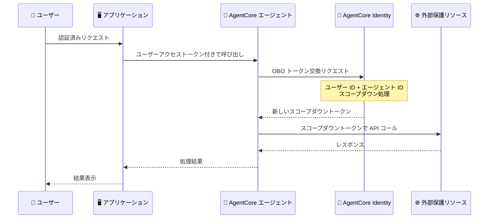

# Amazon Bedrock AgentCore Identity - On-Behalf-Of (OBO) トークン交換サポート

**リリース日**: 2026年4月30日
**サービス**: Amazon Bedrock AgentCore
**機能**: On-Behalf-Of (OBO) トークン交換

📊 [このアップデートのインフォグラフィックを見る](https://takech9203.github.io/aws-news-summary/20260430-amazon-bedrock-agentcore.html)

## 概要

Amazon Bedrock AgentCore Identity が On-Behalf-Of (OBO) トークン交換をサポートしました。この機能により、開発者は認証済みユーザーに代わって保護されたリソースにセキュアにアクセスする AI エージェントを構築できるようになります。ユーザーが複数の同意フローを完了する必要がなくなり、シームレスなエージェント体験を提供できます。

OBO トークン交換では、既存のアクセストークンを新しいスコープダウンされたアクセストークンに交換します。この新しいトークンには元のユーザー ID とエージェント ID の両方が含まれ、アウトバウンドの保護リソースに対してジャストインタイムかつ最小権限のアクセスを付与します。OAuth 2.0 Token Exchange (RFC 8693) に基づいた標準的なアプローチにより、エンタープライズセキュリティ要件を満たしながら、エージェントが外部 API やサービスに安全にアクセスできます。

この機能は、外部 SaaS サービスとの統合を行う AI エージェントを構築する開発者、エンタープライズアプリケーション開発者、およびセキュリティコンプライアンスが重要な組織に向けたものです。

**アップデート前の課題**

- エージェントがユーザーに代わって外部リソースにアクセスする際、各リソースごとに個別の同意フローが必要だった
- ユーザーの ID とエージェントの ID を同時に含むトークンを生成する標準的な方法がなかった
- エージェントに付与する権限の範囲を適切に制限することが困難で、過剰な権限を持つトークンが発行されるリスクがあった

**アップデート後の改善**

- ユーザーのアクセストークンを、特定のリソースを対象としたスコープダウンされたトークンに交換できるようになった
- 複数の同意フローが不要になり、ユーザー体験が大幅に向上した
- ジャストインタイムかつ最小権限のアクセス制御により、セキュリティポスチャが強化された

## アーキテクチャ図



ユーザーの認証トークンが AgentCore Identity を介して OBO トークン交換され、エージェントが最小権限で外部リソースにアクセスするフローを示しています。

## サービスアップデートの詳細

### 主要機能

1. **OBO トークン交換**
   - OAuth 2.0 Token Exchange (RFC 8693) に基づくトークン交換メカニズム
   - 既存のアクセストークンを新しいスコープダウンされたアクセストークンに変換
   - 元のユーザー ID とエージェント ID の両方を新しいトークンに含める
   - 対象の保護リソースに特化したトークンを生成

2. **最小権限アクセス制御**
   - ジャストインタイムでのトークン発行
   - アウトバウンドリソースごとにスコープを限定
   - エージェントが必要以上の権限を持たないよう制御
   - セキュリティポリシーに準拠した委任アクセス

3. **シームレスなユーザー体験**
   - ユーザーが複数の同意フローを完了する必要がない
   - 初回認証のみでエージェントが複数のリソースにアクセス可能
   - エージェントの透過的な認証処理

## 技術仕様

### OAuth 2.0 トークン交換設定

| 項目 | 詳細 |
|------|------|
| プロトコル | OAuth 2.0 Token Exchange (RFC 8693) |
| グラントタイプ | `TOKEN_EXCHANGE` |
| トークン属性 | ユーザー ID + エージェント ID |
| スコープ制御 | リソースごとにスコープダウン |
| 対応する認証プロバイダータイプ | OAUTH |

### API 変更履歴

| 日付 | サービス | 変更内容 |
|------|----------|----------|
| 2026/04/30 | [Amazon Bedrock AgentCore Control](https://awsapichanges.com/archive/changes/7084f0-bedrock-agentcore-control.html) | 14 updated api methods - OBO トークン交換 OAuth2 サポート追加 |

### 認証プロバイダー設定

```json
{
  "credentialProviderConfigurations": [
    {
      "credentialProviderType": "OAUTH",
      "credentialProvider": {
        "oauthCredentialProvider": {
          "providerArn": "arn:aws:bedrock-agentcore:<region>:<account>:oauth-provider/<name>",
          "scopes": ["api.read", "api.write"],
          "grantType": "TOKEN_EXCHANGE",
          "defaultReturnUrl": "https://your-app.example.com/callback"
        }
      }
    }
  ]
}
```

## 設定方法

### 前提条件

1. Amazon Bedrock AgentCore が利用可能なリージョンの AWS アカウント
2. AgentCore Gateway が設定済みであること
3. OAuth 2.0 プロバイダーが AgentCore Identity に登録済みであること
4. 外部リソースが OAuth 2.0 Token Exchange をサポートしていること

### 手順

#### ステップ 1: OAuth プロバイダーの設定

```bash
aws bedrock-agentcore-control create-oauth-provider \
  --name "my-oauth-provider" \
  --token-endpoint "https://idp.example.com/oauth2/token" \
  --client-id "your-client-id" \
  --client-secret-arn "arn:aws:secretsmanager:<region>:<account>:secret:oauth-secret"
```

AgentCore Identity に外部 OAuth プロバイダーを登録します。トークンエンドポイントには、Token Exchange をサポートする IdP のエンドポイントを指定します。

#### ステップ 2: Gateway Target に OBO 認証を設定

```bash
aws bedrock-agentcore-control create-gateway-target \
  --gateway-identifier "my-gateway" \
  --name "my-target" \
  --target-configuration '{"mcp": {"mcpServer": {"endpoint": "https://api.example.com"}}}' \
  --credential-provider-configurations '[{
    "credentialProviderType": "OAUTH",
    "credentialProvider": {
      "oauthCredentialProvider": {
        "providerArn": "arn:aws:bedrock-agentcore:<region>:<account>:oauth-provider/my-oauth-provider",
        "scopes": ["api.read"],
        "grantType": "TOKEN_EXCHANGE"
      }
    }
  }]'
```

Gateway Target の認証設定で `grantType` に `TOKEN_EXCHANGE` を指定することで、OBO トークン交換が有効になります。

#### ステップ 3: エージェント Harness での利用

```bash
aws bedrock-agentcore-control create-harness \
  --harness-name "my-agent" \
  --execution-role-arn "arn:aws:iam::<account>:role/AgentRole" \
  --tools '[{
    "type": "agentcore_gateway",
    "name": "external-api",
    "config": {
      "agentCoreGateway": {
        "gatewayArn": "arn:aws:bedrock-agentcore:<region>:<account>:gateway/my-gateway",
        "outboundAuth": {
          "oauth": {
            "providerArn": "arn:aws:bedrock-agentcore:<region>:<account>:oauth-provider/my-oauth-provider",
            "scopes": ["api.read"],
            "grantType": "TOKEN_EXCHANGE"
          }
        }
      }
    }
  }]'
```

Harness 作成時にツール設定で OBO 認証を指定することで、エージェントがユーザーに代わってリソースにアクセスできるようになります。

## メリット

### ビジネス面

- **ユーザー体験の向上**: 複数の同意フローが不要になり、エージェントとの対話がシームレスになる
- **コンプライアンス対応**: 最小権限の原則に準拠し、監査可能なアクセス制御を実現
- **開発生産性の向上**: 委任認証の複雑な実装を AgentCore に委譲できるため、開発者はビジネスロジックに集中できる

### 技術面

- **セキュリティ強化**: スコープダウンされたトークンにより、トークン漏洩時のリスクを最小化
- **標準プロトコル準拠**: RFC 8693 に基づく実装により、既存の IdP インフラとの互換性を確保
- **きめ細かいアクセス制御**: リソースごとに異なるスコープを指定可能で、ゼロトラストアーキテクチャを実現

## デメリット・制約事項

### 制限事項

- 外部リソース側が OAuth 2.0 Token Exchange をサポートしている必要がある
- OBO トークンの有効期限は元のトークンの有効期限を超えることはできない
- 対応している OAuth プロバイダーの設定が事前に必要

### 考慮すべき点

- トークン交換の追加ステップによるレイテンシーの増加を考慮する必要がある
- 既存の CLIENT_CREDENTIALS や AUTHORIZATION_CODE グラントタイプからの移行計画が必要
- IdP 側での Token Exchange エンドポイントの設定とテストが必要

## ユースケース

### ユースケース 1: エンタープライズ SaaS 統合エージェント

**シナリオ**: 社員がチャットで AI エージェントに「今月の売上レポートを Salesforce から取得して」と依頼する。エージェントはユーザーの権限範囲内で Salesforce API にアクセスする必要がある。

**実装例**:
```json
{
  "tools": [{
    "type": "agentcore_gateway",
    "name": "salesforce-api",
    "config": {
      "agentCoreGateway": {
        "gatewayArn": "arn:aws:bedrock-agentcore:us-east-1:123456789012:gateway/salesforce-gw",
        "outboundAuth": {
          "oauth": {
            "providerArn": "arn:aws:bedrock-agentcore:us-east-1:123456789012:oauth-provider/salesforce",
            "scopes": ["api.read", "reports.read"],
            "grantType": "TOKEN_EXCHANGE"
          }
        }
      }
    }
  }]
}
```

**効果**: ユーザーは追加の認証なしに、自身の権限範囲内で Salesforce データにアクセスするエージェントを利用できる。

### ユースケース 2: マルチサービスオーケストレーション

**シナリオ**: 開発者が AI エージェントに「GitHub の PR をレビューし、Jira チケットを更新して、Slack で通知して」と依頼する。エージェントは 3 つの異なるサービスにユーザーの権限でアクセスする。

**実装例**:
```json
{
  "tools": [
    {
      "type": "agentcore_gateway",
      "name": "github-api",
      "config": {
        "agentCoreGateway": {
          "gatewayArn": "arn:aws:bedrock-agentcore:us-east-1:123456789012:gateway/dev-tools",
          "outboundAuth": {
            "oauth": {
              "providerArn": "arn:aws:bedrock-agentcore:us-east-1:123456789012:oauth-provider/github",
              "scopes": ["repo:read", "pull_request:write"],
              "grantType": "TOKEN_EXCHANGE"
            }
          }
        }
      }
    }
  ]
}
```

**効果**: 1 回の認証でエージェントが複数のサービスにまたがるワークフローを実行でき、各サービスへのアクセスは最小権限に制限される。

### ユースケース 3: カスタマーサポートエージェント

**シナリオ**: カスタマーサポート担当者が AI エージェントを使用して顧客の注文情報を確認し、返品処理を実行する。エージェントは担当者の権限レベルに応じたアクセスのみ許可される。

**実装例**:
```json
{
  "credentialProviderConfigurations": [{
    "credentialProviderType": "OAUTH",
    "credentialProvider": {
      "oauthCredentialProvider": {
        "providerArn": "arn:aws:bedrock-agentcore:us-east-1:123456789012:oauth-provider/order-system",
        "scopes": ["orders.read", "returns.process"],
        "grantType": "TOKEN_EXCHANGE"
      }
    }
  }]
}
```

**効果**: サポート担当者の権限レベルがそのままエージェントに引き継がれ、不正な操作を防止しながら効率的なサポートを提供できる。

## 料金

AgentCore Identity の OBO トークン交換機能の料金は、Amazon Bedrock AgentCore の利用料金に含まれます。追加のトークン交換リクエストに対する個別課金の詳細については、Amazon Bedrock AgentCore の料金ページを参照してください。

## 利用可能リージョン

14 の AWS リージョンで GA として利用可能です。

| リージョン | コード |
|-----------|--------|
| US East (N. Virginia) | us-east-1 |
| US East (Ohio) | us-east-2 |
| US West (Oregon) | us-west-2 |
| Canada (Central) | ca-central-1 |
| Asia Pacific (Mumbai) | ap-south-1 |
| Asia Pacific (Seoul) | ap-northeast-2 |
| Asia Pacific (Singapore) | ap-southeast-1 |
| Asia Pacific (Sydney) | ap-southeast-2 |
| Asia Pacific (Tokyo) | ap-northeast-1 |
| Europe (Frankfurt) | eu-central-1 |
| Europe (Ireland) | eu-west-1 |
| Europe (London) | eu-west-2 |
| Europe (Paris) | eu-west-3 |
| Europe (Stockholm) | eu-north-1 |

## 関連サービス・機能

- **Amazon Bedrock AgentCore Gateway**: エージェントが外部リソースにアクセスするためのゲートウェイ。OBO トークン交換の設定先となる
- **Amazon Bedrock AgentCore Runtime**: エージェントの実行環境。Harness を通じて OBO 認証設定を利用
- **Amazon Cognito**: ユーザー認証の初期トークン発行に使用可能な ID プロバイダー
- **AWS Secrets Manager**: OAuth クライアントシークレットの安全な保管に使用

## 参考リンク

- 📊 [インフォグラフィック](https://takech9203.github.io/aws-news-summary/20260430-amazon-bedrock-agentcore.html)
- [公式発表 (What's New)](https://aws.amazon.com/about-aws/whats-new/2026/04/amazon-bedrock-agentcore/)
- [Amazon Bedrock AgentCore ドキュメント](https://docs.aws.amazon.com/bedrock/latest/userguide/agentcore.html)
- [Amazon Bedrock AgentCore 料金](https://aws.amazon.com/bedrock/agentcore/pricing/)

## まとめ

Amazon Bedrock AgentCore Identity の OBO トークン交換サポートは、エンタープライズ環境での AI エージェント開発における認証・認可の課題を解決する重要なアップデートです。RFC 8693 準拠の標準的なアプローチにより、既存の ID インフラと統合しながら最小権限の原則を維持できます。外部 SaaS サービスと連携する AI エージェントを構築する開発者は、この機能を活用してセキュアかつシームレスなユーザー体験を実現することを推奨します。
