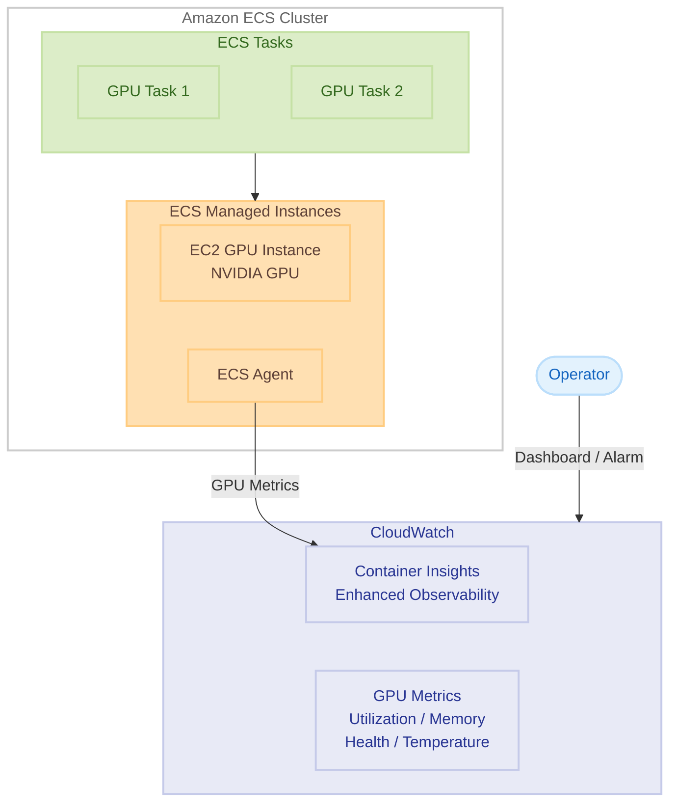

# Amazon ECS Managed Instances - NVIDIA GPU メトリクスサポート

**リリース日**: 2026年4月30日
**サービス**: Amazon Elastic Container Service (Amazon ECS)
**機能**: NVIDIA GPU メトリクス (Container Insights with enhanced observability)

[このアップデートのインフォグラフィックを見る](https://takech9203.github.io/aws-news-summary/20260430-amazon-ecs-mi-gpu-metrics.html)

## 概要

Amazon ECS Managed Instances で NVIDIA GPU メトリクスが利用可能になった。Amazon CloudWatch Container Insights (enhanced observability) を通じて、GPU の健全性とパフォーマンスに関する詳細なメトリクスを取得できるようになり、GPU アクセラレーテッドワークロードのトラブルシューティングと最適化が容易になる。

このアップデートにより、GPU のキャパシティ、使用率、メモリ、ハードウェアヘルス、温度状態を CloudWatch で直接モニタリングできる。GPU デバイスレベルでの粒度の高い可視性を提供し、AI/ML トレーニングや推論などの GPU 集約型ワークロードの安定運用を支援する。

**アップデート前の課題**

- ECS Managed Instances 上の GPU ワークロードについて、GPU 固有のメトリクスを CloudWatch で直接取得する手段がなかった
- GPU の使用率やメモリ消費量を把握するために、カスタムメトリクスの実装やサードパーティツールの導入が必要だった
- GPU のハードウェア障害や温度異常を事前に検知することが困難で、ワークロードへの影響が発生してから初めて問題に気付くケースがあった

**アップデート後の改善**

- Container Insights with enhanced observability を有効にするだけで、GPU メトリクスが自動的に収集・可視化される
- GPU デバイスレベルの粒度でキャパシティ、使用率、メモリ、ヘルス、温度を CloudWatch で確認可能になった
- GPU リソースの適正化 (right-sizing)、パフォーマンス問題のトラブルシューティング、障害の予兆検知がネイティブに実現可能になった

## アーキテクチャ図



ECS Managed Instances 上の GPU インスタンスから ECS Agent がメトリクスを収集し、CloudWatch Container Insights に送信する構成を示す。

## サービスアップデートの詳細

### 主要機能

1. **GPU キャパシティメトリクス**
   - クラスター内の GPU リソースの割り当て状況を把握
   - 利用可能な GPU デバイス数とタスクに割り当て済みのデバイス数を監視
   - キャパシティプランニングとスケーリング判断の根拠として活用

2. **GPU 使用率・メモリメトリクス**
   - GPU コアの使用率をリアルタイムで監視
   - GPU メモリ (VRAM) の使用量と空き容量を追跡
   - ワークロードに対する GPU リソースの過不足を判断

3. **ハードウェアヘルス・温度メトリクス**
   - GPU デバイスのハードウェア健全性をモニタリング
   - 温度状態 (thermal conditions) の監視でオーバーヒートを予防
   - 障害の予兆を検知し、ワークロードへの影響を未然に防止

4. **GPU デバイスレベルの粒度**
   - 個々の GPU デバイス単位でメトリクスを取得可能
   - マルチ GPU インスタンスにおける特定デバイスの問題を特定
   - デバイスごとのパフォーマンス差異を分析

## 技術仕様

### 取得可能な GPU メトリクスカテゴリ

| カテゴリ | 説明 | 用途 |
|------|------|------|
| GPU Capacity | GPU デバイスの割り当て状況 | キャパシティプランニング |
| GPU Utilization | GPU コアの使用率 | パフォーマンス最適化 |
| GPU Memory | VRAM の使用量/空き容量 | メモリ不足の検知 |
| Hardware Health | GPU デバイスの健全性 | 障害予兆検知 |
| Thermal Conditions | GPU 温度状態 | オーバーヒート防止 |

### 前提条件

| 項目 | 要件 |
|------|------|
| コンピューティング | ECS Managed Instances (GPU 対応 EC2 インスタンス) |
| Container Insights | Enhanced observability が有効 |
| GPU | NVIDIA GPU 搭載インスタンスタイプ (P4, P5, G5, G6 など) |
| キャパシティプロバイダー | ECS Managed Instances capacity provider |

## 設定方法

### 前提条件

1. Amazon ECS クラスターが作成済みであること
2. GPU 対応の EC2 インスタンスタイプが利用可能であること
3. 適切な IAM 権限が設定されていること

### 手順

#### ステップ 1: Container Insights with enhanced observability の有効化

```bash
aws ecs update-cluster-settings \
  --cluster my-gpu-cluster \
  --settings name=containerInsights,value=enhanced
```

ECS クラスターで Container Insights の enhanced observability を有効にする。これにより、標準メトリクスに加えて GPU メトリクスの収集が開始される。

#### ステップ 2: ECS Managed Instances capacity provider で GPU インスタンスを起動

```bash
aws ecs create-capacity-provider \
  --name my-gpu-capacity-provider \
  --auto-scaling-group-provider "autoScalingGroupArn=arn:aws:autoscaling:us-east-1:123456789012:autoScalingGroup:xxx:autoScalingGroupName/my-gpu-asg,managedScaling={status=ENABLED,targetCapacity=100},managedTerminationProtection=ENABLED"
```

GPU 対応の EC2 インスタンスを含む Auto Scaling グループを ECS Managed Instances capacity provider として登録する。

#### ステップ 3: GPU メトリクスの確認

```bash
aws cloudwatch list-metrics \
  --namespace "ECS/ContainerInsights" \
  --dimensions Name=ClusterName,Value=my-gpu-cluster
```

CloudWatch で GPU メトリクスが収集されていることを確認する。Container Insights ダッシュボードからも視覚的に確認可能。

## メリット

### ビジネス面

- **コスト最適化**: GPU 使用率の可視化により、過剰プロビジョニングを回避し GPU インスタンスのコストを最適化できる
- **可用性向上**: ハードウェアヘルスと温度の監視により、障害発生前に対処することでワークロードのダウンタイムを削減できる
- **運用効率化**: CloudWatch の統合ダッシュボードで GPU ワークロード全体を一元管理でき、運用チームの負担を軽減できる

### 技術面

- **ネイティブ統合**: 追加のエージェントやサードパーティツール不要で GPU メトリクスを取得できる
- **粒度の高い可視性**: GPU デバイスレベルのメトリクスにより、特定のデバイスの問題を迅速に特定できる
- **既存の監視体制との統合**: CloudWatch アラーム、ダッシュボード、SNS 通知などの既存の監視インフラと統合可能

## デメリット・制約事項

### 制限事項

- ECS Managed Instances でのみ利用可能 (Fargate や自己管理 EC2 インスタンスは対象外)
- NVIDIA GPU のみサポート (AMD GPU や他のアクセラレーターは非対象)
- Container Insights with enhanced observability の有効化が必須

### 考慮すべき点

- Container Insights の enhanced observability には追加の CloudWatch 料金が発生する
- GPU メトリクスの収集頻度や保持期間は CloudWatch の標準設定に依存する

## ユースケース

### ユースケース 1: AI/ML トレーニングワークロードの最適化

**シナリオ**: 大規模言語モデルのファインチューニングをマルチ GPU インスタンスで実行しており、GPU リソースが効率的に使用されているか確認したい。

**実装例**:
```bash
# GPU 使用率が 80% を下回った場合のアラーム設定
aws cloudwatch put-metric-alarm \
  --alarm-name "GPU-Underutilization" \
  --namespace "ECS/ContainerInsights" \
  --metric-name "GpuUtilization" \
  --dimensions Name=ClusterName,Value=ml-training-cluster \
  --statistic Average \
  --period 300 \
  --threshold 80 \
  --comparison-operator LessThanThreshold \
  --evaluation-periods 3 \
  --alarm-actions arn:aws:sns:us-east-1:123456789012:gpu-alerts
```

**効果**: GPU 使用率の低いタスクを特定し、バッチサイズの調整やインスタンスタイプのダウンサイズによりコストを削減できる。

### ユースケース 2: 推論サービスの温度監視と予防保全

**シナリオ**: リアルタイム推論サービスを GPU インスタンスで運用しており、温度上昇によるスロットリングを未然に防ぎたい。

**実装例**:
```bash
# GPU 温度が閾値を超えた場合のアラーム設定
aws cloudwatch put-metric-alarm \
  --alarm-name "GPU-Temperature-High" \
  --namespace "ECS/ContainerInsights" \
  --metric-name "GpuTemperature" \
  --dimensions Name=ClusterName,Value=inference-cluster \
  --statistic Maximum \
  --period 60 \
  --threshold 85 \
  --comparison-operator GreaterThanThreshold \
  --evaluation-periods 2 \
  --alarm-actions arn:aws:sns:us-east-1:123456789012:gpu-thermal-alerts
```

**効果**: 温度上昇を早期に検知し、ワークロードの再配置やインスタンスの冷却対応を行うことで、スロットリングやハードウェア障害を防止できる。

### ユースケース 3: GPU メモリ不足の検知とキャパシティプランニング

**シナリオ**: 複数の推論モデルを同一 GPU インスタンス上で実行しており、GPU メモリ (VRAM) の枯渇を事前に検知したい。

**実装例**:
```bash
# GPU メモリ使用率が 90% を超えた場合のアラーム設定
aws cloudwatch put-metric-alarm \
  --alarm-name "GPU-Memory-High" \
  --namespace "ECS/ContainerInsights" \
  --metric-name "GpuMemoryUtilization" \
  --dimensions Name=ClusterName,Value=inference-cluster \
  --statistic Maximum \
  --period 60 \
  --threshold 90 \
  --comparison-operator GreaterThanThreshold \
  --evaluation-periods 2 \
  --alarm-actions arn:aws:sns:us-east-1:123456789012:gpu-memory-alerts
```

**効果**: メモリ不足による OOM エラーを未然に防ぎ、必要に応じてより大きな GPU メモリを持つインスタンスタイプへのスケールアップを計画できる。

## 料金

GPU メトリクス自体に追加料金は発生しないが、Container Insights with enhanced observability の利用に CloudWatch の料金が適用される。

### 料金例

| 項目 | 料金 |
|------|------|
| Container Insights (enhanced observability) | CloudWatch メトリクス、ログ、トレースの標準料金に準拠 |
| カスタムメトリクス | $0.30/メトリクス/月 (最初の 10,000 メトリクスまで) |
| CloudWatch アラーム | $0.10/アラーム/月 (Standard Resolution) |

詳細は [Amazon CloudWatch 料金ページ](https://aws.amazon.com/cloudwatch/pricing/)を参照。

## 利用可能リージョン

すべての商用 AWS リージョンで利用可能。

## 関連サービス・機能

- **Amazon CloudWatch Container Insights**: ECS、EKS、Kubernetes のコンテナワークロード向け監視・トラブルシューティングサービス
- **Amazon ECS Managed Instances**: ECS がインフラストラクチャの管理を自動化する EC2 ベースのキャパシティプロバイダー
- **Amazon EC2 GPU インスタンス**: P4d, P5, G5, G6 などの NVIDIA GPU 搭載インスタンスファミリー

## 参考リンク

- [インフォグラフィック](https://takech9203.github.io/aws-news-summary/20260430-amazon-ecs-mi-gpu-metrics.html)
- [公式発表 (What's New)](https://aws.amazon.com/about-aws/whats-new/2026/04/amazon-ecs-mi-gpu-metrics/)
- [Amazon ECS Container Insights with enhanced observability ドキュメント](https://docs.aws.amazon.com/AmazonECS/latest/developerguide/cloudwatch-container-insights.html)
- [Amazon CloudWatch 料金](https://aws.amazon.com/cloudwatch/pricing/)

## まとめ

Amazon ECS Managed Instances での NVIDIA GPU メトリクスサポートにより、GPU アクセラレーテッドワークロードの運用可視性が大幅に向上する。Container Insights with enhanced observability を有効にするだけで、追加のツール導入なしに GPU の使用率、メモリ、ヘルス、温度を監視可能になるため、AI/ML ワークロードを ECS 上で運用しているチームは早期の有効化を推奨する。
