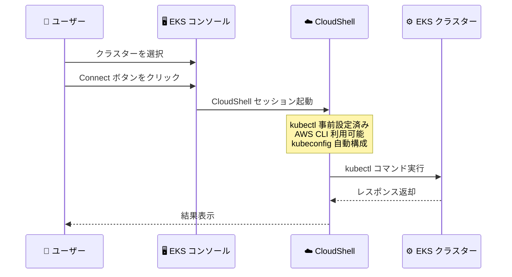

# Amazon EKS - ワンクリッククラスターアクセス (CloudShell 経由)

**リリース日**: 2026年4月30日
**サービス**: Amazon Elastic Kubernetes Service (EKS)
**機能**: ワンクリッククラスターアクセス (CloudShell 経由)

📊 [このアップデートのインフォグラフィックを見る](https://takech9203.github.io/aws-news-summary/20260430-amazon-eks-one-click-cluster-access.html)

## 概要

Amazon EKS が AWS マネジメントコンソールから AWS CloudShell を通じたワンクリッククラスターアクセスを提供開始した。これにより、kubectl、AWS CLI、kubeconfig ファイルをローカルにインストール・設定する必要がなくなり、開発者やオペレーターはツールのセットアップや複雑な環境設定なしに、即座にクラスターへアクセスできるようになった。

コンソール上で任意の EKS クラスターに移動し「Connect」を選択するだけで、kubectl が事前設定された CloudShell セッションが即座に起動する。パブリックおよびプライベートの API サーバーエンドポイントの両方をサポートしており、追加料金なしで EKS が利用可能なすべての AWS リージョンで使用できる。

**アップデート前の課題**

- kubectl、AWS CLI、kubeconfig ファイルのローカルインストールと設定が必要だった
- 初回セットアップに時間がかかり、特に新規メンバーのオンボーディングが煩雑だった
- ローカル環境の依存関係や設定の不整合によるトラブルシューティングが発生していた
- プライベートエンドポイントのクラスターにアクセスするためにネットワーク設定が必要だった

**アップデート後の改善**

- コンソールからワンクリックで kubectl が事前設定された CloudShell セッションを起動可能になった
- ローカル環境への kubectl や kubeconfig のインストール・設定が不要になった
- パブリック・プライベート両方の API サーバーエンドポイントに対応
- 追加料金なしで即座にクラスター操作を実行可能になった

## アーキテクチャ図



ユーザーがコンソールから Connect をクリックするだけで、CloudShell が kubectl 設定済みの状態で起動し、EKS クラスターへ即座にアクセスできるフローを示している。

## サービスアップデートの詳細

### 主要機能

1. **ワンクリッククラスター接続**
   - EKS コンソールの任意のクラスターページから「Connect」ボタンで即座に接続
   - kubectl が対象クラスター用に事前設定された状態で CloudShell が起動
   - kubeconfig の手動設定や aws eks update-kubeconfig コマンドの実行が不要

2. **パブリック・プライベートエンドポイント対応**
   - パブリック API サーバーエンドポイントを持つクラスターに対応
   - プライベート API サーバーエンドポイントを持つクラスターにも対応
   - VPN やバスティオンホストを経由せずにプライベートクラスターへアクセス可能

3. **統合ツール環境**
   - kubectl が事前インストール・設定済み
   - AWS CLI が利用可能
   - 標準 CloudShell ユーティリティが含まれる
   - 追加のツールインストールなしで即座にクラスター操作を開始可能

## 技術仕様

### サポート構成

| 項目 | 詳細 |
|------|------|
| API サーバーエンドポイント | パブリック、プライベート両方に対応 |
| 含まれるツール | kubectl、AWS CLI、標準 CloudShell ユーティリティ |
| 認証方式 | IAM ベース (コンソールログイン資格情報を使用) |
| セッション環境 | AWS CloudShell (マネージド Linux 環境) |

### アクセス要件

| 項目 | 詳細 |
|------|------|
| IAM 権限 | EKS クラスターへのアクセス権限、CloudShell 利用権限 |
| Kubernetes RBAC | クラスター内での適切なロール割り当て |
| ネットワーク要件 | CloudShell が対象クラスターの API エンドポイントに到達可能であること |

## 設定方法

### 前提条件

1. AWS マネジメントコンソールへのアクセス権限
2. 対象 EKS クラスターへの IAM アクセス権限
3. Kubernetes RBAC による適切なロール設定

### 手順

#### ステップ 1: EKS コンソールでクラスターを選択

AWS マネジメントコンソールから Amazon EKS サービスに移動し、対象のクラスターを選択する。

#### ステップ 2: Connect ボタンをクリック

クラスター詳細ページで「Connect」ボタンをクリックする。CloudShell セッションが自動的に起動し、kubectl が対象クラスター用に設定された状態になる。

#### ステップ 3: kubectl コマンドを実行

```bash
# クラスターのノード一覧を確認
kubectl get nodes

# Pod の状態を確認
kubectl get pods --all-namespaces

# サービスの確認
kubectl get svc
```

CloudShell セッション内で kubectl コマンドを即座に実行し、ワークロードの確認やトラブルシューティングを実施できる。

## メリット

### ビジネス面

- **オンボーディング時間の短縮**: 新規チームメンバーが環境構築なしに即座にクラスター操作を開始でき、生産性向上に直結する
- **運用コストの削減**: ローカル環境のセットアップやメンテナンスにかかる工数を削減
- **インシデント対応の迅速化**: 緊急時にどのデバイスからでもブラウザだけでクラスターにアクセスし、即座に対応を開始できる

### 技術面

- **環境依存性の排除**: ローカル環境の差異による問題を完全に排除し、一貫した操作環境を提供
- **プライベートクラスターへの簡易アクセス**: VPN やバスティオンホストの設定なしにプライベートエンドポイントのクラスターへアクセス可能
- **ツールバージョン管理の簡素化**: CloudShell 側で kubectl や AWS CLI が管理されるため、バージョン不整合の問題が発生しない

## デメリット・制約事項

### 制限事項

- CloudShell のセッションタイムアウト制限 (アイドル状態で約 20 分) が適用される
- CloudShell のストレージは永続化されるが、セッション間でプロセスは保持されない
- CloudShell で利用可能なリソース (CPU、メモリ) には制限がある

### 考慮すべき点

- 大規模なスクリプト実行や長時間のオペレーションにはローカル環境の方が適している場合がある
- カスタムツールや特定バージョンの kubectl が必要な場合は、ローカル環境が依然として必要
- CloudShell のネットワーク経路がプライベートクラスターへのアクセスをサポートしているか確認が必要

## ユースケース

### ユースケース 1: 緊急時のトラブルシューティング

**シナリオ**: 本番環境の EKS クラスターで障害が発生し、手元に kubectl が設定されたマシンがない状態で即座に対応する必要がある。

**実装例**:
```bash
# CloudShell から即座にクラスターに接続して状態確認
kubectl get pods -n production --field-selector=status.phase!=Running
kubectl describe pod <問題のPod名> -n production
kubectl logs <問題のPod名> -n production --tail=100
```

**効果**: 環境構築にかかる数十分の時間を省略し、障害発生から対応開始までの時間を大幅に短縮できる。

### ユースケース 2: 新規チームメンバーのオンボーディング

**シナリオ**: 新しい開発者がチームに参加し、既存の EKS クラスター上のワークロードを確認する必要がある。

**実装例**:
```bash
# クラスターの構成を確認
kubectl get namespaces
kubectl get deployments -n development
kubectl get services -n development
```

**効果**: ローカル環境の kubectl セットアップや kubeconfig の共有作業が不要になり、IAM 権限の付与だけで即座にクラスターへのアクセスが可能になる。

### ユースケース 3: マルチクラスター管理での素早い切り替え

**シナリオ**: 複数の EKS クラスターを管理しており、異なるクラスター間で素早く切り替えて状態を確認する必要がある。

**実装例**:
```bash
# コンソールから各クラスターの Connect をクリックして切り替え
# クラスターAの確認
kubectl get nodes
kubectl top nodes

# 別のクラスターに切り替えて同様の操作
```

**効果**: kubeconfig のコンテキスト切り替えや複数の kubeconfig ファイル管理が不要になり、コンソールからの直感的な操作でマルチクラスター管理が効率化される。

## 料金

ワンクリッククラスターアクセス機能自体に追加料金は発生しない。AWS CloudShell は無料で利用可能であり、本機能も含めて追加コストなしで使用できる。

| 項目 | 料金 |
|------|------|
| ワンクリッククラスターアクセス機能 | 無料 |
| AWS CloudShell | 無料 |
| Amazon EKS クラスター | 通常の EKS 料金が適用 |

## 利用可能リージョン

Amazon EKS が利用可能なすべての AWS リージョンで使用可能。東京リージョン (ap-northeast-1) を含む全対象リージョンで追加料金なしで利用できる。

## 関連サービス・機能

- **AWS CloudShell**: ブラウザベースのシェル環境。本機能の基盤となるサービスで、kubectl 実行環境を提供
- **Amazon EKS**: マネージド Kubernetes サービス。本機能によりコンソールからの直接アクセスが強化された
- **AWS IAM**: 認証・認可基盤。CloudShell セッションでの EKS アクセスに IAM 資格情報を使用
- **kubectl**: Kubernetes クラスター管理の標準 CLI ツール。CloudShell に事前インストールされる

## 参考リンク

- 📊 [インフォグラフィック](https://takech9203.github.io/aws-news-summary/20260430-amazon-eks-one-click-cluster-access.html)
- [公式発表 (What's New)](https://aws.amazon.com/about-aws/whats-new/2026/04/amazon-eks-one-click-cluster-access/)
- [Amazon EKS ユーザーガイド - Connect kubectl to an EKS cluster](https://docs.aws.amazon.com/eks/latest/userguide/connect-cluster.html)
- [AWS CloudShell ドキュメント](https://docs.aws.amazon.com/cloudshell/latest/userguide/welcome.html)
- [Amazon EKS 料金ページ](https://aws.amazon.com/eks/pricing/)

## まとめ

Amazon EKS のワンクリッククラスターアクセスは、Kubernetes クラスターへのアクセスの敷居を大幅に下げるアップデートである。特にインシデント対応時の迅速なアクセスや新規メンバーのオンボーディング効率化に効果が高い。EKS を利用しているすべてのチームにおいて、追加料金なしで即座に活用を開始することを推奨する。
