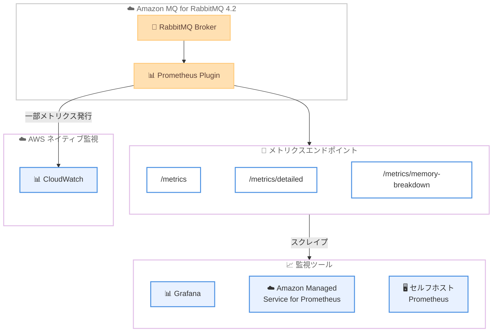

# Amazon MQ for RabbitMQ - Prometheus メトリクスサポート

**リリース日**: 2026年4月30日
**サービス**: Amazon MQ for RabbitMQ
**機能**: Prometheus プラグインによるネイティブメトリクスエンドポイント

[このアップデートのインフォグラフィックを見る](https://takech9203.github.io/aws-news-summary/20260430-amazon-mq-rabbitmq-prometheus-metrics.html)

## 概要

Amazon MQ for RabbitMQ が RabbitMQ 4.2 ブローカー上で Prometheus プラグインをサポートし、ネイティブの Prometheus 互換メトリクスエンドポイントを提供するようになりました。ブローカー、キュー、コネクションのメトリクスを Prometheus 互換の監視ツールから直接スクレイプできるようになり、メッセージングインフラストラクチャの監視とアラートの柔軟性が大幅に向上します。

このアップデートにより、既存の Prometheus ベースの監視スタックへの統合が可能になります。Grafana ダッシュボード、Amazon Managed Service for Prometheus、セルフホスト型の Prometheus サーバーなど、既存の監視基盤をそのまま活用できます。Prometheus プラグインは全ての Amazon MQ for RabbitMQ 4.2 ブローカーでデフォルトで有効化されています。

**アップデート前の課題**

- Amazon MQ for RabbitMQ のメトリクスは CloudWatch 経由でのみ取得可能で、Prometheus 互換ツールとの直接統合ができなかった
- 既存の Prometheus ベース監視スタックを利用している場合、別途エクスポーターの設定や変換処理が必要だった
- ブローカーの詳細なメモリ内訳やキュー単位の細粒度メトリクスを取得する手段が限られていた

**アップデート後の改善**

- Prometheus テキスト形式のネイティブエンドポイントから直接メトリクスをスクレイプ可能になった
- 既存の Prometheus ベース監視スタックとシームレスに統合できるようになった
- /metrics/detailed や /metrics/memory-breakdown など詳細なメトリクスエンドポイントが利用可能になった

## アーキテクチャ図



Amazon MQ for RabbitMQ 4.2 ブローカーの Prometheus プラグインが提供するメトリクスエンドポイントと、各種監視ツールとの連携を示した図です。

## サービスアップデートの詳細

### 主要機能

1. **ネイティブ Prometheus メトリクスエンドポイント**
   - /metrics: ブローカー全体のサマリーメトリクスを Prometheus テキスト形式で公開
   - /metrics/detailed: キュー、コネクション、チャネルなどの詳細メトリクスを提供
   - /metrics/memory-breakdown: メモリ使用量の内訳メトリクスを公開
   - Prometheus 互換の監視ツールから直接スクレイプ可能

2. **CloudWatch メトリクス連携**
   - Prometheus メトリクスの厳選されたサブセットを CloudWatch に自動発行
   - AWS ネイティブの監視・アラート機能との併用が可能
   - 追加設定不要で CloudWatch メトリクスが利用可能

3. **既存監視スタックとの統合**
   - Grafana ダッシュボードとの連携
   - Amazon Managed Service for Prometheus への統合
   - セルフホスト型 Prometheus サーバーへの統合
   - 既存のアラートルールやダッシュボードをそのまま活用可能

## 技術仕様

### メトリクスエンドポイント

| エンドポイント | 用途 | 提供情報 |
|------|------|------|
| /metrics | 基本メトリクス | ブローカー全体のサマリー情報 |
| /metrics/detailed | 詳細メトリクス | キュー、コネクション、チャネルの個別メトリクス |
| /metrics/memory-breakdown | メモリ分析 | メモリ使用量の詳細な内訳 |

### 対応バージョンと有効化

| 項目 | 詳細 |
|------|------|
| 対応エンジンバージョン | RabbitMQ 4.2 |
| 有効化方法 | デフォルトで有効 |
| メトリクス形式 | Prometheus テキスト形式 |
| CloudWatch 連携 | 自動で一部メトリクスを発行 |

## 設定方法

### 前提条件

1. Amazon MQ for RabbitMQ 4.2 ブローカーが稼働していること
2. Prometheus 互換の監視ツールがセットアップ済みであること
3. ブローカーのエンドポイントへのネットワークアクセスが確保されていること

### 手順

#### ステップ 1: ブローカーエンドポイントの確認

```bash
# AWS CLI でブローカー情報を取得
aws mq describe-broker --broker-id <broker-id> --query 'BrokerInstances[].Endpoints'
```

ブローカーのエンドポイント情報を取得し、Prometheus メトリクスエンドポイントの URL を確認します。

#### ステップ 2: Prometheus スクレイプ設定の追加

```yaml
# prometheus.yml
scrape_configs:
  - job_name: 'amazon-mq-rabbitmq'
    scheme: https
    basic_auth:
      username: '<rabbitmq-username>'
      password: '<rabbitmq-password>'
    static_configs:
      - targets: ['<broker-endpoint>:443']
    metrics_path: '/metrics'
```

Prometheus の設定ファイルにスクレイプジョブを追加し、ブローカーのメトリクスエンドポイントを監視対象として登録します。

#### ステップ 3: 詳細メトリクスの取得

```yaml
# 詳細メトリクス用の追加設定
scrape_configs:
  - job_name: 'amazon-mq-rabbitmq-detailed'
    scheme: https
    basic_auth:
      username: '<rabbitmq-username>'
      password: '<rabbitmq-password>'
    static_configs:
      - targets: ['<broker-endpoint>:443']
    metrics_path: '/metrics/detailed'
```

キュー単位やコネクション単位の詳細メトリクスが必要な場合は、/metrics/detailed エンドポイントに対する追加のスクレイプジョブを設定します。

## メリット

### ビジネス面

- **既存投資の活用**: Prometheus/Grafana ベースの既存監視基盤をそのまま再利用でき、追加の監視ツール投資が不要
- **統合的な可視性**: メッセージングインフラストラクチャを他のシステムと同じ監視基盤で一元管理可能
- **迅速な問題検知**: カスタムアラートルールの設定により、ビジネスへの影響を最小化

### 技術面

- **標準準拠のメトリクス**: Prometheus テキスト形式による業界標準の監視インターフェース
- **細粒度のモニタリング**: キュー、コネクション、メモリ使用量の詳細レベルまで可視化
- **ゼロ設定で有効化**: RabbitMQ 4.2 ブローカーではデフォルトで有効なため、追加設定不要で即時利用可能

## デメリット・制約事項

### 制限事項

- RabbitMQ 4.2 以上が必要であり、それ以前のバージョンでは利用不可
- メトリクスエンドポイントへのアクセスにはブローカーの認証情報が必要
- CloudWatch に発行されるメトリクスは Prometheus メトリクスの一部サブセットのみ

### 考慮すべき点

- 高頻度のスクレイプはブローカーのパフォーマンスに影響を与える可能性があるため、スクレイプ間隔の調整が推奨される
- /metrics/detailed エンドポイントは多数のキューやコネクションがある場合にレスポンスサイズが大きくなる可能性がある

## ユースケース

### ユースケース 1: 既存 Prometheus 監視基盤への統合

**シナリオ**: 組織で既に Prometheus + Grafana による監視基盤を運用しており、Amazon MQ for RabbitMQ のメトリクスも同じダッシュボードで監視したい。

**実装例**:
```yaml
# prometheus.yml - 既存の設定に追加
scrape_configs:
  - job_name: 'amazon-mq-rabbitmq'
    scheme: https
    basic_auth:
      username: 'monitoring-user'
      password: '${RABBITMQ_PASSWORD}'
    static_configs:
      - targets: ['b-xxxx.mq.us-east-1.amazonaws.com:443']
    metrics_path: '/metrics'
    scrape_interval: 30s
```

**効果**: 既存の Grafana ダッシュボードにメッセージングメトリクスを追加し、アプリケーション全体の健全性を一画面で確認可能

### ユースケース 2: Amazon Managed Service for Prometheus との連携

**シナリオ**: AWS 環境でスケーラブルなマネージド Prometheus を利用し、長期保存とクロスアカウント監視を実現したい。

**実装例**:
```yaml
# Amazon EKS 上の Prometheus Agent 設定
remote_write:
  - url: https://aps-workspaces.us-east-1.amazonaws.com/workspaces/ws-xxxx/api/v1/remote_write
    sigv4:
      region: us-east-1
scrape_configs:
  - job_name: 'amazon-mq-rabbitmq'
    scheme: https
    basic_auth:
      username: 'monitoring-user'
      password: '${RABBITMQ_PASSWORD}'
    static_configs:
      - targets: ['b-xxxx.mq.us-east-1.amazonaws.com:443']
    metrics_path: '/metrics'
```

**効果**: メトリクスの長期保存、クロスアカウント集約、Amazon Managed Grafana での統合ダッシュボード構築が可能

### ユースケース 3: キュー単位の詳細監視とアラート

**シナリオ**: 特定のキューのメッセージ滞留やコンシューマーの健全性を細かく監視し、異常時に即座にアラートを発報したい。

**実装例**:
```yaml
# Prometheus アラートルール
groups:
  - name: rabbitmq-alerts
    rules:
      - alert: RabbitMQQueueMessagesHigh
        expr: rabbitmq_queue_messages > 10000
        for: 5m
        labels:
          severity: warning
        annotations:
          summary: "キュー {{ $labels.queue }} のメッセージ数が閾値超過"
      - alert: RabbitMQConsumerDown
        expr: rabbitmq_queue_consumers == 0
        for: 2m
        labels:
          severity: critical
        annotations:
          summary: "キュー {{ $labels.queue }} のコンシューマーが 0"
```

**効果**: キュー単位の異常を早期検知し、メッセージ処理の遅延やサービス停止を未然に防止

## 料金

Prometheus プラグイン自体の追加料金はありません。ただし、関連サービスの利用に応じて以下の料金が発生します。

| 項目 | 料金 |
|------|------|
| Amazon MQ for RabbitMQ ブローカー | 既存のブローカー料金に含まれる |
| CloudWatch メトリクス | 標準の CloudWatch メトリクス料金 |
| Amazon Managed Service for Prometheus | 取り込み量・保存量・クエリ量に基づく従量課金 |

## 利用可能リージョン

Amazon MQ が利用可能な全ての AWS リージョンで利用可能です。RabbitMQ 4.2 ブローカーであればデフォルトで有効化されています。

## 関連サービス・機能

- **Amazon Managed Service for Prometheus**: スケーラブルなマネージド Prometheus サービスとしてメトリクスの長期保存・集約に利用
- **Amazon Managed Grafana**: Prometheus メトリクスの可視化・ダッシュボード構築に利用
- **Amazon CloudWatch**: AWS ネイティブの監視サービスとして、Prometheus メトリクスの一部サブセットを自動連携
- **Amazon MQ for RabbitMQ**: マネージドメッセージブローカーサービスの基盤

## 参考リンク

- [インフォグラフィック](https://takech9203.github.io/aws-news-summary/20260430-amazon-mq-rabbitmq-prometheus-metrics.html)
- [公式発表 (What's New)](https://aws.amazon.com/about-aws/whats-new/2026/04/amazon-mq-rabbitmq-prometheus-metrics/)
- [Amazon MQ リリースノート](https://docs.aws.amazon.com/amazon-mq/latest/developer-guide/amazon-mq-release-notes.html)
- [Amazon MQ 料金ページ](https://aws.amazon.com/amazon-mq/pricing/)
- [Amazon MQ for RabbitMQ ドキュメント](https://docs.aws.amazon.com/amazon-mq/latest/developer-guide/working-with-rabbitmq.html)

## まとめ

Amazon MQ for RabbitMQ への Prometheus メトリクスサポートは、既存の Prometheus ベース監視基盤を活用している組織にとって大きな改善です。RabbitMQ 4.2 ブローカーでデフォルト有効のため、追加設定なしで即座にメトリクスの収集を開始できます。既存の Grafana ダッシュボードや Prometheus アラートルールとの統合を検討し、メッセージングインフラストラクチャの可視性向上を図ることを推奨します。
