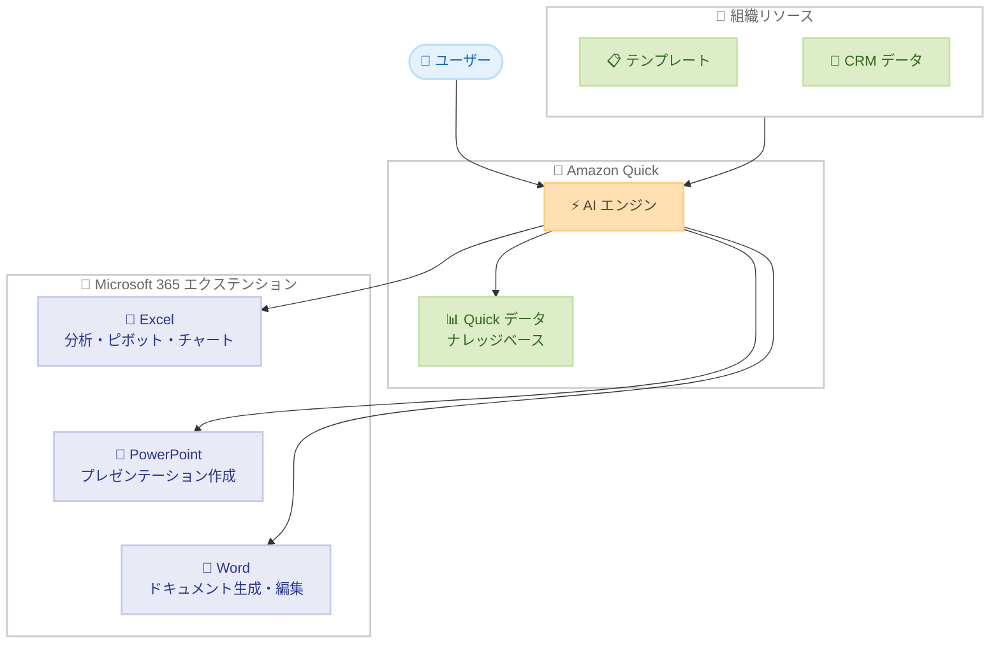

# Amazon Quick - Microsoft Excel、PowerPoint エクステンションの追加と Word エクステンションの更新

**リリース日**: 2026 年 4 月 30 日
**サービス**: Amazon Quick
**機能**: Microsoft 365 エクステンション (Excel、PowerPoint、Word) - Preview

📊 [このアップデートのインフォグラフィックを見る](https://takech9203.github.io/aws-news-summary/20260430-amazon-quick-microsoft-excel.html)

## 概要

Amazon Quick が Microsoft 365 向けの新しいエクステンションをプレビューとして導入しました。Excel エクステンションと PowerPoint エクステンションが新たに追加され、既存の Word エクステンションも大幅に機能強化されています。これらのエクステンションにより、Amazon Quick が Microsoft 365 環境内で直接タスクを実行できるようになり、AI を活用した複雑なローカルタスクの自動化が実現します。

今回のアップデートにより、ユーザーは Amazon Quick のデータとナレッジを活用しながら、Excel でのスプレッドシート分析、PowerPoint でのプレゼンテーション作成、Word でのドキュメント生成を AI アシスタントに委任できるようになります。財務チーム、営業チーム、マーケティングチーム、法務チーム、IT チームなど幅広い部門での日常業務を変革する機能です。

**アップデート前の課題**

- Amazon Quick のデータや分析結果を Microsoft 365 アプリケーションで活用するには手動でのコピーや再作成が必要だった
- Excel での複雑なデータ分析やピボットテーブル作成は手動で行う必要があり時間がかかっていた
- プレゼンテーション資料の作成に Quick のデータを利用する場合、手動での転記が必要だった
- Word でのドキュメント作成において、Quick のコンテキストを活かした AI 支援が限定的だった

**アップデート後の改善**

- Excel エクステンションにより、複雑なスプレッドシート分析、ピボットテーブル・チャート作成、データインポートとクリーニングが AI で自動化可能になった
- PowerPoint エクステンションにより、組織定義のテンプレートを使用して Quick のデータからプレゼンテーションを作成・洗練できるようになった
- Word エクステンションが強化され、書式付きドキュメント生成、変更履歴付きの一括編集、コメントへのレビュアー参加が可能になった
- Microsoft 365 環境内で直接 Amazon Quick の AI 機能を活用でき、ワークフローの切り替えが不要になった

## アーキテクチャ図



この図は、Amazon Quick の AI エンジンが組織リソースとナレッジベースを活用しながら、Microsoft 365 の各アプリケーション内で直接タスクを実行するアーキテクチャを示しています。

## サービスアップデートの詳細

### 主要機能

1. **Excel エクステンション (新規)**
   - 複雑なスプレッドシート分析を AI が支援
   - ピボットテーブルとチャートの自動作成
   - 外部データのインポートとクリーニング
   - 自然言語での指示による財務モデル構築

2. **PowerPoint エクステンション (新規)**
   - Amazon Quick のデータを活用したプレゼンテーション作成
   - 組織が定義したテンプレートに基づくスライド生成
   - プレゼンテーション内容の洗練とブラッシュアップ
   - ブランドガイドラインに準拠した自動フォーマット

3. **Word エクステンション (機能強化)**
   - Word プリミティブを使用した書式付きドキュメント生成
   - 変更履歴 (Track Changes) を有効にした一括編集
   - コメント機能でのレビュアーとしての参加
   - 既存ドキュメントのレッドライニング

## 技術仕様

### 対応エクステンション一覧

| エクステンション | ステータス | 主な機能 |
|------|------|------|
| Excel | 新規 (Preview) | スプレッドシート分析、ピボットテーブル、チャート作成、データインポート |
| PowerPoint | 新規 (Preview) | プレゼンテーション作成、テンプレート活用、スライド洗練 |
| Word | 更新 (Preview) | 書式付きドキュメント生成、変更履歴付き編集、コメントレビュー |

### API 変更履歴

| 日付 | サービス | 変更内容 |
|------|----------|----------|
| 2026/05/01 | [Amazon QuickSight](https://awsapichanges.com/archive/changes/6338dd-quicksight.html) | 23 updated api methods - Story、Scenario の CreateCustomCapability 追加、ControlTitleFormatText 等 |

### チーム別活用例

| チーム | 活用内容 |
|--------|----------|
| 財務チーム | 自然言語で複雑な財務モデルを構築 |
| 営業チーム | CRM データを自動取得してプロポーザル作成 |
| マーケティングチーム | ブランドテンプレートに準拠したプレゼンテーション自動作成 |
| 法務チーム | 契約書レビューの効率化 |
| IT チーム | ルーティンデータ分析の自動化 |

## 設定方法

### 前提条件

1. Amazon Quick アカウントが有効であること
2. Microsoft 365 の有効なサブスクリプションがあること
3. サポート対象の AWS リージョンを使用していること

### 手順

#### ステップ 1: Amazon Quick アカウントのセットアップ

Amazon Quick の Web サイトにアクセスしてアカウントを作成またはサインインします。

#### ステップ 2: エクステンションのインストール

Quick のダウンロードページからエクステンションをインストールします。Excel、PowerPoint、Word それぞれのエクステンションを個別にインストールできます。

#### ステップ 3: Microsoft 365 との連携設定

インストール後、Microsoft 365 アプリケーション内で Amazon Quick エクステンションを有効化し、認証を完了します。

## メリット

### ビジネス面

- **生産性の大幅向上**: AI による自動化で、データ分析やドキュメント作成にかかる時間を削減
- **ブランド一貫性の維持**: 組織定義テンプレートにより、全社的に統一されたプレゼンテーションやドキュメントを作成
- **コンテキスト切り替えの削減**: Microsoft 365 環境内で直接 Quick の AI 機能を利用でき、アプリケーション間の行き来が不要

### 技術面

- **データ連携の自動化**: CRM やナレッジベースから直接データを取得し、ドキュメントに反映
- **変更追跡機能との統合**: Word の Track Changes と連携した編集により、監査証跡が自動的に残る
- **テンプレートベースの生成**: 組織が管理するテンプレートに基づく生成により、フォーマットの標準化を確保

## デメリット・制約事項

### 制限事項

- 現時点ではプレビュー段階であり、一般提供 (GA) ではない
- 利用可能リージョンが限定されている (7 リージョン)
- Microsoft 365 サブスクリプションが別途必要

### 考慮すべき点

- プレビュー機能のため、本番環境での利用には注意が必要
- 組織のテンプレート管理体制の整備が効果的な活用の前提となる
- 生成されたコンテンツの正確性については人間によるレビューが引き続き重要

## ユースケース

### ユースケース 1: 財務チームの月次レポート作成

**シナリオ**: 財務チームが月次の売上データを分析し、経営陣向けのレポートを作成する必要がある。

**実装例**:
```
1. Excel エクステンションで売上データをインポートしクリーニング
2. 自然言語で「地域別売上のピボットテーブルと前年比較チャートを作成」と指示
3. 分析結果を基に PowerPoint エクステンションで経営会議用のプレゼンテーションを自動生成
```

**効果**: 従来数時間かかっていた月次レポート作成プロセスを大幅に短縮し、分析の深さと正確性を向上

### ユースケース 2: 営業チームのプロポーザル作成

**シナリオ**: 営業担当者が顧客向けの提案書を迅速に作成したい。

**実装例**:
```
1. Amazon Quick に「顧客 X 向けの提案書を作成」と指示
2. CRM データから顧客情報を自動取得
3. Word エクステンションで組織テンプレートに基づいた提案書を生成
4. Track Changes を有効にしてマネージャーのレビューを効率化
```

**効果**: プロポーザル作成の所要時間を短縮し、CRM データに基づく正確で一貫した提案書の品質を確保

### ユースケース 3: マーケティングチームのキャンペーン資料作成

**シナリオ**: マーケティングチームが新製品のキャンペーン資料を複数形式で作成する必要がある。

**実装例**:
```
1. PowerPoint エクステンションでブランドテンプレートを使用したプレゼン資料を作成
2. Excel エクステンションで過去のキャンペーン成果データを分析
3. Word エクステンションで詳細なキャンペーン計画書を生成
```

**効果**: ブランドガイドラインに準拠した資料を迅速に作成し、手動フォーマット作業を排除

## 料金

Amazon Quick の料金体系に準じます。Microsoft 365 エクステンションの利用にあたり、Amazon Quick のサブスクリプションと Microsoft 365 のライセンスが必要です。プレビュー期間中の料金の詳細は Amazon Quick の料金ページを参照してください。

## 利用可能リージョン

- US East (N. Virginia)
- US West (Oregon)
- Asia Pacific (Sydney)
- Asia Pacific (Tokyo)
- Europe (Frankfurt)
- Europe (Ireland)
- Europe (London)

## 関連サービス・機能

- **Amazon Quick**: AI を活用したビジネスインテリジェンスおよびプロダクティビティサービス
- **Amazon QuickSight**: BI ダッシュボードとビジュアライゼーションサービス (Quick の基盤技術)
- **Microsoft 365**: エクステンションの実行環境となるオフィスプロダクティビティスイート

## 参考リンク

- 📊 [インフォグラフィック](https://takech9203.github.io/aws-news-summary/20260430-amazon-quick-microsoft-excel.html)
- [公式発表 (What's New)](https://aws.amazon.com/about-aws/whats-new/2026/04/amazon-quick-microsoft-excel/)
- [Amazon Quick Web サイト](https://aws.amazon.com/quick/)
- [Amazon Quick ダウンロードページ](https://aws.amazon.com/quick/download/)

## まとめ

Amazon Quick の Microsoft 365 エクステンション (Excel、PowerPoint、Word) の追加は、AI アシスタントが Microsoft Office アプリケーション内で直接複雑なタスクを実行できるようになる重要なアップデートです。特に東京リージョンでも利用可能であり、日本のエンタープライズユーザーにとって即座に活用できます。プレビュー段階ではありますが、日常的な業務効率化に大きなインパクトをもたらす機能であるため、早期の検証を推奨します。
