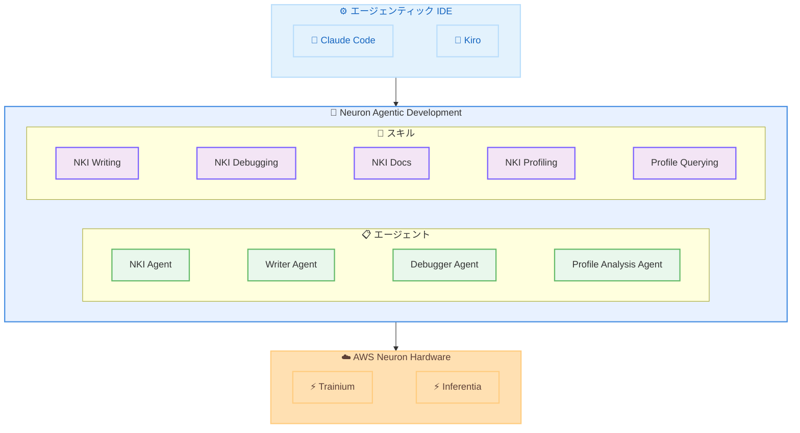

# AWS Neuron SDK - Neuron Agentic Development

**リリース日**: 2026年4月30日
**サービス**: AWS Neuron SDK
**機能**: Neuron Agentic Development for NKI Kernel Development

## 概要

AWS Neuron チームは、Neuron Agentic Development 機能をオープンソースとして公開した。これは AI コーディングアシスタントを活用して AWS Trainium および AWS Inferentia 上での開発を加速させるエージェントとスキルのコレクションである。

初回リリースでは、Neuron Kernel Interface (NKI) カーネル開発に特化したエージェンティックコーディング機能を提供する。NKI は開発者に Trainium へのダイレクトな低レベルプログラミングアクセスを提供し、カスタムコンピュートカーネルの作成を可能にするインターフェースである。Claude Code や Kiro などのエージェンティック IDE を通じて、自然言語で NKI の専門知識にアクセスできるようになり、カーネルのオーサリングからプロファイリング、パフォーマンス分析までのワークフロー全体をカバーする。

**アップデート前の課題**

- NKI カーネル開発には Trainium ハードウェアアーキテクチャの深い専門知識が必要で、学習コストが高かった
- カーネルのデバッグやパフォーマンス最適化は手動での試行錯誤に依存していた
- Neuron SDK のドキュメントやサンプルコードを手動で検索する必要があり、開発サイクルが長かった
- PyTorch や NumPy から NKI カーネルへの変換は、開発者が API 仕様を手動で確認しながら行う必要があった

**アップデート後の改善**

- AI コーディングアシスタントが NKI の専門知識を持ち、自然言語でカーネル開発を支援するようになった
- カーネルのオーサリング、デバッグ、プロファイリング、最適化がエージェンティックなワークフローで自動化された
- Claude Code や Kiro などの IDE から直接、NKI ドキュメントの検索やコード生成が可能になった
- PyTorch/NumPy コードから NKI カーネルへの変換が自然言語の指示で実行可能になった

## アーキテクチャ図



開発者はエージェンティック IDE から Neuron Agentic Development のエージェントとスキルを呼び出し、Trainium/Inferentia ハードウェア向けの NKI カーネル開発を行う。

## サービスアップデートの詳細

### 主要機能

1. **エージェント群**
   - **neuron-nki-agent**: 統合 NKI カーネル開発エージェント。カーネルの作成、コンパイルエラーのデバッグ、パフォーマンスプロファイリング、ボトルネック最適化、API バージョン間のマイグレーション、Perfetto トレース分析、ドキュメント検索をカバーする
   - **neuron-nki-writer-agent**: NKI カーネルのオーサリングと修正を担当。PyTorch/NumPy/自然言語からの変換、shape/dtype サポートの追加、タイリング戦略のリファクタリング、Beta 3 API パターンに沿った新機能の実装を行う
   - **neuron-nki-debugger-agent**: NKI カーネルのコンパイルエラーを自律的にデバッグ。コンパイラエラーの分析、ドキュメントとコード例からの修正候補検索、修正の適用と検証を行う
   - **neuron-nki-profile-analysis-agent**: NKI カーネルのプロファイリングと分析。実行トレースのキャプチャ、パフォーマンスバウンドの計算、ボトルネックエンジンの特定、NKI ソースラインへの非効率性の局所化を行う

2. **スキル群**
   - **neuron-nki-writing**: NKI カーネルの作成と修正スキル
   - **neuron-nki-debugging**: Neuron ハードウェア上でのコンパイルエラーデバッグスキル
   - **neuron-nki-docs**: NKI ドキュメントの API 検索、チュートリアル、エラーコード、アーキテクチャ詳細の調査スキル
   - **neuron-nki-profiling**: Neuron ハードウェア上でのカーネルプロファイリングスキル
   - **neuron-nki-profile-querying**: neuron-explorer の parquet ファイルから SQL と Python でプロファイルデータをクエリ・分析するスキル

3. **IDE 統合とデプロイメント**
   - Claude Code へのデプロイ: `deploy-neuron-agentic-development-to-claude` コマンド
   - Kiro へのデプロイ: `deploy-neuron-agentic-development-to-kiro` コマンド
   - pip パッケージとしてのインストールに対応

## 技術仕様

### 対応プラットフォームと要件

| 項目 | 詳細 |
|------|------|
| 対応ハードウェア | AWS Trainium、AWS Inferentia |
| 対応 IDE | Claude Code、Kiro |
| インストール方法 | pip (Neuron PyPI リポジトリ)、wheel ファイル、GitHub クローン |
| パッケージ名 | neuron-agentic-development |
| バージョン | 1.0 |
| ライセンス | Apache-2.0 |
| リポジトリ | github.com/aws-neuron/neuron-agentic-development |
| NKI API バージョン | Beta 3 |

### エージェントとスキルの対応関係

| エージェント | 対応スキル | 主要機能 |
|-------------|-----------|----------|
| neuron-nki-agent | 全スキル統合 | フルライフサイクル管理 |
| neuron-nki-writer-agent | neuron-nki-writing | カーネル作成・修正 |
| neuron-nki-debugger-agent | neuron-nki-debugging | コンパイルエラー修正 |
| neuron-nki-profile-analysis-agent | neuron-nki-profiling、neuron-nki-profile-querying | パフォーマンス分析 |

## 設定方法

### 前提条件

1. AWS Neuron SDK がインストールされた環境
2. Claude Code または Kiro がインストールされていること
3. Python 3 環境
4. AWS Trainium または Inferentia インスタンスへのアクセス

### 手順

#### ステップ 1: パッケージのインストール

```bash
# Neuron PyPI リポジトリからインストール
pip install --upgrade neuron-agentic-development \
    --extra-index-url https://pip.repos.neuron.amazonaws.com
```

Neuron の公式 PyPI リポジトリからパッケージをインストールする。

#### ステップ 2: IDE へのデプロイ

```bash
# Claude Code へデプロイする場合
deploy-neuron-agentic-development-to-claude

# Kiro へデプロイする場合
deploy-neuron-agentic-development-to-kiro
```

インストール後、使用する IDE に合わせてデプロイコマンドを実行する。これによりエージェントとスキルが IDE から利用可能になる。

#### ステップ 3: GitHub からのインストール (代替方法)

```bash
# GitHub リポジトリをクローンしてインストール
git clone https://github.com/aws-neuron/neuron-agentic-development.git
cd neuron-agentic-development
pip install .
```

最新の開発版を使用する場合は、GitHub リポジトリから直接クローンしてインストールすることも可能である。

## メリット

### ビジネス面

- **開発速度の向上**: NKI カーネル開発の学習曲線を大幅に短縮し、Trainium 採用までの時間を削減できる
- **専門知識の民主化**: NKI の深い専門知識がなくても、自然言語を通じて高品質なカーネル開発が可能になる
- **コスト削減**: デバッグやパフォーマンスチューニングの工数を削減し、開発コストを抑制できる

### 技術面

- **フルライフサイクルサポート**: カーネルのオーサリングからプロファイリング、最適化まで一貫したワークフローを提供する
- **自律的デバッグ**: コンパイルエラーの自動分析と修正提案により、デバッグサイクルを短縮する
- **パフォーマンス分析の自動化**: Perfetto トレースの分析やボトルネックの特定が自動化され、最適化の方向性を迅速に判断できる

## デメリット・制約事項

### 制限事項

- 初回リリースは NKI カーネル開発に特化しており、Neuron SDK の他の機能は今後の対応となる
- 対応 IDE は現時点で Claude Code と Kiro のみ
- NKI Beta 3 API パターンに基づいているため、API バージョンのアップデートに追従する必要がある

### 考慮すべき点

- エージェントが生成するカーネルコードは、ハードウェア上での検証が引き続き必要である
- パフォーマンス最適化の提案は参考情報であり、ワークロードの特性に応じた調整が必要な場合がある
- オープンソースプロジェクトであるため、外部コントリビューションプロセスは現在評価中の段階にある

## ユースケース

### ユースケース 1: PyTorch カスタムカーネルの NKI への移植

**シナリオ**: 既存の PyTorch カスタムオペレーションを Trainium 上で実行するために NKI カーネルに変換したい場合

**実装例**:
```
# Claude Code または Kiro で自然言語で指示
"この PyTorch の attention カーネルを NKI カーネルに変換してください。
入力テンソルの shape は (batch, heads, seq_len, d_model) です。"
```

**効果**: 手動での API 対応確認やタイリング戦略の設計が不要になり、変換作業を大幅に短縮できる

### ユースケース 2: コンパイルエラーの自動デバッグ

**シナリオ**: NKI カーネルのコンパイル時にエラーが発生し、原因の特定と修正に時間がかかっている場合

**実装例**:
```
# neuron-nki-debugger-agent が自動的に以下を実行
1. コンパイラエラーメッセージの分析
2. ドキュメントとサンプルコードからの解決策検索
3. 修正の適用と再コンパイルによる検証
```

**効果**: コンパイルエラーの解決時間を大幅に短縮し、シンプルさを優先した修正により保守性の高いコードを維持できる

### ユースケース 3: カーネルパフォーマンスの最適化

**シナリオ**: NKI カーネルが期待通りのパフォーマンスを発揮しておらず、ボトルネックを特定して最適化したい場合

**実装例**:
```
# neuron-nki-profile-analysis-agent が自動的に以下を実行
1. 実行トレースのキャプチャ
2. パフォーマンスバウンドの計算
3. ボトルネックエンジンの特定
4. NKI ソースラインへの非効率性の局所化
5. 最適化提案の生成
```

**効果**: プロファイリングデータの手動分析が不要になり、ボトルネックの特定から最適化の方向性の決定までが自動化される

## 料金

Neuron Agentic Development 自体はオープンソースであり、無料で利用可能である。ただし、以下の関連コストが発生する。

- AWS Trainium/Inferentia インスタンスの利用料金 (EC2 料金に準じる)
- Claude Code または Kiro の利用に伴う料金 (各サービスの料金体系に準じる)

## 利用可能リージョン

Neuron Agentic Development はオープンソースのツールであり、AWS Trainium または Inferentia インスタンスが利用可能なすべてのリージョンで使用できる。Trainium インスタンスは us-east-1、us-east-2、us-west-2 などの主要リージョンで利用可能である。

## 関連サービス・機能

- **AWS Trainium**: AI/ML トレーニング向けに設計された AWS カスタムチップ。NKI による低レベルプログラミングの対象ハードウェア
- **AWS Inferentia**: ML 推論向けに設計された AWS カスタムチップ。NKI カーネルの実行環境
- **AWS Neuron SDK**: Trainium/Inferentia 向けの開発キット。コンパイラ、ランタイム、フレームワーク統合を提供
- **Kiro**: AWS が提供する AI 搭載 IDE。Neuron Agentic Development のデプロイ先として対応
- **Claude Code**: Anthropic の AI コーディングアシスタント。Neuron Agentic Development のデプロイ先として対応

## 参考リンク

- [公式発表 (What's New)](https://aws.amazon.com/about-aws/whats-new/2026/04/announcing-neuron-agentic-development/)
- [GitHub リポジトリ](https://github.com/aws-neuron/neuron-agentic-development)
- [Neuron Agentic Development ドキュメント](https://awsdocs-neuron.readthedocs-hosted.com/en/latest/about-neuron/agentic-development-overview.html)
- [AWS Neuron SDK ドキュメント](https://awsdocs-neuron.readthedocs-hosted.com/)
- [AWS Trainium](https://aws.amazon.com/ai/machine-learning/trainium/)
- [AWS Inferentia](https://aws.amazon.com/ai/machine-learning/inferentia/)

## まとめ

Neuron Agentic Development は、AWS Trainium/Inferentia 上での NKI カーネル開発を AI コーディングアシスタントで加速させる画期的なオープンソースツールである。NKI の専門知識を持つエージェントとスキルにより、カーネル開発のフルライフサイクルが自然言語で操作可能になり、カスタム AI アクセラレータ開発の敷居を大幅に下げる。Trainium を活用した AI/ML ワークロードの最適化を検討している開発者は、早期に導入を検討することを推奨する。
