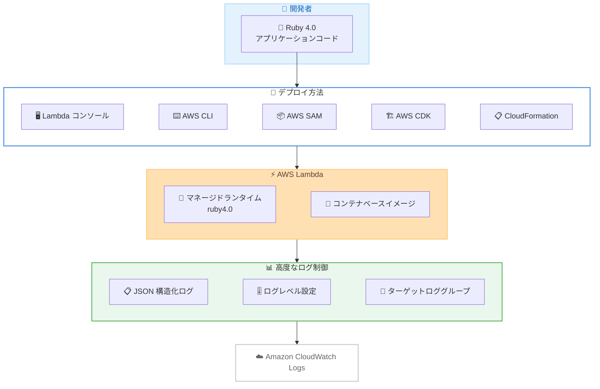

# AWS Lambda - Ruby 4.0 ランタイムサポート

**リリース日**: 2026年4月30日
**サービス**: AWS Lambda
**機能**: Ruby 4.0 マネージドランタイムおよびコンテナベースイメージ

📊 [このアップデートのインフォグラフィックを見る](https://takech9203.github.io/aws-news-summary/20260430-aws-lambda-adds-ruby.html)

## 概要

AWS Lambda が Ruby 4.0 によるサーバーレスアプリケーションの作成をサポートした。マネージドランタイムとコンテナベースイメージの両方で利用可能であり、AWS がセキュリティパッチやバグ修正を自動的に適用する。

Ruby 4.0 は Ruby の最新の長期サポート (LTS) リリースであり、2029 年 3 月までセキュリティおよびバグ修正のサポートが予定されている。Lambda Runtime for Ruby 4.0 では、Lambda の高度なログ制御もサポートされ、JSON 構造化ログ、設定可能なログレベル、ターゲット CloudWatch ロググループの設定が可能になった。

**アップデート前の課題**

- Lambda で Ruby を使用する場合、Ruby 3.x 系のランタイムに制限されていた
- Ruby 4.0 の新しい言語機能やパフォーマンス改善をサーバーレス環境で活用できなかった
- Ruby ランタイムで高度なログ制御 (JSON 構造化ログ、ログレベル設定) が利用できない場合があった

**アップデート後の改善**

- Ruby 4.0 の最新言語機能をサーバーレスアプリケーションで活用できるようになった
- マネージドランタイムとコンテナベースイメージの両方で Ruby 4.0 が利用可能になった
- Lambda の高度なログ制御 (JSON 構造化ログ、設定可能なログレベル、ターゲットロググループ設定) が Ruby 4.0 ランタイムで利用可能になった

## アーキテクチャ図



開発者は複数のデプロイツールを使用して Ruby 4.0 アプリケーションを Lambda にデプロイでき、高度なログ制御を通じて CloudWatch Logs へ構造化ログを出力できる。

## サービスアップデートの詳細

### 主要機能

1. **Ruby 4.0 マネージドランタイム**
   - Lambda のマネージドランタイムとして Ruby 4.0 を選択可能
   - AWS がセキュリティパッチおよびバグ修正を自動的に適用
   - Ruby 4.0 の最新言語機能をすぐに活用可能

2. **コンテナベースイメージ**
   - Ruby 4.0 の公式コンテナベースイメージが提供される
   - カスタム依存関係やネイティブエクステンションを含むデプロイが容易
   - Docker ベースのワークフローとの統合が可能

3. **高度なログ制御 (Advanced Logging Controls)**
   - JSON 構造化ログによるログの解析と検索の効率化
   - 設定可能なログレベル (DEBUG, INFO, WARN, ERROR) による出力制御
   - ターゲット CloudWatch ロググループの指定が可能

## 技術仕様

### ランタイム情報

| 項目 | 詳細 |
|------|------|
| ランタイム識別子 | ruby4.0 |
| Ruby バージョン | 4.0 |
| LTS サポート期限 | 2029 年 3 月 |
| デプロイ形式 | マネージドランタイム / コンテナベースイメージ |
| ログ形式 | JSON 構造化ログ対応 |

### 対応デプロイツール

| ツール | サポート状況 |
|--------|-------------|
| Lambda コンソール | 対応 |
| AWS CLI | 対応 |
| AWS SAM | 対応 |
| AWS CDK | 対応 |
| AWS CloudFormation | 対応 |

## 設定方法

### 前提条件

1. AWS アカウント
2. Ruby 4.0 で作成されたアプリケーションコード
3. AWS CLI v2 または対応するデプロイツール

### 手順

#### ステップ 1: Lambda 関数の作成 (AWS CLI)

```bash
aws lambda create-function \
  --function-name my-ruby-function \
  --runtime ruby4.0 \
  --role arn:aws:iam::123456789012:role/lambda-role \
  --handler lambda_function.handler \
  --zip-file fileb://function.zip
```

マネージドランタイム `ruby4.0` を指定して新しい Lambda 関数を作成する。

#### ステップ 2: 高度なログ制御の設定

```bash
aws lambda update-function-configuration \
  --function-name my-ruby-function \
  --logging-config '{"LogFormat": "JSON", "ApplicationLogLevel": "INFO", "SystemLogLevel": "WARN", "LogGroup": "/aws/lambda/my-ruby-function-logs"}'
```

JSON 構造化ログ、アプリケーションログレベルを INFO、システムログレベルを WARN に設定し、カスタムロググループを指定する。

#### ステップ 3: コンテナベースイメージでのデプロイ

```dockerfile
FROM public.ecr.aws/lambda/ruby:4.0

COPY Gemfile Gemfile.lock ${LAMBDA_TASK_ROOT}/
RUN bundle install

COPY lambda_function.rb ${LAMBDA_TASK_ROOT}/

CMD ["lambda_function.handler"]
```

公式の Ruby 4.0 コンテナベースイメージを使用して、依存関係を含むカスタムイメージを構築する。

## メリット

### ビジネス面

- **長期サポート**: 2029 年 3 月まで LTS サポートされるため、安定した運用が可能
- **自動更新**: マネージドランタイムのセキュリティパッチが自動適用されるため、運用負荷が軽減
- **全リージョン対応**: すべての AWS リージョンで利用可能なため、グローバル展開が容易

### 技術面

- **最新言語機能**: Ruby 4.0 の新しいパフォーマンス改善や言語機能を活用可能
- **構造化ログ**: JSON 構造化ログにより、CloudWatch Logs Insights でのクエリや分析が効率化
- **柔軟なデプロイ**: マネージドランタイムとコンテナの両方に対応し、用途に応じた選択が可能

## デメリット・制約事項

### 制限事項

- Ruby 4.0 への移行時に既存の gem やコードの互換性確認が必要
- Ruby 3.x 系からの移行では、非推奨機能の削除への対応が発生する可能性がある
- コンテナベースイメージの場合、イメージサイズの管理が必要

### 考慮すべき点

- 既存の Ruby 3.x Lambda 関数を移行する際は、十分なテストを実施すること
- Ruby 4.0 で変更された言語仕様やデフォルト動作の差分を事前に確認すること

## ユースケース

### ユースケース 1: 新規サーバーレス API の構築

**シナリオ**: Ruby on Rails の開発チームが REST API をサーバーレスで構築したい

**実装例**:
```ruby
# lambda_function.rb
require 'json'

def handler(event:, context:)
  body = JSON.parse(event['body'])

  # ビジネスロジック処理
  result = process_request(body)

  {
    statusCode: 200,
    headers: { 'Content-Type' => 'application/json' },
    body: JSON.generate(result)
  }
end
```

**効果**: Ruby 4.0 の最新パフォーマンス改善により、レスポンス時間の短縮とコスト削減が期待できる

### ユースケース 2: イベント駆動型データ処理

**シナリオ**: S3 にアップロードされたファイルを Ruby で処理するバッチ処理パイプライン

**実装例**:
```ruby
# lambda_function.rb
require 'aws-sdk-s3'
require 'json'
require 'logger'

$logger = Logger.new($stdout)

def handler(event:, context:)
  event['Records'].each do |record|
    bucket = record.dig('s3', 'bucket', 'name')
    key = record.dig('s3', 'object', 'key')

    $logger.info({ message: 'Processing file', bucket: bucket, key: key }.to_json)

    # ファイル処理ロジック
    process_file(bucket, key)
  end

  { statusCode: 200 }
end
```

**効果**: JSON 構造化ログにより、CloudWatch Logs Insights で処理状況の可視化とデバッグが容易になる

### ユースケース 3: マイクロサービスのコンテナ化

**シナリオ**: ネイティブ拡張を含む gem を使用するサービスをコンテナベースで Lambda にデプロイしたい

**実装例**:
```dockerfile
FROM public.ecr.aws/lambda/ruby:4.0

# ネイティブ拡張のビルドに必要なパッケージ
RUN yum install -y gcc make

COPY Gemfile Gemfile.lock ${LAMBDA_TASK_ROOT}/
RUN bundle install

COPY . ${LAMBDA_TASK_ROOT}/

CMD ["app.handler"]
```

**効果**: ネイティブ拡張を含む複雑な依存関係もコンテナベースイメージで確実にデプロイできる

## 料金

AWS Lambda の料金体系に変更はなく、既存の Lambda 料金モデルが適用される。Ruby 4.0 ランタイムの使用に追加料金は発生しない。

### 料金例

| 使用量 | 月額料金 (概算) |
|--------|------------------|
| 100 万リクエスト / 128MB / 200ms | 約 $0.63 |
| 500 万リクエスト / 256MB / 500ms | 約 $10.42 |

※ 料金はリクエスト数、メモリ割り当て、実行時間に基づく。無料利用枠として月間 100 万リクエスト、40 万 GB 秒が含まれる。

## 利用可能リージョン

すべての AWS リージョンで利用可能。中国リージョンおよび AWS GovCloud (US) リージョンを含む。

## 関連サービス・機能

- **Amazon CloudWatch Logs**: Lambda 関数のログ出力先として JSON 構造化ログの保存と分析に使用
- **AWS SAM (Serverless Application Model)**: Ruby 4.0 Lambda 関数のローカル開発およびデプロイの効率化
- **Amazon ECR (Elastic Container Registry)**: コンテナベースイメージのデプロイ時にイメージの保存先として使用

## 参考リンク

- 📊 [インフォグラフィック](https://takech9203.github.io/aws-news-summary/20260430-aws-lambda-adds-ruby.html)
- [公式発表 (What's New)](https://aws.amazon.com/about-aws/whats-new/2026/04/aws-lambda-adds-ruby/)
- [AWS Lambda Ruby ドキュメント](https://docs.aws.amazon.com/lambda/latest/dg/lambda-ruby.html)
- [AWS Lambda 料金ページ](https://aws.amazon.com/lambda/pricing/)

## まとめ

AWS Lambda の Ruby 4.0 サポートにより、Ruby 開発者は最新の LTS リリースを使用してサーバーレスアプリケーションを構築できるようになった。JSON 構造化ログやログレベル設定などの高度なログ制御も利用可能であり、運用の可視性が向上する。Ruby を使用している既存プロジェクトでは、2029 年 3 月までの長期サポートを活用するために Ruby 4.0 への移行計画を検討することを推奨する。
