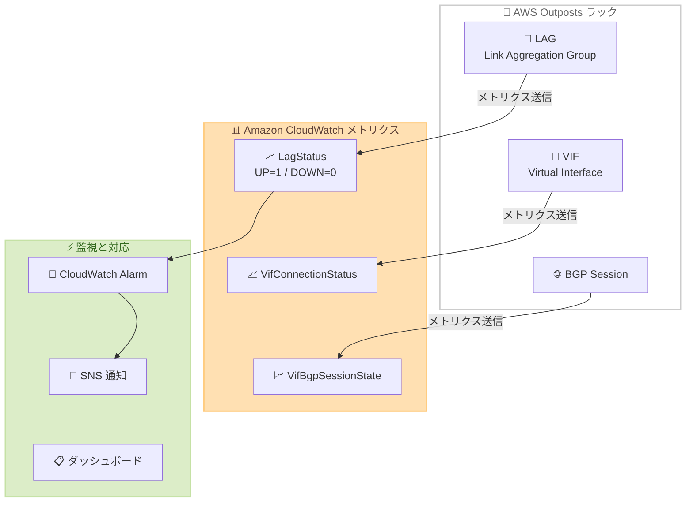

# AWS Outposts - LagStatus CloudWatch メトリクスのサポート

**リリース日**: 2026年4月30日
**サービス**: AWS Outposts
**機能**: LagStatus Amazon CloudWatch メトリクス

📊 [このアップデートのインフォグラフィックを見る](https://takech9203.github.io/aws-news-summary/20260430-aws-outposts-lagstatus-cloudwatch.html)

## 概要

AWS Outposts ラックが LagStatus Amazon CloudWatch メトリクスをサポートするようになった。このメトリクスにより、Outposts の LAG (Link Aggregation Group) 接続状態を CloudWatch コンソールから直接監視できるようになる。

LagStatus メトリクスは、Outposts LAG が運用上 UP (値 "1") か DOWN (値 "0") かを示すシンプルなバイナリメトリクスである。既存の VifConnectionStatus メトリクスおよび VifBgpSessionState メトリクスと組み合わせることで、問題が LAG 構成、BGP ピアリング、または接続の問題のいずれに起因するかを迅速に特定できる。

このアップデートは、すべての AWS 商用リージョンおよび GovCloud リージョンで利用可能である。

**アップデート前の課題**

- Outposts の LAG 接続状態を CloudWatch から直接監視する手段がなかった
- ネットワーク障害発生時に、問題の原因が LAG レベルにあるのか、BGP セッションにあるのか、VIF 接続にあるのかの切り分けが困難だった
- LAG の状態を確認するために別途手動確認や CLI 操作が必要であり、トラブルシューティングに時間がかかっていた

**アップデート後の改善**

- LagStatus メトリクスにより、LAG の UP/DOWN 状態を CloudWatch で直接監視可能になった
- VifConnectionStatus、VifBgpSessionState と組み合わせた階層的な監視により、障害の根本原因を迅速に特定できるようになった
- CloudWatch アラームを設定して LAG 状態の変化を即座に検知し、自動通知や対応が可能になった

## アーキテクチャ図



Outposts ラックの 3 つのネットワークコンポーネント (LAG、VIF、BGP) がそれぞれ対応する CloudWatch メトリクスにデータを送信し、アラームと通知による自動監視を実現する構成を示している。

## サービスアップデートの詳細

### 主要機能

1. **LagStatus メトリクス**
   - Outposts LAG の運用状態を示すバイナリメトリクス
   - 値 "1": LAG が運用上 UP
   - 値 "0": LAG が運用上 DOWN
   - CloudWatch コンソールから直接確認可能

2. **階層的なネットワーク監視**
   - LagStatus: LAG の物理的な接続状態を監視
   - VifConnectionStatus: 仮想インターフェースの接続状態を監視
   - VifBgpSessionState: BGP セッションの状態を監視
   - 3 つのメトリクスの組み合わせにより障害箇所を特定

3. **CloudWatch 統合**
   - CloudWatch コンソールでのメトリクス表示
   - CloudWatch アラームによる自動通知設定が可能
   - ダッシュボードへの組み込みによる統合的な可視化

## 技術仕様

### メトリクス詳細

| 項目 | 詳細 |
|------|------|
| メトリクス名 | LagStatus |
| 名前空間 | AWS/Outposts |
| 値の範囲 | 0 (DOWN) または 1 (UP) |
| 関連メトリクス | VifConnectionStatus、VifBgpSessionState |

### 障害切り分けマトリクス

| LagStatus | VifConnectionStatus | VifBgpSessionState | 推定される問題 |
|-----------|--------------------|--------------------|----------------|
| 0 | - | - | LAG の物理接続またはリンク集約の問題 |
| 1 | 0 | - | VIF 接続の構成問題 |
| 1 | 1 | 0 | BGP ピアリングの問題 |
| 1 | 1 | 1 | 正常 |

## 設定方法

### 前提条件

1. AWS Outposts ラックがデプロイ済みであること
2. CloudWatch へのアクセス権限を持つ IAM ロール/ユーザーがあること
3. Outposts の LAG が構成済みであること

### 手順

#### ステップ 1: CloudWatch コンソールでメトリクスを確認

CloudWatch コンソールにアクセスし、AWS/Outposts 名前空間から LagStatus メトリクスを選択する。

#### ステップ 2: CloudWatch アラームの作成

```bash
aws cloudwatch put-metric-alarm \
  --alarm-name "OutpostsLagDown" \
  --namespace "AWS/Outposts" \
  --metric-name "LagStatus" \
  --statistic "Minimum" \
  --period 60 \
  --threshold 1 \
  --comparison-operator "LessThanThreshold" \
  --evaluation-periods 1 \
  --alarm-actions "arn:aws:sns:us-east-1:123456789012:OutpostsAlerts"
```

LagStatus メトリクスが 1 未満 (つまり 0 = DOWN) になった場合に SNS トピックへ通知するアラームを作成する。

#### ステップ 3: ダッシュボードへの追加

```json
{
  "widgets": [
    {
      "type": "metric",
      "properties": {
        "metrics": [
          ["AWS/Outposts", "LagStatus"],
          ["AWS/Outposts", "VifConnectionStatus"],
          ["AWS/Outposts", "VifBgpSessionState"]
        ],
        "title": "Outposts Network Health",
        "period": 60,
        "stat": "Average"
      }
    }
  ]
}
```

3 つのネットワークメトリクスを 1 つのダッシュボードウィジェットにまとめ、統合的にネットワーク健全性を可視化する。

## メリット

### ビジネス面

- **ダウンタイムの削減**: LAG 障害を即座に検知することで、復旧までの時間を短縮できる
- **運用コストの効率化**: 手動監視の削減と自動アラートにより、運用チームの負荷を軽減できる
- **SLA の遵守**: ネットワーク接続状態のプロアクティブな監視により、SLA 違反のリスクを低減できる

### 技術面

- **障害切り分けの迅速化**: LagStatus、VifConnectionStatus、VifBgpSessionState の 3 層メトリクスにより、問題の原因箇所を即座に特定できる
- **CloudWatch 統合**: 既存の CloudWatch ダッシュボードやアラーム基盤とシームレスに統合できる
- **自動化の実現**: CloudWatch アラームと EventBridge、Lambda を組み合わせた自動復旧ワークフローの構築が可能になる

## デメリット・制約事項

### 制限事項

- メトリクスは LAG の運用状態のみを示し、帯域幅使用率やパケットロスなどの詳細情報は含まない
- LagStatus はバイナリ値のため、部分的な LAG デグレデーション (一部リンクのみダウン) は検知できない可能性がある
- CloudWatch メトリクスの標準的な遅延 (数分程度) が適用される

### 考慮すべき点

- 既存の VifConnectionStatus、VifBgpSessionState メトリクスと組み合わせたアラーム戦略の設計が推奨される
- LAG 冗長構成の場合、個別の LAG ごとにメトリクスを監視する必要がある

## ユースケース

### ユースケース 1: ネットワーク障害の自動検知と通知

**シナリオ**: Outposts 上で本番ワークロードを運用しているチームが、LAG 接続の障害を即座に検知してオンコール担当者に通知したい。

**実装例**:
```bash
aws cloudwatch put-metric-alarm \
  --alarm-name "Outposts-LAG-Down-Critical" \
  --namespace "AWS/Outposts" \
  --metric-name "LagStatus" \
  --statistic "Minimum" \
  --period 60 \
  --threshold 1 \
  --comparison-operator "LessThanThreshold" \
  --evaluation-periods 1 \
  --treat-missing-data "breaching" \
  --alarm-actions "arn:aws:sns:us-east-1:123456789012:PagerDuty-Critical"
```

**効果**: LAG ダウンを 1 分以内に検知し、PagerDuty 経由でオンコール担当者に即座に通知される。

### ユースケース 2: 階層的なネットワーク障害切り分け

**シナリオ**: Outposts への接続に問題が発生した際に、運用チームが問題の原因箇所を迅速に特定したい。

**実装例**:
```json
{
  "widgets": [
    {
      "type": "metric",
      "properties": {
        "metrics": [
          ["AWS/Outposts", "LagStatus", {"label": "LAG Status"}],
          ["AWS/Outposts", "VifConnectionStatus", {"label": "VIF Connection"}],
          ["AWS/Outposts", "VifBgpSessionState", {"label": "BGP Session"}]
        ],
        "title": "Outposts Network Layer Health",
        "period": 60,
        "annotations": {
          "horizontal": [{"value": 1, "label": "Healthy"}]
        }
      }
    }
  ]
}
```

**効果**: 3 つのメトリクスを同一ダッシュボードで比較し、障害箇所を即座に可視化できる。LAG が DOWN で他が N/A なら物理層の問題、LAG が UP で VIF が DOWN なら VIF 構成の問題と判断できる。

### ユースケース 3: 定期的な接続健全性レポート

**シナリオ**: インフラチームが Outposts のネットワーク可用性を週次/月次でレポートしたい。

**実装例**:
```bash
aws cloudwatch get-metric-statistics \
  --namespace "AWS/Outposts" \
  --metric-name "LagStatus" \
  --start-time "2026-04-01T00:00:00Z" \
  --end-time "2026-04-30T23:59:59Z" \
  --period 3600 \
  --statistics "Average" \
  --output json
```

**効果**: 月間の LAG 可用性を数値化し、99.9% 以上の接続時間を維持しているかを客観的に評価できる。

## 料金

LagStatus メトリクスは AWS Outposts の標準メトリクスとして提供される。CloudWatch メトリクスの料金は以下の通り。

### 料金例

| 使用量 | 月額料金 (概算) |
|--------|------------------|
| 標準メトリクス (Outposts 付属) | 追加料金なし |
| CloudWatch アラーム (1 アラーム) | $0.10/月 |
| ダッシュボード (1 ダッシュボード) | $3.00/月 |

## 利用可能リージョン

すべての AWS 商用リージョンおよび AWS GovCloud (US) リージョンで利用可能。

## 関連サービス・機能

- **Amazon CloudWatch**: メトリクスの収集、可視化、アラーム設定の基盤
- **AWS Outposts**: オンプレミス環境で AWS インフラストラクチャを提供するサービス
- **Amazon SNS**: CloudWatch アラームからの通知配信に使用
- **Amazon EventBridge**: メトリクスに基づくイベント駆動型の自動化に活用可能

## 参考リンク

- 📊 [インフォグラフィック](https://takech9203.github.io/aws-news-summary/20260430-aws-outposts-lagstatus-cloudwatch.html)
- [公式発表 (What's New)](https://aws.amazon.com/about-aws/whats-new/2026/04/aws-outposts-lagstatus-cloudwatch/)
- [AWS Outposts ドキュメント](https://docs.aws.amazon.com/outposts/latest/userguide/what-is-outposts.html)
- [CloudWatch Outposts メトリクス](https://docs.aws.amazon.com/outposts/latest/userguide/outposts-cloudwatch-metrics.html)
- [AWS Outposts 料金ページ](https://aws.amazon.com/outposts/pricing/)

## まとめ

AWS Outposts ラックの LagStatus CloudWatch メトリクスにより、Outposts のネットワーク接続状態を CloudWatch から直接監視できるようになった。既存の VifConnectionStatus および VifBgpSessionState メトリクスと組み合わせることで、ネットワーク障害の階層的な切り分けが容易になり、運用チームの障害対応時間の短縮に貢献する。Outposts を本番環境で運用している組織は、早期にアラーム設定とダッシュボードの構築を推奨する。
