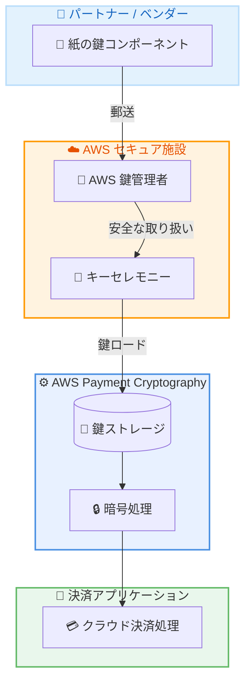

# AWS Payment Cryptography - Physical Key Exchange

**リリース日**: 2026年4月30日
**サービス**: AWS Payment Cryptography
**機能**: Physical Key Exchange (紙ベース暗号鍵交換)

📊 [このアップデートのインフォグラフィックを見る](https://takech9203.github.io/aws-news-summary/20260430-aws-payment-cryptography.html)

## 概要

AWS Payment Cryptography が Physical Key Exchange (紙ベースの暗号鍵交換) をサポートした。これは PCI PIN および P2PE に準拠した新機能であり、自社でセキュアな鍵ロード用インフラストラクチャを維持することなく、紙ベースの暗号鍵交換を実行できるようになる。

電子的な鍵交換が推奨されるものの、パートナーやベンダーが電子的な鍵交換に対応していない場合がある。Physical Key Exchange は、そのような状況でも暗号鍵の交換を可能にし、クラウドへの移行を加速するための選択肢を提供する。紙の鍵コンポーネントは訓練を受けた AWS の鍵管理者に送付され、PCI PIN および P2PE の物理的・論理的セキュリティ要件を満たす AWS 運営のセキュア施設でキーセレモニーが実施される。

**アップデート前の課題**

- 電子鍵交換に対応していないカウンターパーティとの鍵交換のために、自社で HSM (Hardware Security Module) と KLD (Key Loading Device) を維持する必要があった
- 年に数回しか発生しない鍵交換のためにコストのかかるインフラストラクチャを運用する必要があった
- PCI PIN および P2PE 準拠の物理セキュリティ環境を自社で維持・管理する負担があった

**アップデート後の改善**

- 自社で HSM や KLD を維持する必要がなくなった
- AWS が運営するセキュア施設でキーセレモニーが実施されるため、物理セキュリティ環境の自社管理が不要になった
- 紙ベースの鍵交換プロセスが AWS のマネージドサービスとして提供され、運用負担が大幅に軽減された

## アーキテクチャ図



Physical Key Exchange の処理フローを示す。パートナーから送付された紙の鍵コンポーネントが AWS の鍵管理者によって受領され、セキュア施設でキーセレモニーが実施された後、AWS Payment Cryptography に鍵がロードされて暗号処理に利用可能になる。

## サービスアップデートの詳細

### 主要機能

1. **Physical Key Exchange**
   - PCI PIN および P2PE 準拠の紙ベース暗号鍵交換機能
   - 電子鍵交換に対応していないパートナーとの鍵交換を実現
   - AWS が運営するセキュア施設での安全なキーセレモニーの実施

2. **リソースベースポリシー**
   - AWS Payment Cryptography の鍵にリソースベースポリシーを設定可能
   - クロスアカウントでの鍵共有を実現
   - PutResourcePolicy / GetResourcePolicy / DeleteResourcePolicy API の追加

3. **Multi-Party Approval (MPA) チーム連携**
   - ルート公開鍵のインポート操作を保護するための MPA チーム連携 API
   - AssociateMpaTeam / DisassociateMpaTeam / GetMpaTeamAssociation API の追加
   - 機密性の高い操作に対する承認ワークフローの実装

## 技術仕様

### コンプライアンス準拠

| 項目 | 詳細 |
|------|------|
| PCI PIN | 準拠 (物理的・論理的セキュリティ要件) |
| P2PE | 準拠 (Point-to-Point Encryption) |
| 鍵管理者 | AWS の訓練を受けた専門スタッフ |
| 施設 | AWS 運営のセキュア施設 |

### API 変更履歴

| 日付 | サービス | 変更内容 |
|------|----------|----------|
| 2026/04/30 | [Payment Cryptography Control Plane](https://awsapichanges.com/archive/changes/7084f0-controlplane.payment-cryptography.html) | 6 new 9 updated api methods - リソースベースポリシーおよび MPA チーム連携 API の追加 |

### 新規 API メソッド

```
PutResourcePolicy         - 鍵にリソースベースポリシーを設定
GetResourcePolicy         - リソースベースポリシーを取得
DeleteResourcePolicy      - リソースベースポリシーを削除
AssociateMpaTeam          - MPA チームをアクションに関連付け
DisassociateMpaTeam       - MPA チームの関連付けを解除
GetMpaTeamAssociation     - MPA チームの関連付け状態を取得
```

### 更新された API メソッド

既存のメソッド (CreateKey, DeleteKey, GetKey, ImportKey, RestoreKey, StartKeyUsage, StopKeyUsage, AddKeyReplicationRegions, RemoveKeyReplicationRegions) に MpaStatus フィールドが追加された。

```json
{
  "MpaStatus": {
    "MpaSessionArn": "string",
    "Status": "PENDING | APPROVED | FAILED | CANCELLED",
    "InitiationDate": "timestamp",
    "StatusMessage": "string"
  }
}
```

## 設定方法

### 前提条件

1. AWS アカウントを保有していること
2. AWS Payment Cryptography が利用可能なリージョンであること
3. 電子鍵交換に対応していないパートナーとの鍵交換が必要であること

### 手順

#### ステップ 1: AWS サポートケースの作成

```bash
# AWS CLI でサポートケースを作成 (AWS Support API を使用)
aws support create-case \
  --subject "Physical Key Exchange Request" \
  --communication-body "Physical Key Exchange を利用した紙ベース鍵交換のリクエスト" \
  --service-code "payment-cryptography" \
  --category-code "general-guidance"
```

Physical Key Exchange を利用するには、AWS サポートケースを作成するか、AWS アカウントチームに連絡する。

#### ステップ 2: リソースベースポリシーの設定 (クロスアカウント共有の場合)

```bash
# 鍵にリソースベースポリシーを設定
aws payment-cryptography put-resource-policy \
  --resource-arn "arn:aws:payment-cryptography:us-east-1:123456789012:key/example-key-id" \
  --policy '{"Version":"2012-10-17","Statement":[{"Effect":"Allow","Principal":{"AWS":"arn:aws:iam::987654321098:root"},"Action":["payment-cryptography:UseKey"],"Resource":"*"}]}'
```

クロスアカウントで鍵を共有する場合に、リソースベースポリシーを使用してアクセスを許可する。

#### ステップ 3: MPA チームの関連付け (オプション)

```bash
# MPA チームをルート公開鍵インポート操作に関連付け
aws payment-cryptography associate-mpa-team \
  --action "IMPORT_ROOT_PUBLIC_KEY_CERTIFICATE" \
  --mpa-team-arn "arn:aws:mpa:us-east-1:123456789012:team/example-team-id" \
  --requester-comment "Physical Key Exchange 用のルート公開鍵インポートに MPA を適用"
```

機密性の高い鍵インポート操作に対して Multi-Party Approval を有効にし、承認ワークフローを追加する。

## メリット

### ビジネス面

- **インフラコスト削減**: HSM および KLD の購入・維持コストが不要になり、年に数回の利用に対する過剰投資を解消
- **移行の加速**: 電子鍵交換に対応していないパートナーとの鍵交換もクラウドで実行可能になり、決済システムの AWS 移行を促進
- **コンプライアンス負担の軽減**: PCI PIN / P2PE 準拠の物理セキュリティ環境の維持管理を AWS に委任

### 技術面

- **運用簡素化**: キーセレモニーの物理的プロセスを AWS の専門スタッフに委任し、運用負担を削減
- **セキュリティ強化**: AWS のセキュア施設と訓練を受けた鍵管理者による安全な鍵取り扱い
- **クロスアカウント共有**: リソースベースポリシーによる柔軟な鍵の共有が可能

## デメリット・制約事項

### 制限事項

- Physical Key Exchange の利用開始には AWS サポートケースの作成またはアカウントチームへの連絡が必要 (セルフサービスではない)
- 紙の鍵コンポーネントの物理的な送付が必要なため、電子鍵交換と比較してリードタイムが長い
- 電子鍵交換が利用可能な場合はそちらが推奨される

### 考慮すべき点

- パートナーが将来的に電子鍵交換に対応する場合は、移行計画を策定することが望ましい
- キーセレモニーのスケジュール調整が必要になる可能性がある

## ユースケース

### ユースケース 1: レガシー決済ネットワークとの接続

**シナリオ**: 大手銀行が AWS に決済システムを移行したいが、一部の決済ネットワークパートナーが電子鍵交換に対応しておらず、紙ベースでの鍵交換を要求している。

**実装例**:
```
1. AWS サポートケースで Physical Key Exchange をリクエスト
2. パートナーから紙の鍵コンポーネントを AWS セキュア施設に送付
3. AWS 鍵管理者がキーセレモニーを実施して鍵をロード
4. ロードされた鍵を使用して決済処理を開始
```

**効果**: 自社で HSM / KLD を維持することなく、レガシーパートナーとの鍵交換を完了し、クラウド移行を実現

### ユースケース 2: カード発行会社の鍵管理統合

**シナリオ**: カード発行会社が複数のベンダーとの鍵交換を行っているが、一部のベンダーは紙ベースの鍵交換のみ対応しており、専用の HSM 設備を維持している。

**実装例**:
```
1. 電子鍵交換対応ベンダー: ImportKey API で TR-34 / TR-31 鍵ブロックを使用
2. 紙ベースのみ対応ベンダー: Physical Key Exchange を利用
3. リソースベースポリシーでクロスアカウント鍵共有を設定
4. MPA チーム連携でルート公開鍵インポートの承認ワークフローを実装
```

**効果**: すべてのベンダーとの鍵交換を AWS Payment Cryptography に統合し、自社の HSM 設備を廃止

### ユースケース 3: POS 端末管理会社のクラウド化

**シナリオ**: POS 端末管理会社が P2PE 準拠の鍵注入サービスを提供しており、一部の端末メーカーが紙ベースでの鍵コンポーネント交換を要求している。

**実装例**:
```
1. Physical Key Exchange で端末メーカーから紙の鍵コンポーネントを受領
2. AWS 施設でキーセレモニーを実施して鍵をロード
3. ロードされた鍵から派生鍵を生成し、端末への鍵注入に使用
4. P2PE 監査で AWS Payment Cryptography のコンプライアンスレポートを活用
```

**効果**: P2PE 準拠環境の自社維持が不要になり、端末管理サービスのコスト構造を改善

## 料金

AWS Payment Cryptography の Physical Key Exchange に関する具体的な追加料金については、[料金ページ](https://aws.amazon.com/payment-cryptography/pricing/)を参照。基本的な AWS Payment Cryptography の料金体系に基づいて課金される。

### 料金例

| 項目 | 料金 |
|------|------|
| アクティブな鍵 (月額) | 料金ページを参照 |
| 暗号処理 API コール | 料金ページを参照 |
| Physical Key Exchange | AWS サポートまたはアカウントチームに確認 |

## 利用可能リージョン

AWS Payment Cryptography が利用可能なリージョンで Physical Key Exchange を利用可能。具体的なリージョンについては [AWS Payment Cryptography のドキュメント](https://docs.aws.amazon.com/payment-cryptography/latest/userguide/)を参照。

## 関連サービス・機能

- **AWS KMS (Key Management Service)**: 汎用的な暗号鍵管理サービス。Payment Cryptography は決済業界特化の鍵管理を提供
- **AWS CloudHSM**: 専用 HSM クラスター。Physical Key Exchange は HSM の自社管理を不要にする代替手段
- **AWS Multi-Party Approval**: 機密操作に対する承認ワークフロー。Payment Cryptography のルート公開鍵インポートの保護に統合

## 参考リンク

- 📊 [インフォグラフィック](https://takech9203.github.io/aws-news-summary/20260430-aws-payment-cryptography.html)
- [公式発表 (What's New)](https://aws.amazon.com/about-aws/whats-new/2026/05/aws-payment-cryptography/)
- [Physical Key Exchange ドキュメント](https://docs.aws.amazon.com/payment-cryptography/latest/userguide/keys-physicalkeyexchange.html)
- [鍵のインポート・エクスポート ドキュメント](https://docs.aws.amazon.com/payment-cryptography/latest/userguide/keys-importexport.html)
- [料金ページ](https://aws.amazon.com/payment-cryptography/pricing/)
- [AWS Payment Cryptography サービスページ](https://aws.amazon.com/payment-cryptography/)

## まとめ

AWS Payment Cryptography の Physical Key Exchange は、電子鍵交換に対応していないパートナーとの暗号鍵交換を AWS マネージドサービスとして実現する機能である。これにより、年に数回しか使用しない HSM や KLD の維持コストを削減し、決済システムのクラウド移行を加速できる。決済業界で紙ベースの鍵交換が残存している組織は、この機能を活用して自社のセキュリティインフラの運用負担を軽減することを推奨する。
