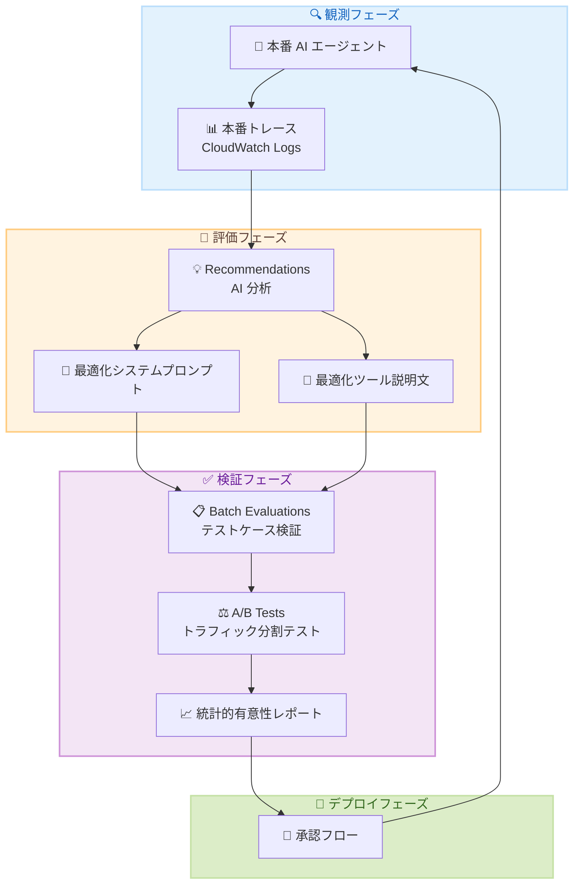

# Amazon Bedrock AgentCore - エージェントパフォーマンス最適化機能

**リリース日**: 2026 年 4 月 30 日
**サービス**: Amazon Bedrock AgentCore
**機能**: Recommendations、Batch Evaluations、A/B Tests (プレビュー)

📊 [このアップデートのインフォグラフィックを見る](https://takech9203.github.io/aws-news-summary/20260430-bedrock-agentcore-optimization-preview.html)

## 概要

Amazon Bedrock AgentCore が、本番環境で稼働する AI エージェントのパフォーマンスを最適化するための 3 つの新機能をプレビューとしてリリースしました。Recommendations (推奨)、Batch Evaluations (バッチ評価)、A/B Tests (A/B テスト) の 3 機能により、「観測 (Observe) - 評価 (Evaluate) - 改善 (Improve)」のループが完成します。

Recommendations 機能は、本番環境のトレースと評価結果を分析し、最適化されたシステムプロンプトやツールの説明文を AI が自動生成します。Batch Evaluations は、事前定義されたテストケースに対して推奨内容を検証します。A/B Tests は、制御されたトラフィック分割による本番トラフィックでの統計的に有意な検証を実現します。すべての推奨は、本番適用前に承認が必要です。

**アップデート前の課題**

- 本番環境で稼働する AI エージェントのシステムプロンプトやツール説明文の最適化は、開発者の手動作業に依存していた
- プロンプトの変更が実際のパフォーマンスにどの程度影響するか、統計的に検証する仕組みがなかった
- 本番トレースから改善点を体系的に抽出し、安全に検証してデプロイするワークフローが存在しなかった

**アップデート後の改善**

- AI が本番トレースを分析し、最適化されたシステムプロンプトやツール説明文を自動で推奨するようになった
- バッチ評価と A/B テストにより、推奨内容を統計的に有意な方法で検証できるようになった
- 承認フローを含む安全な改善サイクルにより、本番環境のエージェント品質を継続的に向上できるようになった

## アーキテクチャ図



「観測 - 評価 - 改善」ループの全体フローを示しています。本番トレースの収集から AI による推奨生成、バッチ評価と A/B テストによる検証、承認後のデプロイまでの一連のサイクルを表現しています。

## サービスアップデートの詳細

### 主要機能

1. **Recommendations (推奨)**
   - 本番環境のトレースと評価出力を AI が分析
   - 最適化されたシステムプロンプトを自動生成 (`SYSTEM_PROMPT_RECOMMENDATION`)
   - 最適化されたツール説明文を自動生成 (`TOOL_DESCRIPTION_RECOMMENDATION`)
   - CloudWatch Logs からのトレースデータを入力として使用
   - Configuration Bundle との統合により、バージョン管理された設定変更を提案

2. **Batch Evaluations (バッチ評価)**
   - 複数のエージェントセッションに対して評価器を一括実行
   - サーバーサイドオーケストレーションによる効率的な処理
   - 事前定義されたテストケース (Ground Truth) に対する検証
   - アサーション、期待されるツール呼び出し軌跡、ターンごとの期待応答をサポート
   - 評価結果のサマリー統計 (平均スコア、完了/失敗セッション数) を提供

3. **A/B Tests (A/B テスト)**
   - Gateway を通じた制御されたトラフィック分割
   - 重み付きバリアント設定によるトラフィック配分
   - リアルタイムの統計的有意性レポート (p 値、信頼区間)
   - 事前定義テストセットまたはライブ本番トラフィックでの検証
   - 実行ステータス管理 (PAUSED、RUNNING、STOPPED)

## 技術仕様

### 新規 API メソッド

| カテゴリ | メソッド名 | 説明 |
|----------|-----------|------|
| Recommendations | `StartRecommendation` | 推奨の生成を開始 |
| Recommendations | `GetRecommendation` | 推奨の詳細と結果を取得 |
| Recommendations | `ListRecommendations` | 推奨の一覧を取得 |
| Recommendations | `DeleteRecommendation` | 推奨を削除 |
| Batch Evaluations | `StartBatchEvaluation` | バッチ評価を開始 |
| Batch Evaluations | `GetBatchEvaluation` | バッチ評価の詳細を取得 |
| Batch Evaluations | `ListBatchEvaluations` | バッチ評価の一覧を取得 |
| Batch Evaluations | `StopBatchEvaluation` | 実行中のバッチ評価を停止 |
| Batch Evaluations | `DeleteBatchEvaluation` | バッチ評価を削除 |
| A/B Tests | `CreateABTest` | A/B テストを作成 |
| A/B Tests | `GetABTest` | A/B テストの詳細と結果を取得 |
| A/B Tests | `UpdateABTest` | A/B テストの設定を更新 |
| A/B Tests | `ListABTests` | A/B テストの一覧を取得 |
| A/B Tests | `DeleteABTest` | A/B テストを削除 |

### API 変更履歴

| 日付 | サービス | 変更内容 |
|------|----------|----------|
| 2026/04/29 | [Amazon Bedrock AgentCore](https://awsapichanges.com/archive/changes/05dafe-bedrock-agentcore.html) | 14 new api methods - バッチ評価、推奨、A/B テスト機能の追加 |
| 2026/04/29 | [Amazon Bedrock AgentCore Control](https://awsapichanges.com/archive/changes/05dafe-bedrock-agentcore-control.html) | 12 new 12 updated api methods - 同上に加え Configuration Bundle、Gateway Rule の追加 |

### Recommendation の設定

```json
{
  "name": "optimize-system-prompt",
  "type": "SYSTEM_PROMPT_RECOMMENDATION",
  "recommendationConfig": {
    "systemPromptRecommendationConfig": {
      "systemPrompt": {
        "configurationBundle": {
          "bundleArn": "arn:aws:bedrock:us-east-1:123456789012:configuration-bundle/my-bundle",
          "versionId": "v1",
          "systemPromptJsonPath": "$.systemPrompt"
        }
      },
      "agentTraces": {
        "cloudwatchLogs": {
          "logGroupArns": ["arn:aws:logs:us-east-1:123456789012:log-group:/aws/agentcore/my-agent"],
          "serviceNames": ["my-agent-service"],
          "startTime": "2026-04-01T00:00:00Z",
          "endTime": "2026-04-30T00:00:00Z"
        }
      },
      "evaluationConfig": {
        "evaluators": [
          {"evaluatorArn": "arn:aws:bedrock:us-east-1:123456789012:evaluator/quality-eval"}
        ]
      }
    }
  }
}
```

### A/B テストの設定

```json
{
  "name": "prompt-optimization-test",
  "gatewayArn": "arn:aws:bedrock:us-east-1:123456789012:gateway/my-gateway",
  "variants": [
    {
      "name": "control",
      "weight": 50,
      "variantConfiguration": {
        "configurationBundle": {
          "bundleArn": "arn:aws:bedrock:us-east-1:123456789012:configuration-bundle/current",
          "bundleVersion": "v1"
        }
      }
    },
    {
      "name": "treatment",
      "weight": 50,
      "variantConfiguration": {
        "configurationBundle": {
          "bundleArn": "arn:aws:bedrock:us-east-1:123456789012:configuration-bundle/recommended",
          "bundleVersion": "v2"
        }
      }
    }
  ],
  "evaluationConfig": {
    "onlineEvaluationConfigArn": "arn:aws:bedrock:us-east-1:123456789012:evaluation-config/online"
  },
  "enableOnCreate": true
}
```

## 設定方法

### 前提条件

1. Amazon Bedrock AgentCore が利用可能なリージョンの AWS アカウント
2. AgentCore Evaluations が設定済みであること
3. 本番環境のエージェントが CloudWatch Logs にトレースを出力していること
4. 適切な IAM 権限 (AgentCore API へのアクセス)

### 手順

#### ステップ 1: 評価器の作成

```bash
aws bedrock-agentcore-control create-evaluator \
  --evaluator-name "quality-evaluator" \
  --evaluator-config '{
    "llmAsAJudge": {
      "instructions": "Evaluate the agent response quality...",
      "ratingScale": {
        "numerical": [
          {"definition": "Poor", "value": 1.0, "label": "Poor"},
          {"definition": "Good", "value": 3.0, "label": "Good"},
          {"definition": "Excellent", "value": 5.0, "label": "Excellent"}
        ]
      },
      "modelConfig": {
        "bedrockEvaluatorModelConfig": {
          "modelId": "anthropic.claude-sonnet-4-20250514"
        }
      }
    }
  }' \
  --level SESSION
```

LLM-as-a-Judge 方式またはコードベースの Lambda 評価器を作成します。評価レベルはツール呼び出し単位、トレース単位、セッション単位から選択できます。

#### ステップ 2: 推奨の生成

```bash
aws bedrock-agentcore start-recommendation \
  --name "system-prompt-optimization" \
  --type SYSTEM_PROMPT_RECOMMENDATION \
  --recommendation-config '{
    "systemPromptRecommendationConfig": {
      "systemPrompt": {
        "text": "You are a helpful assistant..."
      },
      "agentTraces": {
        "cloudwatchLogs": {
          "serviceNames": ["my-agent"],
          "startTime": "2026-04-01T00:00:00Z",
          "endTime": "2026-04-30T00:00:00Z"
        }
      }
    }
  }'
```

本番トレースを基に、AI が最適化されたシステムプロンプトまたはツール説明文を生成します。

#### ステップ 3: バッチ評価による検証

```bash
aws bedrock-agentcore start-batch-evaluation \
  --batch-evaluation-name "validate-recommendation" \
  --evaluators '[{"evaluatorId": "eval-12345"}]' \
  --data-source-config '{
    "cloudWatchLogs": {
      "serviceNames": ["my-agent"],
      "filterConfig": {
        "timeRange": {
          "startTime": "2026-04-28T00:00:00Z",
          "endTime": "2026-04-30T00:00:00Z"
        }
      }
    }
  }'
```

推奨された変更を事前定義されたテストケースに対して評価し、品質が向上することを確認します。

#### ステップ 4: A/B テストによる本番検証

```bash
aws bedrock-agentcore create-ab-test \
  --name "prompt-ab-test" \
  --gateway-arn "arn:aws:bedrock:us-east-1:123456789012:gateway/my-gw" \
  --variants '[
    {"name": "control", "weight": 70, "variantConfiguration": {"configurationBundle": {"bundleArn": "arn:...", "bundleVersion": "v1"}}},
    {"name": "treatment", "weight": 30, "variantConfiguration": {"configurationBundle": {"bundleArn": "arn:...", "bundleVersion": "v2"}}}
  ]' \
  --enable-on-create
```

本番トラフィックの一部を新しい設定にルーティングし、統計的有意性が確認されるまでテストを実行します。

## メリット

### ビジネス面

- **継続的な品質向上**: 本番データに基づく自動最適化により、エージェントの応答品質が継続的に改善される
- **リスク軽減**: 承認フローと段階的検証により、本番障害のリスクを最小化しながら改善を実施できる
- **運用コスト削減**: プロンプトエンジニアリングの手動作業を AI が代替し、開発者の工数を削減できる

### 技術面

- **データドリブン最適化**: 本番トレースに基づく客観的な分析により、直感ではなくデータに基づいた改善が可能
- **統計的検証**: A/B テストによる p 値と信頼区間の算出により、改善効果の統計的有意性を確認できる
- **バージョン管理統合**: Configuration Bundle によるプロンプト・ツール設定の版管理とブランチ管理を実現

## デメリット・制約事項

### 制限事項

- プレビュー段階であり、一般提供 (GA) までに仕様変更の可能性がある
- AgentCore Evaluations が利用可能なリージョンでのみ利用可能
- 推奨の生成には十分な本番トレースデータが必要であり、トラフィックが少ないエージェントでは効果が限定的な可能性がある

### 考慮すべき点

- A/B テストのトラフィック分割は Gateway を経由するため、Gateway の設定が前提となる
- 統計的有意性を得るためには一定量のトラフィックと期間が必要
- 推奨が必ずしも改善につながるとは限らないため、バッチ評価での検証を省略しないことが重要

## ユースケース

### ユースケース 1: カスタマーサポートエージェントのプロンプト最適化

**シナリオ**: カスタマーサポート用 AI エージェントの解決率が低下しているが、プロンプトのどの部分を改善すべきか特定が困難な状況。

**実装例**:
```bash
# 過去 30 日間のトレースから推奨を生成
aws bedrock-agentcore start-recommendation \
  --name "support-agent-prompt-v2" \
  --type SYSTEM_PROMPT_RECOMMENDATION \
  --recommendation-config '{
    "systemPromptRecommendationConfig": {
      "systemPrompt": {"text": "現在のシステムプロンプト..."},
      "agentTraces": {
        "cloudwatchLogs": {
          "serviceNames": ["support-agent"],
          "startTime": "2026-04-01T00:00:00Z",
          "endTime": "2026-04-30T00:00:00Z",
          "rule": {
            "filters": [{"key": "evaluation.score", "operator": "LessThan", "value": {"doubleValue": 3.0}}]
          }
        }
      }
    }
  }'
```

**効果**: 低スコアのセッションを重点的に分析し、改善すべきプロンプトの要素を特定。バッチ評価で検証後、A/B テストで本番適用前に効果を確認。

### ユースケース 2: ツール選択精度の向上

**シナリオ**: マルチツールエージェントで、ツールの選択ミスが頻発しており、ツール説明文の改善が必要な状況。

**実装例**:
```bash
# ツール説明文の推奨を生成
aws bedrock-agentcore start-recommendation \
  --name "tool-description-optimization" \
  --type TOOL_DESCRIPTION_RECOMMENDATION \
  --recommendation-config '{
    "toolDescriptionRecommendationConfig": {
      "toolDescription": {
        "toolDescriptionText": {
          "tools": [
            {"toolName": "search_orders", "toolDescription": {"text": "現在の説明文..."}},
            {"toolName": "update_status", "toolDescription": {"text": "現在の説明文..."}}
          ]
        }
      },
      "agentTraces": {
        "cloudwatchLogs": {
          "serviceNames": ["multi-tool-agent"],
          "startTime": "2026-04-01T00:00:00Z",
          "endTime": "2026-04-30T00:00:00Z"
        }
      }
    }
  }'
```

**効果**: AI がトレースからツール選択エラーのパターンを分析し、各ツールの説明文をより明確で区別しやすい形に最適化。

### ユースケース 3: 段階的ロールアウトによる安全なデプロイ

**シナリオ**: 推奨されたプロンプト変更を本番環境に安全に適用したい。段階的にトラフィックを移行しながら効果を検証する。

**実装例**:
```bash
# 10% のトラフィックで A/B テスト開始
aws bedrock-agentcore create-ab-test \
  --name "gradual-rollout" \
  --gateway-arn "arn:aws:bedrock:us-east-1:123456789012:gateway/prod-gw" \
  --variants '[
    {"name": "current", "weight": 90, "variantConfiguration": {"configurationBundle": {"bundleArn": "arn:...", "bundleVersion": "v1"}}},
    {"name": "optimized", "weight": 10, "variantConfiguration": {"configurationBundle": {"bundleArn": "arn:...", "bundleVersion": "v2"}}}
  ]' \
  --enable-on-create

# 結果確認後、トラフィック比率を変更
aws bedrock-agentcore update-ab-test \
  --ab-test-id "abt-12345" \
  --variants '[
    {"name": "current", "weight": 50, "variantConfiguration": {"configurationBundle": {"bundleArn": "arn:...", "bundleVersion": "v1"}}},
    {"name": "optimized", "weight": 50, "variantConfiguration": {"configurationBundle": {"bundleArn": "arn:...", "bundleVersion": "v2"}}}
  ]'
```

**効果**: 統計的有意性 (p 値、信頼区間) が確認されるまで段階的にトラフィックを増やし、リスクを最小化しながら本番デプロイを実行。

## 料金

プレビュー期間中の料金は公式に発表されていません。GA 後の料金体系については、Amazon Bedrock AgentCore の料金ページを参照してください。

## 利用可能リージョン

AgentCore Evaluations が利用可能なすべての AWS リージョンで利用可能です。

## 関連サービス・機能

- **Amazon Bedrock AgentCore Evaluations**: エージェントの品質評価基盤。今回の最適化機能の前提となるサービス
- **Amazon Bedrock AgentCore Gateway**: A/B テストのトラフィック分割に使用。Configuration Bundle のルーティングを管理
- **Amazon CloudWatch Logs**: 本番エージェントのトレースデータの保存先。推奨生成のデータソース
- **Amazon Bedrock AgentCore Configuration Bundle**: プロンプトやツール設定のバージョン管理。推奨結果の保存先

## 参考リンク

- 📊 [インフォグラフィック](https://takech9203.github.io/aws-news-summary/20260430-bedrock-agentcore-optimization-preview.html)
- [公式発表 (What's New)](https://aws.amazon.com/about-aws/whats-new/2026/05/bedrock-agentcore-optimization-preview/)
- [Amazon Bedrock AgentCore ドキュメント](https://docs.aws.amazon.com/bedrock/latest/userguide/agentcore.html)
- [Amazon Bedrock 料金ページ](https://aws.amazon.com/bedrock/pricing/)

## まとめ

Amazon Bedrock AgentCore の最適化機能プレビューは、本番環境の AI エージェントに対する「観測 - 評価 - 改善」のフルサイクルを実現する重要なアップデートです。AI による推奨生成、バッチ評価による検証、A/B テストによる統計的検証、承認フローによる安全なデプロイという一連のワークフローにより、エージェントの品質を継続的かつ安全に向上できます。プレビュー段階での検証を開始し、GA 後の本格活用に備えることを推奨します。
