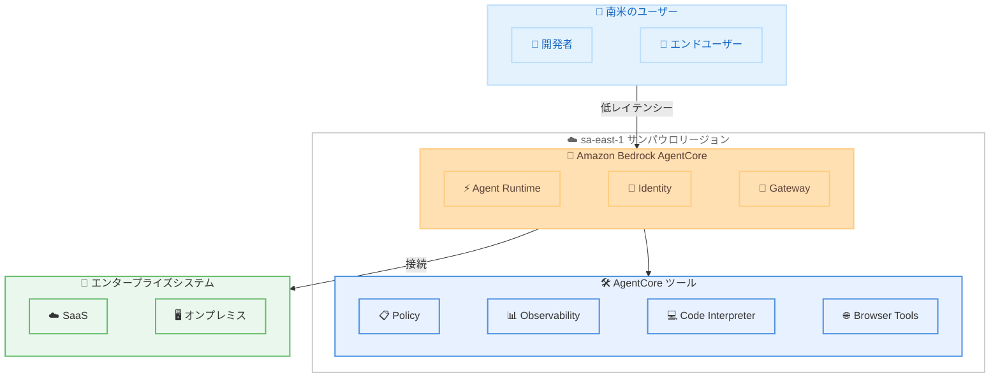

# Amazon Bedrock AgentCore - 南米サンパウロリージョンでの提供開始

**リリース日**: 2026 年 5 月 1 日
**サービス**: Amazon Bedrock AgentCore
**機能**: 南米サンパウロリージョン展開

📊 [このアップデートのインフォグラフィックを見る](https://takech9203.github.io/aws-news-summary/20260501-agentcore-sao-paulo-region.html)

## 概要

Amazon Bedrock AgentCore が AWS 南米 (サンパウロ) リージョン (sa-east-1) で利用可能になりました。AgentCore は AI エージェントの構築、接続、最適化を行うためのプラットフォームであり、エンジニアが任意のフレームワークとモデルを使用してエージェントを迅速に開発し、エンタープライズシステムやツールに接続し、継続的に最適化するための機能を提供します。インフラストラクチャレイヤーでセキュリティが強制されるため、エージェントがセキュリティ制御をバイパスすることはできません。

今回のリージョン拡大により、南米のお客様はエンドユーザーに近い場所でエージェントをデプロイおよび運用できるようになり、レイテンシーの削減とデータレジデンシー要件への対応が可能になります。サンパウロリージョンでのローンチ時点で、Agent Runtime、Identity、Gateway、Policy、Observability、Code Interpreter、Browser Tools のすべての AgentCore 機能が利用可能です。

この展開は、ブラジルおよび南米全域で AI エージェントソリューションを構築する開発者、データ主権要件を持つ組織、およびエンドユーザーに低レイテンシーの体験を提供したい企業を対象としています。

**アップデート前の課題**

- 南米のお客様は AgentCore を利用するために他リージョンにアクセスする必要があり、レイテンシーが高かった
- ブラジルの LGPD (Lei Geral de Protecao de Dados) などのデータレジデンシー要件を満たしながら AgentCore を使用することが困難だった
- 南米のエンドユーザー向けエージェントアプリケーションの応答時間が、リージョン間通信により遅延していた

**アップデート後の改善**

- 南米リージョンでエージェントをローカルにデプロイでき、レイテンシーが大幅に削減された
- データがサンパウロリージョン内に保持されるため、ブラジルのデータ保護法への準拠が容易になった
- AgentCore の全機能がサンパウロリージョンで利用可能となり、機能制限なくエージェントを構築できるようになった

## アーキテクチャ図



サンパウロリージョンにデプロイされた AgentCore の全コンポーネントと、南米のユーザーおよびエンタープライズシステムとの接続関係を示しています。

## サービスアップデートの詳細

### 主要機能

1. **Agent Runtime**
   - 任意のフレームワークとモデルでエージェントを実行するためのマネージドランタイム環境
   - コンテナベースのデプロイをサポートし、カスタムエージェントコードの実行が可能
   - セッション管理、ライフサイクル管理、VPC ネットワーク構成をサポート

2. **Identity**
   - エージェントの認証・認可を管理するサービス
   - OAuth 2.0 クレデンシャルプロバイダー、API キー、IAM ベースの認証をサポート
   - On-Behalf-Of (OBO) トークン交換により、ユーザーに代わったセキュアなリソースアクセスが可能

3. **Gateway**
   - エージェントと外部ツール・サービスを接続するゲートウェイ
   - MCP サーバー、OpenAPI、Lambda、API Gateway など多様なターゲットタイプをサポート
   - プライベートエンドポイントによる VPC 内のセキュアな接続

4. **Policy**
   - エージェントの動作を制御するポリシーエンジン
   - インフラストラクチャレイヤーでのセキュリティ強制
   - エージェントがバイパスできないガードレールの適用

5. **Observability**
   - エージェントの動作を監視・トレースする機能
   - パフォーマンスメトリクスとログの収集
   - 継続的な最適化のためのインサイト提供

6. **Code Interpreter**
   - エージェントがコードを安全に実行するためのサンドボックス環境
   - データ分析、計算、ファイル処理などのタスクをサポート

7. **Browser Tools**
   - エージェントが Web ブラウザを操作するための機能
   - カスタム Chrome 拡張機能のサポート
   - セキュアなブラウザセッション管理

## 技術仕様

### リージョン情報

| 項目 | 詳細 |
|------|------|
| リージョン名 | 南米 (サンパウロ) |
| リージョンコード | sa-east-1 |
| 利用可能な機能 | Agent Runtime、Identity、Gateway、Policy、Observability、Code Interpreter、Browser Tools |
| ローンチ日 | 2026 年 5 月 1 日 |

### API 変更履歴

| 日付 | サービス | 変更内容 |
|------|----------|----------|
| 2026/04/30 | [Amazon Bedrock AgentCore Control](https://awsapichanges.com/archive/changes/7084f0-bedrock-agentcore-control.html) | 14 updated methods - Identity の OBO トークン交換 OAuth2 サポート、Memory のメタデータサポート追加 |

### データレジデンシー

サンパウロリージョンでの AgentCore 利用により、以下のデータ保護要件への対応が容易になります。

- **LGPD (Lei Geral de Protecao de Dados)**: ブラジルの一般データ保護法。個人データのブラジル国内での処理・保存を推奨
- **データローカリティ**: エージェントの処理データがサンパウロリージョン内に保持される
- **規制コンプライアンス**: 金融、ヘルスケアなどの規制業界向けにデータ主権要件を充足

## 設定方法

### 前提条件

1. AWS アカウントが sa-east-1 リージョンで有効であること
2. AgentCore を使用するための適切な IAM 権限が設定されていること
3. 使用するモデルがサンパウロリージョンで利用可能であること

### 手順

#### ステップ 1: リージョンの選択

```bash
# AWS CLI でサンパウロリージョンを指定
export AWS_DEFAULT_REGION=sa-east-1
```

サンパウロリージョンをデフォルトリージョンとして設定します。

#### ステップ 2: AgentCore Runtime の作成

```bash
# AgentCore Agent Runtime を作成
aws bedrock-agentcore-control create-harness \
  --harness-name "my-agent-saopaulo" \
  --execution-role-arn "arn:aws:iam::123456789012:role/AgentCoreRole" \
  --region sa-east-1
```

サンパウロリージョンで新しい AgentCore ランタイム環境を作成します。

#### ステップ 3: Gateway の設定

```bash
# Gateway を作成してツールを接続
aws bedrock-agentcore-control create-gateway \
  --gateway-name "my-gateway-saopaulo" \
  --region sa-east-1
```

エージェントが外部ツールやサービスに接続するための Gateway を作成します。

## メリット

### ビジネス面

- **レイテンシー削減**: 南米のエンドユーザーに対して、リージョン内通信により応答時間が大幅に改善される
- **データレジデンシー準拠**: LGPD をはじめとするブラジルおよび南米のデータ保護規制への対応が容易になる
- **市場拡大**: 南米市場向けの AI エージェントソリューションを現地リージョンからサービス提供できる

### 技術面

- **全機能利用可能**: サンパウロリージョンで AgentCore の全 7 コンポーネントが利用可能であり、機能制限なし
- **低レイテンシーアーキテクチャ**: エージェントとエンドユーザー間のネットワークホップが削減される
- **VPC 統合**: サンパウロリージョンの VPC 内でプライベートエンドポイントを使用した接続が可能

## デメリット・制約事項

### 制限事項

- サンパウロリージョンで利用可能な基盤モデルは、当該リージョンでサポートされるモデルに限定される
- リージョン間のエージェント連携を行う場合、クロスリージョン通信のレイテンシーとコストを考慮する必要がある
- 一部の新機能は、初期ローンチ後に順次展開される可能性がある

### 考慮すべき点

- 既存のエージェントを他リージョンからサンパウロリージョンに移行する場合、関連リソース (S3 バケット、Secrets Manager など) の配置も合わせて検討が必要
- サンパウロリージョンの料金は他リージョンと異なる場合があるため、事前に料金ページで確認することを推奨

## ユースケース

### ユースケース 1: ブラジル金融機関向けカスタマーサポートエージェント

**シナリオ**: ブラジルの金融機関が、顧客データを国内に保持しながら AI エージェントによるカスタマーサポートを提供したい場合

**実装例**:
```bash
# サンパウロリージョンで金融向けエージェントを作成
aws bedrock-agentcore-control create-harness \
  --harness-name "finance-support-agent" \
  --execution-role-arn "arn:aws:iam::123456789012:role/FinanceAgentRole" \
  --environment '{"agentCoreRuntimeEnvironment": {"networkConfiguration": {"networkMode": "VPC"}}}' \
  --region sa-east-1
```

**効果**: 顧客データが LGPD に準拠してブラジル国内で処理され、VPC 内のセキュアな環境でエージェントが動作する

### ユースケース 2: 南米 EC サイトの注文管理エージェント

**シナリオ**: 南米全域に展開する EC サイトが、注文追跡やカスタマーサービスを AI エージェントで自動化し、低レイテンシーで応答したい場合

**実装例**:
```bash
# Gateway を使用して注文管理システムに接続
aws bedrock-agentcore-control create-gateway-target \
  --gateway-identifier "gw-12345" \
  --name "order-management-api" \
  --target-configuration '{"mcp": {"apiGateway": {"restApiId": "abc123", "stage": "prod"}}}' \
  --region sa-east-1
```

**効果**: エンドユーザーからのリクエストがサンパウロリージョン内で完結し、注文情報の取得から応答までのレイテンシーが数百ミリ秒削減される

### ユースケース 3: ヘルスケアデータ分析エージェント

**シナリオ**: ブラジルのヘルスケア企業が、患者データを国外に転送せずに AI エージェントによるデータ分析を行いたい場合

**実装例**:
```bash
# Code Interpreter を活用したデータ分析エージェント
aws bedrock-agentcore-control create-harness \
  --harness-name "healthcare-analysis-agent" \
  --execution-role-arn "arn:aws:iam::123456789012:role/HealthcareAgentRole" \
  --tools '[{"type": "agentcore_code_interpreter", "name": "data-analyzer", "config": {"agentCoreCodeInterpreter": {"codeInterpreterArn": "arn:aws:bedrock:sa-east-1:123456789012:code-interpreter/ci-12345"}}}]' \
  --region sa-east-1
```

**効果**: 患者データがブラジル国内に留まり、LGPD およびヘルスケア規制に準拠しながら高度なデータ分析が可能になる

## 料金

AgentCore の料金は、使用するコンポーネントと使用量に応じて課金されます。サンパウロリージョンの料金は他リージョンと異なる場合があります。

### 料金例

| コンポーネント | 課金単位 |
|----------------|----------|
| Agent Runtime | セッション時間、リクエスト数 |
| Gateway | リクエスト数、データ転送量 |
| Code Interpreter | 実行時間 |
| Browser Tools | セッション時間 |

詳細な料金については、[AgentCore 料金ページ](https://aws.amazon.com/bedrock/agentcore/pricing/)を参照してください。

## 利用可能リージョン

Amazon Bedrock AgentCore は、サンパウロリージョンの追加により以下のリージョンで利用可能です。

| リージョン | リージョンコード |
|------------|------------------|
| 米国東部 (バージニア北部) | us-east-1 |
| 米国西部 (オレゴン) | us-west-2 |
| 欧州 (アイルランド) | eu-west-1 |
| 欧州 (フランクフルト) | eu-central-1 |
| アジアパシフィック (東京) | ap-northeast-1 |
| アジアパシフィック (シドニー) | ap-southeast-2 |
| 南米 (サンパウロ) | sa-east-1 |

最新のリージョン対応状況については、[AWS リージョン対応表](https://aws.amazon.com/about-aws/global-infrastructure/regional-product-services/)を確認してください。

## 関連サービス・機能

- **Amazon Bedrock**: AgentCore の基盤となる生成 AI サービス。基盤モデルへのアクセスを提供
- **Amazon Bedrock Agents**: AgentCore 上で構築される AI エージェント。ユーザーリクエストの理解と実行を担当
- **AWS IAM**: AgentCore リソースへのアクセス制御と認証管理
- **Amazon VPC**: AgentCore のプライベートネットワーク接続とセキュリティグループ設定
- **Amazon CloudWatch**: AgentCore Observability と連携したメトリクス・ログの管理

## 参考リンク

- 📊 [インフォグラフィック](https://takech9203.github.io/aws-news-summary/20260501-agentcore-sao-paulo-region.html)
- [公式発表 (What's New)](https://aws.amazon.com/about-aws/whats-new/2026/05/agentcore-sao-paulo-region/)
- [AgentCore 製品ページ](https://aws.amazon.com/bedrock/agentcore/)
- [AgentCore 開発者ガイド](https://docs.aws.amazon.com/bedrock/latest/agentcore-dg/)
- [AgentCore 料金ページ](https://aws.amazon.com/bedrock/agentcore/pricing/)
- [AWS リージョン対応表](https://aws.amazon.com/about-aws/global-infrastructure/regional-product-services/)

## まとめ

Amazon Bedrock AgentCore のサンパウロリージョン展開は、南米のお客様にとって重要なマイルストーンです。Agent Runtime、Identity、Gateway、Policy、Observability、Code Interpreter、Browser Tools の全機能が利用可能となり、データレジデンシー要件を満たしながら低レイテンシーでエージェントを運用できます。ブラジルおよび南米で AI エージェントソリューションを構築する組織は、サンパウロリージョンへの移行または新規デプロイを検討することを推奨します。
