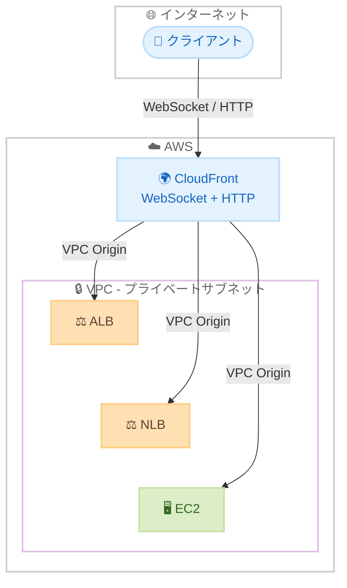

# Amazon CloudFront - VPC Origins での WebSocket サポート

**リリース日**: 2026年5月1日
**サービス**: Amazon CloudFront
**機能**: WebSocket Support for VPC Origins

[このアップデートのインフォグラフィックを見る](https://takech9203.github.io/aws-news-summary/20260501-amazon-cloudfront-websockets-vpc-origins.html)

## 概要

Amazon CloudFront が Virtual Private Cloud (VPC) オリジンを経由した WebSocket トラフィックをサポートしました。これにより、プライベートサブネットに完全にホストされたリアルタイムアプリケーションに対して、CloudFront を単一のエントリポイントとして使用できるようになります。

WebSocket サポートにより、VPC オリジンの機能がクライアントとサーバー間の永続的な双方向接続を必要とするアプリケーション(チャットプラットフォーム、共同編集ツール、ライブダッシュボード、IoT デバイス管理システムなど)にまで拡張されます。

VPC オリジンでの WebSocket トラフィックに追加料金は発生せず、VPC オリジンがサポートされているすべての AWS 商用リージョンで利用可能です。

**アップデート前の課題**

- WebSocket を使用するリアルタイムアプリケーションのオリジンをパブリックサブネットに配置する必要があった
- Access Control Lists (ACL) やその他のメカニズムを使用して WebSocket 対応サーバーへのアクセスを制限する必要があった
- これらのセキュリティソリューションの実装と維持に継続的な運用負荷がかかっていた
- HTTP トラフィックと WebSocket トラフィックで異なるエントリポイントを管理する必要があった

**アップデート後の改善**

- Application Load Balancer (ALB)、Network Load Balancer (NLB)、EC2 インスタンスをプライベートサブネットに配置したまま WebSocket トラフィックを処理可能になった
- CloudFront が従来の HTTP トラフィックとリアルタイム WebSocket 接続の両方に対する単一のフロントドアとして機能するようになった
- 攻撃対象面が縮小され、セキュリティ管理が簡素化された
- AWS Shield による組み込みの DDoS 保護が WebSocket トラフィックにも適用されるようになった

## アーキテクチャ図



クライアントからの WebSocket および HTTP トラフィックが CloudFront を経由してプライベートサブネット内の各オリジンに安全にルーティングされるアーキテクチャを示しています。

## サービスアップデートの詳細

### 主要機能

1. **VPC オリジン経由の WebSocket サポート**
   - プライベートサブネット内のオリジンへの WebSocket 接続を確立可能
   - 永続的な双方向通信を CloudFront 経由で実現
   - HTTP トラフィックと WebSocket トラフィックを同一ディストリビューションで処理

2. **対応オリジンタイプ**
   - Application Load Balancer (ALB): レイヤー 7 でのルーティングが必要な場合
   - Network Load Balancer (NLB): レイヤー 4 での高パフォーマンスルーティングが必要な場合
   - EC2 インスタンス: 直接オリジンとしての使用

3. **セキュリティ強化**
   - オリジンをパブリックインターネットから完全に隔離
   - CloudFront ディストリビューション経由のアクセスのみ許可
   - AWS Shield による組み込み DDoS 保護
   - 攻撃対象面の大幅な縮小

## 技術仕様

### WebSocket 通信要件

| 項目 | 詳細 |
|------|------|
| プロトコル | WebSocket (ws:// / wss://) |
| 対応オリジン | ALB、NLB、EC2 インスタンス |
| サブネット要件 | プライベートサブネットに配置可能 |
| 追加料金 | なし (VPC オリジンの WebSocket トラフィック) |
| DDoS 保護 | AWS Shield Standard による保護あり |

### API変更履歴

| 日付 | サービス | 変更内容 |
|------|----------|----------|
| 2026/04/29 | [Amazon CloudFront](https://awsapichanges.com/archive/changes/05dafe-cloudfront.html) | 7 updated api methods - Cache Tag サポート追加 |

## 設定方法

### 前提条件

1. VPC オリジンが有効な CloudFront ディストリビューションが存在すること
2. プライベートサブネット内に WebSocket 対応のオリジン (ALB/NLB/EC2) が配置されていること
3. オリジンが WebSocket ハンドシェイクに対応していること

### 手順

#### ステップ 1: VPC オリジンの作成

```bash
aws cloudfront create-vpc-origin \
  --vpc-origin-endpoint-config '{
    "Name": "my-websocket-origin",
    "Arn": "arn:aws:elasticloadbalancing:us-east-1:123456789012:loadbalancer/app/my-alb/1234567890abcdef",
    "HTTPPort": 80,
    "HTTPSPort": 443,
    "OriginProtocolPolicy": "https-only"
  }'
```

VPC 内の ALB を VPC オリジンとして登録します。WebSocket は HTTP/HTTPS ポートでハンドシェイクを行うため、通常の HTTP/HTTPS ポートを指定します。

#### ステップ 2: CloudFront ディストリビューションのビヘイビア設定

```json
{
  "PathPattern": "/ws/*",
  "TargetOriginId": "my-websocket-origin",
  "ViewerProtocolPolicy": "https-only",
  "AllowedMethods": ["GET", "HEAD", "OPTIONS", "PUT", "POST", "PATCH", "DELETE"],
  "CachePolicyId": "4135ea2d-6df8-44a3-9df3-4b5a84be39ad"
}
```

WebSocket 接続用のパスパターンに対してビヘイビアを設定します。CachePolicyId には CachingDisabled ポリシーを指定してキャッシュを無効化します。

#### ステップ 3: セキュリティグループの確認

```bash
# VPC オリジンのセキュリティグループで CloudFront からのアクセスを許可
aws ec2 describe-security-groups \
  --group-ids sg-0123456789abcdef0 \
  --query 'SecurityGroups[0].IpPermissions'
```

CloudFront VPC オリジンが使用するマネージドプレフィックスリストからのインバウンドトラフィックが許可されていることを確認します。

## メリット

### ビジネス面

- **運用コスト削減**: パブリックサブネットでのセキュリティ管理が不要になり、運用負荷とコストが削減される
- **セキュリティリスク低減**: オリジンがパブリックインターネットから完全に隔離されることで、セキュリティインシデントのリスクが低減される
- **追加コストなし**: WebSocket トラフィックに対する追加料金が発生せず、コスト予測が容易

### 技術面

- **アーキテクチャの簡素化**: HTTP と WebSocket の両方を単一の CloudFront ディストリビューションで処理でき、インフラの複雑さが軽減される
- **DDoS 保護の統合**: AWS Shield による保護が WebSocket トラフィックにも自動的に適用される
- **攻撃対象面の縮小**: オリジンへの直接アクセスが不可能になり、セキュリティポスチャが大幅に向上する

## デメリット・制約事項

### 制限事項

- VPC オリジンがサポートされている AWS 商用リージョンのみで利用可能
- WebSocket 接続のタイムアウトは CloudFront のアイドルタイムアウト設定に依存する
- VPC オリジンの設定には対象リソースの ARN が必要

### 考慮すべき点

- WebSocket は永続的接続のためキャッシュ無効化ポリシーの設定が必要
- WebSocket 接続数の増加に伴うオリジン側のスケーリング設計が重要
- 既存の VPC オリジン設定がある場合は追加設定なしで WebSocket が利用可能か確認が必要

## ユースケース

### ユースケース 1: リアルタイムチャットアプリケーション

**シナリオ**: 企業内チャットシステムをプライベートサブネットで運用し、外部からの攻撃を防ぎつつ低遅延通信を実現したい。

**実装例**:
```json
{
  "Origins": {
    "Items": [{
      "Id": "chat-websocket-origin",
      "VpcOriginConfig": {
        "VPCOriginId": "vo-1234567890abcdef0"
      }
    }]
  },
  "DefaultCacheBehavior": {
    "ViewerProtocolPolicy": "https-only",
    "CachePolicyId": "4135ea2d-6df8-44a3-9df3-4b5a84be39ad"
  }
}
```

**効果**: チャットサーバーをパブリックサブネットから完全に移行し、セキュリティを強化しつつリアルタイム通信を維持できる。

### ユースケース 2: IoT デバイス管理ダッシュボード

**シナリオ**: 数千台の IoT デバイスからのリアルタイムデータを WebSocket で受信し、管理ダッシュボードに表示するシステムをセキュアに構築したい。

**実装例**:
```json
{
  "CacheBehaviors": {
    "Items": [{
      "PathPattern": "/devices/ws",
      "TargetOriginId": "iot-websocket-origin",
      "AllowedMethods": ["GET", "HEAD", "OPTIONS", "PUT", "POST", "PATCH", "DELETE"],
      "CachePolicyId": "4135ea2d-6df8-44a3-9df3-4b5a84be39ad"
    }]
  }
}
```

**効果**: IoT デバイスからの WebSocket 接続を CloudFront で受け、DDoS 保護を適用しながらプライベートサブネット内のバックエンドに安全にルーティングできる。

### ユースケース 3: 共同編集ツール

**シナリオ**: 複数ユーザーが同時にドキュメントを編集する共同編集ツールにおいて、リアルタイム同期をプライベートネットワーク内で処理したい。

**実装例**:
```bash
# NLB をオリジンとした VPC オリジン設定
aws cloudfront create-vpc-origin \
  --vpc-origin-endpoint-config '{
    "Name": "collab-editor-origin",
    "Arn": "arn:aws:elasticloadbalancing:us-east-1:123456789012:loadbalancer/net/my-nlb/1234567890abcdef",
    "HTTPPort": 80,
    "HTTPSPort": 443,
    "OriginProtocolPolicy": "https-only"
  }'
```

**効果**: 共同編集のリアルタイム同期を NLB 経由で処理し、高パフォーマンスな双方向通信をセキュアに実現できる。

## 料金

VPC オリジン経由の WebSocket トラフィックに追加料金は発生しません。通常の CloudFront データ転送料金およびリクエスト料金が適用されます。

### 料金例

| 項目 | 料金 |
|------|------|
| VPC オリジンでの WebSocket 追加料金 | 無料 |
| CloudFront データ転送 (インターネットへ) | 通常の CloudFront 料金 |
| VPC オリジンへのリクエスト | 通常のオリジンリクエスト料金 |

## 利用可能リージョン

VPC オリジンがサポートされているすべての AWS 商用リージョンで利用可能です。

## 関連サービス・機能

- **Amazon CloudFront VPC Origins**: プライベートサブネット内のオリジンへの安全なアクセスを提供する基盤機能
- **AWS Shield**: CloudFront ディストリビューションに対する DDoS 保護を提供
- **Elastic Load Balancing (ALB/NLB)**: VPC オリジンとして WebSocket トラフィックを処理するロードバランサー
- **Amazon VPC**: プライベートサブネットでのオリジンホスティング環境を提供

## 参考リンク

- [インフォグラフィック](https://takech9203.github.io/aws-news-summary/20260501-amazon-cloudfront-websockets-vpc-origins.html)
- [公式発表 (What's New)](https://aws.amazon.com/about-aws/whats-new/2026/05/amazon-cloudfront-websockets-vpc-origins/)
- [CloudFront VPC Origins ドキュメント](https://docs.aws.amazon.com/AmazonCloudFront/latest/DeveloperGuide/private-content-vpc-origins.html)
- [CloudFront 料金ページ](https://aws.amazon.com/cloudfront/pricing/)

## まとめ

Amazon CloudFront の VPC オリジンでの WebSocket サポートにより、リアルタイムアプリケーションのオリジンをパブリックサブネットに公開する必要がなくなりました。追加コストなしで利用でき、セキュリティの向上とアーキテクチャの簡素化を同時に実現できるため、WebSocket ベースのアプリケーションを運用しているユーザーは VPC オリジンへの移行を検討することを推奨します。
