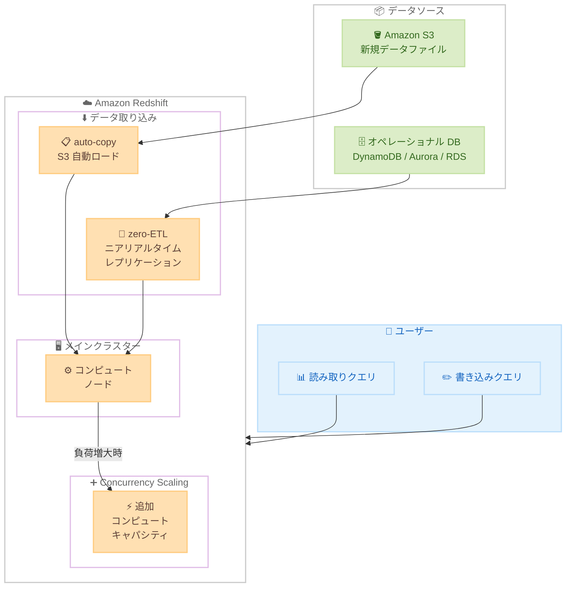

# Amazon Redshift - Concurrency Scaling による auto-copy および zero-ETL サポート

**リリース日**: 2026 年 5 月 1 日
**サービス**: Amazon Redshift
**機能**: Concurrency Scaling の auto-copy および zero-ETL サポート

📊 [このアップデートのインフォグラフィックを見る](https://takech9203.github.io/aws-news-summary/20260501-concurrency-scaling-auto-copy-zero-ETL.html)

## 概要

Amazon Redshift が Concurrency Scaling の auto-copy および zero-ETL に対するサポートを一般提供 (GA) として発表しました。これにより、データ取り込みパイプラインにおける読み取りおよび書き込みクエリの増加に対して、自動的にコンピュートキャパシティを追加し、パフォーマンスを維持できるようになります。

auto-copy は S3 バケットを監視し、新しいデータファイルを自動的にロードする機能です。zero-ETL はオペレーショナルデータベースやトランザクショナルデータベースからニアリアルタイムでデータをレプリケーションする機能です。今回のアップデートにより、これらのデータ取り込み機能に Concurrency Scaling が適用され、取り込み負荷が増大した際にも安定したクエリパフォーマンスを維持できます。

**アップデート前の課題**

- auto-copy や zero-ETL によるデータ取り込み中に読み取りクエリのパフォーマンスが低下する場合があった
- データ取り込み量が急増した際、書き込みクエリがメインクラスターのリソースを圧迫していた
- 取り込みパイプラインとユーザークエリのリソース競合を手動で管理する必要があった

**アップデート後の改善**

- Concurrency Scaling が自動的にコンピュートキャパシティを追加し、読み取り・書き込みクエリの増加に対応
- auto-copy による S3 からのデータロードが高負荷時でもスムーズに実行
- zero-ETL によるニアリアルタイムレプリケーションがパフォーマンス低下なく継続

## アーキテクチャ図



Concurrency Scaling が auto-copy および zero-ETL のデータ取り込みパイプラインにおいて、負荷増大時に自動的に追加コンピュートキャパシティを提供する構成を示しています。

## サービスアップデートの詳細

### 主要機能

1. **auto-copy の Concurrency Scaling 対応**
   - S3 バケットの監視と新規データファイルの自動ロードにおいて、Concurrency Scaling が適用
   - データファイルが大量に追加された場合でも、自動的にスケールアウトして取り込み処理を加速
   - ユーザーの読み取りクエリへの影響を最小限に抑制

2. **zero-ETL の Concurrency Scaling 対応**
   - オペレーショナルデータベースおよびトランザクショナルデータベースからのニアリアルタイムレプリケーションにおいて Concurrency Scaling が適用
   - レプリケーション負荷が増大した際に追加キャパシティを自動プロビジョニング
   - DynamoDB、Aurora、RDS などのソースデータベースからの同期遅延を削減

3. **読み取り・書き込み両方のスケーリング**
   - Concurrency Scaling が読み取りクエリだけでなく書き込みクエリにも対応
   - データ取り込みと分析クエリの両方でパフォーマンスを維持
   - クラスター全体のスループット向上に貢献

## 技術仕様

### 対応環境

| 項目 | 詳細 |
|------|------|
| 対象サービス | Amazon Redshift Serverless、RA3 プロビジョニングデータウェアハウス |
| スケーリング対象 | 読み取りクエリ、書き込みクエリ |
| 対応機能 | auto-copy、zero-ETL |
| スケーリング方式 | 自動 (負荷に応じてコンピュートキャパシティを追加) |

### API 変更履歴

| 日付 | サービス | 変更内容 |
|------|----------|----------|
| 2026/04/09 | [Redshift Data API Service](https://awsapichanges.com/archive/changes/215aec-redshift-data.html) | 1 updated api methods - BatchExecuteStatement API の名前付き SQL パラメータサポート |

### Concurrency Scaling の動作

```sql
-- Concurrency Scaling の有効化確認
SHOW concurrency_scaling;

-- auto-copy ジョブの実行状況確認
SELECT * FROM sys_copy_job
WHERE status = 'RUNNING'
ORDER BY start_time DESC;

-- Concurrency Scaling のアクティビティ確認
SELECT * FROM stl_concurrency_scaling
ORDER BY start_time DESC
LIMIT 10;
```

## 設定方法

### 前提条件

1. Amazon Redshift Serverless ワークグループまたは RA3 プロビジョニングクラスター
2. Concurrency Scaling が有効化されていること
3. auto-copy または zero-ETL インテグレーションが設定済みであること

### 手順

#### ステップ 1: Concurrency Scaling の有効化

```sql
-- ワークロード管理 (WLM) で Concurrency Scaling を有効化
ALTER WORKLOAD MANAGEMENT CONFIGURATION
SET concurrency_scaling = 'auto';
```

WLM 設定で Concurrency Scaling モードを `auto` に設定し、負荷増大時に自動的にスケールアウトできるようにします。

#### ステップ 2: auto-copy の設定

```sql
-- S3 バケットからの auto-copy ジョブを作成
COPY my_table
FROM 's3://my-bucket/data/'
IAM_ROLE 'arn:aws:iam::123456789012:role/RedshiftCopyRole'
FORMAT AS PARQUET
JOB CREATE my_auto_copy_job
AUTO ON;
```

S3 バケットを監視し、新しいデータファイルが追加された際に自動的にロードするジョブを作成します。Concurrency Scaling が有効な場合、高負荷時には自動的に追加キャパシティが割り当てられます。

#### ステップ 3: zero-ETL インテグレーションの確認

```sql
-- zero-ETL インテグレーションのステータス確認
SELECT integration_id, source_arn, target_arn, status
FROM svv_integration
WHERE status = 'active';
```

zero-ETL インテグレーションが正常に動作していることを確認します。Concurrency Scaling は既存の zero-ETL インテグレーションに対して自動的に適用されます。

## メリット

### ビジネス面

- **データ鮮度の向上**: 取り込みパイプラインのスループットが向上し、分析用データの鮮度が改善
- **SLA の維持**: データ取り込み量の増加時でもクエリレスポンスタイムを維持可能
- **運用コスト削減**: 手動でのキャパシティ計画やリソース調整が不要に

### 技術面

- **自動スケーリング**: 負荷に応じてコンピュートリソースが自動的に追加・削除
- **リソース競合の解消**: データ取り込みとユーザークエリのリソース競合を自動的に解消
- **ニアリアルタイム処理の安定化**: zero-ETL のレプリケーション遅延を最小限に維持

## デメリット・制約事項

### 制限事項

- Redshift Serverless および RA3 プロビジョニングデータウェアハウスのみが対象
- DC2 や DS2 ノードタイプでは利用不可
- Concurrency Scaling の利用には追加のコンピュートコストが発生

### 考慮すべき点

- Concurrency Scaling クラスターの起動には数秒から数十秒の遅延が発生する場合がある
- 大量のスケーリングイベントが発生した場合、コストが想定以上に増加する可能性がある
- Concurrency Scaling の使用量を監視し、必要に応じて上限を設定することを推奨

## ユースケース

### ユースケース 1: リアルタイムデータレイク分析

**シナリオ**: EC サイトがトランザクションログを S3 に出力し、auto-copy で Redshift に自動取り込みしている。セール期間中はデータ量が通常の 10 倍に増加する。

**実装例**:
```sql
-- auto-copy ジョブの作成
COPY transaction_logs
FROM 's3://ecommerce-logs/transactions/'
IAM_ROLE 'arn:aws:iam::123456789012:role/RedshiftRole'
FORMAT AS PARQUET
JOB CREATE sales_auto_copy
AUTO ON;

-- Concurrency Scaling の有効化
ALTER WORKLOAD MANAGEMENT CONFIGURATION
SET concurrency_scaling = 'auto';
```

**効果**: セール期間中のデータ取り込み量増加に対して自動的にスケールし、分析ダッシュボードのレスポンスタイムを維持

### ユースケース 2: マルチソース zero-ETL 統合

**シナリオ**: 複数の Aurora データベースから zero-ETL で Redshift にデータをレプリケーションし、統合分析を実行。業務時間中はソースデータベースのトランザクション量が増加する。

**実装例**:
```sql
-- zero-ETL インテグレーションのステータス確認
SELECT integration_id, source_arn, status,
       last_successful_replication_time
FROM svv_integration;

-- Concurrency Scaling アクティビティの監視
SELECT query, service_class, start_time, end_time
FROM stl_concurrency_scaling
WHERE start_time > DATEADD(hour, -1, GETDATE());
```

**効果**: 業務時間中のレプリケーション負荷増大に対して Concurrency Scaling が自動対応し、レプリケーション遅延を最小限に維持

### ユースケース 3: IoT データのリアルタイム取り込み

**シナリオ**: IoT デバイスからのセンサーデータが S3 に蓄積され、auto-copy で Redshift にロードされる。デバイス数の増加に伴い、取り込みデータ量が変動する。

**実装例**:
```sql
-- IoT センサーデータの auto-copy
COPY sensor_data
FROM 's3://iot-data/sensors/'
IAM_ROLE 'arn:aws:iam::123456789012:role/IoTRedshiftRole'
FORMAT AS JSON 'auto'
JOB CREATE iot_sensor_copy
AUTO ON;
```

**効果**: デバイス数の増減に応じて自動的にスケーリングし、データ取り込みのスループットを維持

## 料金

Concurrency Scaling は 1 日あたり 1 時間の無料クレジットが付与されます。無料クレジットを超過した使用時間分については、オンデマンドの Redshift クラスター料金と同等の秒単位課金が適用されます。

### 料金例

| 使用量 | 月額料金（概算） |
|--------|------------------|
| 1 日あたり 1 時間以内の使用 | 無料（無料クレジット内） |
| 1 日あたり追加 2 時間の使用（ra3.xlplus） | 約 $110/月 |

## 利用可能リージョン

すべての AWS 商用リージョンおよび AWS GovCloud (US) リージョンで利用可能です。Redshift Serverless および RA3 プロビジョニングデータウェアハウスが対象となります。

## 関連サービス・機能

- **Amazon Redshift Concurrency Scaling**: 読み取り・書き込みクエリの自動スケーリング基盤機能
- **Amazon Redshift auto-copy**: S3 バケットの監視と新規データファイルの自動ロード機能
- **Amazon Redshift zero-ETL**: オペレーショナル DB からのニアリアルタイムデータレプリケーション
- **Amazon Aurora zero-ETL integration**: Aurora から Redshift へのネイティブデータ統合
- **Amazon DynamoDB zero-ETL integration**: DynamoDB から Redshift へのデータ統合

## 参考リンク

- 📊 [インフォグラフィック](https://takech9203.github.io/aws-news-summary/20260501-concurrency-scaling-auto-copy-zero-ETL.html)
- [公式発表 (What's New)](https://aws.amazon.com/about-aws/whats-new/2026/03/concurrency-scaling-auto-copy-zero-ETL/)
- [ドキュメント - Concurrency Scaling](https://docs.aws.amazon.com/redshift/latest/dg/concurrency-scaling.html)
- [ドキュメント - auto-copy](https://docs.aws.amazon.com/redshift/latest/dg/loading-data-copy-job.html)
- [ドキュメント - zero-ETL integrations](https://docs.aws.amazon.com/redshift/latest/dg/zero-etl-using.html)
- [料金ページ](https://aws.amazon.com/redshift/pricing/)

## まとめ

Amazon Redshift の Concurrency Scaling が auto-copy および zero-ETL に対応したことで、データ取り込みパイプラインのパフォーマンスが大幅に向上しました。特にデータ量が変動する環境において、手動のキャパシティ管理が不要になり、安定したデータ取り込みとクエリパフォーマンスを維持できます。既に auto-copy や zero-ETL を利用している環境では、Concurrency Scaling を有効化するだけで本機能の恩恵を受けられるため、早期の導入検討を推奨します。
