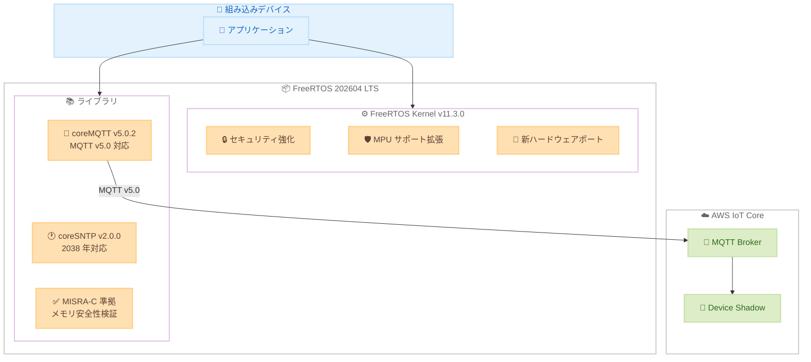

# FreeRTOS - 202604 LTS リリース

**リリース日**: 2026年5月1日
**サービス**: FreeRTOS
**機能**: FreeRTOS 202604 LTS (セキュリティ強化および MQTT v5.0 対応)

📊 [このアップデートのインフォグラフィックを見る](https://takech9203.github.io/aws-news-summary/20260501-freertos-lts.html)

## 概要

FreeRTOS 202604 LTS は、組み込みデバイス向けオープンソースリアルタイムオペレーティングシステムの新しい Long Term Support リリースである。組み込みシステム開発者および IoT デバイスメーカーに対し、2 年間の機能安定性、セキュリティアップデート、重大なバグ修正を提供する。

本リリースでは、メモリ安全性、コード品質、プロトコルサポートという組み込みシステムにおける主要な課題に対応している。FreeRTOS kernel v11.3.0 による新しいハードウェアポート、セキュリティ強化、MPU サポートの拡張に加え、coreMQTT v5.0.2 による MQTT v5.0 プロトコルサポート、coreSNTP v2.0.0 による 2038 年問題への対応が含まれる。

すべてのライブラリはメモリ安全性および MISRA-C 準拠の検証を受けており、組み込みシステムの堅牢性、移植性、信頼性を向上させる。

**アップデート前の課題**

- 以前の LTS バージョンでは MPU リージョンの多くが FreeRTOS によって占有され、アプリケーション固有のメモリ保護に使用できるリージョンが制限されていた
- MQTT v3.1.1 のみのサポートでは、帯域幅制約のあるデバイスでのトピックエイリアスやリクエスト/レスポンスパターンが利用できなかった
- SNTP ライブラリが 2038 年問題に対応しておらず、長期運用デバイスでの TLS 証明書検証やタイムスタンプの正確性に懸念があった

**アップデート後の改善**

- FreeRTOS が占有する MPU リージョン数が削減され、開発者がアプリケーション固有のメモリ保護にハードウェアリージョンを確保できるようになった
- MQTT v5.0 プロトコルサポートにより、トピックエイリアスやリクエスト/レスポンスパターンなどの高度な機能が利用可能になった
- 2038 年対応により、現在デプロイされるデバイスが運用期間を通じて TLS 証明書の検証やデータのタイムスタンプを正しく処理できるようになった

## アーキテクチャ図



FreeRTOS 202604 LTS の主要コンポーネントと AWS IoT Core との連携を示す。カーネルとライブラリが協調して、組み込みデバイスからクラウドへの安全な接続を実現する。

## サービスアップデートの詳細

### 主要機能

1. **FreeRTOS Kernel v11.3.0**
   - 新しいハードウェアポートの追加による対応デバイスの拡大
   - セキュリティハードニングによる脆弱性耐性の向上
   - MPU サポートの拡張: FreeRTOS が占有する MPU リージョン数を削減し、アプリケーション固有のメモリ保護にリージョンを確保可能

2. **coreMQTT v5.0.2 (MQTT v5.0 プロトコルサポート)**
   - トピックエイリアス: 帯域幅制約のあるデバイスでのデータ転送効率を改善
   - リクエスト/レスポンスパターン: インタラクティブな IoT アプリケーション向けの双方向通信
   - MQTT v5.0 の各種プロパティとリーズンコードのサポート

3. **coreSNTP v2.0.0 (2038 年問題対応)**
   - 2038 年以降も正しくタイムスタンプを処理する機能
   - TLS 証明書の有効期限検証の長期対応
   - 長期運用デバイスの安定動作を保証

4. **メモリ安全性と MISRA-C 準拠**
   - 全ライブラリがメモリ安全性の検証を完了
   - MISRA-C コーディング標準への準拠を確認
   - 組み込みシステムの堅牢性、移植性、信頼性の向上

## 技術仕様

### ライブラリバージョン

| コンポーネント | バージョン | 主要変更点 |
|------|------|------|
| FreeRTOS Kernel | v11.3.0 | 新ハードウェアポート、セキュリティ強化、MPU 拡張 |
| coreMQTT | v5.0.2 | MQTT v5.0 プロトコルサポート |
| coreSNTP | v2.0.0 | 2038 年問題対応 |

### LTS サポート期間

| 項目 | 詳細 |
|------|------|
| リリース名 | FreeRTOS 202604 LTS |
| サポート期間 | 2 年間 |
| 提供内容 | セキュリティアップデート、重大バグ修正 |
| 延長サポート | FreeRTOS Extended Maintenance Plan で対応可能 |

### MQTT v5.0 の主要な新機能

| 機能 | 説明 |
|------|------|
| トピックエイリアス | 繰り返しのトピック名を短い数値に置換し帯域幅を節約 |
| リクエスト/レスポンス | 応答トピックと相関データによる双方向通信 |
| セッション有効期限 | クライアント切断後のセッション保持期間を制御 |
| リーズンコード | 各操作の結果を詳細に通知 |

### API変更履歴

| 日付 | サービス | 変更内容 |
|------|----------|----------|
| 2026/05/01 | [AWS IoT](https://awsapichanges.com/archive/changes/6338dd-iot.html) | 3 updated methods - HTTP ルールアクションでのクロストピックバッチ処理サポート |

## 設定方法

### 前提条件

1. FreeRTOS 対応の開発ボード (ARM Cortex-M、RISC-V など)
2. CMake 3.13 以上または対応する IDE
3. 適切なクロスコンパイラツールチェーン

### 手順

#### ステップ 1: FreeRTOS 202604 LTS の取得

```bash
# GitHub リポジトリからクローン
git clone https://github.com/FreeRTOS/FreeRTOS-LTS.git --branch 202604.00-LTS
cd FreeRTOS-LTS
git submodule update --init --recursive
```

FreeRTOS 202604 LTS のソースコードと全ライブラリをローカルに取得する。

#### ステップ 2: プロジェクトの設定

```bash
# CMake によるビルド設定（例: ARM Cortex-M4 向け）
mkdir build && cd build
cmake .. -DCMAKE_TOOLCHAIN_FILE=../tools/cmake/arm-gcc-cortex-m4.cmake \
         -DFREERTOS_PORT=GCC_ARM_CM4F \
         -DBOARD=your_board_name
```

ターゲットボードとコンパイラに合わせたビルド環境を構成する。

#### ステップ 3: MQTT v5.0 の有効化

```c
/* FreeRTOSConfig.h での設定例 */
#define mqttconfigMQTT_VERSION_5_ENABLED    ( 1 )

/* coreMQTT v5.0 の初期化例 */
MQTTContext_t mqttContext;
MQTTConnectInfo_t connectInfo = {
    .cleanSession = true,
    .pClientIdentifier = "my-iot-device",
    .clientIdentifierLength = strlen("my-iot-device"),
    .keepAliveSeconds = 60,
    .sessionExpiry = 3600  /* MQTT v5.0: セッション有効期限 */
};
```

MQTT v5.0 機能を有効にし、セッション有効期限などの新機能を利用する設定を行う。

#### ステップ 4: 以前の LTS からの移行

```bash
# 移行ガイドの参照
# coreMQTT: https://github.com/FreeRTOS/coreMQTT/blob/main/MIGRATION.md
# coreSNTP: https://github.com/FreeRTOS/coreSNTP/blob/main/MIGRATION.md
```

coreMQTT および coreSNTP の移行ガイドに従い、既存プロジェクトを新しい LTS バージョンに更新する。

## メリット

### ビジネス面

- **長期サポートによるコスト削減**: 2 年間のセキュリティアップデートと重大バグ修正により、頻繁なアップグレード作業が不要
- **製品寿命の延長**: 2038 年問題対応により、長期運用デバイスの設計寿命を延ばすことが可能
- **コンプライアンス対応の簡素化**: MISRA-C 準拠のライブラリを使用することで、安全規格への準拠作業が軽減される

### 技術面

- **帯域幅効率の向上**: MQTT v5.0 のトピックエイリアスにより、制約のあるネットワーク環境でのデータ転送が効率化
- **メモリ利用の最適化**: MPU リージョン削減により、アプリケーション開発者が利用可能なハードウェアリソースが増加
- **セキュリティの強化**: カーネルレベルのセキュリティハードニングとメモリ安全性検証により、脆弱性リスクを低減

## デメリット・制約事項

### 制限事項

- MQTT v5.0 の全機能を利用するには coreMQTT v5.0.2 への移行が必要であり、既存コードの修正が発生する
- MPU サポートの拡張は対応ハードウェア (MPU 搭載プロセッサ) に限定される
- LTS サポート期間終了後は Extended Maintenance Plan (有償) が必要

### 考慮すべき点

- 既存の MQTT v3.1.1 ベースのアプリケーションからの移行には、プロトコルの違いに関する理解とテストが必要
- coreSNTP v2.0.0 への移行時に API の破壊的変更がある可能性があるため、移行ガイドの確認が必須
- 新しいカーネルバージョンへの移行時にはハードウェア依存部分の動作検証が推奨される

## ユースケース

### ユースケース 1: 産業用 IoT センサーの長期運用

**シナリオ**: 工場に設置される温度・振動センサーを 10 年以上運用する必要がある。デバイスは帯域幅が制限されたネットワーク環境で動作し、2038 年以降も正確なタイムスタンプが必要。

**実装例**:
```c
/* coreSNTP v2.0.0 による時刻同期 */
SntpContext_t sntpContext;
SntpServerInfo_t server = {
    .pServerName = "pool.ntp.org",
    .port = 123
};

/* 2038年以降も安全に動作する時刻取得 */
Sntp_SendTimeRequest(&sntpContext, rand() % UINT32_MAX);
```

**効果**: 2038 年問題に対応した時刻同期により、デバイスの運用期間全体で TLS 証明書の検証とデータの正確なタイムスタンプ付けが保証される。

### ユースケース 2: 帯域幅制約のある遠隔監視システム

**シナリオ**: セルラー回線 (LTE-M/NB-IoT) で接続される遠隔地の環境モニタリングデバイスにおいて、データ通信コストを最小化しながら複数のセンサーデータを送信したい。

**実装例**:
```c
/* MQTT v5.0 トピックエイリアスによる帯域幅節約 */
MQTTPublishInfo_t publishInfo = {
    .pTopicName = "devices/sensor-001/telemetry/temperature",
    .topicNameLength = strlen("devices/sensor-001/telemetry/temperature"),
    .topicAlias = 1,  /* 初回送信後はエイリアスのみで通信可能 */
    .pPayload = sensorData,
    .payloadLength = dataLen
};
MQTT_Publish(&mqttContext, &publishInfo, packetId);
```

**効果**: トピックエイリアスの使用により、繰り返し送信するトピック名のオーバーヘッドを削減し、セルラー通信コストを最大 30-40% 削減できる。

### ユースケース 3: セキュリティクリティカルな医療機器

**シナリオ**: 医療機器で使用される組み込みシステムにおいて、MISRA-C 準拠とメモリ安全性が規制要件として求められている。MPU を活用してアプリケーションの安全性を確保したい。

**実装例**:
```c
/* MPU設定: アプリケーション固有のメモリ保護 */
TaskParameters_t taskParams = {
    .pvTaskCode = vMedicalSensorTask,
    .pcName = "MedSensor",
    .usStackDepth = configMINIMAL_STACK_SIZE,
    .xRegions = {
        /* FreeRTOS のMPUリージョン使用が削減されたため、
           アプリケーション用に追加リージョンを確保可能 */
        { (void*)SENSOR_DATA_BASE, SENSOR_DATA_SIZE,
          portMPU_REGION_READ_WRITE | portMPU_REGION_CACHEABLE },
        { (void*)CONFIG_ROM_BASE, CONFIG_ROM_SIZE,
          portMPU_REGION_READ_ONLY }
    }
};
xTaskCreateRestricted(&taskParams, &taskHandle);
```

**効果**: MISRA-C 準拠ライブラリの使用と MPU による厳格なメモリ保護により、医療機器の規制認証プロセスが簡素化され、ソフトウェアの安全性が向上する。

## 料金

FreeRTOS はオープンソース (MIT ライセンス) で無料で利用可能。

### 関連コスト

| 項目 | 料金 |
|--------|------------------|
| FreeRTOS 202604 LTS | 無料 (MIT ライセンス) |
| AWS IoT Core 接続 | $0.08 / 100 万接続分 |
| AWS IoT Core メッセージング | $1.00 / 100 万メッセージ (最初 10 億) |
| FreeRTOS Extended Maintenance Plan | 個別見積もり |

## 利用可能リージョン

FreeRTOS はオープンソースソフトウェアであり、リージョンに依存せずグローバルに利用可能。AWS IoT Core と組み合わせて使用する場合は、AWS IoT Core が利用可能な全リージョンで動作する。

## 関連サービス・機能

- **AWS IoT Core**: FreeRTOS デバイスからのクラウド接続先。MQTT v5.0 対応のメッセージブローカーを提供
- **AWS IoT Device Management**: FreeRTOS デバイスのフリート管理、OTA アップデートの配信
- **AWS IoT Device Defender**: FreeRTOS デバイスのセキュリティ監査と異常検知
- **AWS IoT Greengrass**: エッジでの ML 推論やローカル処理を FreeRTOS デバイスと連携

## 参考リンク

- 📊 [インフォグラフィック](https://takech9203.github.io/aws-news-summary/20260501-freertos-lts.html)
- [公式発表 (What's New)](https://aws.amazon.com/about-aws/whats-new/2026/04/freertos-lts/)
- [FreeRTOS LTS ページ](https://www.freertos.org/lts-libraries.html)
- [FreeRTOS LTS GitHub リポジトリ](https://github.com/FreeRTOS/FreeRTOS-LTS)
- [coreMQTT 移行ガイド](https://github.com/FreeRTOS/coreMQTT/blob/main/MIGRATION.md)
- [coreSNTP 移行ガイド](https://github.com/FreeRTOS/coreSNTP/blob/main/MIGRATION.md)
- [AWS IoT Core ドキュメント](https://docs.aws.amazon.com/iot/latest/developerguide/)
- [AWS IoT Core 料金](https://aws.amazon.com/iot-core/pricing/)

## まとめ

FreeRTOS 202604 LTS は、組み込みシステムのセキュリティ、通信効率、長期運用対応を大幅に強化するリリースである。特に MQTT v5.0 対応による帯域幅最適化と 2038 年問題への対応は、IoT デバイスの長期運用を計画する組織にとって重要なアップデートである。既存の FreeRTOS プロジェクトでは、提供されている移行ガイドを参照し、計画的な LTS バージョンの更新を推奨する。
