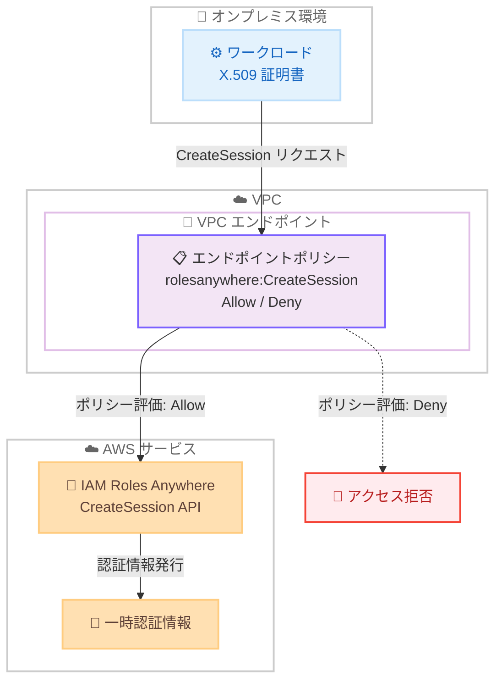

# IAM Roles Anywhere - VPC エンドポイントポリシーによる CreateSession API の制御

**リリース日**: 2026年5月1日
**サービス**: AWS IAM Roles Anywhere
**機能**: VPC エンドポイントポリシーでの CreateSession API サポート

📊 [このアップデートのインフォグラフィックを見る](https://takech9203.github.io/aws-news-summary/20260501-iam-roles-anywhere-vpc.html)

## 概要

AWS IAM Roles Anywhere が、VPC エンドポイントポリシーで CreateSession API の制御をサポートするようになった。これにより、VPC エンドポイントを経由するすべての IAM Roles Anywhere API 操作に対して、一貫したきめ細かいアクセス制御が可能になる。

CreateSession API は、AWS 外部で実行されるワークロードが X.509 証明書を使用して一時的な AWS 認証情報を取得するための API である。今回のアップデートにより、VPC エンドポイントポリシーを更新して CreateSession 操作の許可・拒否を制御できるようになった。

**アップデート前の課題**

- VPC エンドポイントポリシーが CreateSession API には適用されず、セキュリティギャップが存在していた
- IAM Roles Anywhere の他のすべての API 操作には VPC エンドポイントポリシーが適用されていたが、CreateSession のみが例外だった
- VPC エンドポイント経由での一時認証情報の発行を細かく制御できなかった

**アップデート後の改善**

- VPC エンドポイントポリシーで CreateSession API を明示的に許可・拒否できるようになった
- すべての IAM Roles Anywhere API 操作に対して一貫したアクセス制御が実現された
- VPC エンドポイント経由での認証情報取得に対するセキュリティ制御が強化された

## アーキテクチャ図



VPC エンドポイントポリシーが CreateSession API リクエストを評価し、ポリシーに基づいてアクセスを許可または拒否するフローを示す。

## サービスアップデートの詳細

### 主要機能

1. **CreateSession API の VPC エンドポイントポリシー対応**
   - VPC エンドポイントポリシーで `rolesanywhere:CreateSession` アクションを明示的に制御可能
   - Allow ステートメントに CreateSession が含まれていない場合、VPC エンドポイント経由での認証情報取得がブロックされる
   - `rolesanywhere:*` をアクションとして指定している場合は、CreateSession も含めてすべての操作が許可される

2. **一貫したアクセス制御**
   - すべての IAM Roles Anywhere API 操作が VPC エンドポイントポリシーの制御対象に
   - セキュリティポリシーの一貫性が確保され、例外のないアクセス制御が可能

3. **既存環境への影響**
   - 既存の VPC エンドポイントポリシーで CreateSession を明示的に許可していない場合、アクセスがブロックされる可能性がある
   - ポリシーの見直しが必要な場合がある

## 技術仕様

### VPC エンドポイントポリシーの構成

| 項目 | 詳細 |
|------|------|
| サービス名 | `com.amazonaws.{region}.rolesanywhere` |
| 対象 API | `rolesanywhere:CreateSession` |
| ポリシー形式 | IAM ポリシー形式の JSON |
| 動作 | ポリシーで明示的に許可されない限り拒否 |

### VPC エンドポイントポリシー設定例

```json
{
  "Version": "2012-10-17",
  "Statement": [
    {
      "Sid": "AllowCreateSession",
      "Effect": "Allow",
      "Principal": "*",
      "Action": [
        "rolesanywhere:CreateSession"
      ],
      "Resource": "*",
      "Condition": {
        "StringEquals": {
          "rolesanywhere:TrustAnchorArn": "arn:aws:rolesanywhere:us-east-1:123456789012:trust-anchor/abc12345-1234-1234-1234-abc123456789"
        }
      }
    }
  ]
}
```

## 設定方法

### 前提条件

1. IAM Roles Anywhere が設定済みであること (トラストアンカー、プロファイルが作成済み)
2. VPC エンドポイントが `com.amazonaws.{region}.rolesanywhere` に対して作成済みであること
3. X.509 証明書を使用するワークロードが VPC エンドポイント経由で通信可能であること

### 手順

#### ステップ 1: 既存の VPC エンドポイントポリシーの確認

```bash
aws ec2 describe-vpc-endpoints \
  --vpc-endpoint-ids vpce-0123456789abcdef0 \
  --query "VpcEndpoints[].PolicyDocument" \
  --output text
```

現在の VPC エンドポイントに設定されているポリシーを確認する。CreateSession が許可リストに含まれているか確認する。

#### ステップ 2: VPC エンドポイントポリシーの更新

```bash
aws ec2 modify-vpc-endpoint \
  --vpc-endpoint-id vpce-0123456789abcdef0 \
  --policy-document file://vpc-endpoint-policy.json
```

VPC エンドポイントポリシーを更新し、CreateSession API の許可を明示的に追加する。ポリシーファイルには必要なアクションを含める。

#### ステップ 3: 動作確認

```bash
# VPC エンドポイント経由で CreateSession を呼び出し、認証情報を取得できることを確認
aws rolesanywhere create-session \
  --profile-arn arn:aws:rolesanywhere:us-east-1:123456789012:profile/abc12345 \
  --trust-anchor-arn arn:aws:rolesanywhere:us-east-1:123456789012:trust-anchor/abc12345 \
  --role-arn arn:aws:iam::123456789012:role/MyRole \
  --certificate file://certificate.pem \
  --private-key file://private-key.pem
```

VPC エンドポイント経由で CreateSession API が正常に動作することを確認する。

## メリット

### ビジネス面

- **コンプライアンスの向上**: VPC エンドポイントを経由するすべての認証操作を制御でき、監査要件を満たしやすくなる
- **セキュリティガバナンスの一貫性**: 例外のない一貫したポリシー適用により、セキュリティ管理が簡素化される
- **リスク低減**: 不正な認証情報の取得を VPC エンドポイントレベルで防止できる

### 技術面

- **きめ細かいアクセス制御**: VPC エンドポイントポリシーで条件キーを使用し、特定のトラストアンカーやプロファイルのみ許可可能
- **多層防御の強化**: IAM ポリシー、リソースポリシー、VPC エンドポイントポリシーの 3 層でアクセスを制御
- **一貫した API 制御**: すべての IAM Roles Anywhere API が同じメカニズムで制御される

## デメリット・制約事項

### 制限事項

- 既存の VPC エンドポイントポリシーで CreateSession を明示的に許可していない場合、意図せずアクセスがブロックされる可能性がある
- VPC エンドポイントポリシーの変更が反映されるまで若干の遅延が発生する場合がある
- VPC エンドポイントポリシーのサイズ上限 (20,480 文字) に注意が必要

### 考慮すべき点

- 既存環境のポリシーを確認し、CreateSession が暗黙的に拒否されていないか検証が必要
- ワイルドカード (`rolesanywhere:*`) を使用している場合は影響なし
- 個別のアクションを列挙している場合は `rolesanywhere:CreateSession` の追加が必要

## ユースケース

### ユースケース 1: ハイブリッド環境でのセキュアな認証制御

**シナリオ**: オンプレミスのワークロードが VPN/Direct Connect 経由で VPC エンドポイントを通じて AWS にアクセスする環境で、特定のトラストアンカーからの認証のみを許可したい。

**実装例**:
```json
{
  "Version": "2012-10-17",
  "Statement": [
    {
      "Effect": "Allow",
      "Principal": "*",
      "Action": "rolesanywhere:CreateSession",
      "Resource": "*",
      "Condition": {
        "StringEquals": {
          "rolesanywhere:TrustAnchorArn": "arn:aws:rolesanywhere:us-east-1:123456789012:trust-anchor/production-anchor"
        }
      }
    }
  ]
}
```

**効果**: 承認されたトラストアンカーからの認証のみが VPC エンドポイント経由で許可され、不正な証明書による認証情報の取得を防止する。

### ユースケース 2: マルチアカウント環境でのアクセス制限

**シナリオ**: 複数の AWS アカウントが共有 VPC を使用する環境で、各アカウントが自身の IAM Roles Anywhere リソースのみにアクセスできるよう制限したい。

**実装例**:
```json
{
  "Version": "2012-10-17",
  "Statement": [
    {
      "Effect": "Allow",
      "Principal": "*",
      "Action": "rolesanywhere:CreateSession",
      "Resource": "*",
      "Condition": {
        "StringEquals": {
          "aws:PrincipalOrgID": "o-example12345"
        }
      }
    }
  ]
}
```

**効果**: 組織内のアカウントのみが VPC エンドポイント経由で認証情報を取得でき、外部からのアクセスを防止する。

### ユースケース 3: 本番環境と開発環境の分離

**シナリオ**: 本番環境用と開発環境用で異なる VPC エンドポイントを使用し、それぞれのエンドポイントで許可するプロファイルを分離したい。

**実装例**:
```json
{
  "Version": "2012-10-17",
  "Statement": [
    {
      "Effect": "Allow",
      "Principal": "*",
      "Action": "rolesanywhere:CreateSession",
      "Resource": "*",
      "Condition": {
        "StringEquals": {
          "rolesanywhere:ProfileArn": "arn:aws:rolesanywhere:us-east-1:123456789012:profile/production-profile"
        }
      }
    }
  ]
}
```

**効果**: 本番環境の VPC エンドポイントからは本番用プロファイルのみ利用可能となり、環境間の誤アクセスを防止する。

## 料金

VPC エンドポイントポリシーの設定自体に追加料金は発生しない。IAM Roles Anywhere の利用料金および VPC エンドポイントの標準料金が適用される。

### 料金例

| 項目 | 料金 |
|------|------|
| IAM Roles Anywhere | 無料 (AWS IAM の一部) |
| VPC エンドポイント (インターフェイス型) | $0.014/時間 + データ処理料金 |

## 利用可能リージョン

IAM Roles Anywhere が利用可能なすべての AWS リージョンで利用可能。以下を含む:

- すべての商用リージョン
- AWS GovCloud (US) リージョン
- AWS European Sovereign Cloud (ドイツ) リージョン
- 中国リージョン (北京、寧夏)

## 関連サービス・機能

- **AWS IAM Roles Anywhere**: AWS 外部のワークロードに一時的な AWS 認証情報を提供するサービス
- **AWS PrivateLink / VPC エンドポイント**: VPC からインターネットを経由せずに AWS サービスにアクセスする機能
- **AWS Certificate Manager (ACM)**: X.509 証明書の管理に使用可能
- **AWS CloudTrail**: CreateSession API 呼び出しの監査ログ記録

## 参考リンク

- 📊 [インフォグラフィック](https://takech9203.github.io/aws-news-summary/20260501-iam-roles-anywhere-vpc.html)
- [公式発表 (What's New)](https://aws.amazon.com/about-aws/whats-new/2026/05/iam-roles-anywhere-vpc/)
- [IAM Roles Anywhere ユーザーガイド](https://docs.aws.amazon.com/rolesanywhere/latest/userguide/)
- [VPC エンドポイントポリシー](https://docs.aws.amazon.com/vpc/latest/privatelink/vpc-endpoints-access.html)

## まとめ

IAM Roles Anywhere の CreateSession API が VPC エンドポイントポリシーの制御対象に追加されたことで、すべての IAM Roles Anywhere API 操作に一貫したアクセス制御が適用されるようになった。既存の VPC エンドポイントポリシーで個別のアクションを列挙している環境では、`rolesanywhere:CreateSession` を明示的に追加する必要があるため、早急にポリシーの確認を行うことを推奨する。
