# Amazon EKS - Elastic Fabric Adapter 向け Dynamic Resource Allocation (DRA) サポート

**リリース日**: 2026年5月1日
**サービス**: Amazon Elastic Kubernetes Service (Amazon EKS)
**機能**: Kubernetes Dynamic Resource Allocation for Elastic Fabric Adapter

📊 [このアップデートのインフォグラフィックを見る](https://takech9203.github.io/aws-news-summary/20260501-kubernetes-dra-elastic-fabric-adapter.html)

## 概要

Amazon EKS が Elastic Fabric Adapter (EFA) 向けの Dynamic Resource Allocation (DRA) をサポートしました。これにより、AI、機械学習、HPC (High Performance Computing) ワークロードにおけるノード間の高性能通信と RDMA (Remote Direct Memory Access) の設定が大幅に簡素化されます。

EFA DRA ドライバーは、Kubernetes の upstream プロジェクトである DRANET をベースに構築されており、EFA インターフェースの共有やトポロジーを考慮したリソース割り当てを Kubernetes 上で実現します。これにより、各アクセラレータデバイス (NVIDIA GPU、AWS Trainium、AWS Inferentia) に最も近いネットワークインターフェースを通じてノード間通信を行うことが可能になります。

**アップデート前の課題**

- EFA デバイスプラグインでは、PCIe トポロジーを考慮した最適なインターフェース割り当てが困難だった
- 同一ノード上の複数ワークロード間で EFA インターフェースを共有する仕組みが限定的だった
- アクセラレータデバイスと EFA インターフェースの物理的な近接性を手動で管理する必要があった

**アップデート後の改善**

- PCIe ルートまたはデバイスグループを共有する EFA インターフェースとアクセラレータデバイスを自動的に割り当て可能になった
- 同一ノード上のワークロード間で EFA インターフェースを共有し、利用効率を最大化できるようになった
- Kubernetes のネイティブ API (DRA) を通じてリソース管理が標準化され、運用が簡素化された

## アーキテクチャ図

```mermaid
flowchart TD
    subgraph EKSCluster["☁️ Amazon EKS Cluster - Kubernetes 1.34+"]
        subgraph ControlPlane["⚙️ Control Plane"]
            Scheduler["📋 Kubernetes Scheduler<br/>DRA 対応"]
        end
        subgraph WorkerNode["🖥️ Worker Node"]
            subgraph DRADriver["🔧 EFA DRA Driver - DRANET ベース"]
                TopoAware["🗺️ トポロジー認識<br/>PCIe ルート検出"]
                Sharing["🔄 インターフェース共有<br/>マネージャー"]
            end
            subgraph Devices["⚡ デバイス"]
                direction LR
                EFA1["🌐 EFA Interface 1"]
                EFA2["🌐 EFA Interface 2"]
                GPU["🎮 NVIDIA GPU"]
                Trainium["🧠 AWS Trainium"]
                EFA1 ~~~ EFA2 ~~~ GPU ~~~ Trainium
            end
            subgraph Workloads["📦 ワークロード"]
                direction LR
                Pod1["Pod A<br/>ML Training"]
                Pod2["Pod B<br/>HPC Job"]
                Pod1 ~~~ Pod2
            end
        end
    end

    Scheduler -->|ResourceClaim 処理| DRADriver
    TopoAware -->|最適な EFA 割り当て| Devices
    Sharing -->|インターフェース共有| Workloads
    Pod1 -.->|RDMA 通信| EFA1
    Pod2 -.->|RDMA 通信| EFA2
    GPU -.->|PCIe 近接| EFA1
    Trainium -.->|PCIe 近接| EFA2

    classDef cloud fill:none,stroke:#CCCCCC,stroke-width:2px,color:#666666
    classDef layer fill:none,stroke:#E1BEE7,stroke-width:2px,color:#666666
    classDef compute fill:#FFE0B2,stroke:#FFCC80,stroke-width:2px,color:#5D4037
    classDef storage fill:#DCEDC8,stroke:#C5E1A5,stroke-width:2px,color:#33691E
    classDef user fill:#E3F2FD,stroke:#BBDEFB,stroke-width:2px,color:#1565C0

    class EKSCluster cloud
    class ControlPlane,WorkerNode,Devices,Workloads layer
    class Scheduler,DRADriver,TopoAware,Sharing compute
    class EFA1,EFA2,GPU,Trainium storage
    class Pod1,Pod2 user
```



EFA DRA ドライバーが PCIe トポロジーを認識し、アクセラレータデバイスに最も近い EFA インターフェースを各 Pod に自動割り当てする仕組みを示しています。

## サービスアップデートの詳細

### 主要機能

1. **トポロジー認識リソース割り当て**
   - PCIe ルートまたはデバイスグループを共有する EFA インターフェースとアクセラレータデバイスを自動的にペアリング
   - 各 NVIDIA GPU、AWS Trainium、AWS Inferentia デバイスに最も近いネットワークインターフェースを通じた通信を実現
   - ノード間トラフィックの最適なルーティングによりレイテンシーを最小化

2. **EFA インターフェース共有**
   - 同一ノード上の複数ワークロード間で EFA インターフェースを共有可能
   - EFA インターフェースの利用効率を最大化
   - リソースの無駄を削減し、ノードあたりのワークロード密度を向上

3. **DRANET プロジェクトベースの実装**
   - Kubernetes upstream の DRANET プロジェクトをベースに構築
   - Kubernetes の標準的な DRA API を通じてリソースを管理
   - コミュニティ標準に準拠したアプローチによる長期的な互換性を確保

## 技術仕様

### 対応環境

| 項目 | 詳細 |
|------|------|
| 対応 Kubernetes バージョン | 1.34 以降 |
| 対応ノードタイプ | EKS マネージドノードグループ、セルフマネージドノード |
| 対応アクセラレータ | NVIDIA GPU、AWS Trainium、AWS Inferentia |
| ベースプロジェクト | DRANET (kubernetes-sigs/dranet) |
| 既存プラグインとの関係 | EFA デバイスプラグインは Karpenter および EKS Auto Mode で引き続きサポート |

### DRA と従来のデバイスプラグインの比較

| 機能 | EFA DRA ドライバー | EFA デバイスプラグイン |
|------|-------------------|---------------------|
| トポロジー認識割り当て | 対応 | 非対応 |
| インターフェース共有 | 対応 | 限定的 |
| 推奨環境 | EKS マネージドノードグループ、セルフマネージドノード | Karpenter、EKS Auto Mode |
| 対応 K8s バージョン | 1.34+ | 従来バージョン |

## 設定方法

### 前提条件

1. Amazon EKS クラスターが Kubernetes バージョン 1.34 以降で動作していること
2. EKS マネージドノードグループまたはセルフマネージドノードを使用していること
3. EFA 対応の EC2 インスタンスタイプを使用していること (p5、p4d、trn1、inf2 など)

### 手順

#### ステップ 1: EFA DRA ドライバーのインストール

```bash
# EFA DRA ドライバーの Helm チャートをインストール
helm repo add aws-efa https://aws.github.io/aws-efa-k8s-device-plugin
helm repo update

# EFA DRA ドライバーをデプロイ
helm install aws-efa-dra-driver aws-efa/aws-efa-dra-driver \
  --namespace kube-system
```

EFA DRA ドライバーを Kubernetes クラスターにデプロイします。ドライバーは各ノード上で動作し、EFA デバイスの検出とリソース公開を行います。

#### ステップ 2: ResourceClaim を使用した Pod の定義

```yaml
apiVersion: v1
kind: Pod
metadata:
  name: ml-training-job
spec:
  containers:
  - name: training
    image: my-ml-training:latest
    resources:
      claims:
      - name: efa-interface
  resourceClaims:
  - name: efa-interface
    resourceClaimTemplateName: efa-claim-template
---
apiVersion: resource.k8s.io/v1beta1
kind: ResourceClaimTemplate
metadata:
  name: efa-claim-template
spec:
  spec:
    devices:
      requests:
      - name: efa
        deviceClassName: efa.aws.com
```

DRA の ResourceClaim を通じて EFA インターフェースをリクエストします。Kubernetes スケジューラーが PCIe トポロジーを考慮して最適なインターフェースを割り当てます。

#### ステップ 3: トポロジー認識割り当ての確認

```bash
# Pod のリソース割り当て状態を確認
kubectl get resourceclaims -o wide

# EFA デバイスのトポロジー情報を確認
kubectl describe node <node-name> | grep -A 10 "efa"
```

割り当てられた EFA インターフェースが、対象アクセラレータと同じ PCIe ルートに配置されていることを確認します。

## メリット

### ビジネス面

- **インフラコスト最適化**: EFA インターフェースの共有により、必要なインターフェース数を削減し、ノードあたりのワークロード密度を向上
- **運用効率の向上**: トポロジー認識の自動化により、インフラ設定の手動チューニングが不要に
- **ジョブ完了時間の短縮**: 最適なネットワーク経路選択により、分散学習やHPC ジョブの実行時間を短縮

### 技術面

- **レイテンシーの最小化**: PCIe トポロジーを考慮した割り当てにより、GPU/Trainium とネットワークインターフェース間のデータ転送を最適化
- **Kubernetes ネイティブ**: DRA API を通じた標準的なリソース管理により、既存の Kubernetes ワークフローとの統合が容易
- **スケーラビリティ**: ノード間通信の効率化により、大規模な分散トレーニングジョブのスケーリングが向上

## デメリット・制約事項

### 制限事項

- Kubernetes 1.34 以降が必須であり、既存クラスターのアップグレードが必要な場合がある
- Karpenter および EKS Auto Mode との組み合わせでは従来の EFA デバイスプラグインの使用が推奨される
- 新規デプロイメント向けに推奨されており、既存の EFA デバイスプラグインからの移行パスについては段階的な対応が必要

### 考慮すべき点

- DRA は Kubernetes 1.34 で GA となった比較的新しい API であり、エコシステムの成熟度を考慮する必要がある
- 既存の EFA デバイスプラグインとの共存期間中は、どちらのアプローチを採用するか運用ポリシーの策定が必要

## ユースケース

### ユースケース 1: 大規模分散 AI モデルトレーニング

**シナリオ**: 数百の GPU を使用した大規模言語モデルのトレーニングにおいて、ノード間の勾配同期通信のパフォーマンスを最大化したい場合。

**実装例**:
```yaml
apiVersion: v1
kind: Pod
metadata:
  name: distributed-training
spec:
  containers:
  - name: trainer
    image: nccl-training:latest
    env:
    - name: NCCL_NET
      value: "EFA"
    resources:
      claims:
      - name: efa-devices
      limits:
        nvidia.com/gpu: 8
  resourceClaims:
  - name: efa-devices
    resourceClaimTemplateName: efa-topology-aware
```

**効果**: PCIe トポロジーを考慮した EFA 割り当てにより、各 GPU からの NCCL AllReduce 通信が最短経路で行われ、分散トレーニングのスループットが向上します。

### ユースケース 2: HPC ワークロードの効率的なリソース利用

**シナリオ**: 複数の HPC ジョブが同一ノード上で実行される環境において、EFA インターフェースを効率的に共有したい場合。

**実装例**:
```yaml
apiVersion: resource.k8s.io/v1beta1
kind: ResourceClaimTemplate
metadata:
  name: shared-efa-template
spec:
  spec:
    devices:
      requests:
      - name: efa
        deviceClassName: efa.aws.com
      config:
      - requests: ["efa"]
        opaque:
          driver: efa.aws.com
          parameters:
            sharing: "enabled"
```

**効果**: 複数の HPC ジョブが同じ EFA インターフェースを共有することで、限られたネットワークリソースの利用効率が向上し、ノードあたりのジョブスループットが改善されます。

### ユースケース 3: AWS Trainium を活用した推論ワークロード

**シナリオ**: AWS Inferentia/Trainium デバイスを搭載したノードで、推論リクエストのレイテンシーを最小化したい場合。

**実装例**:
```yaml
apiVersion: v1
kind: Pod
metadata:
  name: inference-server
spec:
  containers:
  - name: inference
    image: neuron-inference:latest
    resources:
      claims:
      - name: efa-neuron
      limits:
        aws.amazon.com/neuron: 2
  resourceClaims:
  - name: efa-neuron
    resourceClaimTemplateName: efa-neuron-topology
```

**効果**: Trainium/Inferentia デバイスと同じ PCIe ルート上の EFA インターフェースが自動的に割り当てられ、モデル分割された推論の通信レイテンシーが削減されます。

## 料金

EFA DRA ドライバー自体に追加料金は発生しません。以下の関連コストを考慮してください。

| 項目 | 料金 |
|------|------|
| EFA DRA ドライバー | 無料 (オープンソース) |
| Elastic Fabric Adapter | 追加料金なし (対応インスタンスタイプに含まれる) |
| Amazon EKS クラスター | 標準の EKS 料金が適用 |
| EC2 インスタンス | EFA 対応インスタンスタイプの料金 (p5、trn1、inf2 など) |

## 利用可能リージョン

Amazon EKS が利用可能なすべての AWS リージョンで使用できます。

## 関連サービス・機能

- **Elastic Fabric Adapter (EFA)**: 高性能ノード間通信を実現するネットワークインターフェースで、本アップデートの中核コンポーネント
- **Amazon EKS Auto Mode**: Kubernetes クラスターの自動管理機能。EFA デバイスプラグインとの連携が推奨される
- **AWS Trainium / AWS Inferentia**: AWS 独自の機械学習チップ。EFA DRA ドライバーによるトポロジー認識割り当ての対象デバイス
- **NVIDIA GPU (P5 インスタンス)**: 分散トレーニングにおいて EFA と組み合わせて使用される主要なアクセラレータ
- **Karpenter**: Kubernetes のノード自動スケーリング。現時点では EFA デバイスプラグインとの連携が推奨される

## 参考リンク

- 📊 [インフォグラフィック](https://takech9203.github.io/aws-news-summary/20260501-kubernetes-dra-elastic-fabric-adapter.html)
- [公式発表 (What's New)](https://aws.amazon.com/about-aws/whats-new/2026/05/kubernetes-dra-elastic-fabric-adapter/)
- [ドキュメント - Manage EFA devices on Amazon EKS](https://docs.aws.amazon.com/eks/latest/userguide/device-management-efa.html)
- [DRANET プロジェクト (GitHub)](https://github.com/kubernetes-sigs/dranet)
- [Amazon EKS 料金ページ](https://aws.amazon.com/eks/pricing/)
- [Elastic Fabric Adapter](https://aws.amazon.com/hpc/efa/)

## まとめ

Amazon EKS における EFA 向け DRA サポートは、AI/ML および HPC ワークロードのネットワークパフォーマンスを Kubernetes ネイティブな方法で最適化する重要なアップデートです。PCIe トポロジーを考慮した自動割り当てとインターフェース共有により、大規模分散トレーニングや HPC ジョブの効率が向上します。Kubernetes 1.34 以降の新規デプロイメントでは、従来の EFA デバイスプラグインに代わり EFA DRA ドライバーの採用を検討することを推奨します。
