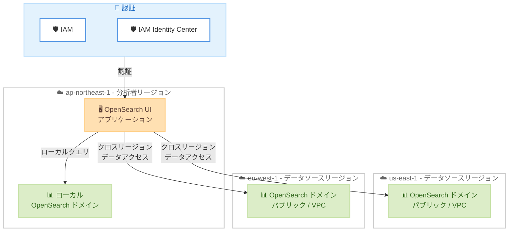

# Amazon OpenSearch Service - OpenSearch UI クロスリージョンデータアクセス

**リリース日**: 2026年5月1日
**サービス**: Amazon OpenSearch Service
**機能**: OpenSearch UI Cross-Region Data Access to OpenSearch Domains

📊 [このアップデートのインフォグラフィックを見る](https://takech9203.github.io/aws-news-summary/20260501-opensearch-ui-cross-region-data-access-domains.html)

## 概要

Amazon OpenSearch Service の OpenSearch UI がクロスリージョンデータアクセスをサポートした。この機能により、単一の OpenSearch UI アプリケーションから異なる AWS リージョンにホストされた OpenSearch ドメインにアクセスし、クエリの実行やダッシュボードの構築が可能になる。

2026 年初頭にリリースされたクロスアカウントデータアクセス機能と組み合わせることで、アカウントとリージョンの柔軟な組み合わせで OpenSearch ドメインに対してクエリを実行したりダッシュボードを構築したりできるようになった。エンドポイントの切り替えやデータのレプリケーションは不要である。パブリックおよび VPC 構成の両方をサポートし、認証方式として IAM と IAM Identity Center に対応している。

**アップデート前の課題**

- 複数の AWS リージョンにまたがる OpenSearch ドメインのデータを統合的に分析するには、データを単一リージョンにレプリケーションする必要があった
- リージョン間でデータを参照するためにクロスリージョンレプリケーションの設定やデータパイプラインの構築が必要だった
- 異なるリージョンの OpenSearch ドメインにアクセスするにはエンドポイントの切り替えが必要で、運用が煩雑だった

**アップデート後の改善**

- 単一の OpenSearch UI から複数リージョンの OpenSearch ドメインにアクセスし、クエリやダッシュボード構築が可能になった
- データのレプリケーションが不要になり、ストレージコストとレプリケーション遅延を削減できる
- クロスアカウント機能と併用することで、アカウントとリージョンを自由に組み合わせた統合分析が可能になった

## アーキテクチャ図



ap-northeast-1 の OpenSearch UI アプリケーションから、us-east-1 および eu-west-1 の OpenSearch ドメインにクロスリージョンでアクセスするフローを示している。同一パーティション内のリージョン間でデータアクセスが可能である。

## サービスアップデートの詳細

### 主要機能

1. **クロスリージョンドメインアソシエーション**
   - 単一の OpenSearch UI アプリケーションから異なるリージョンの OpenSearch ドメインに接続可能
   - 同一パーティション内のリージョン間でデータ可視化を一元化
   - エンドポイントの切り替えやデータレプリケーションが不要

2. **パブリック / VPC 両構成のサポート**
   - パブリックアクセス構成の OpenSearch ドメインに対応
   - VPC 構成の OpenSearch ドメインにも対応
   - VPC エンドポイントアクセスに `SupportedRegions` オプションが追加され、リージョン間のアクセスを許可可能

3. **クロスアカウントとの併用**
   - クロスアカウントデータアクセス機能と組み合わせて使用可能
   - アカウントとリージョンの柔軟な組み合わせでドメインにアクセス可能
   - 組織全体の分散データを単一の UI から統合的に分析

4. **柔軟な認証方式**
   - IAM 認証に対応
   - IAM Identity Center によるエンドユーザー認証に対応
   - 既存の認証基盤をそのまま活用可能

## 技術仕様

### サポート構成

| 項目 | 詳細 |
|------|------|
| アクセス範囲 | 同一パーティション内のクロスリージョン |
| ドメインタイプ | パブリック、VPC |
| 認証方式 | IAM、IAM Identity Center |
| 併用機能 | クロスアカウントデータアクセス |
| ネットワーク | VPC エンドポイント経由のリージョン間接続をサポート |

### API 変更履歴

| 日付 | サービス | 変更内容 |
|------|----------|----------|
| 2026/04/23 | [Amazon OpenSearch Service](https://awsapichanges.com/archive/changes/0aaee4-es.html) | 10 updated api methods - クロスリージョンドメインアソシエーションのサポート追加 |

### 更新された API メソッド

| メソッド | 変更内容 |
|----------|----------|
| AuthorizeVpcEndpointAccess | `ServiceOptions.SupportedRegions` パラメータの追加 |
| ListVpcEndpointAccess | レスポンスに `ServiceOptions.SupportedRegions` を含む |
| RevokeVpcEndpointAccess | `ServiceOptions.SupportedRegions` パラメータの追加 |
| CreateDomain | ドメイン構成にリージョン間接続オプションを追加 |
| UpdateDomainConfig | ドメイン構成の更新でリージョン間設定を反映 |
| DescribeDomain | レスポンスにリージョン間接続情報を含む |
| DescribeDomainConfig | レスポンスにリージョン間接続設定を含む |
| DescribeDomains | 複数ドメインの一括取得でリージョン間情報を含む |
| DescribeDryRunProgress | ドライラン結果にリージョン間設定の検証を含む |
| DeleteDomain | レスポンスに更新されたドメイン情報を反映 |

### VPC エンドポイントアクセス設定例

```json
{
    "DomainName": "my-domain",
    "Service": "application.opensearchservice.amazonaws.com",
    "ServiceOptions": {
        "SupportedRegions": [
            "us-east-1",
            "eu-west-1",
            "ap-northeast-1"
        ]
    }
}
```

## 設定方法

### 前提条件

1. OpenSearch UI アプリケーションが作成済みであること
2. アクセス先のリージョンに OpenSearch ドメインが存在すること
3. VPC 構成の場合、VPC エンドポイントアクセスでリモートリージョンが許可されていること
4. IAM または IAM Identity Center による認証が設定済みであること

### 手順

#### ステップ 1: VPC エンドポイントアクセスの許可 (VPC 構成の場合)

```bash
aws opensearch authorize-vpc-endpoint-access \
    --domain-name my-target-domain \
    --service "application.opensearchservice.amazonaws.com" \
    --service-options '{"SupportedRegions": ["ap-northeast-1"]}'
```

ターゲットリージョンの OpenSearch ドメインに対して、ソースリージョンからの VPC エンドポイントアクセスを許可する。パブリックアクセス構成の場合はこのステップは不要。

#### ステップ 2: OpenSearch UI アプリケーションにリモートドメインをデータソースとして追加

```bash
aws opensearch update-application \
    --id <application-id> \
    --data-sources '[{
        "dataSourceArn": "arn:aws:es:us-east-1:<account-id>:domain/remote-domain",
        "dataSourceDescription": "Cross-region data source in us-east-1"
    }]'
```

OpenSearch UI アプリケーションに異なるリージョンの OpenSearch ドメインをデータソースとして登録する。

#### ステップ 3: OpenSearch UI からクエリを実行

OpenSearch UI にログインし、追加したクロスリージョンデータソースを選択してクエリやダッシュボードの構築を行う。クロスアカウントデータソースと同様の操作でリージョン横断的なデータ分析が可能。

## メリット

### ビジネス面

- **運用コスト削減**: クロスリージョンレプリケーションが不要になり、ストレージコストとデータ転送コストを削減できる
- **グローバル分析の統合**: 複数リージョンに分散したデータを単一のダッシュボードから分析でき、グローバルなビジネスインサイトを迅速に取得できる
- **DR/BCP シナリオでの活用**: 災害復旧サイトのデータにもアクセスでき、マルチリージョン構成の可視性が向上する

### 技術面

- **アーキテクチャの簡素化**: クロスリージョンレプリケーションパイプラインが不要になり、システム構成がシンプルになる
- **データ鮮度の向上**: レプリケーション遅延なく、各リージョンの最新データに直接クエリを実行可能
- **柔軟な構成**: クロスアカウントと組み合わせることで、アカウント x リージョンの任意の組み合わせでデータにアクセスできる

## デメリット・制約事項

### 制限事項

- クロスリージョンアクセスは同一パーティション内に限定される (例: 商用パーティション内のリージョン間のみ)
- リージョン間のネットワークレイテンシにより、同一リージョン内のクエリと比較してレスポンスタイムが増加する可能性がある
- VPC 構成のドメインへのクロスリージョンアクセスでは、VPC エンドポイントの追加設定が必要

### 考慮すべき点

- クロスリージョンクエリでは、データ転送料金 (リージョン間データ転送) が発生する可能性がある
- 大量データのクロスリージョンクエリはレイテンシに影響するため、ダッシュボードの設計時にクエリの粒度を考慮する必要がある
- コンプライアンス要件により、特定のデータがリージョン外に転送されることに制約がある場合は事前に確認が必要

## ユースケース

### ユースケース 1: グローバルオブザーバビリティダッシュボード

**シナリオ**: グローバルに展開するアプリケーションが各リージョンの OpenSearch ドメインにログを保存しており、SRE チームが全リージョンのログを一元的にモニタリングしたい。

**実装例**:
```bash
# 各リージョンのドメインを東京リージョンの OpenSearch UI に統合
aws opensearch update-application \
    --id <app-id> \
    --data-sources '[
        {"dataSourceArn": "arn:aws:es:us-east-1:<account-id>:domain/prod-us", "dataSourceDescription": "US East Production"},
        {"dataSourceArn": "arn:aws:es:eu-west-1:<account-id>:domain/prod-eu", "dataSourceDescription": "EU West Production"},
        {"dataSourceArn": "arn:aws:es:ap-northeast-1:<account-id>:domain/prod-apac", "dataSourceDescription": "APAC Production"}
    ]'
```

**効果**: 単一のダッシュボードから全リージョンのアプリケーションログを横断的に分析でき、グローバルな障害の影響範囲把握と根本原因の特定が迅速化される。

### ユースケース 2: マルチリージョン・マルチアカウント統合分析

**シナリオ**: 大規模な組織で各事業部門が異なるアカウントとリージョンで OpenSearch を運用しており、セキュリティチームが組織全体のセキュリティログを統合的に分析したい。

**実装例**:
```bash
# クロスアカウント + クロスリージョンの組み合わせ
aws opensearch update-application \
    --id <security-app-id> \
    --data-sources '[
        {"dataSourceArn": "arn:aws:es:us-east-1:<sales-account>:domain/security-logs", "dataSourceDescription": "Sales US security logs"},
        {"dataSourceArn": "arn:aws:es:eu-west-1:<emea-account>:domain/security-logs", "dataSourceDescription": "EMEA security logs"},
        {"dataSourceArn": "arn:aws:es:ap-northeast-1:<apac-account>:domain/security-logs", "dataSourceDescription": "APAC security logs"}
    ]'
```

**効果**: クロスアカウントとクロスリージョンを組み合わせることで、組織全体のセキュリティデータをリアルタイムで分析でき、グローバルな脅威検出が可能になる。

### ユースケース 3: DR サイトのデータ検証

**シナリオ**: プライマリリージョンとDR リージョンの両方に OpenSearch ドメインを配置しており、DR サイトのデータ整合性を日常的に検証したい。

**実装例**:
```bash
# プライマリリージョンの UI から DR リージョンのドメインにアクセス
aws opensearch update-application \
    --id <app-id> \
    --data-sources '[
        {"dataSourceArn": "arn:aws:es:ap-northeast-1:<account-id>:domain/primary-domain", "dataSourceDescription": "Primary Region"},
        {"dataSourceArn": "arn:aws:es:ap-southeast-1:<account-id>:domain/dr-domain", "dataSourceDescription": "DR Region"}
    ]'
```

**効果**: 単一の UI からプライマリとDR のデータを比較分析でき、フェイルオーバー時のデータ整合性を継続的に監視できる。

## 料金

OpenSearch UI のクロスリージョンデータアクセス機能自体に追加料金は発生しない。ただし、以下の料金が適用される。

### 料金例

| 項目 | 料金 |
|------|------|
| クロスリージョンデータアクセス機能 | 追加料金なし |
| OpenSearch ドメイン | インスタンスタイプ・サイズに基づく従量課金 |
| リージョン間データ転送 | クロスリージョンのデータ転送料金が適用 |

最新の料金情報は [Amazon OpenSearch Service 料金ページ](https://aws.amazon.com/opensearch-service/pricing/)を参照。

## 利用可能リージョン

OpenSearch UI が利用可能なすべての AWS リージョンで利用可能。同一パーティション内のリージョン間でクロスリージョンアクセスが可能。

## 関連サービス・機能

- **Amazon OpenSearch Service**: フルマネージドの検索・分析サービス。今回のアップデートで UI のクロスリージョンアクセスが追加された
- **OpenSearch UI**: OpenSearch Service のビジュアル分析インターフェース。クロスリージョンおよびクロスアカウントデータソースの統合管理が可能
- **OpenSearch UI クロスアカウントデータアクセス**: 2026 年 3 月リリースのクロスアカウント機能。今回のクロスリージョン機能と組み合わせて使用可能
- **IAM Identity Center**: エンドユーザー認証に使用。SSO によるシームレスなクロスリージョン・クロスアカウントアクセスを実現
- **VPC エンドポイント**: VPC 構成のドメインへのクロスリージョンアクセスで使用。`SupportedRegions` オプションによりリージョン間接続を許可

## 参考リンク

- 📊 [インフォグラフィック](https://takech9203.github.io/aws-news-summary/20260501-opensearch-ui-cross-region-data-access-domains.html)
- [公式発表 (What's New)](https://aws.amazon.com/about-aws/whats-new/2026/05/opensearch-ui-cross-region-data-access-domains/)
- [Amazon OpenSearch Service ドキュメント](https://docs.aws.amazon.com/opensearch-service/latest/developerguide/what-is.html)
- [Amazon OpenSearch Service 料金ページ](https://aws.amazon.com/opensearch-service/pricing/)

## まとめ

Amazon OpenSearch Service の OpenSearch UI がクロスリージョンデータアクセスをサポートしたことで、複数リージョンに分散した OpenSearch ドメインのデータを単一の UI から統合的に分析できるようになった。先行リリースのクロスアカウント機能と組み合わせることで、アカウントとリージョンの任意の組み合わせでデータにアクセスでき、グローバルなオブザーバビリティやセキュリティ分析が大幅に簡素化される。マルチリージョン構成で OpenSearch を運用しているチームは、この機能の導入を検討することを推奨する。
