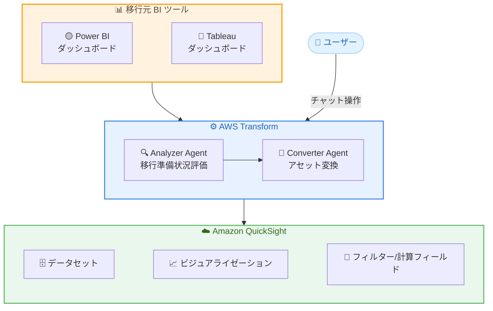

# AWS Transform - BI マイグレーションエージェント

**リリース日**: 2026年5月1日
**サービス**: AWS Transform / Amazon QuickSight
**機能**: Power BI および Tableau から Amazon QuickSight への BI マイグレーションエージェント

[このアップデートのインフォグラフィックを見る](https://takech9203.github.io/aws-news-summary/20260501-quick-bi-migration.html)

## 概要

AWS Transform に、Power BI および Tableau のダッシュボードを Amazon QuickSight (Amazon Quick の BI 機能) に変換する BI マイグレーションエージェントが追加された。これにより、従来は数か月かかっていた BI マイグレーション作業を数日に短縮できる。

これらのエージェントは AWS Advanced Consulting Partner である Wavicle Data Solutions によって構築されており、AWS Transform のエージェント型 AI 機能と統合されている。AWS Marketplace を通じて 4 つのエージェント (Power BI 用の Analyzer と Converter、Tableau 用の Analyzer と Converter) が利用可能である。

チャットベースのインターフェースを使用してソースダッシュボードの移行準備状況を評価し、データセット、計算フィールド、ビジュアライゼーション、フィルターを QuickSight 上に再構築する。すべての処理は自身の AWS アカウント内で実行され、データが環境外に出ることはない。

**アップデート前の課題**

- Tableau や Power BI から Amazon QuickSight への移行に数か月の手作業が必要だった
- ダッシュボードの再構築には各コンポーネント (データセット、計算フィールド、ビジュアライゼーション、フィルター) を個別に手動で移行する必要があった
- 移行準備状況の評価に専門的な知識と時間が必要だった

**アップデート後の改善**

- AI エージェントにより BI マイグレーションを数か月から数日に短縮可能
- チャットベースのインターフェースで移行準備状況の自動評価と変換を実行
- すべての処理が自アカウント内で完結し、データセキュリティを確保
- 移行後は Amazon Quick の AI ワークフロー (自然言語での質問、自動リサーチ、データドリブンアクション) を活用可能

## アーキテクチャ図

ユーザーはチャットインターフェースを通じて AWS Transform の Analyzer Agent でダッシュボードを評価し、Converter Agent で QuickSight アセットに変換するフローを示す。

## サービスアップデートの詳細

### 主要機能

1. **Analyzer Agent (分析エージェント)**
   - 移行元の BI ダッシュボードを自動スキャンし、移行準備状況を評価
   - Power BI 用と Tableau 用の 2 種類が提供
   - チャットベースのインターフェースで対話的に分析結果を確認可能

2. **Converter Agent (変換エージェント)**
   - 評価済みのダッシュボードを Amazon QuickSight アセットに変換
   - データセット、計算フィールド、ビジュアライゼーション、フィルターを再構築
   - Power BI 用と Tableau 用の 2 種類が提供

3. **AWS Transform ワークフロー統合**
   - AWS Transform のエージェント型 AI 機能と完全に統合
   - 専門エージェント、ツール、ナレッジベース、ワークフローを活用
   - すべての処理が顧客の AWS アカウント内で実行される

4. **移行後の活用**
   - 変換後、QuickSight 管理者がダッシュボードの所有権を BI 作成者に割り当て
   - Amazon Quick の AI ワークフロー (自然言語での質問、自動リサーチ、データドリブンアクション) を利用可能

## 技術仕様

### エージェント構成

| 項目 | 詳細 |
|------|------|
| Power BI Analyzer | 移行元 Power BI ダッシュボードの評価 |
| Power BI Converter | Power BI から QuickSight への変換 |
| Tableau Analyzer | 移行元 Tableau ダッシュボードの評価 |
| Tableau Converter | Tableau から QuickSight への変換 |
| 構築パートナー | Wavicle Data Solutions (AWS Advanced Consulting Partner) |
| 処理場所 | 顧客の AWS アカウント内 |

### API 変更履歴

| 日付 | サービス | 変更内容 |
|------|----------|----------|
| 2026/05/01 | [Amazon QuickSight](https://awsapichanges.com/archive/changes/6338dd-quicksight.html) | 23 updated api methods - ControlTitleFormatText、ContextRegion、CreateCustomCapability 等の更新 |

### 変換対象コンポーネント

- データセット
- 計算フィールド
- ビジュアライゼーション
- フィルター

## 設定方法

### 前提条件

1. AWS アカウントを保有していること
2. AWS Transform へのアクセスが有効であること
3. Amazon QuickSight がセットアップ済みであること
4. 移行元の Power BI または Tableau 環境へのアクセス

### 手順

#### ステップ 1: AWS Marketplace からサブスクライブ

AWS Marketplace で該当するエージェントをサブスクライブする。

- [Power BI Migration Agent](https://aws.amazon.com/marketplace/pp/prodview-p7sor3iihijpg)
- [Tableau Migration Agent](https://aws.amazon.com/marketplace/pp/prodview-dkpskx3mnmk6m)

#### ステップ 2: Analyzer Agent で評価

チャットベースのインターフェースを使用して、移行元のダッシュボードの移行準備状況を評価する。Analyzer Agent がダッシュボードの複雑さ、使用されているコンポーネント、移行の互換性を分析する。

#### ステップ 3: Converter Agent で変換

評価結果に基づき、Converter Agent を使用してダッシュボードを QuickSight アセットに変換する。データセット、計算フィールド、ビジュアライゼーション、フィルターが自動的に再構築される。

#### ステップ 4: 検証と公開

QuickSight 管理者が変換されたダッシュボードの所有権を BI 作成者に割り当て、作成者が内容を検証した後に公開する。

## メリット

### ビジネス面

- **大幅な時間短縮**: BI マイグレーションを数か月から数日に短縮し、ビジネスへの影響を最小化
- **コスト削減**: 手動移行に比べて人件費と専門コンサルティング費用を大幅に削減
- **AI 機能の活用**: 移行後に Amazon Quick の AI ワークフローを利用して、より高度な分析が可能

### 技術面

- **データセキュリティ**: すべての処理が顧客の AWS アカウント内で完結し、データが外部に出ない
- **包括的な変換**: データセット、計算フィールド、ビジュアライゼーション、フィルターを一括で移行
- **対話型インターフェース**: チャットベースで操作でき、移行プロセスの透明性が高い

## デメリット・制約事項

### 制限事項

- US East (N. Virginia) リージョンからのみエージェントの利用が可能
- AWS Marketplace 経由でのサブスクリプションが必要
- AWS Transform の利用が前提条件

### 考慮すべき点

- 変換後のダッシュボードは BI 作成者による検証が必要であり、完全自動化ではない
- 移行元ダッシュボードの複雑さによっては、追加の手動調整が必要な場合がある
- Wavicle Data Solutions が構築したサードパーティソリューションであるため、AWS ネイティブサービスとは異なるサポート体系の可能性がある

## ユースケース

### ユースケース 1: 大規模エンタープライズの BI 統合

**シナリオ**: 複数の事業部で Tableau を使用している企業が、Amazon QuickSight に統合して AI 機能を活用したい

**効果**: 数百のダッシュボードを数日で移行し、統一された BI プラットフォーム上で AI ドリブンな分析を実現

### ユースケース 2: Power BI からのクラウドネイティブ移行

**シナリオ**: オンプレミスの Power BI Server を使用している組織が AWS クラウドへの全面移行を計画している

**効果**: Power BI ダッシュボードを QuickSight に自動変換し、クラウドネイティブな BI 環境を迅速に構築。ライセンスコストの削減も期待できる

### ユースケース 3: M&A 後の BI 環境統合

**シナリオ**: 買収した企業が異なる BI ツール (Tableau) を使用しており、自社の QuickSight 環境に統合する必要がある

**効果**: Analyzer Agent で移行準備状況を事前に評価し、Converter Agent で迅速に統合。IT チームの負荷を最小化しながら統合を完了

## 料金

AWS Marketplace を通じたサブスクリプション形式で提供される。具体的な料金は AWS Marketplace の各製品ページを参照。

- [Power BI Migration Agent 料金](https://aws.amazon.com/marketplace/pp/prodview-p7sor3iihijpg)
- [Tableau Migration Agent 料金](https://aws.amazon.com/marketplace/pp/prodview-dkpskx3mnmk6m)

AWS アカウントチームに連絡することで、無料または割引での Amazon Quick マイグレーションプログラムを利用できる場合がある。

## 利用可能リージョン

BI マイグレーションエージェントは US East (N. Virginia) リージョンで利用可能。変換先の QuickSight アセットは、[Amazon QuickSight が利用可能なすべての商用リージョン](https://docs.aws.amazon.com/general/latest/gr/quicksight.html)で作成可能。

## 関連サービス・機能

- **AWS Transform**: エージェント型 AI によるエンタープライズ IT 変革ワークベンチ。クラウド移行、レガシーアプリのモダナイゼーション、技術的負債の削減を加速
- **Amazon QuickSight**: AWS のクラウドネイティブ BI サービス。データ可視化、ダッシュボード作成、ML インサイトを提供
- **Amazon Quick**: AI を活用した業務支援アシスタント。自然言語での質問、ビジネスインサイト、自動化、ノーコードアプリ構築を提供

## 参考リンク

- [インフォグラフィック](https://takech9203.github.io/aws-news-summary/20260501-quick-bi-migration.html)
- [公式発表 (What's New)](https://aws.amazon.com/about-aws/whats-new/2026/05/quick-bi-migration/)
- [AWS Blog - AWS Transform now automates BI migration to Amazon Quick in days](https://aws.amazon.com/blogs/machine-learning/aws-transform-now-automates-bi-migration-to-amazon-quick-in-days/)
- [Wavicle Data Solutions - BI Migration](https://wavicledata.com/bi-migration-aws-transform/)
- [AWS Marketplace - Power BI Migration Agent](https://aws.amazon.com/marketplace/pp/prodview-p7sor3iihijpg)
- [AWS Marketplace - Tableau Migration Agent](https://aws.amazon.com/marketplace/pp/prodview-dkpskx3mnmk6m)
- [Amazon QuickSight ドキュメント](https://docs.aws.amazon.com/general/latest/gr/quicksight.html)

## まとめ

AWS Transform に追加された BI マイグレーションエージェントにより、Power BI や Tableau からの Amazon QuickSight への移行が劇的に簡素化される。従来数か月かかっていた移行作業を数日に短縮できるため、BI プラットフォームの統合やクラウド移行を検討している組織にとって大きな価値がある。まずは AWS Marketplace からサブスクライブするか、AWS アカウントチームに連絡して利用可能なプログラムを確認することを推奨する。
