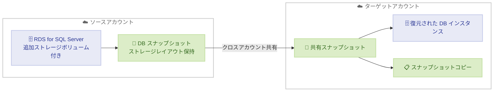

# Amazon RDS for SQL Server - 追加ストレージボリュームのクロスアカウントスナップショット共有

**リリース日**: 2026年5月1日
**サービス**: Amazon RDS for SQL Server
**機能**: 追加ストレージボリュームを含むクロスアカウントスナップショット共有

📊 [このアップデートのインフォグラフィックを見る](https://takech9203.github.io/aws-news-summary/20260501-rds-sqlserver-cross-account-snapshot-sharing-additional-storage-volume.html)

## 概要

Amazon RDS for SQL Server は、追加ストレージボリュームを持つデータベースインスタンスに対するクロスアカウントスナップショット共有をサポートしました。追加ストレージボリュームは、プライマリストレージボリュームに加えて最大 3 つのストレージボリューム (各最大 64 TiB) を追加でき、データベースストレージを最大 256 TiB までスケールすることを可能にする機能です。

今回のアップデートにより、追加ストレージボリュームを設定したデータベースインスタンスのスナップショットを AWS アカウント間で作成、共有、コピーできるようになりました。クロスアカウントスナップショットは、元のデータベースインスタンスのストレージレイアウト (追加ストレージボリュームの構成を含む) を保持します。

この機能は、コンプライアンス要件に基づく分離バックアップ環境の構築や、本番環境の問題調査のために別アカウントでデータベーススナップショットを復元して開発・テストを行うといったユースケースに対応します。

**アップデート前の課題**

- 追加ストレージボリュームを持つ RDS for SQL Server インスタンスのスナップショットをアカウント間で共有できなかった
- 大容量データベース (64 TiB 超) の災害復旧やバックアップを別アカウントで管理するには、手動でのデータ移行が必要だった
- コンプライアンス要件に基づく分離バックアップ環境を、追加ストレージボリューム構成で構築することが困難だった

**アップデート後の改善**

- 追加ストレージボリュームを含むスナップショットをアカウント間で直接共有可能になった
- スナップショット共有時にストレージレイアウト (追加ストレージボリュームの構成) が保持される
- ターゲットアカウントでの復元、同一/異なるリージョンへのコピー、独立したバックアップの作成が可能になった

## アーキテクチャ図



ソースアカウントで追加ストレージボリュームを含む DB スナップショットを作成し、ターゲットアカウントに共有する流れを示しています。ターゲットアカウントでは復元やコピーが可能です。

## サービスアップデートの詳細

### 主要機能

1. **クロスアカウントスナップショット共有**
   - 追加ストレージボリュームを持つ DB インスタンスのスナップショットを別の AWS アカウントに共有可能
   - ストレージレイアウト (追加ストレージボリュームの構成) が完全に保持される
   - AWS Management Console、AWS CLI、AWS SDK から利用可能

2. **ターゲットアカウントでの操作**
   - 共有スナップショットから別の DB インスタンスへの復元
   - 同一リージョンまたは異なるリージョンへのスナップショットコピー
   - 異なる IAM アクセス権限での独立バックアップの作成

3. **追加ストレージボリューム構成の保持**
   - 最大 3 つの追加ストレージボリューム (各最大 64 TiB) の構成が保持される
   - プライマリストレージボリュームと追加ストレージボリュームの完全なレイアウトが復元時に再現される

## 技術仕様

### ストレージ構成

| 項目 | 詳細 |
|------|------|
| プライマリストレージボリューム | 最大 64 TiB |
| 追加ストレージボリューム数 | 最大 3 つ |
| 追加ストレージボリュームあたりの容量 | 最大 64 TiB |
| 合計最大ストレージ容量 | 256 TiB |
| クロスアカウント共有時のレイアウト保持 | あり |

### クロスアカウント操作

| 操作 | サポート |
|------|----------|
| スナップショットの共有 | 対応 |
| スナップショットからの復元 | 対応 |
| 同一リージョンへのコピー | 対応 |
| 異なるリージョンへのコピー | 対応 |
| 独立した IAM 権限でのバックアップ | 対応 |

## 設定方法

### 前提条件

1. ソースアカウントに追加ストレージボリュームを設定した RDS for SQL Server インスタンスが存在すること
2. ターゲットアカウントの AWS アカウント ID を把握していること
3. 適切な IAM 権限が設定されていること

### 手順

#### ステップ 1: DB スナップショットの作成

```bash
aws rds create-db-snapshot \
  --db-instance-identifier my-sql-server-instance \
  --db-snapshot-identifier my-cross-account-snapshot
```

追加ストレージボリュームを持つ RDS for SQL Server インスタンスの手動スナップショットを作成します。

#### ステップ 2: スナップショットの共有

```bash
aws rds modify-db-snapshot-attribute \
  --db-snapshot-identifier my-cross-account-snapshot \
  --attribute-name restore \
  --values-to-add 123456789012
```

ターゲットアカウント (この例では 123456789012) にスナップショットの復元権限を付与します。追加ストレージボリュームの構成はスナップショットとともに保持されます。

#### ステップ 3: ターゲットアカウントでスナップショットを復元

```bash
aws rds restore-db-instance-from-db-snapshot \
  --db-instance-identifier restored-instance \
  --db-snapshot-identifier arn:aws:rds:us-east-1:111122223333:snapshot:my-cross-account-snapshot
```

ターゲットアカウントで共有スナップショットから DB インスタンスを復元します。ストレージレイアウト (追加ストレージボリュームを含む) が再現されます。

## メリット

### ビジネス面

- **コンプライアンス強化**: 分離されたアカウントにバックアップを保持することで、規制要件への適合を実現
- **災害復旧の改善**: 大容量データベースのクロスアカウント DR 戦略を簡素化
- **運用効率の向上**: 手動データ移行の必要性を排除し、スナップショットベースのワークフローで効率化

### 技術面

- **ストレージレイアウト保持**: 追加ストレージボリュームの構成が共有・復元時に維持される
- **大容量対応**: 最大 256 TiB のデータベースに対してクロスアカウント操作が可能
- **マルチリージョン対応**: 共有スナップショットを異なるリージョンにコピー可能

## デメリット・制約事項

### 制限事項

- RDS for SQL Server のみが対象 (他の RDS エンジンについては別途確認が必要)
- スナップショットの暗号化設定によっては、KMS キーポリシーの調整が必要
- ターゲットアカウントでの復元には十分なストレージクォータが必要

### 考慮すべき点

- 暗号化されたスナップショットの共有には、KMS キーへのクロスアカウントアクセス設定が必要
- 大容量スナップショットのコピーには時間がかかる場合がある
- スナップショット共有は手動スナップショットのみサポート (自動バックアップは対象外)

## ユースケース

### ユースケース 1: コンプライアンス要件に基づく分離バックアップ

**シナリオ**: 金融機関が規制要件に基づき、本番データベースのバックアップを完全に分離されたアカウントに保持する必要がある。データベースは 100 TiB を超える大容量。

**実装例**:
```bash
# ソースアカウントでスナップショット作成
aws rds create-db-snapshot \
  --db-instance-identifier prod-sql-server \
  --db-snapshot-identifier compliance-backup-20260501

# バックアップアカウントに共有
aws rds modify-db-snapshot-attribute \
  --db-snapshot-identifier compliance-backup-20260501 \
  --attribute-name restore \
  --values-to-add 999888777666
```

**効果**: 大容量データベースの完全なストレージレイアウトを維持した状態で、分離アカウントにバックアップを保持でき、コンプライアンス要件を満たせる。

### ユースケース 2: 本番問題の調査用環境構築

**シナリオ**: 本番環境で発生したデータ関連の問題を調査するため、開発チームが別アカウントでデータベースを復元してデバッグを行う。

**実装例**:
```bash
# 開発アカウントで共有スナップショットから復元
aws rds restore-db-instance-from-db-snapshot \
  --db-instance-identifier debug-instance \
  --db-snapshot-identifier arn:aws:rds:us-east-1:111122223333:snapshot:prod-snapshot-20260501 \
  --db-instance-class db.m5.xlarge
```

**効果**: 本番環境に影響を与えることなく、実データを使った問題調査が可能。追加ストレージボリュームの構成も保持されるため、本番と同等のストレージレイアウトで再現検証ができる。

### ユースケース 3: クロスリージョン災害復旧

**シナリオ**: 災害復旧計画の一環として、プライマリリージョンの大容量データベーススナップショットを別アカウント・別リージョンにコピーし、DR 環境を維持する。

**実装例**:
```bash
# ターゲットアカウントで別リージョンにコピー
aws rds copy-db-snapshot \
  --source-db-snapshot-identifier arn:aws:rds:us-east-1:111122223333:snapshot:dr-snapshot \
  --target-db-snapshot-identifier dr-copy-us-west-2 \
  --source-region us-east-1 \
  --region us-west-2
```

**効果**: 追加ストレージボリュームを含む大容量データベースの DR 環境を、アカウント分離とリージョン分離の両方を実現しながら構築できる。

## 料金

スナップショットの共有自体に追加料金は発生しません。ただし、以下の標準料金が適用されます。

### 料金例

| 項目 | 料金 |
|------|------|
| スナップショットストレージ | リージョンごとの RDS スナップショットストレージ料金 |
| クロスリージョンコピー | データ転送料金 + コピー先リージョンのスナップショットストレージ料金 |
| 復元した DB インスタンス | 通常の RDS for SQL Server インスタンス料金 |

## 利用可能リージョン

すべての AWS 商用リージョンで利用可能です。

## 関連サービス・機能

- **Amazon RDS 追加ストレージボリューム**: プライマリボリュームに加えて最大 3 つのストレージボリュームを追加し、最大 256 TiB までスケール可能にする機能
- **AWS KMS**: 暗号化されたスナップショットのクロスアカウント共有に必要なキー管理サービス
- **AWS IAM**: ターゲットアカウントでのスナップショット操作に対するアクセス制御

## 参考リンク

- 📊 [インフォグラフィック](https://takech9203.github.io/aws-news-summary/20260501-rds-sqlserver-cross-account-snapshot-sharing-additional-storage-volume.html)
- [公式発表 (What's New)](https://aws.amazon.com/about-aws/whats-new/2026/05/rds-sqlserver-cross-account-snapshot-sharing-additional-storage-volume/)
- [ドキュメント - Sharing a DB snapshot](https://docs.aws.amazon.com/AmazonRDS/latest/UserGuide/USER_ShareSnapshot.html)
- [ドキュメント - Copying a DB snapshot](https://docs.aws.amazon.com/AmazonRDS/latest/UserGuide/USER_CopySnapshot.html)
- [ドキュメント - Working with storage in RDS for SQL Server](https://docs.aws.amazon.com/AmazonRDS/latest/UserGuide/CHAP_SQLServer.Storage.html)
- [料金ページ](https://aws.amazon.com/rds/sqlserver/pricing/)

## まとめ

Amazon RDS for SQL Server の追加ストレージボリュームに対するクロスアカウントスナップショット共有のサポートにより、大容量データベース (最大 256 TiB) のバックアップ、災害復旧、およびコンプライアンス対応が大幅に簡素化されました。ストレージレイアウトが完全に保持されるため、追加ストレージボリュームを活用している環境でも安心してクロスアカウント運用を導入できます。この機能はすべての AWS 商用リージョンで利用可能であり、AWS Management Console、CLI、SDK から即座に利用を開始できます。
