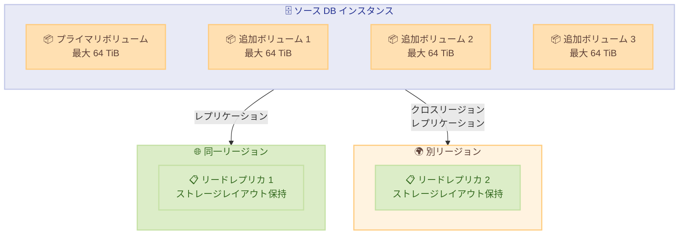

# Amazon RDS for SQL Server - 追加ストレージボリュームでのリードレプリカサポート

**リリース日**: 2026年5月1日
**サービス**: Amazon RDS for SQL Server
**機能**: 追加ストレージボリューム (ASV) を持つ DB インスタンスでのリードレプリカ作成

[このアップデートのインフォグラフィックを見る](https://takech9203.github.io/aws-news-summary/20260501-rds-sqlserver-supports-read-replica-for-asv.html)

## 概要

Amazon RDS for SQL Server が、追加ストレージボリューム (Additional Storage Volumes) を構成した DB インスタンスでリードレプリカの作成をサポートしました。追加ストレージボリュームは、プライマリストレージボリュームに加えて最大 3 つのストレージボリューム (各最大 64 TiB) を追加することで、データベースストレージを最大 256 TiB までスケールできる機能です。

今回のアップデートにより、追加ストレージボリュームを構成した大容量データベースでも、同一リージョンおよびクロスリージョンのリードレプリカを作成できるようになりました。リードレプリカ作成時にはソースインスタンスのストレージレイアウトが保持され、作成後はソースとレプリカで独立してストレージボリューム構成を管理できます。

**アップデート前の課題**

- 追加ストレージボリュームを使用した大容量 SQL Server DB インスタンスではリードレプリカを作成できなかった
- 大容量データベースの読み取りスケーリングを行うには、別途手動でデータベースを構築する必要があった
- クロスリージョンでのディザスタリカバリ構成が、追加ストレージボリューム利用時には制限されていた

**アップデート後の改善**

- 追加ストレージボリュームを構成した DB インスタンスから、同一リージョンおよびクロスリージョンのリードレプリカを作成可能になった
- リードレプリカがソースインスタンスのストレージレイアウト (追加ストレージボリュームの構成を含む) を自動的に保持する
- 作成後はソースとレプリカのストレージボリューム構成を独立して管理できるため、柔軟な運用が可能になった

## アーキテクチャ図



追加ストレージボリュームを持つソース DB インスタンスから、同一リージョンおよびクロスリージョンのリードレプリカを作成する構成を示しています。レプリカはソースのストレージレイアウトを保持して作成されます。

## サービスアップデートの詳細

### 主要機能

1. **追加ストレージボリューム対応のリードレプリカ作成**
   - プライマリ + 最大 3 つの追加ストレージボリュームを持つインスタンスからレプリカを作成可能
   - 最大 256 TiB のデータベースストレージ構成をそのままレプリケーション
   - 既存のリードレプリカ機能と同様の操作方法で利用可能

2. **ストレージレイアウトの自動保持**
   - リードレプリカ作成時にソースインスタンスのストレージレイアウトを自動的に複製
   - 追加ストレージボリュームの数と構成がレプリカに反映される
   - データの整合性を保ちながらレプリケーションを実行

3. **独立したストレージ管理**
   - 初期作成後はソースとレプリカのストレージボリューム構成を個別に管理可能
   - レプリカ側で追加ストレージボリュームのサイズ変更や追加が独立して可能
   - ワークロードに応じた柔軟なストレージ最適化が実現

## 技術仕様

### ストレージ構成

| 項目 | 詳細 |
|------|------|
| プライマリストレージボリューム | 最大 64 TiB |
| 追加ストレージボリューム数 | 最大 3 つ |
| 追加ストレージボリュームあたりの容量 | 最大 64 TiB |
| 合計最大ストレージ容量 | 256 TiB |
| レプリカタイプ | 同一リージョン、クロスリージョン |

### サポートされる操作方法

| 方法 | 詳細 |
|------|------|
| AWS Management Console | GUI からリードレプリカを作成 |
| AWS CLI | `create-db-instance-read-replica` コマンドを使用 |
| AWS SDK | 各言語の SDK から API を呼び出し |

## 設定方法

### 前提条件

1. Amazon RDS for SQL Server の DB インスタンスが追加ストレージボリュームで構成されていること
2. ソースインスタンスで自動バックアップが有効になっていること
3. クロスリージョンレプリカの場合、ターゲットリージョンで RDS が利用可能であること

### 手順

#### ステップ 1: ソースインスタンスの確認

```bash
aws rds describe-db-instances \
  --db-instance-identifier my-sql-server-instance \
  --query "DBInstances[0].{StorageType:StorageType,AllocatedStorage:AllocatedStorage}"
```

ソースインスタンスのストレージ構成を確認し、追加ストレージボリュームが構成されていることを確認します。

#### ステップ 2: 同一リージョンリードレプリカの作成

```bash
aws rds create-db-instance-read-replica \
  --db-instance-identifier my-sql-server-replica \
  --source-db-instance-identifier my-sql-server-instance
```

同一リージョンにリードレプリカを作成します。追加ストレージボリュームの構成はソースインスタンスから自動的に引き継がれます。

#### ステップ 3: クロスリージョンリードレプリカの作成

```bash
aws rds create-db-instance-read-replica \
  --db-instance-identifier my-sql-server-replica-dr \
  --source-db-instance-identifier arn:aws:rds:us-east-1:123456789012:db:my-sql-server-instance \
  --region us-west-2
```

クロスリージョンにリードレプリカを作成します。ソースインスタンスは ARN で指定し、ターゲットリージョンを `--region` パラメータで指定します。

## メリット

### ビジネス面

- **ディザスタリカバリの強化**: 大容量データベースでもクロスリージョンレプリカにより、事業継続性を確保できる
- **読み取りパフォーマンスの向上**: 大規模なレポーティングやアナリティクスワークロードをレプリカにオフロードし、本番環境への影響を軽減
- **運用の簡素化**: 手動でのデータベース複製が不要になり、運用工数とコストを削減

### 技術面

- **ストレージレイアウトの自動保持**: レプリカ作成時に追加ストレージボリュームの構成を手動で再現する必要がない
- **独立したストレージ管理**: ソースとレプリカで異なるストレージ要件に対応可能
- **既存ツールとの互換性**: AWS Management Console、CLI、SDK から既存の操作フローでそのまま利用可能

## デメリット・制約事項

### 制限事項

- 追加ストレージボリュームの合計容量が大きい場合、レプリカの初期作成に時間がかかる可能性がある
- リードレプリカは読み取り専用であり、書き込み操作はソースインスタンスでのみ実行可能
- クロスリージョンレプリカではデータ転送料金が発生する

### 考慮すべき点

- レプリカのストレージ構成をソースと異なるものに変更する場合、パフォーマンスへの影響を検証すること
- 大容量ストレージのレプリケーション遅延を監視し、許容範囲内であることを確認すること

## ユースケース

### ユースケース 1: 大規模データウェアハウスの読み取りスケーリング

**シナリオ**: 100 TiB を超える SQL Server データベースで、レポーティングクエリが本番ワークロードに影響を与えている

**実装例**:
```bash
# 大容量 DB インスタンスのリードレプリカを作成
aws rds create-db-instance-read-replica \
  --db-instance-identifier reporting-replica \
  --source-db-instance-identifier production-sql-server \
  --db-instance-class db.r6i.8xlarge
```

**効果**: レポーティングワークロードをレプリカにオフロードし、本番データベースのパフォーマンスを維持しながら、大容量データへのクエリを高速に実行可能

### ユースケース 2: クロスリージョン DR 構成

**シナリオ**: 規制要件により、大容量 SQL Server データベースのクロスリージョンバックアップが必要

**実装例**:
```bash
# DR 用のクロスリージョンレプリカを作成
aws rds create-db-instance-read-replica \
  --db-instance-identifier dr-replica-west \
  --source-db-instance-identifier arn:aws:rds:ap-northeast-1:123456789012:db:production-db \
  --region ap-southeast-1
```

**効果**: 大容量データベースのクロスリージョン DR を自動化し、RTO/RPO の目標を達成。手動でのデータ移行作業を排除

### ユースケース 3: データ分析基盤との統合

**シナリオ**: 複数の追加ストレージボリュームに分散されたデータを、分析チームが本番に影響を与えずにアクセスしたい

**実装例**:
```bash
# 分析専用レプリカの作成
aws rds create-db-instance-read-replica \
  --db-instance-identifier analytics-replica \
  --source-db-instance-identifier main-sql-server \
  --db-instance-class db.r6i.4xlarge

# レプリカのエンドポイントを分析ツールに設定
aws rds describe-db-instances \
  --db-instance-identifier analytics-replica \
  --query "DBInstances[0].Endpoint"
```

**効果**: 分析チームが全ストレージボリュームのデータにアクセス可能になり、本番環境への影響なくデータ分析を実行可能

## 料金

リードレプリカの料金は、通常の Amazon RDS for SQL Server インスタンス料金に準じます。

### 料金の構成要素

| 項目 | 説明 |
|------|------|
| DB インスタンス料金 | レプリカのインスタンスクラスに応じた時間料金 |
| ストレージ料金 | レプリカのストレージ使用量に応じた月額料金 |
| データ転送料金 | クロスリージョンレプリカの場合、リージョン間データ転送料金が発生 |

詳細は [Amazon RDS for SQL Server の料金ページ](https://aws.amazon.com/rds/sqlserver/pricing/) を参照してください。

## 利用可能リージョン

すべての AWS 商用リージョンおよび AWS GovCloud (US) リージョンで利用可能です。

## 関連サービス・機能

- **Amazon RDS Additional Storage Volumes**: プライマリボリュームに加えて最大 3 つのストレージボリュームを追加し、最大 256 TiB までスケール可能にする機能
- **Amazon RDS リードレプリカ**: 読み取りワークロードのスケーリングやディザスタリカバリに使用されるリードオンリーの DB インスタンス
- **Amazon RDS Multi-AZ**: 高可用性のためのスタンバイレプリカを別の AZ に配置する機能

## 参考リンク

- [インフォグラフィック](https://takech9203.github.io/aws-news-summary/20260501-rds-sqlserver-supports-read-replica-for-asv.html)
- [公式発表 (What's New)](https://aws.amazon.com/about-aws/whats-new/2026/05/rds-sqlserver-supports-read-replica-for-asv/)
- [Working with read replicas for Amazon RDS for SQL Server](https://docs.aws.amazon.com/AmazonRDS/latest/UserGuide/SQLServer.ReadReplicas.html)
- [Working with storage in RDS for SQL Server](https://docs.aws.amazon.com/AmazonRDS/latest/UserGuide/CHAP_Storage.html)
- [Amazon RDS for SQL Server 料金](https://aws.amazon.com/rds/sqlserver/pricing/)

## まとめ

Amazon RDS for SQL Server が追加ストレージボリューム構成のリードレプリカをサポートしたことで、大容量 (最大 256 TiB) の SQL Server データベースでも読み取りスケーリングやクロスリージョン DR を容易に実現できるようになりました。追加ストレージボリュームを活用して大容量データベースを運用しているユーザーは、AWS Management Console、CLI、または SDK からリードレプリカを作成し、読み取りワークロードの分散やディザスタリカバリ体制の強化を検討することを推奨します。
