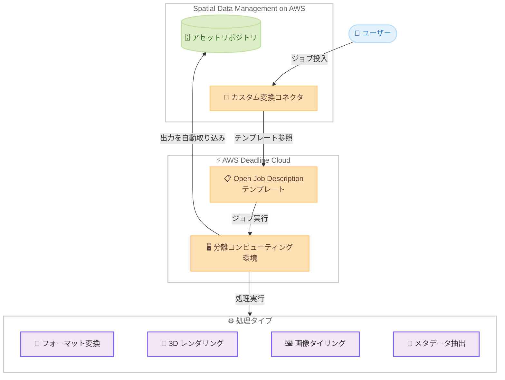

# Spatial Data Management on AWS - カスタム変換コネクタの追加

**リリース日**: 2026年5月1日
**サービス**: Spatial Data Management on AWS (SDMA)
**機能**: カスタム変換コネクタ、統合デスクトップクライアントインストーラー

[このアップデートのインフォグラフィックを見る](https://takech9203.github.io/aws-news-summary/20260501-spatial-data-management-aws.html)

## 概要

Spatial Data Management on AWS (SDMA) にカスタム変換コネクタと統合デスクトップクライアントインストーラーが追加された。カスタム変換コネクタにより、フォーマット変換、3D レンダリング、画像タイリング、メタデータ抽出などの計算集約型処理を、AWS Deadline Cloud の Open Job Description テンプレートを使用してジョブとして実行できるようになった。

この機能は、空間データパイプライン全体で処理ワークロードを自動化およびチェーンする必要があるユーザーを対象としている。SDMA の組み込みコンテンツ分析をカスタムロジックで拡張し、フォーマット検証、属性抽出、専用コンピューティングリソースを必要とする変換を実行できる。

**アップデート前の課題**

- SDMA の組み込み処理機能のみに依存しており、カスタム変換処理を統合的に実行できなかった
- 計算集約型の処理 (3D レンダリング、画像タイリングなど) を SDMA のワークフローに組み込むには、外部システムとの手動連携が必要だった
- デスクトップクライアントのインストール時に CLI やその他のコンポーネントを個別にインストールする必要があった

**アップデート後の改善**

- Open Job Description テンプレートを使用して、カスタム変換処理を AWS Deadline Cloud にジョブとして投入可能になった
- コネクタが分離されたコンピューティング環境で実行され、宣言された出力が自動的に SDMA のガバナンス付きアセットリポジトリに取り込まれるようになった
- スタンドアロンインストーラーにより、必要な依存関係がすべてバンドルされ、セットアップが簡素化された

## アーキテクチャ図



カスタム変換コネクタが AWS Deadline Cloud と連携し、分離されたコンピューティング環境で処理を実行した後、結果を SDMA のアセットリポジトリに自動取り込みする流れを示している。

## サービスアップデートの詳細

### 主要機能

1. **カスタム変換コネクタ**
   - AWS Deadline Cloud の Open Job Description テンプレートを使用してジョブを定義
   - フォーマット変換、3D レンダリング、画像タイリング、メタデータ抽出などの計算集約型処理に対応
   - SDMA の組み込みコンテンツ分析をカスタムロジックで拡張可能
   - フォーマット検証、属性抽出、専用コンピューティングリソースを必要とする変換を実行

2. **分離コンピューティング環境でのジョブ実行**
   - コネクタは分離されたコンピューティング環境で実行される
   - 宣言された出力が自動的に SDMA のガバナンス付きアセットリポジトリに取り込まれる
   - 処理ワークロードを空間データパイプライン全体で自動化およびチェーン可能

3. **統合デスクトップクライアントインストーラー**
   - スタンドアロンインストーラーとして提供
   - 必要な依存関係をすべてバンドル
   - CLI やその他のコンポーネントの個別インストールが不要

## 技術仕様

### カスタム変換コネクタの構成要素

| 項目 | 詳細 |
|------|------|
| ジョブ定義 | Open Job Description テンプレート |
| 実行基盤 | AWS Deadline Cloud |
| 実行環境 | 分離コンピューティング環境 |
| 出力先 | SDMA ガバナンス付きアセットリポジトリ |
| サポート処理 | フォーマット変換、3D レンダリング、画像タイリング、メタデータ抽出 |

### API 変更履歴

| 日付 | サービス | 変更内容 |
|------|----------|----------|
| 2026/04/29 | [AWSDeadlineCloud](https://awsapichanges.com/archive/changes/05dafe-deadline.html) | 4 updated api methods - rtx-pro-server-6000 GPU アクセラレータのサポート追加 |

### Open Job Description テンプレートの概要

Open Job Description (OpenJD) は、レンダーファームやコンピューティングクラスターでのジョブ実行を定義するためのオープンな仕様である。SDMA のカスタム変換コネクタでは、このテンプレートを使用して処理ジョブの入力、実行コマンド、出力を宣言的に定義する。

```yaml
# Open Job Description テンプレート例
specificationVersion: jobtemplate-2023-09
name: "SpatialDataTransformation"
steps:
  - name: "FormatConversion"
    parameterSpace:
      taskParameterDefinitions:
        - name: "InputFile"
          type: PATH
          range: "{{Param.InputFiles}}"
    script:
      actions:
        onRun:
          command: "/usr/local/bin/convert"
          args:
            - "{{Task.Param.InputFile}}"
            - "--output"
            - "{{Param.OutputDir}}"
```

## 設定方法

### 前提条件

1. SDMA がデプロイ済みであること
2. AWS Deadline Cloud のファームおよびフリートが設定済みであること
3. Open Job Description テンプレートが作成済みであること
4. 必要な IAM 権限が付与されていること

### 手順

#### ステップ 1: Open Job Description テンプレートの作成

```yaml
specificationVersion: jobtemplate-2023-09
name: "CustomTransformation"
steps:
  - name: "ProcessSpatialData"
    script:
      actions:
        onRun:
          command: "python3"
          args:
            - "/scripts/transform.py"
            - "--input"
            - "{{Param.InputPath}}"
            - "--output"
            - "{{Param.OutputPath}}"
```

SDMA で実行する変換処理を Open Job Description テンプレートとして定義する。入力ファイル、実行コマンド、出力先を宣言的に記述する。

#### ステップ 2: カスタム変換コネクタの設定

SDMA のコンソールまたは API からカスタム変換コネクタを作成し、Open Job Description テンプレートと AWS Deadline Cloud のファームを紐付ける。

#### ステップ 3: デスクトップクライアントのインストール

統合インストーラーをダウンロードして実行する。必要な依存関係がすべてバンドルされているため、追加のインストール作業は不要である。

## メリット

### ビジネス面

- **ワークフロー自動化**: 空間データパイプライン全体で処理ワークロードを自動化し、手動作業を削減
- **柔軟な拡張性**: 組み込み処理に加えてカスタムロジックを追加でき、多様なビジネス要件に対応可能
- **オンボーディング簡素化**: 統合インストーラーにより新規ユーザーのセットアップ時間を短縮

### 技術面

- **分離実行環境**: コネクタが分離されたコンピューティング環境で実行されるため、セキュリティとリソース分離が確保される
- **自動出力取り込み**: 処理結果が自動的にガバナンス付きリポジトリに取り込まれ、データ管理の一貫性を維持
- **ジョブチェーン**: 複数の変換処理をチェーンして実行でき、複雑なデータ処理パイプラインを構築可能

## デメリット・制約事項

### 制限事項

- 対応リージョンが限定的 (9 リージョン)
- AWS Deadline Cloud の設定が前提条件として必要
- Open Job Description テンプレートの作成には仕様の理解が必要

### 考慮すべき点

- カスタム変換コネクタの実行コストは AWS Deadline Cloud のコンピューティングリソース使用量に依存する
- 大規模なデータセットの処理では、適切なフリートサイジングの検討が必要

## ユースケース

### ユースケース 1: 地理空間データのフォーマット変換

**シナリオ**: 建設会社が複数のベンダーから異なるフォーマット (LAS、E57、IFC) の 3D スキャンデータを受領し、社内標準フォーマットに統一する必要がある。

**実装例**:
```yaml
specificationVersion: jobtemplate-2023-09
name: "PointCloudConversion"
steps:
  - name: "ConvertToStandard"
    script:
      actions:
        onRun:
          command: "pdal"
          args:
            - "pipeline"
            - "--input"
            - "{{Task.Param.InputFile}}"
            - "--output-format"
            - "LAZ"
```

**効果**: 受領データの自動変換により、手動変換作業の工数を削減し、データ品質の一貫性を確保できる。

### ユースケース 2: 大規模画像の自動タイリング

**シナリオ**: 衛星画像プロバイダーが高解像度の衛星画像をウェブ配信用のタイルピラミッドに自動変換する。

**実装例**:
```yaml
specificationVersion: jobtemplate-2023-09
name: "ImageTiling"
steps:
  - name: "GenerateTiles"
    script:
      actions:
        onRun:
          command: "gdal2tiles.py"
          args:
            - "--zoom=0-18"
            - "--processes=4"
            - "{{Task.Param.InputRaster}}"
            - "{{Param.OutputTileDir}}"
```

**効果**: 大規模な衛星画像の処理を AWS Deadline Cloud の分散コンピューティングで実行し、処理時間を大幅に短縮できる。

### ユースケース 3: BIM モデルのメタデータ抽出と検証

**シナリオ**: 設計事務所が BIM モデルからメタデータを自動抽出し、プロジェクト標準への準拠を検証する。

**実装例**:
```yaml
specificationVersion: jobtemplate-2023-09
name: "BIMMetadataExtraction"
steps:
  - name: "ExtractAndValidate"
    script:
      actions:
        onRun:
          command: "python3"
          args:
            - "/scripts/extract_bim_metadata.py"
            - "--input"
            - "{{Task.Param.IFCFile}}"
            - "--schema"
            - "/schemas/project_standard.json"
```

**効果**: BIM モデルの品質検証を自動化し、設計標準への準拠率を向上させつつ、レビュー工数を削減できる。

## 料金

SDMA はオープンソースの AWS ソリューションとして提供されており、ソリューション自体の利用料金は無料である。ただし、以下の AWS サービスの使用に応じたコストが発生する。

### 料金例

| リソース | 料金体系 |
|----------|----------|
| AWS Deadline Cloud | ジョブ実行時のコンピューティングリソース使用量に応じた従量課金 |
| Amazon S3 | アセットストレージの容量に応じた従量課金 |
| Amazon EC2 | Deadline Cloud フリートのインスタンス使用量 |

## 利用可能リージョン

以下の AWS リージョンで利用可能。

- アジアパシフィック: 東京 (ap-northeast-1)、シンガポール (ap-southeast-1)、シドニー (ap-southeast-2)
- ヨーロッパ: フランクフルト (eu-central-1)、アイルランド (eu-west-1)、ロンドン (eu-west-2)
- 米国東部: バージニア北部 (us-east-1)、オハイオ (us-east-2)
- 米国西部: オレゴン (us-west-2)

## 関連サービス・機能

- **AWS Deadline Cloud**: カスタム変換コネクタのジョブ実行基盤として使用。Open Job Description テンプレートに基づくジョブスケジューリングと分散処理を提供
- **Open Job Description**: ジョブの定義に使用するオープン仕様。入力、実行コマンド、出力を宣言的に定義
- **Amazon S3**: SDMA のアセットリポジトリのバックエンドストレージとして使用

## 参考リンク

- [インフォグラフィック](https://takech9203.github.io/aws-news-summary/20260501-spatial-data-management-aws.html)
- [公式発表 (What's New)](https://aws.amazon.com/about-aws/whats-new/2026/05/spatial-data-management-aws/)
- [SDMA コネクタの概要 - ドキュメント](https://docs.aws.amazon.com/solutions/latest/spatial-data-management-on-aws/connectors-overview.html)
- [SDMA ソリューションページ](https://aws.amazon.com/solutions/implementations/spatial-data-management-on-aws/)

## まとめ

Spatial Data Management on AWS へのカスタム変換コネクタの追加により、空間データの処理パイプラインに柔軟なカスタム処理を組み込めるようになった。AWS Deadline Cloud との統合により、計算集約型の処理を分離されたコンピューティング環境でスケーラブルに実行でき、結果を自動的にガバナンス付きリポジトリに取り込むことができる。空間データを扱う組織は、Open Job Description テンプレートの作成から始めて、既存のデータ処理ワークフローの自動化を検討することを推奨する。
