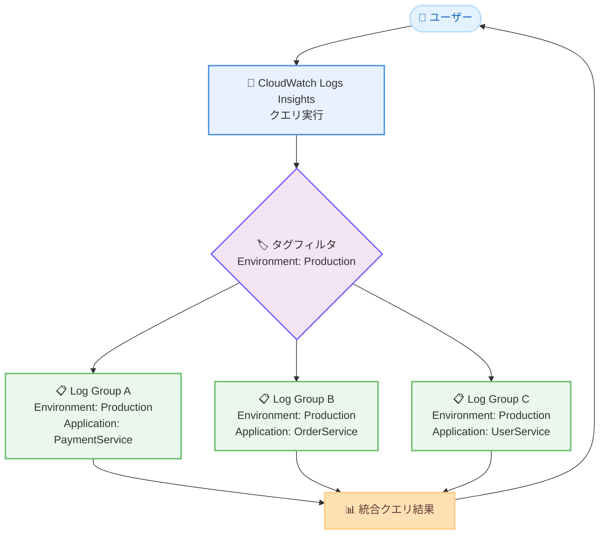

# Amazon CloudWatch Logs Insights - タグによるロググループクエリ

**リリース日**: 2026年5月4日
**サービス**: Amazon CloudWatch Logs
**機能**: CloudWatch Logs Insights でのタグベースクエリ

[このアップデートのインフォグラフィックを見る](https://takech9203.github.io/aws-news-summary/20260504-amazon-cloudwatch-logs-query-by-tags.html)

## 概要

Amazon CloudWatch Logs Insights のクエリ言語が拡張され、ロググループに付与されたタグを使用してクエリを実行できるようになった。これにより、ロググループ名を個別に指定することなく、共通のタグを持つロググループ全体に対してログ分析を実行できる。

タグはロググループに割り当てるキーバリューペアで、`Environment: Production`、`Application: PaymentService`、`Owner: TeamName` のような形でリソースを分類するために使用される。今回のアップデートにより、ロググループ名、データソース、ファセットに加えて、タグをクエリ条件として指定可能になった。

**アップデート前の課題**

- CloudWatch Logs Insights でクエリを実行する際、対象のロググループ名を個別に明示的に指定する必要があった
- 環境が拡大しロググループが増加するたびに、クエリ対象のロググループリストを手動で更新する運用負荷が発生していた
- 特定のアプリケーションやチームに関連するログを横断分析する場合、対象のロググループを事前に把握して列挙する必要があった

**アップデート後の改善**

- タグを指定するだけで、共通タグを持つすべてのロググループに対してクエリを実行可能になった
- ロググループにタグが追加・削除されると、クエリ結果が自動的に最新の状態を反映するため、手動メンテナンスが不要になった
- 環境の成長に伴う運用オーバーヘッドが大幅に削減された

## アーキテクチャ図



タグ `Environment: Production` を指定してクエリを実行すると、該当タグを持つすべてのロググループが自動的にクエリ対象となり、統合された結果が返される。

## サービスアップデートの詳細

### 主要機能

1. **タグベースのロググループ選択**
   - ロググループに付与されたタグのキーと値を条件としてクエリ対象を指定可能
   - 複数のタグ条件を組み合わせたフィルタリングに対応
   - 既存のロググループ名指定、データソース指定、ファセット指定と併用可能

2. **動的なクエリ対象の更新**
   - ロググループにタグが追加されると、次回のクエリ実行時から自動的にクエリ対象に含まれる
   - タグが削除されると、そのロググループはクエリ対象から自動的に除外される
   - クエリ定義の変更なしに、環境の変化に追従する

3. **既存のクエリ手法との統合**
   - ロググループ名による指定(従来方式)
   - データソースによる指定
   - ファセットによる指定
   - タグによる指定(今回追加)

## 技術仕様

### クエリ対象指定方法の比較

| 指定方法 | 説明 | ユースケース |
|------|------|------|
| ロググループ名 | 個別のロググループ名を明示的に指定 | 特定のロググループのみを対象とする場合 |
| データソース | データソースの種類で指定 | 特定のデータソース種別のログを分析する場合 |
| ファセット | ファセット属性で指定 | 属性ベースのフィルタリング |
| タグ | キーバリューペアで指定 | 環境、アプリケーション、チーム単位での横断分析 |

### API 変更履歴

| 日付 | サービス | 変更内容 |
|------|----------|----------|
| 2026/05/01 | [Amazon CloudWatch Logs](https://awsapichanges.com/archive/changes/6338dd-logs.html) | 1 updated api method - ListLogGroups に logGroupTags パラメータを追加 |

### ListLogGroups API の新パラメータ

```json
{
  "logGroupTags": [
    {
      "key": "Environment",
      "values": ["Production"]
    },
    {
      "key": "Application",
      "values": ["PaymentService", "OrderService"]
    }
  ]
}
```

### 必要な IAM 権限

```json
{
  "Version": "2012-10-17",
  "Statement": [
    {
      "Effect": "Allow",
      "Action": [
        "logs:StartQuery",
        "logs:GetQueryResults",
        "logs:ListLogGroups",
        "tag:GetResources"
      ],
      "Resource": "*"
    }
  ]
}
```

## 設定方法

### 前提条件

1. CloudWatch Logs Insights へのアクセス権限を持つ IAM ユーザーまたはロール
2. クエリ対象のロググループにタグが付与されていること
3. `logs:StartQuery` および `tag:GetResources` の権限が付与されていること

### 手順

#### ステップ 1: ロググループにタグを付与

```bash
aws logs tag-resource \
  --resource-arn arn:aws:logs:ap-northeast-1:123456789012:log-group:/aws/lambda/my-function \
  --tags Environment=Production,Application=PaymentService,Owner=TeamA
```

対象のロググループに分類用のタグを付与する。複数のロググループに共通のタグを設定することで、タグベースクエリの対象グループとなる。

#### ステップ 2: タグを使用してクエリを実行

```bash
aws logs start-query \
  --log-group-tags '[{"key":"Environment","values":["Production"]}]' \
  --start-time $(date -d '1 hour ago' +%s) \
  --end-time $(date +%s) \
  --query-string 'fields @timestamp, @message | filter @message like /ERROR/ | sort @timestamp desc | limit 20'
```

`--log-group-tags` パラメータにタグ条件を指定してクエリを開始する。指定したタグを持つすべてのロググループが自動的にクエリ対象となる。

#### ステップ 3: クエリ結果を取得

```bash
aws logs get-query-results \
  --query-id "12345678-1234-1234-1234-123456789012"
```

`start-query` で返されたクエリ ID を使用して結果を取得する。

## メリット

### ビジネス面

- **運用コストの削減**: ロググループの追加・削除時にクエリ定義を手動で更新する作業が不要になり、運用チームの工数を削減
- **環境拡大への自動対応**: マイクロサービスのスケールアウトやアプリケーション追加時に、タグさえ付与すれば既存のクエリが自動的に新しいロググループを含む
- **チーム間コラボレーションの改善**: チーム名やアプリケーション名のタグで横断分析が容易になり、インシデント対応やパフォーマンス分析の効率が向上

### 技術面

- **クエリ管理の簡素化**: ロググループ名のハードコーディングが不要になり、クエリのメンテナンスが大幅に削減
- **動的なスコーピング**: タグの追加・削除でクエリ対象が自動更新されるため、Infrastructure as Code との親和性が高い
- **柔軟なフィルタリング**: 環境、アプリケーション、チームなど多次元でのログ分類と横断分析が可能

## デメリット・制約事項

### 制限事項

- タグの変更がクエリ結果に反映されるタイミングについて、即時反映か eventual consistency かの詳細は公式ドキュメントでの確認が必要
- ロググループに付与できるタグの上限は 50 個(既存の CloudWatch Logs 制限)
- タグのキーは最大 128 文字、値は最大 256 文字

### 考慮すべき点

- タグベースクエリを効果的に活用するには、組織全体で一貫したタグ付け戦略を策定する必要がある
- タグが未設定のロググループはタグベースクエリの対象外となるため、既存のロググループへのタグ付与作業が発生する可能性がある
- `tag:GetResources` の API コール制限に注意が必要(大量のロググループがある場合)

## ユースケース

### ユースケース 1: 本番環境の横断的なエラー監視

**シナリオ**: 本番環境で稼働する全マイクロサービスのエラーログを一括で監視したい。サービスは頻繁に追加・廃止される。

**実装例**:
```
# Environment: Production タグを持つ全ロググループを対象にエラーを検索
fields @timestamp, @message, @logStream
| filter @message like /ERROR|CRITICAL/
| sort @timestamp desc
| limit 100
```

**効果**: 新しいマイクロサービスが追加されても `Environment: Production` タグを付与するだけでモニタリング対象に自動追加される。

### ユースケース 2: チーム別のログ分析

**シナリオ**: 各開発チームが担当するサービスのログを、チームメンバーが簡単に横断検索したい。

**実装例**:
```
# Owner: TeamPayments タグで決済チームの全ログを分析
fields @timestamp, @message, @logStream
| filter @message like /latency/
| stats avg(latency) as avg_latency by bin(5m)
```

**効果**: チームが新しいサービスをデプロイする際に `Owner` タグを設定するだけで、既存のダッシュボードやアラートクエリに自動的に含まれる。

### ユースケース 3: コスト配分単位でのログ分析

**シナリオ**: AWS のコスト配分タグと連動し、プロジェクト単位でのログ使用量やエラー傾向を分析したい。

**実装例**:
```
# CostCenter: CC-1234 タグで特定コストセンターのログ量を分析
fields @timestamp, @message
| stats count(*) as log_count by bin(1h)
```

**効果**: コスト配分レポートと同じタグ体系でログ分析が可能になり、プロジェクト単位でのログコスト最適化を支援する。

## 料金

CloudWatch Logs Insights のタグベースクエリ機能自体に追加料金は発生しない。既存の CloudWatch Logs Insights の料金体系が適用される。

### 料金例

| 使用量 | 月額料金(概算) |
|--------|------------------|
| スキャンデータ 1 GB | $0.0076 (ap-northeast-1) |
| スキャンデータ 100 GB | $0.76 (ap-northeast-1) |

※ ログの取り込みおよび保存に関する料金は別途発生する。

## 利用可能リージョン

すべての商用 AWS リージョンおよび AWS GovCloud (US) リージョンで利用可能。

## 関連サービス・機能

- **Amazon CloudWatch Logs Insights**: ログデータのインタラクティブな検索と分析を提供するクエリエンジン
- **AWS Resource Groups Tag Editor**: 複数の AWS リソースに対して一括でタグを管理するツール
- **AWS Organizations Tag Policies**: 組織全体でタグの命名規則を強制するポリシー機能
- **Amazon CloudWatch Contributor Insights**: ログデータからトップ N のコントリビュータを自動的に可視化

## 参考リンク

- [インフォグラフィック](https://takech9203.github.io/aws-news-summary/20260504-amazon-cloudwatch-logs-query-by-tags.html)
- [公式発表 (What's New)](https://aws.amazon.com/about-aws/whats-new/2026/05/amazon-cloudwatch-logs-query-by-tags/)
- [CloudWatch Logs Insights ドキュメント](https://docs.aws.amazon.com/AmazonCloudWatch/latest/logs/CWL_AnalyzeLogData_LogsInsights.html)
- [CloudWatch Logs 料金ページ](https://aws.amazon.com/cloudwatch/pricing/)

## まとめ

Amazon CloudWatch Logs Insights のタグベースクエリは、大規模環境でのログ分析における運用効率を大幅に改善するアップデートである。特にマイクロサービスアーキテクチャやマルチチーム環境において、タグ付け戦略と組み合わせることで、ロググループの増減に自動対応するクエリ管理が実現できる。まずは既存のロググループに対して環境、アプリケーション、オーナーなどの分類タグを付与し、タグベースクエリへの移行を検討することを推奨する。
