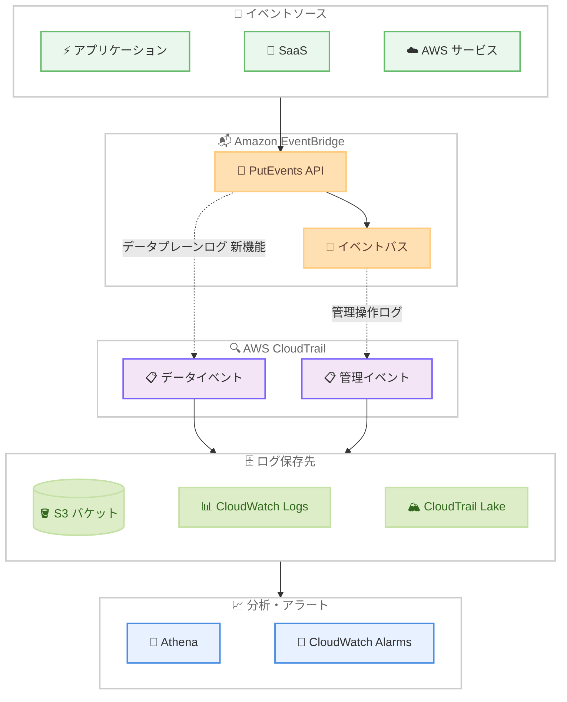

# Amazon EventBridge - データプレーン API の AWS CloudTrail ロギングサポート

**リリース日**: 2026年5月4日
**サービス**: Amazon EventBridge
**機能**: データプレーン API の AWS CloudTrail ロギング

📊 [このアップデートのインフォグラフィックを見る](https://takech9203.github.io/aws-news-summary/20260504-amazon-eventbridge-data-aws-cloudtrail.html)

## 概要

Amazon EventBridge がデータプレーン API の AWS CloudTrail ロギングをサポートした。これにより、EventBridge のイベントバスに対する PutEvents API 呼び出しが CloudTrail に記録されるようになり、イベントバスのアクティビティに対するセキュリティ監査やオペレーショナルトラブルシューティングの可視性が大幅に向上する。

従来、EventBridge では PutRule や CreateEventBus などのコントロールプレーン (管理プレーン) API のみが CloudTrail に記録されていた。今回のアップデートにより、実際にイベントを発行する PutEvents API もデータイベントとして CloudTrail に記録できるようになり、「誰が」「いつ」「どこから」イベントを送信したかを追跡可能になった。

このアップデートは、セキュリティ監査、コンプライアンス要件の充足、イベント駆動アーキテクチャのデバッグを必要とする Solutions Architect やセキュリティエンジニアにとって重要な機能強化である。

**アップデート前の課題**

- EventBridge の PutEvents API 呼び出しが CloudTrail に記録されず、誰がイベントバスにイベントを送信したか追跡できなかった
- イベント駆動アーキテクチャにおける不正なイベント発行の検出が困難だった
- PutEvents の呼び出し元 IP アドレスや IAM アイデンティティの特定ができず、セキュリティインシデント調査に支障があった
- コンプライアンス要件 (SOC 2、PCI DSS など) で求められるデータプレーンレベルの監査証跡を EventBridge 単体では満たせなかった

**アップデート後の改善**

- PutEvents API 呼び出しが CloudTrail データイベントとして記録され、完全な監査証跡が利用可能になった
- 各リクエストの送信元 IP アドレス、IAM アイデンティティ、日時を特定できるようになった
- CloudTrail の高度なイベントセレクタを使用して、特定のイベントバスに対するデータイベントのみをフィルタリングして記録可能になった
- セキュリティ監視やオペレーショナルトラブルシューティングの精度が向上した

## アーキテクチャ図



EventBridge の PutEvents API 呼び出しがデータイベントとして CloudTrail に記録され、S3 や CloudTrail Lake に保存された後、Athena や CloudWatch Alarms で分析・監視できるデータフローを示している。

## サービスアップデートの詳細

### 主要機能

1. **PutEvents API の CloudTrail データイベントロギング**
   - EventBridge イベントバスへの PutEvents API 呼び出しが CloudTrail データイベントとして記録される
   - リクエスト元の IP アドレス、IAM アイデンティティ、日時、リクエストパラメータが記録される
   - イベントの `detail` フィールドは機密データ保護のためリダクション (墨消し) される

2. **PutPartnerEvents API のロギング対応**
   - パートナーイベントソースからの PutPartnerEvents API 呼び出しもデータイベントとして記録可能
   - SaaS 連携のイベント発行を追跡可能

3. **グローバルエンドポイント経由の PutEvents ロギング**
   - EventBridge グローバルエンドポイントを使用した PutEvents も記録可能
   - 成功した呼び出しのみ記録される (AccessDenied は記録されない)

4. **高度なイベントセレクタによるフィルタリング**
   - `resources.type` に `AWS::Events::EventBus`、`AWS::Events::EventSource`、`AWS::Events::Endpoint` を指定可能
   - `eventName`、`readOnly`、`resources.ARN` でフィルタリング可能
   - 特定のイベントバスのみを対象にしたロギング設定が可能

## 技術仕様

### サポートされるリソースタイプ

| リソースタイプ (コンソール) | resources.type 値 | 記録される API |
|------|------|------|
| EventBridge event bus | `AWS::Events::EventBus` | PutEvents |
| EventBridge partner event source | `AWS::Events::EventSource` | PutPartnerEvents |
| EventBridge endpoint | `AWS::Events::Endpoint` | PutEvents (グローバルエンドポイント経由、成功時のみ) |

### CloudTrail データイベントの仕様

| 項目 | 詳細 |
|------|------|
| eventSource | `events.amazonaws.com` |
| eventName | `PutEvents` / `PutPartnerEvents` |
| readOnly | `false` (書き込み操作) |
| データ保護 | `detail` フィールドはリダクションされる |
| クロスアカウント | API 呼び出し元アカウントにのみ配信される |

### API 変更履歴

今回のアップデートに関連する API 変更は awsapichanges.com では確認されなかった。既存の CloudTrail API (CreateTrail、PutEventSelectors、PutAdvancedEventSelectors) を使用してデータイベントロギングを設定する。

### IAM ポリシー設定

```json
{
  "Version": "2012-10-17",
  "Statement": [
    {
      "Effect": "Allow",
      "Action": [
        "cloudtrail:PutEventSelectors",
        "cloudtrail:GetEventSelectors",
        "cloudtrail:DescribeTrails"
      ],
      "Resource": "arn:aws:cloudtrail:*:*:trail/*"
    }
  ]
}
```

## 設定方法

### 前提条件

1. 既存の CloudTrail トレイルまたは CloudTrail Lake イベントデータストアが作成済みであること
2. CloudTrail トレイルのログ配信先 S3 バケットが設定済みであること
3. IAM ユーザーまたはロールに CloudTrail の設定変更権限があること

### 手順

#### ステップ 1: AWS CLI で高度なイベントセレクタを使用してデータイベントロギングを有効化

```bash
aws cloudtrail put-event-selectors \
  --trail-name my-trail \
  --advanced-event-selectors '[
    {
      "Name": "EventBridge PutEvents logging",
      "FieldSelectors": [
        {
          "Field": "eventCategory",
          "Equals": ["Data"]
        },
        {
          "Field": "resources.type",
          "Equals": ["AWS::Events::EventBus"]
        }
      ]
    }
  ]'
```

このコマンドは、指定したトレイルに対して EventBridge イベントバスのデータイベント (PutEvents) のロギングを有効化する。すべてのイベントバスが対象になる。

#### ステップ 2: 特定のイベントバスのみを対象にする場合

```bash
aws cloudtrail put-event-selectors \
  --trail-name my-trail \
  --advanced-event-selectors '[
    {
      "Name": "Specific EventBus logging",
      "FieldSelectors": [
        {
          "Field": "eventCategory",
          "Equals": ["Data"]
        },
        {
          "Field": "resources.type",
          "Equals": ["AWS::Events::EventBus"]
        },
        {
          "Field": "resources.ARN",
          "Equals": ["arn:aws:events:ap-northeast-1:123456789012:event-bus/my-event-bus"]
        }
      ]
    }
  ]'
```

`resources.ARN` フィールドを追加することで、特定のイベントバスに対する PutEvents のみを記録する。高ボリューム環境でのコスト最適化に有効である。

#### ステップ 3: CloudTrail コンソールからの設定

1. AWS CloudTrail コンソールを開く
2. 対象のトレイルを選択
3. 「データイベント」セクションで「編集」を選択
4. 「リソースタイプ」から「EventBridge event bus」を選択
5. 「すべてのイベントバス」または特定のイベントバス ARN を指定
6. 変更を保存

#### ステップ 4: ロギングの確認

```bash
aws cloudtrail get-event-selectors --trail-name my-trail
```

設定が正しく適用されたことを確認する。`AdvancedEventSelectors` に EventBridge のデータイベント設定が含まれていることを検証する。

## メリット

### ビジネス面

- **コンプライアンス要件の充足**: SOC 2、PCI DSS、HIPAA などの規制要件で求められるデータプレーンレベルの監査証跡を EventBridge で実現可能になった
- **セキュリティインシデント対応の迅速化**: 不正なイベント発行の検出と発信元の特定が可能になり、インシデント対応時間を短縮できる
- **ガバナンスの強化**: イベント駆動アーキテクチャにおける全アクティビティの可視化により、組織全体のガバナンス体制を強化できる

### 技術面

- **デバッグ効率の向上**: PutEvents の呼び出し履歴を CloudTrail で確認でき、イベント駆動アーキテクチャのトラブルシューティングが容易になった
- **細粒度のフィルタリング**: 高度なイベントセレクタにより、特定のイベントバスやイベント名でフィルタリングしてログ量とコストを最適化できる
- **既存ツールとの統合**: CloudTrail Lake、Athena、CloudWatch Logs など既存の分析基盤をそのまま活用してイベントバスのアクティビティを分析可能
- **クロスリージョン対応**: マルチリージョントレイルを使用することで、全リージョンの EventBridge データイベントを一元管理できる

## デメリット・制約事項

### 制限事項

- データイベントのロギングはオプトイン方式であり、デフォルトでは無効。明示的に設定する必要がある
- イベントの `detail` フィールドはリダクションされるため、イベントペイロードの内容自体は CloudTrail からは確認できない
- クロスアカウントでイベントバスにイベントを送信した場合、データイベントは API 呼び出し元のアカウントにのみ配信される (リソースオーナーのアカウントには配信されない)
- グローバルエンドポイント経由の PutEvents は成功した呼び出しのみ記録され、AccessDenied エラーは記録されない
- CloudTrail Event history にはデータイベントは表示されない (トレイルまたは Lake の設定が必要)

### 考慮すべき点

- データイベントは高ボリュームになる可能性があり、追加の CloudTrail 料金が発生する。高スループットのイベントバスでは、特定のバスのみにフィルタリングを適用することを推奨
- CloudTrail データイベントの配信には若干の遅延があり、リアルタイムのセキュリティ監視には CloudWatch アラームとの組み合わせが必要
- 既存のトレイルに大量のデータイベントが追加される場合、S3 ストレージコストの増加も考慮する必要がある

## ユースケース

### ユースケース 1: セキュリティ監査とコンプライアンス

**シナリオ**: 金融機関が PCI DSS コンプライアンスのために、EventBridge を経由するすべての決済関連イベントの発行元を追跡する必要がある。

**実装例**:
```bash
# 決済用イベントバスのデータイベントロギングを有効化
aws cloudtrail put-event-selectors \
  --trail-name compliance-trail \
  --advanced-event-selectors '[
    {
      "Name": "Payment EventBus audit",
      "FieldSelectors": [
        {"Field": "eventCategory", "Equals": ["Data"]},
        {"Field": "resources.type", "Equals": ["AWS::Events::EventBus"]},
        {"Field": "resources.ARN", "Equals": ["arn:aws:events:ap-northeast-1:123456789012:event-bus/payment-events"]}
      ]
    }
  ]'

# Athena で不正アクセスの調査
# SELECT useridentity.arn, sourceipaddress, eventtime
# FROM cloudtrail_logs
# WHERE eventsource = 'events.amazonaws.com'
#   AND eventname = 'PutEvents'
#   AND resources[0].arn LIKE '%payment-events%'
# ORDER BY eventtime DESC
```

**効果**: 決済イベントの発行元を完全に追跡可能になり、監査レポートの自動生成と不正アクセスの早期検知が実現できる。

### ユースケース 2: イベント駆動アーキテクチャのデバッグ

**シナリオ**: マイクロサービスアーキテクチャで、特定のイベントが期待通りにイベントバスに到達しているか確認し、イベント消失の原因を特定する。

**実装例**:
```bash
# すべてのイベントバスのデータイベントを記録
aws cloudtrail put-event-selectors \
  --trail-name debug-trail \
  --advanced-event-selectors '[
    {
      "Name": "All EventBus data events",
      "FieldSelectors": [
        {"Field": "eventCategory", "Equals": ["Data"]},
        {"Field": "resources.type", "Equals": ["AWS::Events::EventBus"]}
      ]
    }
  ]'

# CloudTrail Lake で特定時間帯のイベント発行状況を調査
aws cloudtrail-data start-query \
  --query-statement "SELECT eventTime, userIdentity.arn, requestParameters \
    FROM event_data_store_id \
    WHERE eventName = 'PutEvents' \
    AND eventTime > '2026-05-04T10:00:00Z' \
    AND eventTime < '2026-05-04T11:00:00Z'"
```

**効果**: イベントの発行タイミングと発行元を正確に把握でき、イベント消失やタイミング問題の原因特定時間を大幅に短縮できる。

### ユースケース 3: 異常検知とアラート

**シナリオ**: 通常のイベント発行パターンから逸脱したアクティビティ (深夜の大量イベント発行や未知の IP からのアクセス) を検知してアラートを発報する。

**実装例**:
```bash
# CloudTrail Insights をデータイベントに対して有効化
aws cloudtrail put-insight-selectors \
  --trail-name security-trail \
  --insight-selectors '[
    {"InsightType": "ApiCallRateInsight"},
    {"InsightType": "ApiErrorRateInsight"}
  ]'

# CloudWatch Logs へのデータイベント配信を設定し、
# メトリクスフィルタで異常なPutEvents呼び出しを検知
aws logs put-metric-filter \
  --log-group-name "CloudTrail/EventBridgeDataEvents" \
  --filter-name "UnusualPutEvents" \
  --filter-pattern '{ ($.eventName = "PutEvents") && ($.sourceIPAddress != "10.0.*") }' \
  --metric-transformations \
    metricName=UnusualPutEventsCount,metricNamespace=Security,metricValue=1
```

**効果**: 異常なイベント発行パターンをリアルタイムで検知し、セキュリティチームに即座にアラートを送信することで、潜在的な脅威への対応時間を短縮できる。

## 料金

CloudTrail データイベントのロギングには追加料金が発生する。EventBridge 自体の料金に変更はない。

### 料金例

| 項目 | 料金 |
|------|------|
| データイベント (S3 配信) | $0.10 / 100,000 イベント |
| データイベント集約 (S3 配信) | $0.03 / 100,000 イベント (分析対象) |
| CloudWatch Logs 配信 | $0.25/GB |
| CloudTrail Insights (データイベント) | $0.03 / 100,000 イベント (分析対象) |
| CloudTrail Lake 取り込み | 料金オプションにより異なる |

### コスト試算例

| シナリオ | 月間 PutEvents 数 | CloudTrail データイベント料金 (概算) |
|----------|-------------------|--------------------------------------|
| 小規模 | 100 万回 | 約 $1.00 |
| 中規模 | 1,000 万回 | 約 $10.00 |
| 大規模 | 1 億回 | 約 $100.00 |

高ボリューム環境では、高度なイベントセレクタで特定のイベントバスのみにフィルタリングを適用し、コストを最適化することを推奨する。

## 利用可能リージョン

以下のすべてのリージョンで利用可能:

- すべての商用 AWS リージョン
- AWS GovCloud (US) リージョン
- Amazon Web Services China (Beijing) Region (Sinnet 運営)
- Amazon Web Services China (Ningxia) Region (NWCD 運営)

## 関連サービス・機能

- **AWS CloudTrail**: EventBridge データイベントの記録先。トレイルまたは CloudTrail Lake でデータイベントを保存・分析する
- **Amazon EventBridge**: サーバーレスイベントバスサービス。今回のアップデートにより PutEvents のロギングが可能になった
- **Amazon Athena**: S3 に保存された CloudTrail ログに対して SQL クエリを実行し、イベント発行パターンの分析に使用
- **Amazon CloudWatch Logs**: CloudTrail データイベントのリアルタイム配信先として使用。メトリクスフィルタやアラームとの連携が可能
- **AWS CloudTrail Lake**: データイベントを含む CloudTrail ログの長期保存と SQL ベースの分析基盤

## 参考リンク

- 📊 [インフォグラフィック](https://takech9203.github.io/aws-news-summary/20260504-amazon-eventbridge-data-aws-cloudtrail.html)
- [公式発表 (What's New)](https://aws.amazon.com/about-aws/whats-new/2026/05/amazon-eventbridge-data-aws-cloudtrail/)
- [Logging Amazon EventBridge API calls using AWS CloudTrail](https://docs.aws.amazon.com/eventbridge/latest/userguide/logging-using-cloudtrail.html)
- [CloudTrail - Logging data events](https://docs.aws.amazon.com/awscloudtrail/latest/userguide/logging-data-events-with-cloudtrail.html)
- [AWS CloudTrail 料金](https://aws.amazon.com/cloudtrail/pricing/)
- [Amazon EventBridge 料金](https://aws.amazon.com/eventbridge/pricing/)

## まとめ

Amazon EventBridge のデータプレーン API (PutEvents) が AWS CloudTrail でロギング可能になったことで、イベント駆動アーキテクチャにおけるセキュリティ監査、コンプライアンス、オペレーショナルトラブルシューティングの能力が大幅に向上した。高度なイベントセレクタを活用して必要なイベントバスのみを対象にすることでコストを最適化しつつ、完全な監査証跡を実現できる。イベント駆動アーキテクチャを本番運用している環境では、セキュリティおよびコンプライアンス要件に応じて早期にデータイベントロギングの有効化を検討することを推奨する。
