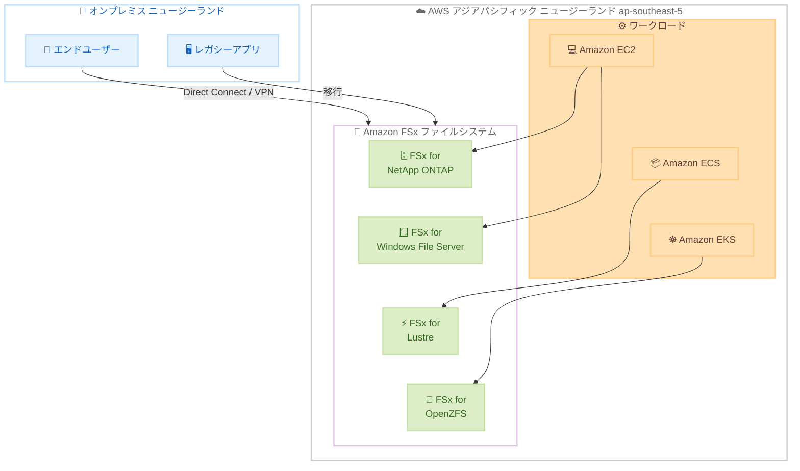

# Amazon FSx - アジアパシフィック (ニュージーランド) リージョンで利用可能に

**リリース日**: 2026年5月4日
**サービス**: Amazon FSx
**機能**: アジアパシフィック (ニュージーランド) リージョン対応

[このアップデートのインフォグラフィックを見る](https://takech9203.github.io/aws-news-summary/20260504-amazon-fsx-aws-asia-pacific.html)

## 概要

Amazon FSx が AWS アジアパシフィック (ニュージーランド) リージョン (ap-southeast-5) で利用可能になった。Amazon FSx は、クラウドで高機能かつ高性能なファイルシステムを簡単かつコスト効率よく起動、実行、スケーリングできるフルマネージドサービスである。

このリージョン拡大により、ニュージーランドおよびオセアニア地域のユーザーは、低レイテンシーで Amazon FSx の 4 つのファイルシステム (NetApp ONTAP、Windows File Server、Lustre、OpenZFS) を利用できるようになった。データレジデンシー要件がある顧客にとっても、ニュージーランド国内にデータを保持しながら高性能なファイルストレージを活用できる点が大きな利点となる。

**アップデート前の課題**

- ニュージーランドの顧客は最寄りのアジアパシフィック (シドニー) リージョンを利用する必要があり、レイテンシーが発生していた
- データレジデンシー要件によりニュージーランド国内にデータを保持する必要がある場合、Amazon FSx を利用できなかった
- オセアニア地域でのハイパフォーマンスコンピューティングや機械学習ワークロードにおいて、ファイルストレージの選択肢が限られていた

**アップデート後の改善**

- ニュージーランドリージョンから直接 Amazon FSx の全 4 種類のファイルシステムを利用可能になった
- データレジデンシー要件を満たしながら、フルマネージドの高性能ファイルストレージを活用できるようになった
- ニュージーランド国内のワークロードに対する低レイテンシーアクセスが実現した

## アーキテクチャ図



ニュージーランドリージョンで利用可能な Amazon FSx の 4 つのファイルシステムと、各種コンピューティングサービスおよびオンプレミス環境からの接続パターンを示している。

## サービスアップデートの詳細

### 主要機能

1. **4 種類のファイルシステムをフルサポート**
   - NetApp ONTAP: マルチプロトコル対応のエンタープライズストレージ
   - Windows File Server: Windows ベースのワークロード向け共有ストレージ
   - Lustre: HPC、機械学習、メディア処理向け高性能ファイルシステム
   - OpenZFS: Linux ベースのアプリケーション向け高性能ストレージ

2. **フルマネージドサービス**
   - ハードウェアプロビジョニングの自動化
   - パッチ適用の自動化
   - バックアップの自動化
   - インフラ管理からの解放

3. **高性能アーキテクチャ**
   - 最新の AWS コンピューティング、ネットワーキング、ディスクテクノロジーを活用
   - サブミリ秒のレイテンシーを実現
   - 高スループットでのデータアクセス

## 技術仕様

### ファイルシステム比較

| ファイルシステム | プロトコル | 主な用途 | 特徴 |
|------|----------|----------|------|
| FSx for NetApp ONTAP | NFS, SMB, iSCSI | エンタープライズアプリ、データベース | マルチプロトコル、データ重複排除、圧縮 |
| FSx for Windows File Server | SMB | Windows アプリ、ホームディレクトリ | Active Directory 統合、DFS |
| FSx for Lustre | Lustre | HPC、機械学習、メディア処理 | 数百 GB/s スループット、S3 連携 |
| FSx for OpenZFS | NFS | Linux アプリ、データベース | スナップショット、クローン、圧縮 |

### デプロイオプション

| 項目 | 詳細 |
|------|------|
| 可用性構成 | Single-AZ / Multi-AZ |
| ストレージタイプ | SSD / HDD |
| 暗号化 | AWS KMS による保管時暗号化、転送時暗号化 |
| バックアップ | 自動バックアップ、AWS Backup 統合 |
| レプリケーション | クロスリージョンレプリケーション対応 |

## 設定方法

### 前提条件

1. AWS アカウントでアジアパシフィック (ニュージーランド) リージョンが有効化されていること
2. 適切な IAM 権限が設定されていること
3. VPC およびサブネットが構成されていること

### 手順

#### ステップ 1: リージョンの選択

```bash
# AWS CLI でニュージーランドリージョンを指定
export AWS_DEFAULT_REGION=ap-southeast-5
```

AWS CLI 環境変数でアジアパシフィック (ニュージーランド) リージョンを指定する。

#### ステップ 2: FSx for NetApp ONTAP ファイルシステムの作成例

```bash
aws fsx create-file-system \
  --file-system-type ONTAP \
  --storage-capacity 1024 \
  --storage-type SSD \
  --subnet-ids subnet-xxxxxxxxxxxxxxxxx \
  --ontap-configuration '{
    "DeploymentType": "SINGLE_AZ_1",
    "ThroughputCapacity": 128
  }' \
  --region ap-southeast-5
```

1 TB の SSD ストレージと 128 MB/s のスループットキャパシティを持つ FSx for NetApp ONTAP ファイルシステムを作成する。

#### ステップ 3: FSx for Lustre ファイルシステムの作成例

```bash
aws fsx create-file-system \
  --file-system-type LUSTRE \
  --storage-capacity 1200 \
  --storage-type SSD \
  --subnet-ids subnet-xxxxxxxxxxxxxxxxx \
  --lustre-configuration '{
    "DeploymentType": "PERSISTENT_2",
    "PerUnitStorageThroughput": 250
  }' \
  --region ap-southeast-5
```

1.2 TB の SSD ストレージと 250 MB/s/TiB のスループットを持つ FSx for Lustre ファイルシステムを作成する。

## メリット

### ビジネス面

- **データレジデンシーの確保**: ニュージーランド国内にデータを保持する規制要件を満たしながら、高性能なファイルストレージを利用可能
- **低レイテンシーアクセス**: ニュージーランド国内のユーザーおよびアプリケーションに対して最小限のレイテンシーでサービスを提供
- **TCO の削減**: フルマネージドサービスにより運用負荷が軽減され、ハードウェア調達や管理のコストが不要

### 技術面

- **ワークロードの多様性**: 4 種類のファイルシステムから用途に応じた最適な選択が可能
- **高可用性**: AZ 内またはクロス AZ でのデータレプリケーションによるデータ保護
- **シームレスな移行**: オンプレミスと同じファイルシステムプロトコルをサポートし、アプリケーション変更なしで移行可能

## デメリット・制約事項

### 制限事項

- 新リージョンのため、初期段階ではインスタンスタイプやキャパシティの制約がある可能性がある
- クロスリージョンレプリケーションの転送コストが発生する
- リージョン間のデータ転送にはレイテンシーが発生するため、マルチリージョン構成の設計に注意が必要

### 考慮すべき点

- ニュージーランドリージョンの料金は他のリージョンと異なる可能性があるため、事前に料金ページで確認が必要
- 既存のシドニーリージョンからの移行を検討する場合、ダウンタイムやデータ転送の計画が必要

## ユースケース

### ユースケース 1: ニュージーランド国内のエンタープライズファイル共有

**シナリオ**: ニュージーランドに拠点を持つ企業が、社内のファイル共有基盤をクラウドに移行したいが、データレジデンシー要件によりデータをニュージーランド国内に保持する必要がある。

**実装例**:
```bash
aws fsx create-file-system \
  --file-system-type WINDOWS \
  --storage-capacity 2048 \
  --storage-type SSD \
  --subnet-ids subnet-xxxxxxxxxxxxxxxxx \
  --windows-configuration '{
    "DeploymentType": "MULTI_AZ_1",
    "ThroughputCapacity": 64,
    "ActiveDirectoryId": "d-xxxxxxxxxx"
  }' \
  --region ap-southeast-5
```

**効果**: Active Directory と統合された高可用性ファイル共有をニュージーランド国内で運用でき、コンプライアンス要件を満たしながらユーザーに低レイテンシーアクセスを提供。

### ユースケース 2: HPC および機械学習ワークロード

**シナリオ**: ニュージーランドの研究機関が、大規模な科学計算や機械学習モデルのトレーニングに必要な高スループットファイルストレージを必要としている。

**実装例**:
```bash
aws fsx create-file-system \
  --file-system-type LUSTRE \
  --storage-capacity 4800 \
  --storage-type SSD \
  --subnet-ids subnet-xxxxxxxxxxxxxxxxx \
  --lustre-configuration '{
    "DeploymentType": "PERSISTENT_2",
    "PerUnitStorageThroughput": 1000
  }' \
  --region ap-southeast-5
```

**効果**: 数百 GB/s のスループットを提供する Lustre ファイルシステムにより、計算クラスタからの大量の I/O リクエストを処理し、研究のイテレーション速度を向上。

### ユースケース 3: マルチプロトコル環境でのデータ統合

**シナリオ**: Linux と Windows の両方の環境が混在する企業が、単一のストレージプラットフォームからデータを共有したい。

**実装例**:
```bash
aws fsx create-file-system \
  --file-system-type ONTAP \
  --storage-capacity 2048 \
  --storage-type SSD \
  --subnet-ids subnet-xxxxxxxxxxxxxxxxx \
  --ontap-configuration '{
    "DeploymentType": "MULTI_AZ_1",
    "ThroughputCapacity": 256
  }' \
  --region ap-southeast-5
```

**効果**: NFS と SMB の両方のプロトコルをサポートする NetApp ONTAP により、異なる OS 環境から同じデータにアクセスでき、データサイロの解消とストレージ管理の簡素化を実現。

## 料金

Amazon FSx はファイルシステムの種類ごとに異なる料金体系を採用しており、使用したリソースに対してのみ課金される。最低料金やセットアップ料金は発生しない。

### 料金構成要素

| 項目 | 説明 |
|------|------|
| ストレージ容量 | GB あたりの月額料金 (SSD / HDD) |
| スループットキャパシティ | MB/s あたりの月額料金 |
| バックアップストレージ | GB あたりの月額料金 |
| データ転送 | リージョン間転送に対する課金 |

料金はリージョンによって異なるため、最新の料金情報は [Amazon FSx 料金ページ](https://aws.amazon.com/fsx/pricing/) で確認すること。

## 利用可能リージョン

今回のアップデートにより、アジアパシフィック (ニュージーランド) リージョン (ap-southeast-5) が追加された。Amazon FSx は現在、世界中の多数の AWS リージョンで利用可能である。完全なリージョン別の利用可能情報は [AWS リージョン表](https://aws.amazon.com/about-aws/global-infrastructure/regional-product-services/) で確認できる。

## 関連サービス・機能

- **Amazon EC2**: FSx ファイルシステムをマウントしてコンピューティングワークロードから利用
- **Amazon ECS / EKS**: コンテナ化されたアプリケーションから FSx の永続ストレージを利用
- **AWS Backup**: FSx ファイルシステムの集中バックアップ管理
- **AWS Direct Connect**: オンプレミス環境から FSx への低レイテンシー接続
- **Amazon S3**: FSx for Lustre との連携によるデータレイク統合

## 参考リンク

- [インフォグラフィック](https://takech9203.github.io/aws-news-summary/20260504-amazon-fsx-aws-asia-pacific.html)
- [公式発表 (What's New)](https://aws.amazon.com/about-aws/whats-new/2026/05/amazon-fsx-aws-asia-pacific/)
- [Amazon FSx 製品ページ](https://aws.amazon.com/fsx/)
- [Amazon FSx ドキュメント](https://docs.aws.amazon.com/fsx/)
- [料金ページ](https://aws.amazon.com/fsx/pricing/)
- [AWS リージョン表](https://aws.amazon.com/about-aws/global-infrastructure/regional-product-services/)

## まとめ

Amazon FSx のアジアパシフィック (ニュージーランド) リージョンへの拡大により、ニュージーランドおよびオセアニア地域の顧客は、データレジデンシー要件を満たしながら 4 種類の高性能ファイルシステムをフルマネージドで利用できるようになった。オンプレミスからの移行、HPC ワークロード、エンタープライズファイル共有など幅広いユースケースに対応するため、ニュージーランドでクラウドストレージの活用を検討している組織にとっては早期に検証を開始することを推奨する。
