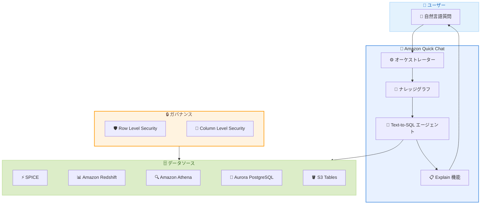

# Amazon Quick - Dataset Q&A

**リリース日**: 2026年05月04日
**サービス**: Amazon Quick
**機能**: Dataset Q&A (会話型アナリティクス)

📊 [このアップデートのインフォグラフィックを見る](https://takech9203.github.io/aws-news-summary/20260504-amazon-quick-dataset-qa.html)

## 概要

Amazon Quick に Dataset Q&A が追加されました。これは、エンタープライズデータに対して自然言語で直接質問できる会話型アナリティクス機能です。既存の Dashboard Q&A や Topic Q&A と並び、Dataset Q&A はデータセットへのアクセス権を持つ全てのユーザーが、事前設定されたダッシュボードの範囲を超えて自由にデータを探索し、実用的なインサイトを得られる新しい手段を提供します。

Dataset Q&A は Amazon Quick の text-to-SQL エージェントによって動作し、ユーザーの質問を解釈し、適切なデータを特定し、正確な SQL を生成します。これらすべてが単一の会話ステップで完結します。データオーナーが設定した Row Level Security (RLS) および Column Level Security (CLS) ポリシーを含むすべてのガバナンスルールが自動的に適用されます。

**アップデート前の課題**

- ダッシュボードに事前設定されていないデータの探索には、アナリストへの依頼が必要で、数時間から数日の待ち時間が発生していた
- Topic Q&A を利用するにはトピックの構成やフィールド定義の事前設定が必要だった
- アドホッククエリのバックログがデータチームの生産性を制約する最大のボトルネックになっていた
- 自然言語クエリの結果を検証するための SQL の透明性が欠如していた

**アップデート後の改善**

- 事前設定やトピック構成不要で、任意のデータセットに対して即座に自然言語で質問が可能になった
- text-to-SQL エージェントがエンジンおよびダイアレクト対応の最適化 SQL を自動生成
- Explain 機能により、生成された SQL のステップバイステップの推論過程を確認可能
- ナレッジグラフによる複数データセットの自動検出と横断的なクエリが実現

## アーキテクチャ図



Dataset Q&A のアーキテクチャフローを示しています。ユーザーの自然言語質問がオーケストレーターに渡され、ナレッジグラフでデータセットが特定された後、text-to-SQL エージェントがガバナンスルールを適用しながらデータソースに対して最適な SQL を生成・実行します。

## サービスアップデートの詳細

### 主要機能

1. **Text-to-SQL エージェント**
   - ユーザーの自然言語質問を解釈し、適切なデータセットを特定
   - エンジンおよび SQL ダイアレクトに対応した最適化 SQL を自動生成
   - SPICE および Direct Query データソースの両方に対応
   - 複数質問の同時処理、会話コンテキストの維持

2. **ナレッジグラフによるデータ検出**
   - データセットメタデータ、ビジネス定義、フィールド説明を統合
   - データアセット間の意味的関係を把握
   - 複数データセットからの自動ルーティング
   - All data and apps モードでの全データアセット横断検索

3. **Dataset Enrichment**
   - データオーナーがカスタム指示、ビジネス定義、フィールド説明を直接追加可能
   - YAML、JSON、プレーンテキスト形式でのファイルアップロードに対応
   - トピック構成不要でビジネスコンテキストを設定
   - 一度定義すれば全ユーザーに自動適用

4. **Chat Explainability**
   - 生成された SQL のステップバイステップ表示
   - エージェントが行った仮定やフィルターの説明
   - 非技術者向けのプレーンテキスト説明
   - クエリ結果の正確性を確認してから共有可能

5. **Spaces によるクロスアセット分析**
   - ファイル、データセット、ダッシュボード、ナレッジベースを統合
   - 構造化データと非構造化コンテンツの横断分析
   - 組織全体のデータサイロを超えた包括的なインサイト

## 技術仕様

### 対応データソース

| データソース | 対応モード | 備考 |
|-------------|-----------|------|
| Amazon SPICE | SPICE | SPICE 容量に基づく集計 |
| Amazon Redshift | Direct Query | フルデータセット分析 |
| Amazon Athena | Direct Query | フルデータセット分析 |
| Aurora PostgreSQL | Direct Query | フルデータセット分析 |
| Amazon S3 Tables (Apache Iceberg) | Direct Query | フルデータセット分析 |

### 対応クエリタイプ

| クエリタイプ | 説明 |
|-------------|------|
| トレンド分析 | 時系列データの傾向把握 |
| 時系列比較 | 期間間のデータ比較 |
| ランキング | 項目の順位付け |
| マルチ条件分析 | 複数条件を組み合わせた分析クエリ |
| 探索的質問 | オープンエンドの自由な探索 |
| ランタイム計算 | データセットに存在しない計算メトリクスの動的生成 |
| ウィンドウ関数 | 割合計算、累積集計 |
| 複数質問同時処理 | 1 つのプロンプトで複数質問に回答 |

### Q&A モードの比較

| 機能 | Dashboard Q&A | Topic Q&A | Dataset Q&A |
|------|:---:|:---:|:---:|
| 事前構成不要 | - | - | 対応 |
| 全フィールドアクセス | - | 構成済みのみ | 対応 |
| SQL 透明性 | - | - | 対応 |
| ランタイム計算 | - | - | 対応 |
| RLS/CLS 対応 | 対応 | 対応 | 対応 |
| ダッシュボード内探索 | 対応 | - | - |
| キュレーションされた同義語 | - | 対応 | - |

## 設定方法

### 前提条件

1. AWS アカウントで Amazon Quick Enterprise Edition が有効であること
2. Enterprise ユーザーまたは Professional ユーザーとしてのアクセス権
3. 対象データセットへのアクセス権限

### 手順

#### ステップ 1: Chat インターフェースを開く

Amazon Quick のコンソールで、右上のナビゲーションにある Open chat アイコンを選択します。My Assistant がデフォルトのシステムチャットエージェントとして表示されます。

#### ステップ 2: データセットを選択する

チャットフッターのナレッジピッカーにアクセスし、Specific data and apps 内の Add を選択します。Add Quick assets で Datasets を選択し、対象のデータセットを選択して Save を選択します。

#### ステップ 3: 自然言語で質問する

データセットが選択された状態で、チャットインターフェースに質問を入力します。

```
例: Can you describe the structure of this dataset?
例: How many rides do we have for every month in 2025?
例: What percentage of total trips does each member type account for?
```

#### ステップ 4: Dataset Enrichment を設定する (オプション)

データオーナーはデータセットにビジネスコンテキストを追加して精度を向上させることができます。

```yaml
# dataset_enrichment.yaml の例
fields:
  member_casual:
    description: "ユーザーの会員タイプ。member は年間会員、casual は都度利用"
  started_at:
    description: "ライドの開始タイムスタンプ"
  ended_at:
    description: "ライドの終了タイムスタンプ"
custom_instructions:
  - "duration の計算には started_at と ended_at の差分を使用する"
  - "volume は trip_count を意味する"
```

ファイルを Amazon Quick のデータセット設定画面からアップロードします。

## メリット

### ビジネス面

- **データ民主化の加速**: SQL スキルがないビジネスユーザーでも、自然言語でデータから直接インサイトを取得可能
- **アナリストの生産性向上**: アドホックリクエストのバックログを大幅に削減し、データチームが戦略的な分析に集中可能
- **意思決定の迅速化**: 数時間から数日かかっていたデータリクエストが数秒で完了

### 技術面

- **ゼロセットアップ**: トピック構成やダッシュボード作成不要で即座にクエリ開始可能
- **SQL 透明性**: 生成された SQL を確認・検証でき、技術的な信頼性を担保
- **ガバナンス自動適用**: 既存の RLS/CLS ポリシーが自動的に適用され、追加設定不要
- **マルチエンジン対応**: SPICE、Redshift、Athena、Aurora PostgreSQL、S3 Tables に対してエンジン固有の最適化 SQL を生成

## デメリット・制約事項

### 制限事項

- コンポジットデータセット (親が SPICE、子が Direct Query モード) は非対応
- パラメータ付きカスタム SQL データセットは非対応
- Direct Query モードのみで Dataset Q&A が利用可能 (SPICE データセットは SPICE 容量に制約)
- Enterprise Edition が必要 (Standard Edition では利用不可)

### 考慮すべき点

- 自然言語の曖昧性により、複雑なビジネス用語の解釈が意図と異なる場合がある (Explain 機能で確認を推奨)
- 大規模データセットへのクエリはデータソース側のコンピューティングリソースを消費する
- Dataset Enrichment によるビジネスコンテキストの追加が精度向上に重要
- 生成される SQL の品質はモデルのバージョンやセッションにより異なる場合がある

## ユースケース

### ユースケース 1: セルフサービス型アドホック分析

**シナリオ**: 営業マネージャーが四半期末にリージョン別・製品別の売上トレンドを確認したいが、既存ダッシュボードには該当するビューがない。

**実装例**:
```
質問: What were total sales by region and product category for Q4 2025,
      and how did they compare to Q3 2025?
```

**効果**: アナリストへのチケット起票なしに、数秒でクロス集計結果を取得。Explain 機能で SQL を確認し、結果の正確性を検証した上で経営層への報告に活用可能。

### ユースケース 2: データエンジニアによるクエリ検証

**シナリオ**: データエンジニアが複雑なビジネスロジックの解釈を確認する必要がある。「リピート顧客」の定義が Q3 と Q4 の両方に購入があるユーザーなのか、いずれかに購入があるユーザーなのかを検証したい。

**実装例**:
```
質問: What is the average order value for repeat customers who made
      purchases in both Q3 and Q4 2025?

→ Explain 機能で生成された SQL を確認:
  WHERE customer_id IN (
    SELECT customer_id FROM orders WHERE quarter = 'Q3'
    INTERSECT
    SELECT customer_id FROM orders WHERE quarter = 'Q4'
  )
```

**効果**: 自然言語がどのように SQL に変換されたかを透明に確認でき、AND vs OR ロジックの正確性を事前に検証可能。技術的な信頼性を担保した上でステークホルダーに結果を共有。

### ユースケース 3: マルチデータセット横断分析

**シナリオ**: 交通計画担当者が自転車シェアリングの利用状況と気象データ、都市イベントの相関を分析したい。複数のデータソースが存在するが、統合ダッシュボードはまだ作成されていない。

**実装例**:
```
Spaces に以下を登録:
- 自転車トリップデータセット (構造化データ)
- 気象データセット (CSV)
- イベントカレンダー (PDF)

質問: What was the impact of major events on bike usage in October 2025?
```

**効果**: 手動のデータ統合や ETL なしに、複数データサイロを横断したコンテキスト対応のインサイトを取得。組織全体のデータ資産を統合的に活用した意思決定が可能。

## 料金

Amazon Quick の Dataset Q&A は Amazon Quick Enterprise Edition に含まれる機能です。

| プラン | 月額料金 |
|--------|---------|
| Enterprise Edition (著者) | Amazon Quick の料金ページを参照 |
| Enterprise Edition (読者) | Amazon Quick の料金ページを参照 |

- Dataset Q&A の利用に追加料金は不要 (Enterprise Edition のライセンスに含まれる)
- Direct Query モードで外部データソースに接続する場合、Amazon Redshift、Amazon Athena 等のクエリ実行コストは別途発生
- SPICE 使用量は既存の SPICE 容量プランに基づく

## 利用可能リージョン

Dataset Q&A は Amazon Quick が利用可能なすべての AWS リージョンで一般提供 (GA) されています。

詳細なリージョン一覧は [Amazon Quick のリージョンドキュメント](https://docs.aws.amazon.com/quick/latest/userguide/regions.html#regions-qs) を参照してください。

## 関連サービス・機能

- **Amazon Quick Dashboard Q&A**: 公開済みダッシュボード内のデータに対する自然言語質問機能
- **Amazon Quick Topic Q&A**: キュレーションされたトピック定義に基づく自然言語クエリ機能
- **Amazon Quick Spaces**: ファイル、データセット、ダッシュボード、ナレッジベースを統合するコレクション機能
- **Amazon Redshift**: Dataset Q&A の Direct Query 対象データウェアハウス
- **Amazon Athena**: Dataset Q&A の Direct Query 対象サーバーレスクエリサービス
- **Amazon S3 Tables**: Apache Iceberg テーブルを格納する S3 テーブルバケット

## 参考リンク

- 📊 [インフォグラフィック](https://takech9203.github.io/aws-news-summary/20260504-amazon-quick-dataset-qa.html)
- [公式発表 (What's New)](https://aws.amazon.com/about-aws/whats-new/2026/05/amazon-quick-dataset-qa/)
- [AWS Blog - Introducing Dataset Q&A: Expanding natural language querying for structured datasets in Amazon Quick](https://aws.amazon.com/blogs/machine-learning/introducing-dataset-qa-expanding-natural-language-querying-for-structured-datasets-in-amazon-quick/)
- [Amazon Quick リージョンドキュメント](https://docs.aws.amazon.com/quick/latest/userguide/regions.html#regions-qs)
- [Amazon Quick 料金ページ](https://aws.amazon.com/quicksight/pricing/)

## まとめ

Amazon Quick Dataset Q&A は、ビジネスユーザーとデータの間にあった最大のボトルネック -- アナリストを介したアドホッククエリの待ち時間 -- を解消する画期的な機能です。text-to-SQL エージェント、ナレッジグラフ、Chat Explainability の組み合わせにより、自然言語から正確で透明性の高い SQL 生成を実現し、エンタープライズガバナンスを維持しながらデータの民主化を推進します。Solutions Architect としては、既存の RLS/CLS ポリシーがそのまま適用される点と、Dataset Enrichment によるビジネスコンテキストの追加が精度向上の鍵となる点を顧客に伝えることを推奨します。
