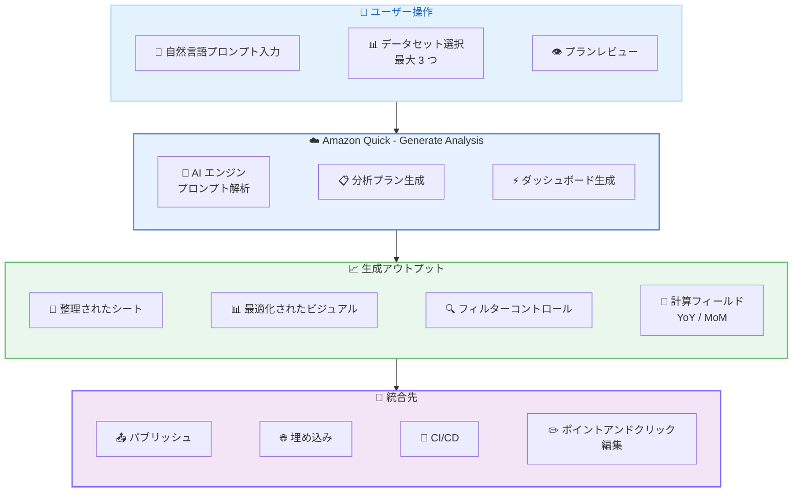

# Amazon Quick - Generate Analysis (自然言語プロンプトによるダッシュボード自動生成)

**リリース日**: 2026 年 5 月 4 日
**サービス**: Amazon Quick (Amazon QuickSight)
**機能**: Generate Analysis

📊 [このアップデートのインフォグラフィックを見る](https://takech9203.github.io/aws-news-summary/20260504-amazon-quick-generates-analyses-from-natural-language-prompts.html)

## 概要

Amazon Quick に新たに追加された Generate Analysis 機能により、自然言語のプロンプトからダッシュボードを自動生成できるようになった。ユーザーは作成したいダッシュボードの内容を自然言語で記述し、最大 3 つのデータセットを選択して、編集可能なプランをレビューした上でダッシュボードを生成できる。従来は数時間かかっていた手動でのダッシュボード構築を数分に短縮する。

生成されるダッシュボードには、データに最適化されたビジュアル、さまざまなディメンションで探索するためのフィルターコントロール、前年比成長率や前月比比較などの計算フィールドが含まれる。生成されたアウトプットは既存のパブリッシュワークフロー、埋め込み、CI/CD パイプライン、ポイントアンドクリック編集と互換性がある。

本機能は Enterprise サブスクリプションの Author Pro ユーザーが利用可能である。

**アップデート前の課題**

- ダッシュボード作成には、ビジュアルタイプの選択、フィールドのマッピング、フィルター設定、計算フィールドの定義など、手動で数時間の設定作業が必要だった
- 前年比成長率や前月比比較などの分析指標を作成するには、DAX のような計算式の知識が求められた
- BI の専門知識がないビジネスユーザーは、分析チームへのリクエストを通じてダッシュボードを入手する必要があり、フィードバックループに時間がかかっていた

**アップデート後の改善**

- 自然言語でダッシュボードの要件を記述するだけで、整理されたシートとビジュアルが自動生成される
- 前年比成長率 (YoY) や前月比比較 (MoM) などの計算フィールドが自動的に生成される
- 生成されたダッシュボードは即座にレビュー・編集可能で、既存のワークフローにそのまま統合できる

## アーキテクチャ図



ユーザーが自然言語でプロンプトを入力し、データセットを選択すると、Amazon Quick の AI エンジンがプロンプトを解析して分析プランを生成する。レビュー後にダッシュボードが自動生成され、既存のワークフローに統合できる。

## サービスアップデートの詳細

### 主要機能

1. **自然言語によるダッシュボード定義**
   - ユーザーが目標を自然言語で記述 (例: 「売上パフォーマンスダッシュボードを作成し、収益トレンド、地域比較、前月比成長率を含める」)
   - AI がプロンプトを解析してダッシュボード構成を決定
   - 専門的な BI スキルが不要

2. **データセット選択と分析プラン**
   - 最大 3 つのデータセットを選択可能
   - 生成前に編集可能な分析プランをレビュー
   - プランの調整によりダッシュボードの方向性を制御

3. **インテリジェントなビジュアル生成**
   - データの特性に基づいて最適なビジュアルタイプを自動選択
   - 整理されたシート構成で情報を論理的にグループ化
   - フィルターコントロールの自動配置でインタラクティブな探索を実現

4. **計算フィールドの自動生成**
   - 前年比成長率 (Year-over-Year Growth)
   - 前月比比較 (Month-over-Month Comparisons)
   - その他の一般的な分析指標

5. **既存ワークフローとの互換性**
   - パブリッシュワークフロー対応
   - 埋め込み分析 (Embedded Analytics) 対応
   - CI/CD パイプラインとの連携
   - ポイントアンドクリック編集で微調整可能

## 技術仕様

### Generate Analysis の仕様

| 項目 | 詳細 |
|------|------|
| 入力 | 自然言語プロンプト |
| データセット上限 | 最大 3 つ |
| 出力形式 | QuickSight Analysis (シート + ビジュアル + フィルター + 計算フィールド) |
| 対応ユーザータイプ | Enterprise サブスクリプション / Author Pro |
| ワークフロー統合 | パブリッシュ、埋め込み、CI/CD、手動編集 |

### API 変更履歴

| 日付 | サービス | 変更内容 |
|------|----------|----------|
| 2026/05/01 | [Amazon QuickSight](https://awsapichanges.com/archive/changes/6338dd-quicksight.html) | 23 updated methods - ControlTitleFormatText、ControlTitleFontConfiguration、ContextRegion、Story/scenario in CreateCustomCapability API 等 |

### サービス構成

Amazon QuickSight は Amazon Quick にリブランドされ、以下の統合機能群の一部として位置付けられている。

| コンポーネント | 機能 |
|---------------|------|
| Amazon Quick Sight | データ可視化、ダッシュボード、SPICE エンジン |
| Amazon Quick Flows | ワークフロー自動化 |
| Amazon Quick Automate | プロセス最適化 |
| Amazon Quick Index | データディスカバリ |
| Amazon Quick Research | 包括的な分析 |

## 設定方法

### 前提条件

1. Amazon Quick (QuickSight) Enterprise サブスクリプションのアカウント
2. Author Pro ユーザーとしてプロビジョニングされていること
3. 分析対象のデータセットが QuickSight に登録されていること

### 手順

#### ステップ 1: Generate Analysis の開始

Amazon Quick Sight コンソールにログインし、新しい Analysis の作成画面から Generate Analysis を選択する。

#### ステップ 2: 自然言語プロンプトの入力

ダッシュボードの要件を自然言語で記述する。

```text
例: "Create a sales performance dashboard with revenue trends, 
regional comparisons, and month-over-month growth"
```

ビジネスゴール、含めたい指標、比較の軸を明確に記述すると、より精度の高いダッシュボードが生成される。

#### ステップ 3: データセットの選択

分析に使用するデータセットを最大 3 つ選択する。選択したデータセットのスキーマ情報が AI エンジンに渡され、適切なビジュアルと計算フィールドの決定に使用される。

#### ステップ 4: 分析プランのレビューと編集

生成された分析プランをレビューし、必要に応じて編集する。プランには以下が含まれる。

- シート構成
- 各シートに配置されるビジュアルの種類
- 使用される計算フィールド
- フィルターコントロールの配置

#### ステップ 5: ダッシュボードの生成と調整

プランを確定すると、ダッシュボードが自動生成される。生成後はポイントアンドクリック編集で詳細な調整を行い、パブリッシュする。

## メリット

### ビジネス面

- **Time to Insight の大幅短縮**: ダッシュボード作成が数時間から数分に短縮され、データドリブンな意思決定の速度が向上
- **BI 専門リソースの最適化**: 自然言語で要件を伝えるだけでダッシュボードが生成されるため、BI チームのバックログが削減される
- **セルフサービス分析の民主化**: BI の専門知識がないビジネスユーザーでも高品質なダッシュボードを作成可能

### 技術面

- **既存パイプラインとの互換性**: 生成されたダッシュボードは CI/CD パイプラインや埋め込み分析と完全に互換
- **計算フィールドの自動生成**: YoY、MoM などの計算式を手動で作成する必要がなく、エラーのリスクが低減
- **編集可能な中間プラン**: ブラックボックスではなく、生成プランをレビュー・編集でき、結果の品質を制御可能

## デメリット・制約事項

### 制限事項

- Enterprise サブスクリプションの Author Pro ユーザーのみが利用可能 (Standard Edition や通常の Author では利用不可)
- データセットは最大 3 つまでに制限される
- 生成される計算フィールドは一般的な分析指標 (YoY、MoM) が中心であり、業界固有の複雑な指標は手動追加が必要な場合がある

### 考慮すべき点

- 自然言語プロンプトの記述精度がダッシュボードの品質に直接影響する
- 複雑な分析要件の場合、生成後の手動調整が必要になる可能性がある
- Author Pro のライセンスコストが追加で発生する ($40/ユーザー/月 + $250/月のインフラストラクチャ費用)

## ユースケース

### ユースケース 1: 経営層向け売上ダッシュボードの迅速作成

**シナリオ**: 新任の営業部門長が、就任初日に全社の売上状況を把握するためのダッシュボードを必要としている。従来は BI チームへのリクエストから 1-2 週間かかっていた。

**実装例**:
```text
プロンプト: "Create an executive sales dashboard showing quarterly revenue 
by region, top 10 products by revenue, customer acquisition trends, 
and year-over-year growth comparison"

データセット: 
- 売上トランザクションテーブル
- 製品マスタテーブル
- 顧客テーブル
```

**効果**: 数分で経営層向けのダッシュボードが完成し、即座に全社売上の可視化と分析が可能になる。

### ユースケース 2: CI/CD パイプラインとの統合による分析基盤の標準化

**シナリオ**: マルチテナント SaaS 企業が、新規顧客のオンボーディング時に標準的な分析ダッシュボードを自動デプロイしたい。

**実装例**:
```text
プロンプト: "Create a SaaS usage analytics dashboard with daily active 
users, feature adoption rates, monthly churn analysis, and 
month-over-month engagement trends"

統合: 
- Generate Analysis で基本テンプレートを作成
- QuickSight API でダッシュボードをエクスポート
- CI/CD パイプラインに組み込み、テナントごとにデプロイ
```

**効果**: 新規テナントのオンボーディング時に標準化された分析ダッシュボードを自動デプロイでき、運用工数を大幅に削減できる。

### ユースケース 3: 埋め込み分析によるカスタマー向けレポーティング

**シナリオ**: マーケティングプラットフォームが、顧客向けにキャンペーン分析ダッシュボードをアプリ内に埋め込みたい。

**実装例**:
```text
プロンプト: "Create a marketing campaign performance dashboard with 
impression trends, click-through rates by channel, conversion 
funnel analysis, and cost per acquisition comparisons"

統合:
- Generate Analysis でダッシュボードを生成
- Embedded Analytics SDK で顧客向けアプリに埋め込み
- Row-Level Security でテナント分離を実現
```

**効果**: 高品質なキャンペーン分析ダッシュボードを迅速に顧客に提供でき、プロダクトの付加価値が向上する。

## 料金

Generate Analysis 機能は Author Pro ユーザーの機能として含まれ、追加料金なしで利用できる。

### 料金体系

| ユーザータイプ | 月額料金 |
|---------------|----------|
| Author Pro | $40/ユーザー/月 |
| Author (通常) | $24/ユーザー/月 (Generate Analysis 利用不可) |
| Reader Pro | $20/ユーザー/月 |
| Reader | $3/ユーザー/月 |

**注意**: アカウントに Pro ユーザーが 1 名以上存在する場合、$250/月のアカウントインフラストラクチャ費用が別途発生する。

### 料金例

| 構成 | 月額料金 (概算) |
|------|------------------|
| Author Pro 5 名 + Reader 20 名 | $250 (インフラ) + $200 (Author Pro) + $60 (Reader) = $510/月 |
| Author Pro 10 名 + Reader Pro 50 名 | $250 (インフラ) + $400 (Author Pro) + $1,000 (Reader Pro) = $1,650/月 |

## 利用可能リージョン

Generate Analysis は Enterprise サブスクリプションの Author Pro ユーザー向けに、Amazon Quick (QuickSight) が利用可能な以下のリージョンで提供される。

**注意**: 「Quick リージョン」では Author Pro ユーザーに Quick Enterprise の全機能が追加コストなしで含まれる。その他のリージョンでは Author Pro の生成 AI 機能として利用可能。

- US East (N. Virginia) - us-east-1
- US East (Ohio) - us-east-2
- US West (Oregon) - us-west-2
- Asia Pacific (Tokyo) - ap-northeast-1
- Asia Pacific (Singapore) - ap-southeast-1
- Asia Pacific (Sydney) - ap-southeast-2
- Asia Pacific (Mumbai) - ap-south-1
- Asia Pacific (Seoul) - ap-northeast-2
- Europe (Ireland) - eu-west-1
- Europe (Frankfurt) - eu-central-1
- Europe (London) - eu-west-2
- Canada (Central) - ca-central-1
- South America (Sao Paulo) - sa-east-1

## 関連サービス・機能

- **Amazon Quick Sight**: Generate Analysis の基盤となるデータ可視化エンジン。SPICE インメモリ分析、インタラクティブダッシュボード、埋め込み分析を提供
- **Amazon Q in QuickSight**: 自然言語による Q&A 機能。Generate Analysis は Q の AI 基盤を活用してダッシュボード全体を生成する上位機能
- **Amazon QuickSight Embedded Analytics**: 生成されたダッシュボードを外部アプリケーションに埋め込むための SDK と API
- **Amazon Quick Research**: 包括的な分析を行うコンポーネント。Generate Analysis と組み合わせてデータの深い洞察を提供

## 参考リンク

- 📊 [インフォグラフィック](https://takech9203.github.io/aws-news-summary/20260504-amazon-quick-generates-analyses-from-natural-language-prompts.html)
- [公式発表 (What's New)](https://aws.amazon.com/about-aws/whats-new/2026/05/amazon-quick-generates-analyses-from-natural-language-prompts/)
- [Amazon Quick (QuickSight) ドキュメント](https://docs.aws.amazon.com/quicksight/latest/user/)
- [Amazon QuickSight 料金ページ](https://aws.amazon.com/quicksight/pricing/)
- [Amazon QuickSight エンドポイントとリージョン](https://docs.aws.amazon.com/general/latest/gr/quicksight.html)

## まとめ

Amazon Quick の Generate Analysis は、自然言語プロンプトからダッシュボードを自動生成する機能であり、BI ダッシュボード構築の大幅な効率化を実現する。Enterprise サブスクリプションの Author Pro ユーザーが利用でき、生成されたダッシュボードは既存の CI/CD パイプラインや埋め込み分析と完全に互換性がある。セルフサービス BI の推進やダッシュボード作成のボトルネック解消を目指す組織にとって、特に価値の高いアップデートである。
