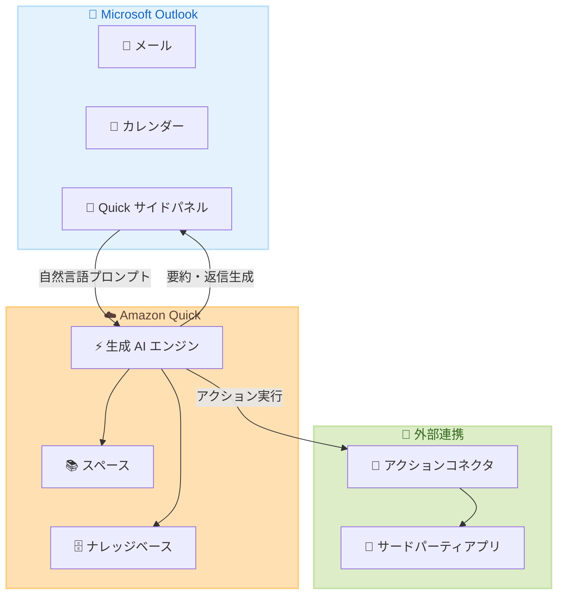

# Amazon Quick - Microsoft Outlook 拡張機能 (Preview)

**リリース日**: 2026 年 5 月 4 日
**サービス**: Amazon Quick
**機能**: Microsoft Outlook 拡張機能 (Preview)

📊 [このアップデートのインフォグラフィックを見る](https://takech9203.github.io/aws-news-summary/20260504-amazon-quick-microsoft-outlook.html)

## 概要

AWS は Amazon Quick の Microsoft Outlook 拡張機能のプレビューを発表した。この拡張機能により、生成 AI を活用した生産性向上機能を Outlook のメールおよびカレンダーワークフローに直接統合できる。ユーザーは自然言語を使用して、未読メッセージの要約、受信トレイの整理、会議のスケジュール、インライン返信の下書きを Outlook から離れることなく実行できる。

Amazon Quick は AWS が提供する AI アシスタントサービスであり、リサーチ、ビジネスインサイト、自動化、ノーコードアプリ構築などの機能を備えている。今回の Outlook 拡張機能は、従来のレガシー Microsoft Outlook 拡張機能に代わる新しい実装であり、エンタープライズナレッジベースとの連携やサードパーティアプリケーションとの統合機能を強化している。

**アップデート前の課題**

- メール管理やカレンダー操作のために Outlook とその他のツール間を頻繁に切り替える必要があった
- 大量の未読メールの優先順位付けやアクションアイテムの抽出を手動で行う必要があった
- 会議スケジュールの調整に複数のメールのやり取りが必要で、最適な時間の特定に時間を要した
- 社内ナレッジベースの情報をメール返信に活用するには、別のアプリケーションを参照する必要があった
- レガシー版の Outlook 拡張機能では管理者向けの一元管理機能が限定的だった

**アップデート後の改善**

- 自然言語でのメール要約・優先順位付けにより、受信トレイ管理の効率が大幅に向上
- Amazon Quick のスペースやナレッジベースから関連情報を引き出して、コンテキストに基づいた返信を自動生成
- 会話形式の指示で同僚との最適な会議時間を検索し、直接スケジュール設定が可能
- 設定済みのインテグレーションを通じて、Outlook から直接サードパーティアプリケーションのアクションを実行可能
- レガシー拡張機能からの移行が推奨され、GA 時には管理者向けの集中管理機能が提供予定

## アーキテクチャ図



Amazon Quick Outlook 拡張機能のアーキテクチャを示す。ユーザーは Outlook のサイドパネルから自然言語プロンプトを送信し、Amazon Quick の生成 AI エンジンがスペースやナレッジベースの情報を活用して応答を生成する。

## サービスアップデートの詳細

### 主要機能

1. **受信トレイ管理**
   - 未読メールの要約と優先順位付け
   - 自然言語クエリによる特定のメールやディスカッションの検索
   - メールのフォルダへの移動、フォローアップフラグの設定
   - メールの整理と分類の自動化

2. **カレンダーおよび会議管理**
   - カレンダーの要約
   - 同僚との最適な会議時間の検索
   - 自然言語の指示による会議のスケジュール設定
   - 会議参加者のスケジュール空き状況の確認

3. **メール要約と返信**
   - メールスレッドの要約生成
   - アクションアイテムの抽出
   - Amazon Quick のスペースやナレッジベースの情報を活用したコンテキストに基づく返信生成
   - サイドパネルからフォーカス中のメールスレッドに関する質問

4. **エンタープライズナレッジ連携**
   - Amazon Quick スペースの情報を返信に統合
   - ナレッジベースからの関連情報取得
   - ダッシュボードデータの参照

5. **外部アクション実行**
   - 設定済みアクションコネクタを通じたサードパーティアプリケーション操作
   - Outlook から直接外部アプリケーションのタスクを実行

## 技術仕様

### データプライバシーとセキュリティ

| 項目 | 詳細 |
|------|------|
| データ利用 | ユーザーデータはサービス改善や LLM トレーニングに使用されない |
| データ読み取り | サイドパネルが閉じている場合、メールやコンテンツは読み取られない |
| データ送信 | ユーザーが明示的にプロンプトを送信した場合のみデータが Amazon Quick に送信される |
| 会話保持期間 | 各会話は 30 日間保存される |
| Outlook データのインデックス | Microsoft Outlook の会話は企業の Amazon Quick インスタンスにインデックスされない |
| コード実行 | Outlook アプリケーションサンドボックス内で生成 AI がコードを生成・実行する |
| ポリシー | AWS Responsible AI Policy に準拠 |

### 動作仕様

| 項目 | 詳細 |
|------|------|
| 拡張機能タイプ | Microsoft Outlook アドイン |
| 配布元 | Microsoft Outlook アプリストア / Amazon Quick ダウンロードページ |
| 認証 | Amazon Quick アカウント |
| AI 処理 | 生成 AI によるコード生成・実行 (サンドボックス内) |
| レスポンス | 個人のユーザー権限に基づいた応答を生成 |
| 位置付け | レガシー Microsoft Outlook 拡張機能の後継 |

## 設定方法

### 前提条件

1. Amazon Quick アカウントの作成 (Free プランから利用可能)
2. Microsoft Outlook (デスクトップ版またはウェブ版)
3. サポートされているリージョンでの利用

### 手順

#### ステップ 1: Amazon Quick アカウントの作成

[Amazon Quick サインアップページ](https://portal.aws.amazon.com/billing/signup/service?app=AmazonQuickSuite&tier=free&funnel=boost#/validation) からアカウントを作成する。メールまたはソーシャルアカウントでサインアップが可能。

#### ステップ 2: Outlook 拡張機能のインストール

以下のいずれかの方法でインストールする。

- Microsoft Outlook アプリストアで「Amazon Quick」を検索してインストール
- [Amazon Quick ダウンロードページ](https://aws.amazon.com/quick/download/) からインストール

#### ステップ 3: 拡張機能の起動と利用

Outlook 内で Quick サイドパネルを開き、自然言語でプロンプトを入力して利用を開始する。

```text
# 使用例
"未読メールをすべて要約し、今日中に緊急対応が必要なものをハイライトして"
"このスレッドの主要ポイントを参照して [連絡先名] へのフォローアップメールを作成して"
"このメールスレッドの参加者と来週 30 分のミーティングをスケジュールして"
```

## メリット

### ビジネス面

- **生産性向上**: メール処理やカレンダー管理に費やす時間を大幅に削減し、コア業務に集中できる
- **情報の一元活用**: Amazon Quick のスペースやナレッジベースの情報をメール返信に直接活用でき、正確で一貫した情報発信が可能
- **コラボレーション強化**: 会議スケジュールの最適化により、チーム間の調整コストを削減

### 技術面

- **サンドボックス実行**: コード生成・実行が Outlook のサンドボックス内で行われるため、セキュリティリスクを最小化
- **データプライバシー**: サイドパネル閉鎖時のデータ非読み取り、LLM トレーニングへの非使用など、厳格なデータ保護
- **シームレスな統合**: 既存の Outlook ワークフローを変更することなく、AI 機能を追加可能
- **拡張性**: アクションコネクタを通じたサードパーティアプリケーションとの統合により、自動化の幅を拡大

## デメリット・制約事項

### 制限事項

- プレビュー段階であり、機能や仕様が変更される可能性がある
- 管理者向けの集中デプロイメント制御や使用状況モニタリング機能は GA 時まで未提供
- 生成 AI は不正確なアクションを実行する可能性があり、応答の正確性をユーザーが確認する必要がある
- 応答は個人のユーザー権限に基づくため、他のメール受信者がアクセスできない情報が含まれる可能性がある

### 考慮すべき点

- 機密データを含むメールへの利用時には、生成された返信内容を慎重にレビューする必要がある
- 会話履歴は 30 日間保持されるため、データ保持ポリシーとの整合性を確認すること
- レガシー Outlook 拡張機能から新しい拡張機能への移行計画を策定すること
- GA 時の管理者機能に依存する要件がある場合、プレビュー期間中の制約を把握しておくこと

## ユースケース

### ユースケース 1: エグゼクティブの受信トレイ管理

**シナリオ**: 1 日に数百通のメールを受信するエグゼクティブが、朝の時点で重要なメールを迅速に把握し、対応の優先順位を決定したい。

**実装例**:
```text
"未読メールをすべて要約し、緊急度の高い順に並べて。特にクライアントからのメールと
期限が今週中のアクションアイテムを含むメールをハイライトして"
```

**効果**: メール確認に要する時間を従来の数十分から数分に短縮し、重要な意思決定に集中できる。

### ユースケース 2: プロジェクトマネージャーのステータス報告

**シナリオ**: プロジェクトマネージャーが週次のステータスレポートを作成するために、Quick スペースに蓄積されたプロジェクトデータとメールスレッドの情報を統合したい。

**実装例**:
```text
"Quick スペースのプロジェクトダッシュボードデータを使って、今週の進捗状況を
まとめたステータスレポートメールをリーダーシップチーム向けに下書きして。
このスレッドで議論されたリスク項目も含めて"
```

**効果**: 複数のソースからの情報収集と文書作成の工数を削減し、一貫性のある報告書を効率的に作成できる。

### ユースケース 3: クロスファンクショナルチームの会議調整

**シナリオ**: 複数部署のメンバーとの会議をスケジュールする必要があるが、参加者のスケジュール確認と調整に時間がかかる。

**実装例**:
```text
"このメールスレッドに含まれる全員のスケジュールを確認して、
来週の月曜から水曜の間で 45 分の会議に最適な時間帯を 3 つ提案して。
午前 10 時以降で提案して"
```

**効果**: 会議調整のための複数回のメールやり取りを不要にし、最適な時間を自動的に提案・設定できる。

## 料金

Amazon Quick は以下の料金プランで提供されている。

| プラン | 月額料金 |
|--------|----------|
| Free | $0 / ユーザー / 月 |
| Plus | $20 / ユーザー / 月 (年払い) |
| Professional | $20 / ユーザー / 月 |
| Enterprise | $40 / ユーザー / 月 |

- Pro および Enterprise アカウントには $250 / アカウント / 月の基本料金が発生
- Free プランからサインアップ可能で、Outlook 拡張機能の利用範囲はプランにより異なる場合がある
- プレビュー期間中の追加料金については [Amazon Quick 料金ページ](https://aws.amazon.com/quick/pricing/) を参照

## 利用可能リージョン

プレビューは以下の 7 リージョンで利用可能。

| リージョン | リージョンコード |
|------------|------------------|
| US East (N. Virginia) | us-east-1 |
| US West (Oregon) | us-west-2 |
| Asia Pacific (Sydney) | ap-southeast-2 |
| Europe (Ireland) | eu-west-1 |
| Asia Pacific (Tokyo) | ap-northeast-1 |
| Europe (Frankfurt) | eu-central-1 |
| Europe (London) | eu-west-2 |

東京リージョン (ap-northeast-1) が含まれているため、日本からの利用も可能。

## 関連サービス・機能

- **Amazon Quick**: AI アシスタントサービスの本体。スペース、ナレッジベース、チャット機能を提供
- **Amazon Quick スペース**: 企業データを統合して AI が参照できる知識リポジトリ
- **Amazon Quick アクションコネクタ**: サードパーティアプリケーションとの連携を可能にするインテグレーション機能
- **Amazon Quick ブラウザ拡張機能**: ウェブブラウザ上での Quick 利用を可能にする拡張機能
- **Amazon Quick Microsoft Excel 拡張機能**: Excel での生成 AI 活用を実現する拡張機能

## 参考リンク

- 📊 [インフォグラフィック](https://takech9203.github.io/aws-news-summary/20260504-amazon-quick-microsoft-outlook.html)
- [公式発表 (What's New)](https://aws.amazon.com/about-aws/whats-new/2026/05/amazon-quick-microsoft-outlook/)
- [ドキュメント - Outlook 拡張機能ガイド](https://docs.aws.amazon.com/quick/latest/userguide/outlook-extension-preview-guide.html)
- [Amazon Quick ウェブサイト](https://aws.amazon.com/quick/)
- [Amazon Quick ダウンロードページ](https://aws.amazon.com/quick/download/)
- [料金ページ](https://aws.amazon.com/quick/pricing/)

## まとめ

Amazon Quick の Microsoft Outlook 拡張機能 (Preview) は、生成 AI の能力を日常的なメール・カレンダー管理に直接統合する。自然言語による受信トレイ管理、エンタープライズナレッジベースとの連携、サードパーティアプリケーションとの統合により、ビジネスユーザーの生産性を大幅に向上させる。東京リージョンを含む 7 リージョンで利用可能であり、レガシー拡張機能からの移行が推奨されているため、既に Amazon Quick を導入している組織は早期の検証を推奨する。
