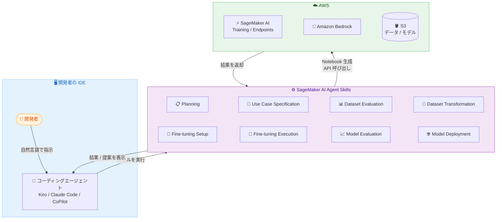

# Amazon SageMaker AI - AI エージェントによるモデルカスタマイズ体験

**リリース日**: 2026 年 5 月 4 日
**サービス**: Amazon SageMaker AI
**機能**: AI Agent Experience for Model Customization

📊 [このアップデートのインフォグラフィックを見る](https://takech9203.github.io/aws-news-summary/20260504-amazon-sagemaker-ai-ai.html)

## 概要

Amazon SageMaker AI に、モデルカスタマイズのためのエージェント体験 (Agentic Experience) が新たに追加された。この機能により、従来数か月を要していたモデルカスタマイズのワークフローを、数日または数時間で完了できるようになる。開発者は自然言語でコーディングエージェントと対話しながら、ユースケースの定義から本番環境へのデプロイまでの全プロセスを効率化できる。

この新機能は、SageMaker AI モデルカスタマイズ用エージェントスキルに基づいており、ファインチューニングの専門知識、データフォーマット変換、LLM-as-a-Judge メトリクスによる品質評価、Amazon Bedrock または SageMaker AI エンドポイントへのデプロイオプションを提供する。Kiro、Claude Code、CoPilot などの複数のコーディングエージェントと連携し、Amazon Nova、Llama、Qwen、GPT-OSS などの主要モデルファミリーに対応する。

**アップデート前の課題**

- ファインチューニングのワークフロー全体 (ユースケース定義、データ準備、モデル選択、実験設定、評価、デプロイ) を手動で管理する必要があり、数か月を要していた
- トレーニングやデプロイのためのインフラストラクチャ構築が差別化されない重労働 (undifferentiated heavy lifting) であった
- 各ステップで専門知識が必要であり、最適なファインチューニング手法の選択、ハイパーパラメータの設定、評価指標の設計などに高いスキルが求められていた
- 複数のモデルや手法を比較するための実験管理が複雑であった

**アップデート後の改善**

- 自然言語でコーディングエージェントに指示するだけで、エンドツーエンドのモデルカスタマイズワークフローを実行できるようになった
- エージェントスキルが AWS のベストプラクティスを自動的に適用し、データ準備からデプロイまでをガイドする
- 再利用可能で編集可能なコードアーティファクト (Jupyter Notebook) が生成され、透明性、再現性、AIOps パイプラインへの統合が実現された
- Visual Studio Code、Cursor、SageMaker Studio Notebooks など、好みの IDE にスキルをインストールして利用可能になった

## アーキテクチャ図



開発者は IDE 上でコーディングエージェントに自然言語で指示し、SageMaker AI Agent Skills が各ステージ (計画、データ準備、ファインチューニング、評価、デプロイ) を順次実行する。各ステップで Jupyter Notebook が生成され、開発者がレビュー・編集した上で実行する。

## サービスアップデートの詳細

### 主要機能

1. **エージェントスキルによる段階的ガイダンス**
   - Planning スキルが開発者の意図を理解し、ステップバイステップのカスタマイズ計画を生成
   - Use Case Specification スキルがゴール、制約、成功基準を構造化されたドキュメントとして整理
   - 各ステージで実行可能な Jupyter Notebook を生成し、セルごとにレビュー・編集・実行が可能

2. **包括的なデータ準備とファインチューニング**
   - Dataset Evaluation スキルがデータ品質のバリデーション、フォーマット検出、要件分析を実施
   - Dataset Transformation スキルが SageMaker 互換のトレーニングフォーマットへ自動変換
   - Fine-tuning Setup スキルが最適な手法 (SFT、DPO、RLVR) とベースモデルを選択
   - ハイパーパラメータ設定とトレーニングジョブの実行を自動化

3. **LLM-as-a-Judge による品質評価**
   - Model Evaluation スキルが評価設計、ベンチマーク選択、LLM-as-a-Judge メトリクスによるモデル比較を実施
   - Amazon Bedrock Evaluations を活用した包括的な品質評価
   - 成功基準に対するモデル候補の自動判定

4. **柔軟なデプロイオプション**
   - Amazon Bedrock へのモデルインポートとデプロイ
   - SageMaker AI エンドポイントへのデプロイ
   - コスト効率の高いデプロイ構成の推奨

5. **マルチエージェント・マルチ IDE 対応**
   - Kiro、Claude Code、CoPilot と連携可能
   - Visual Studio Code、Cursor、SageMaker Studio Notebooks に対応
   - SageMaker Studio Notebooks には Kiro エージェントとスキルがプリインストール済み

## 技術仕様

### 対応ファインチューニング手法

| 手法 | 用途 | 説明 |
|------|------|------|
| SFT (Supervised Fine-Tuning) | 命令チューニング | ラベル付きデータで特定タスクへの適応を実施 |
| DPO (Direct Preference Optimization) | トーン・好み調整 | 人間の好みに基づくモデル出力の最適化 |
| RLVR (Reinforcement Learning with Verifiable Rewards) | 検証可能な正確性 | Lambda 関数による報酬関数を用いた強化学習 |

### 対応モデルファミリー

| モデルファミリー | プロバイダー | 備考 |
|------------------|--------------|------|
| Amazon Nova | AWS | us-east-1 のみでカスタマイズ可能、LLMaaJ 非対応 |
| Llama | Meta | オープンウェイトモデル |
| Qwen | Alibaba | オープンウェイトモデル |
| GPT-OSS | OpenAI | オープンソース版 |

### エージェントスキル一覧

| # | スキル | 機能 |
|---|--------|------|
| 1 | planning | 意図に基づくステップバイステップ計画の生成 |
| 2 | directory-management | プロジェクトディレクトリとアーティファクトの管理 |
| 3 | use-case-specification | ユースケースのゴール・成功基準の定義 |
| 4 | dataset-evaluation | データ品質バリデーションとフォーマット検出 |
| 5 | dataset-transformation | SageMaker 互換フォーマットへの変換 |
| 6 | finetuning-setup | 手法選択とベースモデル選定 |
| 7 | finetuning | ハイパーパラメータ設定とジョブ実行 |
| 8 | model-evaluation | LLM-as-a-Judge によるモデル評価 |
| 9 | model-deployment | エンドポイント設定とデプロイ |

### API 変更履歴

| 日付 | サービス | 変更内容 |
|------|----------|----------|
| 2026/04/30 | [Amazon SageMaker Service](https://awsapichanges.com/archive/changes/7084f0-api.sagemaker.html) | 7 updated api methods - InstancePools サポートの追加、InferenceComponent への Specifications サポート追加 |

### 必要な IAM 権限

```json
{
  "Version": "2012-10-17",
  "Statement": [
    {
      "Sid": "SageMakerFullAccess",
      "Effect": "Allow",
      "Action": "sagemaker:*",
      "Resource": "*"
    },
    {
      "Sid": "BedrockModelImportAndDeploy",
      "Effect": "Allow",
      "Action": [
        "bedrock:CreateModelImportJob",
        "bedrock:GetModelImportJob",
        "bedrock:DeleteImportedModel",
        "bedrock:CreateCustomModel",
        "bedrock:GetFoundationModel",
        "bedrock-runtime:Converse"
      ],
      "Resource": "*"
    }
  ]
}
```

## 設定方法

### 前提条件

1. AWS アカウントと Amazon SageMaker AI へのアクセス権限
2. ローカル環境での AWS 認証情報の設定
3. Python 3.8 以上 (生成される Notebook の実行用)
4. uv のインストール (プラグインの依存関係管理)

### 手順

#### ステップ 1: AWS 認証情報の設定

```bash
# AWS CLI での設定
aws configure

# または環境変数での設定
export AWS_ACCESS_KEY_ID=<your-access-key>
export AWS_SECRET_ACCESS_KEY=<your-secret-key>
export AWS_SESSION_TOKEN=<your-session-token>
export AWS_DEFAULT_REGION=us-east-1
```

IAM ロールには `AmazonSageMakerFullAccess` マネージドポリシーを付与し、信頼ポリシーに `sagemaker.amazonaws.com` を追加する。Bedrock デプロイを使用する場合は `bedrock.amazonaws.com` も追加する。

#### ステップ 2: プラグインのインストール

```bash
# Claude Code の場合
claude plugin install sagemaker-ai@claude-plugins-official

# Cursor の場合 (Cursor 内で実行)
/add-plugin sagemaker-ai

# Kiro の場合 (Skills CLI を使用)
npx skills add https://github.com/awslabs/agent-plugins/tree/main/plugins/sagemaker-ai/skills --all --agent kiro-cli --copy
```

IDE にプラグインをインストールし、SageMaker AI エージェントスキルを有効化する。

#### ステップ 3: モデルカスタマイズの開始

```text
# エージェントに自然言語で指示
"Help me fine-tune a model for customer support classification"
"I want to customize Amazon Nova for my summarization use case"
"Evaluate my dataset for finetuning a base model"
```

コーディングエージェントに自然言語で指示すると、Planning スキルが意図を理解し、最適なワークフローを生成する。

## メリット

### ビジネス面

- **開発期間の大幅短縮**: 数か月のモデルカスタマイズプロセスが数日~数時間に短縮され、TTM (Time to Market) が劇的に改善される
- **専門知識の民主化**: ML エンジニアリングの深い知識がなくても、開発者がエージェントのガイダンスにより高品質なカスタムモデルを構築可能
- **再現性と自動化**: 生成されるコードアーティファクトが AIOps パイプラインに統合可能で、本番運用の自動化を促進

### 技術面

- **ベストプラクティスの自動適用**: AWS のファインチューニングに関する専門知識がスキルに埋め込まれ、最適な手法・パラメータが自動的に提案される
- **柔軟なデプロイ先**: SageMaker AI エンドポイントと Amazon Bedrock の両方に対応し、コスト効率とパフォーマンスに応じた選択が可能
- **透明性と編集可能性**: すべてのステップが Jupyter Notebook として生成され、内容の確認・カスタマイズが可能。ブラックボックス化を防ぐ設計

## デメリット・制約事項

### 制限事項

- Amazon Nova モデルはカスタマイズが us-east-1 のみに限定され、LLM-as-a-Judge による評価にも非対応
- SageMaker デフォルトの実行ポリシーでは、バケット名に "sagemaker" を含む S3 バケットのみアクセス可能。それ以外のバケットには追加のポリシーが必要
- RLVR ファインチューニングでは Lambda 関数名に "sagemaker" を含む必要がある
- Kiro IDE のチャットインターフェースでは "vibe" モードでのみスキルが正しくトリガーされ、"spec" モードでは安定しない

### 考慮すべき点

- 生成される Notebook は実行前にレビューが必要であり、完全な自動化ではなく Human-in-the-Loop のアプローチ
- Bedrock デプロイを使用する場合、リージョン推論ポリシーの設定が追加で必要
- LLM-as-a-Judge 機能は Amazon Bedrock Evaluations の料金が別途発生する
- スキルは OSS として公開されているが、組織固有の要件に合わせたカスタマイズが推奨される

## ユースケース

### ユースケース 1: カスタマーサポート分類モデルの構築

**シナリオ**: EC サイトのカスタマーサポートチームが、問い合わせを自動分類するカスタムモデルを構築したい。既存の問い合わせデータはあるが、ML チームのリソースが限られている。

**実装例**:
```text
# コーディングエージェントへの指示
"I want to fine-tune a model for customer support ticket classification.
My categories are: billing, shipping, returns, product_questions, and technical_support.
I have 10,000 labeled examples in CSV format in s3://my-sagemaker-data/support-tickets/"
```

**効果**: ML エンジニアなしでも、開発者がエージェントのガイダンスに従い 1-2 日でカスタム分類モデルを構築・デプロイできる。Dataset Evaluation スキルがデータ品質を検証し、最適な SFT 設定を自動提案する。

### ユースケース 2: 社内文書要約モデルのトーン調整

**シナリオ**: コンサルティング企業が、社内レポートを経営層向けに要約するモデルを構築したい。要約の文体やフォーマットを自社のスタイルガイドに合わせる必要がある。

**実装例**:
```text
# コーディングエージェントへの指示
"Help me customize a model for document summarization with our company's executive style.
I have preference pairs showing preferred vs non-preferred summaries.
Use DPO to align the model with our tone and format preferences."
```

**効果**: DPO (Direct Preference Optimization) を使用して、モデルの出力を組織固有のスタイルに調整。Model Evaluation スキルが LLM-as-a-Judge で品質を定量評価し、基準を満たすまで反復的に改善できる。

### ユースケース 3: コード生成モデルの正確性向上

**シナリオ**: SaaS 企業が、自社の API に特化したコード生成モデルを構築したい。生成されるコードの正確性を検証可能な方法で保証する必要がある。

**実装例**:
```text
# コーディングエージェントへの指示
"I need to fine-tune a code generation model for our internal API.
Use RLVR with a reward function that validates generated code against our test suite.
Deploy to a SageMaker endpoint with auto-scaling."
```

**効果**: RLVR (Reinforcement Learning with Verifiable Rewards) により、テストスイートを報酬関数として活用し、生成コードの正確性を向上。Lambda 関数による報酬計算でスケーラブルなトレーニングパイプラインを実現する。

## 料金

SageMaker AI モデルカスタマイズスキル自体の利用は無料 (OSS プラグイン)。ただし、以下の AWS リソース使用に応じた料金が発生する。

| 項目 | 料金体系 |
|------|----------|
| SageMaker Training | トレーニングインスタンスの使用時間に応じた従量課金 |
| SageMaker Endpoints | エンドポイントインスタンスの稼働時間に応じた従量課金 |
| Amazon Bedrock (デプロイ先) | モデルインポートとリクエスト数に応じた従量課金 |
| Amazon Bedrock Evaluations (LLM-as-a-Judge) | 評価実行ごとの課金 |
| Amazon S3 | データ・モデルアーティファクトのストレージ料金 |
| AWS Lambda (RLVR 使用時) | 報酬関数の実行回数・時間に応じた課金 |

詳細は [SageMaker AI 料金ページ](https://aws.amazon.com/sagemaker/pricing/) および [Amazon Bedrock 料金ページ](https://aws.amazon.com/bedrock/pricing/) を参照。

## 利用可能リージョン

SageMaker AI モデルカスタマイズスキルは、Amazon SageMaker AI が利用可能なすべてのリージョンで使用可能。ただし、以下の制約がある。

- Amazon Nova モデルのカスタマイズ: us-east-1 のみ
- Bedrock デプロイ: Bedrock が利用可能なリージョン
- SageMaker Studio Notebooks (プリインストール環境): SageMaker Studio が利用可能なリージョン

## 関連サービス・機能

- **Amazon Bedrock**: カスタマイズしたモデルのデプロイ先として利用可能。Bedrock Evaluations を LLM-as-a-Judge に活用
- **Amazon SageMaker HyperPod**: 同じエージェントプラグインに含まれるクラスター運用スキルで、大規模トレーニングクラスターの管理も対応
- **AWS Lambda**: RLVR ファインチューニングにおける報酬関数の実行環境として使用
- **Amazon S3**: トレーニングデータ、モデルアーティファクト、生成されたコードの保存先
- **AWS Systems Manager (SSM)**: HyperPod クラスターノードへのリモートコマンド実行に使用

## 参考リンク

- 📊 [インフォグラフィック](https://takech9203.github.io/aws-news-summary/20260504-amazon-sagemaker-ai-ai.html)
- [公式発表 (What's New)](https://aws.amazon.com/about-aws/whats-new/2026/05/amazon-sagemaker-ai-ai/)
- [SageMaker AI Agent Plugin (GitHub)](https://github.com/awslabs/agent-plugins/tree/main/plugins/sagemaker-ai)
- [Amazon SageMaker AI Model Customization](https://aws.amazon.com/sagemaker/ai/model-customization/)
- [SageMaker AI Developer Guide - Model Customization](https://docs.aws.amazon.com/sagemaker/latest/dg/customize-model.html)
- [サンプルデータセット](https://docs.aws.amazon.com/sagemaker/latest/dg/model-customize-open-weight-samples.html)
- [SageMaker AI 料金ページ](https://aws.amazon.com/sagemaker/pricing/)
- [Amazon Bedrock 料金ページ](https://aws.amazon.com/bedrock/pricing/)

## まとめ

Amazon SageMaker AI の AI エージェントによるモデルカスタマイズ体験は、従来数か月を要していたファインチューニングワークフローを数日~数時間に短縮する画期的な機能である。エージェントスキルとして OSS 公開されているため、組織のニーズに合わせたカスタマイズも可能であり、既存の IDE やコーディングエージェントとシームレスに統合できる。Solutions Architect としては、ML 専門チームのリソースが限られている顧客に対して、開発者主導のモデルカスタマイズアプローチとして積極的に提案すべきアップデートである。
