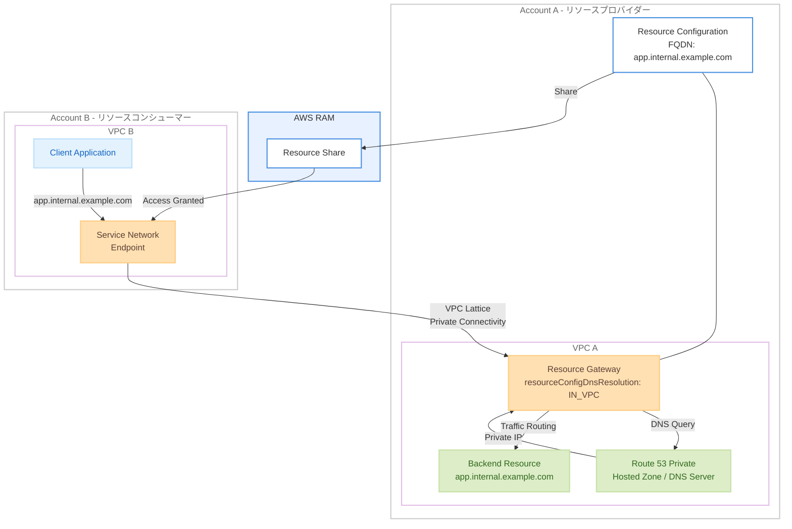

# Amazon VPC Lattice - プライベートドメイン名ターゲットのサポート

**リリース日**: 2026年5月4日
**サービス**: Amazon VPC Lattice
**機能**: リソース構成におけるプライベートドメイン名ターゲットのサポート

[このアップデートのインフォグラフィックを見る](https://takech9203.github.io/aws-news-summary/20260504-amazon-vpc-lattice.html)

## 概要

Amazon VPC Lattice のリソース構成で、ネットワーク内のプライベートなドメイン名ターゲットがサポートされるようになった。これにより、プライベート FQDN のリソース構成を定義し、AWS RAM を通じて他のアカウントと共有することで、プライベートにホストされたリソースへのセキュアなクロスアカウントアクセスが可能になる。

従来、リソース構成を使用して共有できるドメイン名ターゲットは、パブリックに解決可能なものに限定されていた。プライベート DNS サーバーを使用しているユーザーは、この仕組みを通じて FQDN を他のアカウントと共有できなかった。今回のアップデートにより、リソースゲートウェイの `resourceConfigDnsResolution` プロパティを `IN_VPC` に設定することで、VPC の DNS 設定を使用してプライベート FQDN を解決し、パブリック DNS エントリを必要とせずに正しいバックエンドにトラフィックをルーティングできる。

**アップデート前の課題**

- リソース構成で共有可能なドメイン名ターゲットはパブリックに解決可能なものに限られていた
- プライベート DNS サーバーを使用している環境では、FQDN を他のアカウントと共有するメカニズムがなかった
- クロスアカウントでプライベートリソースにアクセスするために、複雑なネットワーク構成やカスタムソリューションが必要だった

**アップデート後の改善**

- プライベート FQDN をリソース構成として定義し、他のアカウントと安全に共有できるようになった
- リソースゲートウェイの DNS 解決プロパティを `IN_VPC` に設定するだけで機能が有効化される
- VPC の DNS 設定（Route 53 プライベートホストゾーンやカスタム DNS サーバー）を活用してプライベート名前解決が可能になった

## アーキテクチャ図



Account A のリソースプロバイダーがプライベート FQDN のリソース構成を定義し、リソースゲートウェイの DNS 解決を `IN_VPC` に設定することで、Account B のクライアントアプリケーションからパブリック DNS を経由せずにプライベートリソースへアクセスできる構成を示している。

## サービスアップデートの詳細

### 主要機能

1. **プライベートドメイン名ターゲットの共有**
   - プライベート FQDN をリソース構成として定義可能
   - AWS RAM を通じて他のアカウントとセキュアに共有
   - パブリック DNS エントリが不要

2. **IN_VPC DNS 解決モード**
   - リソースゲートウェイに `resourceConfigDnsResolution` プロパティを追加
   - `IN_VPC` を設定すると、VPC の DNS 設定を使用してプライベート FQDN を解決
   - Route 53 プライベートホストゾーンおよびカスタム DNS サーバーとの互換性

3. **シームレスなクロスアカウント接続**
   - コンシューマー側では既存の VPC Lattice のサービスネットワーク経由でアクセス
   - プロバイダー側の DNS インフラストラクチャの変更が不要
   - ネットワーク分離を維持しながらプライベートリソースへの安全なアクセスを実現

## 技術仕様

### リソースゲートウェイの DNS 解決設定

| 項目 | 詳細 |
|------|------|
| プロパティ名 | `resourceConfigDnsResolution` |
| 設定値 | `IN_VPC` または `PUBLIC` |
| デフォルト値 | `PUBLIC` |
| 適用対象 | リソースゲートウェイ |
| 対象ターゲットタイプ | ドメイン名（FQDN）ターゲット |

### API 変更履歴

| 日付 | サービス | 変更内容 |
|------|----------|----------|
| 2026/05/04 | [vpc-lattice](https://awsapichanges.com/archive/changes/f687cc-vpc-lattice.html) | 3 updated api methods - CreateResourceGateway, GetResourceGateway, ListResourceGateways に resourceConfigDnsResolution パラメータを追加 |

### 更新された API メソッド

```json
{
  "CreateResourceGateway": {
    "新規パラメータ": "resourceConfigDnsResolution",
    "値": "IN_VPC | PUBLIC",
    "説明": "リソースゲートウェイ作成時にDNS解決方式を指定"
  },
  "GetResourceGateway": {
    "新規レスポンスフィールド": ["resourceConfigDnsResolution", "serviceManaged", "managedBy"],
    "説明": "リソースゲートウェイの詳細取得時にDNS解決設定を返却"
  },
  "ListResourceGateways": {
    "新規レスポンスフィールド": "resourceConfigDnsResolution",
    "説明": "リソースゲートウェイ一覧にDNS解決設定を含む"
  }
}
```

## 設定方法

### 前提条件

1. VPC Lattice が利用可能なリージョンの AWS アカウント
2. リソースが配置されている VPC にプライベート DNS 解決環境（Route 53 プライベートホストゾーンまたはカスタム DNS サーバー）が構成済み
3. AWS RAM によるリソース共有の権限

### 手順

#### ステップ 1: リソースゲートウェイの作成（IN_VPC DNS 解決を有効化）

```bash
aws vpc-lattice create-resource-gateway \
  --name my-private-dns-gateway \
  --vpc-identifier vpc-0123456789abcdef0 \
  --subnet-ids subnet-0123456789abcdef0 subnet-0123456789abcdef1 \
  --security-group-ids sg-0123456789abcdef0 \
  --ip-address-type IPV4 \
  --resource-config-dns-resolution IN_VPC
```

リソースゲートウェイを作成し、DNS 解決方式を `IN_VPC` に設定する。これにより VPC 内の DNS 設定を使用してプライベート FQDN を解決する。

#### ステップ 2: リソース構成の作成

```bash
aws vpc-lattice create-resource-configuration \
  --name my-private-app \
  --type SINGLE \
  --resource-gateway-identifier rgw-0123456789abcdef0 \
  --resource-configuration-definition '{"dnsResource": {"domainName": "app.internal.example.com", "ipAddressType": "IPV4"}}' \
  --port-ranges '[{"fromPort": 443, "toPort": 443}]'
```

プライベート FQDN をターゲットとするリソース構成を作成する。`domainName` にはプライベート DNS で解決可能な FQDN を指定する。

#### ステップ 3: AWS RAM でリソース構成を共有

```bash
aws ram create-resource-share \
  --name my-private-resource-share \
  --resource-arns arn:aws:vpc-lattice:us-east-1:111111111111:resourceconfiguration/rcfg-0123456789abcdef0 \
  --principals 222222222222
```

AWS RAM を使用してリソース構成を他のアカウントと共有する。共有先のアカウントでサービスネットワークに関連付けることでアクセスが可能になる。

## メリット

### ビジネス面

- **マルチアカウント戦略の促進**: プライベートリソースのクロスアカウント共有が容易になり、組織全体のマルチアカウント戦略を加速できる
- **運用コストの削減**: カスタム VPN やピアリング設定なしにプライベートリソースへのアクセスを実現し、インフラ管理の負担を軽減
- **追加コスト不要**: 本機能は追加料金なしで利用可能であり、既存の VPC Lattice 料金体系内で使用できる

### 技術面

- **DNS インフラの変更不要**: 既存のプライベート DNS サーバーや Route 53 プライベートホストゾーンをそのまま活用できる
- **セキュリティの維持**: パブリック DNS にエントリを公開する必要がなく、プライベートリソースの情報が外部に露出しない
- **シンプルな設定**: リソースゲートウェイに 1 つのプロパティを設定するだけで機能を有効化できる

## デメリット・制約事項

### 制限事項

- リソースゲートウェイが配置されている VPC の DNS 設定で対象 FQDN が解決可能である必要がある
- TCP プロトコルのみサポート（現時点）
- リソース構成のカスタムドメイン名は作成後に変更不可

### 考慮すべき点

- VPC の DNS 設定に依存するため、DNS サーバーの可用性がリソースへのアクセスに直接影響する
- クロスアカウント共有を使用する場合、AWS RAM の権限設定とサービスネットワークへの関連付けが必要
- 既存のリソースゲートウェイを `IN_VPC` に変更する場合はアップデート操作が必要

## ユースケース

### ユースケース 1: 共有サービスアカウントのプライベートアプリケーション共有

**シナリオ**: 共有サービスアカウントにホストされている内部 API（プライベート DNS で管理）を複数の開発アカウントからアクセスしたい場合。

**実装例**:
```bash
# 共有サービスアカウントで実行
aws vpc-lattice create-resource-gateway \
  --name shared-services-gw \
  --vpc-identifier vpc-shared \
  --subnet-ids subnet-a subnet-b \
  --resource-config-dns-resolution IN_VPC

aws vpc-lattice create-resource-configuration \
  --name internal-api \
  --type SINGLE \
  --resource-gateway-identifier rgw-shared \
  --resource-configuration-definition '{"dnsResource": {"domainName": "api.internal.corp.example.com", "ipAddressType": "IPV4"}}' \
  --port-ranges '[{"fromPort": 443, "toPort": 443}]'
```

**効果**: 各開発アカウントから VPN やピアリングなしに共有サービスの内部 API にアクセスできる。

### ユースケース 2: オンプレミス連携リソースのクロスアカウント公開

**シナリオ**: オンプレミスの DNS サーバーで管理されているアプリケーション（AWS Direct Connect 経由で到達可能）を、他の AWS アカウントから利用可能にしたい場合。

**実装例**:
```bash
# Route 53 Resolver Inbound Endpoint と連携するVPCにリソースゲートウェイを配置
aws vpc-lattice create-resource-gateway \
  --name onprem-access-gw \
  --vpc-identifier vpc-hybrid \
  --subnet-ids subnet-hybrid-a subnet-hybrid-b \
  --resource-config-dns-resolution IN_VPC

aws vpc-lattice create-resource-configuration \
  --name onprem-erp \
  --type SINGLE \
  --resource-gateway-identifier rgw-onprem \
  --resource-configuration-definition '{"dnsResource": {"domainName": "erp.corp.internal", "ipAddressType": "IPV4"}}' \
  --port-ranges '[{"fromPort": 8443, "toPort": 8443}]'
```

**効果**: オンプレミスのリソースに対して、複雑なネットワーク構成なしに他のアカウントからセキュアにアクセスできる。

### ユースケース 3: マイクロサービスのプライベートサービスディスカバリ

**シナリオ**: Route 53 プライベートホストゾーンでサービスディスカバリを行っているマイクロサービス群を、異なるチームのアカウントから利用させたい場合。

**実装例**:
```bash
# グループリソース構成でマイクロサービス群を束ねる
aws vpc-lattice create-resource-gateway \
  --name microservices-gw \
  --vpc-identifier vpc-services \
  --subnet-ids subnet-svc-a subnet-svc-b \
  --resource-config-dns-resolution IN_VPC

# 各マイクロサービスのリソース構成を作成
aws vpc-lattice create-resource-configuration \
  --name auth-service \
  --type SINGLE \
  --resource-gateway-identifier rgw-microservices \
  --resource-configuration-definition '{"dnsResource": {"domainName": "auth.services.internal", "ipAddressType": "IPV4"}}' \
  --port-ranges '[{"fromPort": 443, "toPort": 443}]'
```

**効果**: サービスメッシュを導入せずに、プライベート DNS ベースのサービスディスカバリをクロスアカウントで活用できる。

## 料金

本機能自体は追加料金なしで利用可能。VPC Lattice の標準料金が適用される。

### 料金例

| 項目 | 料金（US East） |
|------|------------------|
| VPC リソースへのデータ処理（最初の 1 PB） | $0.01/GB |
| VPC リソースへのデータ処理（次の 4 PB） | $0.006/GB |
| VPC リソースへのデータ処理（5 PB 超） | $0.004/GB |
| サービスネットワークエンドポイント | 追加料金なし |
| VPC 関連付け | 追加料金なし |

## 利用可能リージョン

VPC Lattice が利用可能なすべての AWS リージョンで追加料金なしで利用可能。

## 関連サービス・機能

- **Amazon Route 53 Private Hosted Zones**: VPC 内のプライベート DNS 解決に使用。IN_VPC 設定と連携してプライベート FQDN を解決
- **AWS Resource Access Manager**: リソース構成を他のアカウントと共有するために使用
- **VPC Lattice Service Networks**: リソース構成の関連付け先として、クロスアカウント接続のエンドポイントを提供
- **Route 53 Resolver**: オンプレミス DNS サーバーとの連携によるハイブリッド DNS 解決に活用

## 参考リンク

- [インフォグラフィック](https://takech9203.github.io/aws-news-summary/20260504-amazon-vpc-lattice.html)
- [公式発表 (What's New)](https://aws.amazon.com/about-aws/whats-new/2026/05/amazon-vpc-lattice/)
- [VPC Lattice ユーザーガイド - リソース構成](https://docs.aws.amazon.com/vpc-lattice/latest/ug/resource-configuration.html)
- [VPC Lattice ユーザーガイド - リソースゲートウェイの作成](https://docs.aws.amazon.com/vpc-lattice/latest/ug/create-resource-gateway.html)
- [料金ページ](https://aws.amazon.com/vpc/lattice/pricing/)

## まとめ

Amazon VPC Lattice のリソース構成がプライベートドメイン名ターゲットをサポートしたことで、プライベート DNS 環境を持つ組織がクロスアカウントでのリソース共有を大幅に簡素化できるようになった。リソースゲートウェイの `resourceConfigDnsResolution` を `IN_VPC` に設定するだけで有効化でき、既存の DNS インフラストラクチャを変更する必要がない。マルチアカウント戦略を採用している組織や、オンプレミスとのハイブリッド環境を運用しているユーザーは、本機能の採用を検討することを推奨する。
