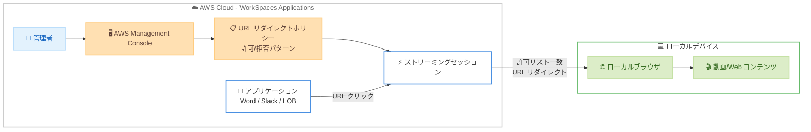

# Amazon WorkSpaces Applications - ホストからクライアントへの URL リダイレクション

**リリース日**: 2026年5月4日
**サービス**: Amazon WorkSpaces Applications
**機能**: Host-to-Client URL Redirection

[このアップデートのインフォグラフィックを見る](https://takech9203.github.io/aws-news-summary/20260504-amazon-workspaces-applications-url.html)

## 概要

Amazon WorkSpaces Applications (旧 AppStream 2.0) にホストからクライアントへの URL リダイレクション機能が追加された。この機能により、ストリーミングセッション内で開かれた URL を自動的にユーザーのローカルブラウザで起動できるようになる。管理者は AWS Management Console を通じて許可・拒否する URL パターンを設定し、どの Web コンテンツをリダイレクトするかを制御できる。

これにより、機密性の高いアプリケーションはストリーミング環境内で安全に保持しながら、動画ストリーミングなどのリソース集約型コンテンツをローカルデバイスにオフロードすることが可能になる。帯域幅を多く消費する Web ワークロードをローカルデバイスに移行することで、ストリーミングインフラストラクチャの負荷を軽減し、エンドユーザー体験に影響を与えることなくインフラコストを削減できる。

**アップデート前の課題**

- ストリーミングセッション内のすべての Web コンテンツがストリーミングインフラストラクチャを経由して処理されていた
- 動画視聴などの帯域幅を大量に消費するコンテンツもストリーミングサーバーのリソースを消費していた
- ストリーミングインフラストラクチャのコストが不必要に高くなる傾向があった
- アプリケーション内の外部リンクをローカルブラウザで開くための手動操作が必要だった

**アップデート後の改善**

- 設定した URL パターンに基づいて自動的にローカルブラウザで URL が開かれるようになった
- 帯域幅を大量に消費する Web コンテンツをローカルデバイスにオフロードし、インフラコストを削減できる
- Microsoft Word や Slack などのアプリケーション内の埋め込みリンクも自動リダイレクト対象となる
- Chrome および Edge ブラウザでのブラウザナビゲーションもリダイレクト対象として動作する

## アーキテクチャ図



ストリーミングセッション内のアプリケーションで URL がクリックされると、管理者が設定した許可リストと照合され、一致する場合はユーザーのローカルブラウザで自動的に開かれる。

## サービスアップデートの詳細

### 主要機能

1. **URL リダイレクトの自動化**
   - ストリーミングセッション内の URL をユーザーのローカルデフォルトブラウザで自動的に開く
   - ブラウザナビゲーションおよびアプリケーション内の埋め込みリンクの両方に対応
   - ユーザーの手動操作なしにシームレスにリダイレクトが実行される

2. **許可/拒否パターンによるアクセス制御**
   - AWS Management Console から URL パターンを設定
   - 許可リスト (Allow List) に一致する URL のみがリダイレクト対象
   - 拒否リスト (Deny List) により特定の URL のリダイレクトをブロック可能
   - 機密性の高いアプリケーションをストリーミング環境内に保持するきめ細かな制御

3. **幅広いアプリケーションサポート**
   - ストリーミングホスト上の Chrome および Edge ブラウザでのナビゲーション
   - Microsoft Word 内の埋め込みリンク
   - Slack やカスタム LOB アプリケーション内のリンク
   - ブラウザベースおよびアプリケーションベースの両方のシナリオに対応

## 技術仕様

### 対応環境

| 項目 | 詳細 |
|------|------|
| ストリーミングホストブラウザ | Chrome、Edge |
| 対応アプリケーション | Microsoft Word、Slack、カスタム LOB アプリ |
| リダイレクト先 | ユーザーのローカルデフォルトブラウザ |
| 設定方法 | AWS Management Console |
| URL パターン設定 | 許可リスト/拒否リストによるパターンマッチング |

### 設定要素

| 設定項目 | 説明 |
|----------|------|
| Allow URL Patterns | リダイレクト対象とする URL パターンの一覧 |
| Deny URL Patterns | リダイレクトをブロックする URL パターンの一覧 |

## 設定方法

### 前提条件

1. Amazon WorkSpaces Applications 環境が構成済みであること
2. AWS Management Console へのアクセス権限があること
3. ストリーミングホスト上に Chrome または Edge ブラウザがインストールされていること

### 手順

#### ステップ 1: AWS Management Console でリダイレクトポリシーを設定

AWS Management Console にログインし、Amazon WorkSpaces Applications の設定画面で URL リダイレクトのポリシーを構成する。許可する URL パターンと拒否する URL パターンを定義する。

#### ステップ 2: 許可 URL パターンの追加

リダイレクト対象とする URL パターンを許可リストに追加する。例えば、動画ストリーミングサイトや外部の Web コンテンツなど、ローカルブラウザで開くことが望ましい URL を指定する。

#### ステップ 3: 拒否 URL パターンの追加

ストリーミング環境内に保持すべき機密性の高い URL パターンを拒否リストに追加する。社内システムや機密データへのアクセスを含む URL などを指定する。

#### ステップ 4: 動作確認

ストリーミングセッションを開始し、設定した URL パターンに基づいてリダイレクトが正しく動作することを確認する。

## メリット

### ビジネス面

- **インフラコスト削減**: 帯域幅を多く消費する Web ワークロードをローカルデバイスにオフロードすることで、ストリーミングインフラストラクチャの使用量とコストを削減
- **セキュリティの維持**: 機密アプリケーションはストリーミング環境内に保持しながら、一般的な Web コンテンツのみをリダイレクト
- **ユーザー体験の向上**: 動画などのリッチコンテンツをローカルデバイスで直接再生することで、より快適な視聴体験を提供

### 技術面

- **帯域幅の最適化**: ストリーミングサーバーの帯域幅消費を削減し、コアアプリケーションのパフォーマンスを向上
- **柔軟なポリシー制御**: 許可/拒否パターンによるきめ細かな URL リダイレクト制御が可能
- **幅広い互換性**: Chrome、Edge ブラウザおよび主要なビジネスアプリケーションとの統合

## デメリット・制約事項

### 制限事項

- ストリーミングホスト上のブラウザは Chrome および Edge のみ対応
- リダイレクトはユーザーのローカルデフォルトブラウザで開かれるため、ブラウザの選択はユーザーのローカル設定に依存
- URL パターンの設定は AWS Management Console を通じて行う必要がある

### 考慮すべき点

- 許可/拒否パターンの設計には、組織のセキュリティポリシーとの整合性を考慮する必要がある
- リダイレクトされた URL のコンテンツはローカルデバイスで直接アクセスされるため、ネットワークアクセス制御が別途必要になる場合がある
- ユーザーのローカルデバイスに適切なブラウザとネットワーク接続が必要

## ユースケース

### ユースケース 1: 動画コンテンツのオフロード

**シナリオ**: 企業の従業員がストリーミングセッション内で業務アプリケーションを使用しながら、研修動画やプレゼンテーション動画を視聴する必要がある。

**実装例**:
```
許可 URL パターン:
- https://www.youtube.com/*
- https://vimeo.com/*
- https://company-training.example.com/videos/*
```

**効果**: 動画ストリーミングがローカルデバイスで直接再生されることにより、ストリーミングサーバーの帯域幅消費を大幅に削減し、同時に他のユーザーのセッションパフォーマンスも向上する。

### ユースケース 2: 外部 Web サービスへのアクセス

**シナリオ**: 従業員が Slack や Microsoft Word 内のリンクから外部の Web サービスにアクセスする際、ストリーミング環境を経由せずにローカルブラウザで直接開きたい。

**実装例**:
```
許可 URL パターン:
- https://docs.google.com/*
- https://*.sharepoint.com/*
- https://confluence.example.com/*

拒否 URL パターン:
- https://internal-crm.example.com/*
- https://hr-system.example.com/*
```

**効果**: 一般的な Web サービスはローカルブラウザで快適に利用でき、機密性の高い社内システムはストリーミング環境内で安全にアクセスされる。

### ユースケース 3: コスト最適化のためのインフラ負荷軽減

**シナリオ**: 大規模組織で数百人のユーザーが同時にストリーミングセッションを使用しており、Web ブラウジングによるインフラコストが課題となっている。

**実装例**:
```
許可 URL パターン:
- https://*.cdn.example.com/*
- https://media.example.com/*
- https://*.streaming-service.com/*

拒否 URL パターン:
- https://erp.example.com/*
- https://finance.example.com/*
```

**効果**: 帯域幅を多く消費するコンテンツをローカルデバイスに移行することで、ストリーミングインスタンスのサイジングを最適化し、月間インフラコストを削減できる。

## 料金

Amazon WorkSpaces Applications の URL リダイレクション機能自体には追加料金はかからない。Amazon WorkSpaces Applications の標準料金 (従量課金制) が適用される。URL リダイレクションによりストリーミングインフラストラクチャの負荷が軽減されるため、全体的なコスト削減効果が期待できる。

## 利用可能リージョン

以下の AWS リージョンで利用可能。

- US East (N. Virginia, Ohio)
- US West (Oregon)
- Asia Pacific (Malaysia, Mumbai, Seoul, Singapore, Sydney, Tokyo)
- Canada (Central)
- Europe (Frankfurt, Ireland, London, Milan, Paris)
- South America (Sao Paulo)
- Israel (Tel Aviv)
- AWS GovCloud (US-West, US-East)

**東京リージョンで利用可能。**

## 関連サービス・機能

- **Amazon WorkSpaces**: フルマネージドの仮想デスクトップサービス。WorkSpaces Applications はアプリケーション単位のストリーミングに特化
- **Amazon AppStream 2.0**: WorkSpaces Applications の前身サービス。同様のアプリケーションストリーミング機能を提供
- **AWS Management Console**: URL リダイレクトポリシーの設定に使用

## 参考リンク

- [インフォグラフィック](https://takech9203.github.io/aws-news-summary/20260504-amazon-workspaces-applications-url.html)
- [公式発表 (What's New)](https://aws.amazon.com/about-aws/whats-new/2026/05/amazon-workspaces-applications-url/)
- [ドキュメント - Host to Client URL Redirection](https://docs.aws.amazon.com/appstream2/latest/developerguide/feature-support-url-redirection.html)
- [Amazon WorkSpaces Applications](https://aws.amazon.com/workspaces/applications/)

## まとめ

Amazon WorkSpaces Applications のホストからクライアントへの URL リダイレクション機能は、ストリーミング環境のコスト最適化とユーザー体験の向上を両立する実用的なアップデートである。特に動画視聴やリッチ Web コンテンツを扱う組織では、インフラコストの削減効果が大きい。東京リージョンを含む多数のリージョンで利用可能であり、既存の WorkSpaces Applications 環境に追加コストなく導入できるため、早期の評価・導入を推奨する。
