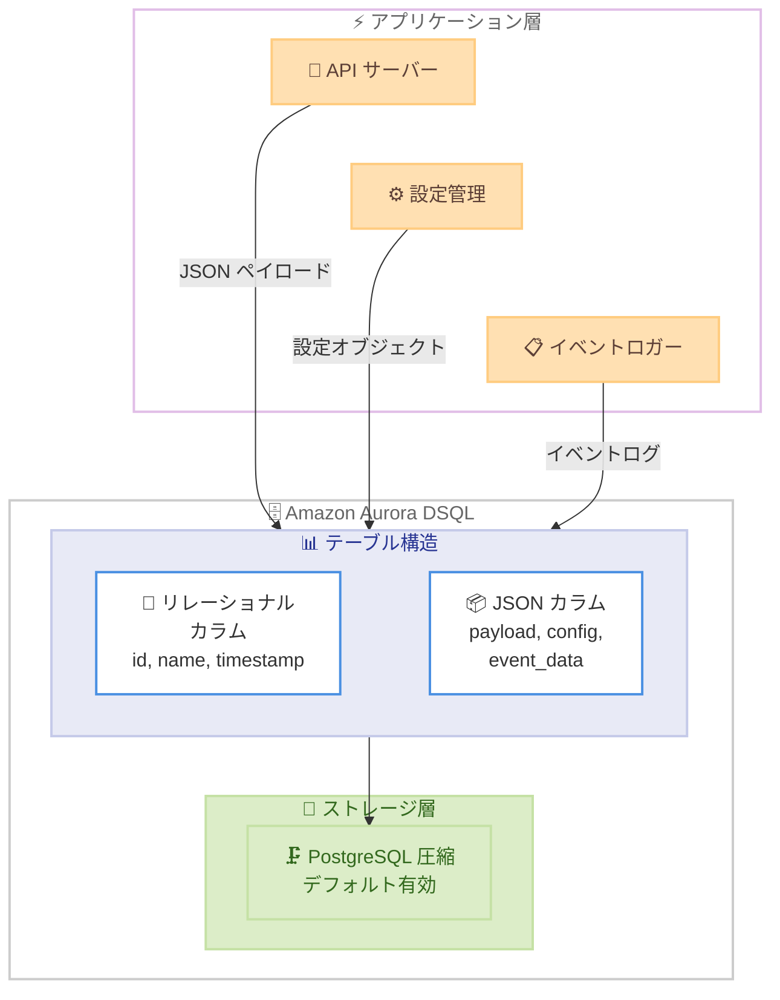

# Amazon Aurora DSQL - JSON データ型サポート (圧縮対応)

**リリース日**: 2026 年 5 月 4 日
**サービス**: Amazon Aurora DSQL
**機能**: PostgreSQL JSON データ型サポート (圧縮機能付き)

📊 [このアップデートのインフォグラフィックを見る](https://takech9203.github.io/aws-news-summary/20260504-aurora-dsql-json-support.html)

## 概要

Amazon Aurora DSQL が PostgreSQL の JSON データ型をサポートし、オプションの圧縮機能を提供するようになりました。これにより、PostgreSQL の JSON 型に依存するコードやツールを Aurora DSQL で変更なしに使用でき、リレーショナルデータと半構造化データを同一テーブル内で管理することが可能になります。

JSON データ型は、テーブルの作成時や変更時にカラム定義で使用でき、API ペイロード、設定オブジェクト、イベントログなどの半構造化データの格納に適しています。PostgreSQL の圧縮機能がデフォルトで有効になっているため、大きな JSON ペイロードがより効率的に保存され、ストレージコストの削減に貢献します。

**アップデート前の課題**

- Aurora DSQL で JSON データ型を直接使用できず、半構造化データの格納に TEXT 型やアプリケーション層での変換処理が必要だった
- PostgreSQL の JSON 型に依存する既存のコードやツールを Aurora DSQL で使用する際に修正が必要だった
- リレーショナルデータと半構造化データを同一テーブル内で自然に共存させることが困難だった
- 大容量の JSON データを保存する際にストレージ効率が悪く、コストが高くなる傾向があった

**アップデート後の改善**

- PostgreSQL 互換の JSON データ型を直接使用でき、既存コードの移行が容易に
- テーブル定義で JSON カラムを宣言し、半構造化データをネイティブに格納可能
- PostgreSQL 圧縮がデフォルトで有効になり、大きな JSON ペイロードのストレージ効率が向上
- API ペイロード、設定オブジェクト、イベントログなどを効率的に管理可能

## アーキテクチャ図



Aurora DSQL のテーブル内でリレーショナルカラムと JSON カラムが共存し、PostgreSQL 圧縮によりストレージ効率が最適化される構成を示しています。

## サービスアップデートの詳細

### 主要機能

1. **PostgreSQL JSON データ型のネイティブサポート**
   - PostgreSQL 標準の JSON 型をカラム定義で使用可能
   - JSON データの格納、取得、操作に対応
   - 既存の PostgreSQL JSON 関数および演算子との互換性

2. **デフォルト圧縮によるストレージ最適化**
   - PostgreSQL の TOAST (The Oversized-Attribute Storage Technique) 圧縮がデフォルトで有効
   - 大きな JSON ペイロードを自動的に圧縮して保存
   - 圧縮・解凍はデータベースエンジンが透過的に処理

3. **既存ツール・コードとの互換性**
   - PostgreSQL の JSON 型に依存する ORM やドライバーがそのまま動作
   - アプリケーション層での変換処理が不要
   - 既存の PostgreSQL 移行パスが簡素化

## 技術仕様

### JSON データ型の仕様

| 項目 | 詳細 |
|------|------|
| サポートデータ型 | JSON |
| 圧縮 | PostgreSQL TOAST 圧縮 (デフォルト有効) |
| テーブル操作 | CREATE TABLE / ALTER TABLE で JSON カラム定義可能 |
| 互換性 | PostgreSQL JSON 型準拠 |
| 格納形式 | テキストベースの JSON 表現 |

### JSON 型と JSONB 型の比較

| 項目 | JSON | JSONB |
|------|------|-------|
| 格納形式 | テキスト (入力時のまま) | バイナリ分解形式 |
| 圧縮対応 | あり (TOAST) | - |
| 入力検証 | あり (構文チェック) | - |
| キー順序 | 保持 | 保持しない |
| 重複キー | 保持 | 最後の値を使用 |
| インデックス | 不可 (GIN) | 可能 (GIN) |

### API 変更履歴

現時点で AWS API Changes における関連する API 変更は確認されていません。本機能は PostgreSQL 互換レイヤーでのデータ型サポート拡張であり、AWS 管理 API の変更を伴わないアップデートです。

## 設定方法

### 前提条件

1. Aurora DSQL クラスターが作成済みであること
2. クラスターへの接続権限を持つ IAM ロールまたはユーザーが設定済みであること
3. PostgreSQL 互換クライアント (psql、各言語の PostgreSQL ドライバーなど) がインストール済みであること

### 手順

#### ステップ 1: JSON カラムを含むテーブルの作成

```sql
CREATE TABLE api_events (
    id UUID PRIMARY KEY DEFAULT gen_random_uuid(),
    event_type VARCHAR(100) NOT NULL,
    payload JSON NOT NULL,
    created_at TIMESTAMP DEFAULT NOW()
);
```

JSON 型のカラム `payload` を定義してテーブルを作成します。圧縮はデフォルトで有効になるため、追加の設定は不要です。

#### ステップ 2: JSON データの挿入

```sql
INSERT INTO api_events (event_type, payload)
VALUES (
    'user.signup',
    '{"user_id": "u-12345", "email": "user@example.com", "plan": "enterprise", "metadata": {"source": "web", "campaign": "q2-launch"}}'
);
```

JSON 文字列をそのまま挿入できます。構文的に正しい JSON でない場合はエラーが返されます。

#### ステップ 3: JSON データのクエリ

```sql
-- JSON フィールドの抽出
SELECT
    event_type,
    payload->>'user_id' AS user_id,
    payload->>'email' AS email,
    payload->'metadata'->>'source' AS source
FROM api_events
WHERE event_type = 'user.signup';
```

PostgreSQL 標準の JSON 演算子 (`->`, `->>`) を使用して JSON フィールドを抽出できます。

#### ステップ 4: 既存テーブルへの JSON カラム追加

```sql
ALTER TABLE existing_table
ADD COLUMN config JSON;
```

既存テーブルに対して ALTER TABLE で JSON カラムを追加できます。

## メリット

### ビジネス面

- **移行コストの削減**: PostgreSQL JSON 型に依存する既存アプリケーションを修正なしで Aurora DSQL に移行可能。開発工数を大幅に削減
- **ストレージコストの最適化**: デフォルトの圧縮機能により、大容量の JSON データを効率的に保存。ストレージ費用の削減に直結
- **開発生産性の向上**: リレーショナルデータと半構造化データを同一データベースで管理でき、別途 NoSQL データベースを運用する必要がない

### 技術面

- **PostgreSQL 互換性の強化**: 標準 JSON 型のサポートにより、ORM やマイグレーションツールとの互換性が向上
- **スキーマ柔軟性**: 構造が変化しやすいデータ (API レスポンス、設定値) を JSON カラムで柔軟に管理
- **透過的な圧縮**: アプリケーション側で圧縮・解凍ロジックを実装する必要がなく、データベースエンジンが自動処理

## デメリット・制約事項

### 制限事項

- JSON 型は入力テキストをそのまま保存するため、クエリ時に毎回パースが必要 (JSONB と異なりバイナリ形式で保存されない)
- JSON カラムに対する GIN インデックスの作成は、現時点では JSONB 型ほどの柔軟性がない可能性がある
- Aurora DSQL の分散トランザクション特性上、大量の JSON データを含むトランザクションではレイテンシーに影響する場合がある

### 考慮すべき点

- 高頻度のキー検索やフィルタリングが必要な場合、リレーショナルカラムへの正規化を検討すべき
- JSON データの圧縮率はペイロードの内容 (テキストの重複度、データ構造) に依存する
- JSON 型はキー順序と重複キーを保持するが、これが不要な場合は将来的に JSONB 型の対応状況を確認する

## ユースケース

### ユースケース 1: API ペイロードの格納と分析

**シナリオ**: マイクロサービスアーキテクチャで、各サービスが受信する API リクエスト/レスポンスのペイロードを監査目的で保存する必要がある。ペイロードの構造はサービスごとに異なり、頻繁に変更される。

**実装例**:
```sql
CREATE TABLE api_audit_log (
    id UUID PRIMARY KEY DEFAULT gen_random_uuid(),
    service_name VARCHAR(50) NOT NULL,
    endpoint VARCHAR(255) NOT NULL,
    method VARCHAR(10) NOT NULL,
    request_payload JSON,
    response_payload JSON,
    status_code INT,
    latency_ms INT,
    created_at TIMESTAMP DEFAULT NOW()
);

-- 特定サービスのエラーレスポンスを分析
SELECT
    endpoint,
    response_payload->>'error_code' AS error_code,
    response_payload->>'message' AS error_message,
    COUNT(*) AS occurrences
FROM api_audit_log
WHERE service_name = 'payment-service'
  AND status_code >= 400
  AND created_at > NOW() - INTERVAL '24 hours'
GROUP BY endpoint, error_code, error_message
ORDER BY occurrences DESC;
```

**効果**: サービスごとに異なるペイロード構造を柔軟に格納しつつ、圧縮によりストレージコストを抑制。障害分析やパフォーマンス監視に活用可能。

### ユースケース 2: マルチテナント設定管理

**シナリオ**: SaaS アプリケーションで、テナントごとにカスタマイズ可能な設定をデータベースに保存する。設定項目はテナントのプランや要件に応じて大きく異なる。

**実装例**:
```sql
CREATE TABLE tenant_config (
    tenant_id UUID PRIMARY KEY,
    tenant_name VARCHAR(100) NOT NULL,
    plan VARCHAR(20) NOT NULL,
    config JSON NOT NULL,
    updated_at TIMESTAMP DEFAULT NOW()
);

-- テナント設定の挿入
INSERT INTO tenant_config (tenant_id, tenant_name, plan, config)
VALUES (
    'a1b2c3d4-e5f6-7890-abcd-ef1234567890',
    'Acme Corp',
    'enterprise',
    '{
        "features": {"sso": true, "audit_log": true, "custom_branding": true},
        "limits": {"max_users": 500, "storage_gb": 100, "api_calls_per_month": 1000000},
        "integrations": {"slack": {"webhook_url": "https://hooks.slack.com/..."}, "jira": {"enabled": true}},
        "notifications": {"email": true, "sms": false}
    }'
);

-- 特定機能が有効なテナントを検索
SELECT tenant_name, plan
FROM tenant_config
WHERE config->>'features' LIKE '%"sso": true%';
```

**効果**: テナントごとの多様な設定要件を単一テーブルで管理。スキーマ変更なしに新しい設定項目を追加可能。

### ユースケース 3: IoT イベントログの集約

**シナリオ**: IoT デバイスから送信されるイベントデータを格納する。デバイスの種類によってペイロード構造が異なり、デバイスのファームウェアアップデートにより構造が変化する可能性がある。

**実装例**:
```sql
CREATE TABLE iot_events (
    event_id UUID PRIMARY KEY DEFAULT gen_random_uuid(),
    device_id VARCHAR(64) NOT NULL,
    device_type VARCHAR(50) NOT NULL,
    event_data JSON NOT NULL,
    received_at TIMESTAMP DEFAULT NOW()
);

-- デバイスイベントの挿入
INSERT INTO iot_events (device_id, device_type, event_data)
VALUES (
    'sensor-temp-001',
    'temperature_sensor',
    '{"temperature_c": 23.5, "humidity_pct": 65.2, "battery_level": 0.87, "firmware": "2.1.0", "location": {"lat": 35.6762, "lng": 139.6503}}'
);

-- 異常温度を検知したデバイスの分析
SELECT
    device_id,
    event_data->>'temperature_c' AS temperature,
    event_data->'location'->>'lat' AS latitude,
    event_data->'location'->>'lng' AS longitude,
    received_at
FROM iot_events
WHERE device_type = 'temperature_sensor'
  AND (event_data->>'temperature_c')::FLOAT > 40.0
ORDER BY received_at DESC;
```

**効果**: デバイス種別やファームウェアバージョンによって異なるイベント構造を柔軟に格納。圧縮により大量の IoT イベントデータのストレージコストを最適化。

## 料金

Aurora DSQL の料金は従来と変わらず、以下のコンポーネントで構成されます。JSON データ型の使用に追加料金はかかりません。

| コンポーネント | 料金体系 |
|----------------|----------|
| 読み取り処理 | 処理ユニットあたりの従量課金 |
| 書き込み処理 | 処理ユニットあたりの従量課金 |
| ストレージ | GB あたりの月額課金 |
| データ転送 | リージョン間転送に課金 |

圧縮機能によりストレージ使用量が削減されるため、大容量の JSON データを扱うワークロードでは実質的なコスト削減が期待できます。

## 利用可能リージョン

Aurora DSQL が利用可能なすべてのリージョンで JSON データ型がサポートされています。2026 年 5 月時点で以下のリージョンが含まれます。

- 米国東部 (バージニア北部) - us-east-1
- 米国東部 (オハイオ) - us-east-2
- 米国西部 (オレゴン) - us-west-2
- アジアパシフィック (東京) - ap-northeast-1
- アジアパシフィック (大阪) - ap-northeast-3
- アジアパシフィック (ソウル) - ap-northeast-2
- アジアパシフィック (シドニー) - ap-southeast-2
- アジアパシフィック (メルボルン) - ap-southeast-4
- 欧州 (フランクフルト) - eu-central-1
- 欧州 (アイルランド) - eu-west-1
- 欧州 (スペイン) - eu-south-2
- カナダ (セントラル) - ca-central-1
- カナダウエスト (カルガリー) - ca-west-1
- 南米 (サンパウロ) - sa-east-1

## 関連サービス・機能

- **Amazon Aurora DSQL**: 常時可用なサーバーレス分散 SQL データベース。PostgreSQL 互換の SQL エンジンを提供
- **Amazon Aurora PostgreSQL**: フルマネージドの PostgreSQL 互換データベース。JSONB 型を含む完全な PostgreSQL データ型をサポート
- **Amazon DynamoDB**: NoSQL データベースサービス。JSON ドキュメントのネイティブ格納に対応するが、リレーショナルクエリは不可
- **Amazon DocumentDB**: MongoDB 互換のドキュメントデータベース。JSON ドキュメントの格納と柔軟なクエリに特化

## 参考リンク

- 📊 [インフォグラフィック](https://takech9203.github.io/aws-news-summary/20260504-aurora-dsql-json-support.html)
- [公式発表 (What's New)](https://aws.amazon.com/about-aws/whats-new/2026/05/aurora-dsql-json-support/)
- [Aurora DSQL ドキュメント - サポート済みデータ型](https://docs.aws.amazon.com/aurora-dsql/latest/userguide/working-with-postgresql-compatibility-supported-data-types.html)
- [Aurora DSQL 概要](https://aws.amazon.com/rds/aurora/dsql/)
- [Aurora DSQL 料金](https://aws.amazon.com/rds/aurora/dsql/pricing/)

## まとめ

Amazon Aurora DSQL における JSON データ型サポートは、PostgreSQL 互換性の重要な強化であり、半構造化データをリレーショナルデータと統合的に管理するニーズに応えるアップデートです。デフォルトの圧縮機能により、大容量の JSON ペイロードを効率的に保存できるため、API ペイロードの監査、マルチテナント設定管理、IoT イベントログなど多様なワークロードで活用できます。既存の PostgreSQL JSON 依存コードを変更なしで移行できる点も、Aurora DSQL の採用障壁を下げる重要なポイントです。
