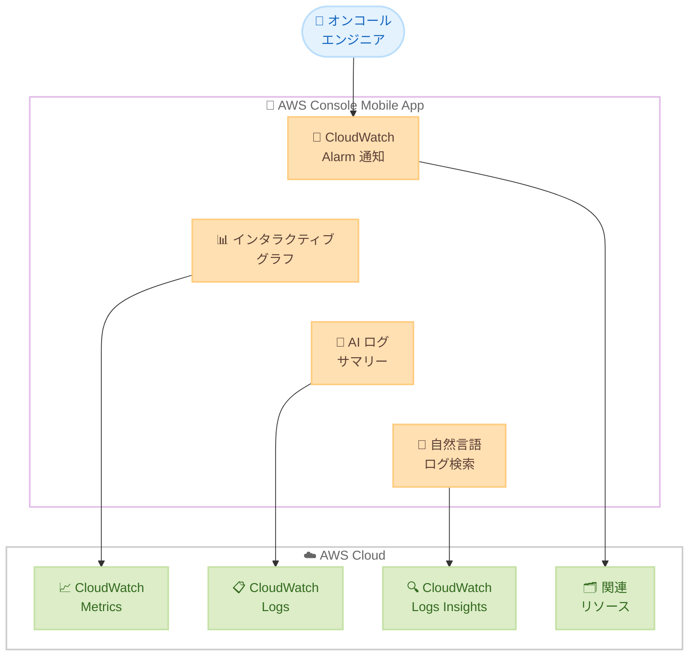

# AWS Console Mobile App - CloudWatch Alarms のインタラクティブグラフ、AI ログサマリー、自然言語ログ検索

**リリース日**: 2026年5月4日
**サービス**: AWS Console Mobile App
**機能**: CloudWatch Alarms のインタラクティブグラフ、AI ログサマリー、自然言語ログ検索

[このアップデートのインフォグラフィックを見る](https://takech9203.github.io/aws-news-summary/20260504-aws-console-mobile-app.html)

## 概要

AWS Console Mobile App に CloudWatch Alarms の調査機能が大幅に強化された。インタラクティブグラフ、AI 生成ログサマリー、自然言語によるログ検索、関連メトリクスおよびリソースへのストリームラインアクセスが追加され、モバイルデバイスからアラーム状態の調査とトリアージをより効率的に実施できるようになった。

これにより、オンコールエンジニアは通知を受けてから根本原因の特定までの時間を大幅に短縮できる。従来は複数の画面やサービスを切り替える必要があったが、今回のアップデートにより単一ビューですべての必要な情報にアクセスできるようになった。

**アップデート前の課題**

- モバイルアプリでアラームを調査する際、メトリクス、ログ、リソース情報を確認するために複数の画面を切り替える必要があった
- ログの検索にはクエリ構文の知識が必要で、モバイルデバイスからの入力が煩雑だった
- アラームのトリガー原因を特定するために、PC に戻って詳細調査する必要がある場面が多かった

**アップデート後の改善**

- 単一ビューでアラームに関連するメトリクス、ログ、リソースをすべて確認可能になった
- AI 生成サマリーにより、ログの主要な要因が自動的にハイライトされる
- 自然言語やボイス入力でログ検索が可能になり、クエリ構文の知識が不要になった
- インタラクティブグラフで特定の時間範囲にズームインし、異常を迅速に特定できるようになった

## アーキテクチャ図

オンコールエンジニアがモバイルアプリから CloudWatch Alarms を受信し、インタラクティブグラフ、AI サマリー、自然言語検索を通じて AWS Cloud 上のメトリクスやログにアクセスするフローを示している。

## サービスアップデートの詳細

### 主要機能

1. **インタラクティブグラフ**
   - アラームをトリガーしたメトリクスを視覚化
   - 特定の時間範囲へのズームインが可能
   - データの探索により異常を迅速に特定
   - カスタム時間範囲の選択とタイムゾーン調整に対応

2. **AI 生成ログサマリー**
   - 関連ログの自動分析と要約
   - 主要な原因要素のハイライト表示
   - 根本原因特定までの時間を短縮

3. **自然言語ログ検索**
   - テキスト入力による自然言語クエリ
   - ボイス入力対応
   - 事前保存された Logs Insights クエリの選択
   - CloudWatch Logs Insights との統合

4. **統合調査ビュー**
   - 関連メトリクスとリソースの一元表示
   - アラームからログ、メトリクス、リソースへのシームレスなナビゲーション
   - 複数画面の切り替えが不要

## 技術仕様

### 対応プラットフォーム

| 項目 | 詳細 |
|------|------|
| iOS | Apple App Store から入手可能 |
| Android | Google Play Store から入手可能 |
| 対応リージョン | すべての AWS 商用リージョン |
| 追加コスト | なし |

### 検索機能

| 検索方法 | 説明 |
|----------|------|
| テキスト入力 | 自然言語でログクエリを記述 |
| ボイス入力 | 音声認識によるクエリ入力 |
| 保存済みクエリ | 事前保存した Logs Insights クエリを選択 |

## 設定方法

### 前提条件

1. AWS Console Mobile App がインストールされていること (iOS または Android)
2. AWS アカウントへのアクセス権限があること
3. CloudWatch Alarms が設定されていること
4. CloudWatch Logs へのアクセス権限 (AI サマリーおよびログ検索の利用に必要)

### 手順

#### ステップ 1: アプリのインストールまたはアップデート

Apple App Store または Google Play Store から AWS Console Mobile App をダウンロードまたは最新バージョンにアップデートする。

#### ステップ 2: CloudWatch へのナビゲーション

アプリ内で CloudWatch サービスに移動し、Alarms セクションを開く。

#### ステップ 3: アラームの調査

トリガーされたアラームを選択すると、インタラクティブグラフ、AI ログサマリー、自然言語検索が統合された調査ビューが表示される。

## メリット

### ビジネス面

- **MTTR の短縮**: 通知から根本原因特定までの時間を大幅に削減し、サービス復旧を迅速化
- **オンコール体験の改善**: PC を開かずにモバイルデバイスだけで初期調査が完了し、エンジニアの負担を軽減
- **運用コスト削減**: 迅速なトリアージにより、不要なエスカレーションや対応人員の削減が期待できる

### 技術面

- **単一ビュー統合**: 複数サービスの情報を一画面に集約し、コンテキストスイッチのオーバーヘッドを削減
- **AI 活用によるログ分析**: 大量のログデータから重要な情報を自動抽出し、人手による分析時間を短縮
- **自然言語インターフェース**: クエリ構文の知識がなくてもログ検索が可能になり、幅広いチームメンバーが調査に参加可能

## デメリット・制約事項

### 制限事項

- モバイルアプリでの操作のため、詳細なダッシュボード作成やアラーム設定変更などの操作は引き続き PC が必要
- AI ログサマリーの精度は、ログの構造化度合いやデータ量に依存する可能性がある
- 自然言語検索の対応言語や精度に関する詳細は公式ドキュメントで確認が必要

### 考慮すべき点

- AI ログサマリー機能を活用するために、CloudWatch Logs への適切な IAM 権限設定が必要
- 大量のログデータがある環境では、モバイルネットワーク帯域の使用量に注意が必要
- ボイス入力機能の利用にはデバイスのマイク権限が必要

## ユースケース

### ユースケース 1: 深夜のアラーム対応

**シナリオ**: オンコールエンジニアが深夜に CPU 使用率アラームの通知を受信した。PC を開かずにモバイルデバイスからすぐに状況を把握したい。

**実装例**:
1. プッシュ通知からアラームを開く
2. インタラクティブグラフで CPU 使用率のスパイク時間を特定
3. AI サマリーで関連ログの要因を確認
4. 原因がデプロイメントに関連していると判断し、ロールバックを依頼

**効果**: PC を起動せずに 5 分以内で根本原因を特定し、対応を開始できる。

### ユースケース 2: エラー率増加の調査

**シナリオ**: API Gateway の 5xx エラー率が閾値を超えてアラームが発生。移動中のエンジニアがモバイルから調査する。

**実装例**:
1. アラーム画面でエラー率メトリクスのグラフを確認
2. 自然言語で「過去 30 分のエラーログを表示」と検索
3. AI サマリーで「Lambda タイムアウトが主要因」と確認
4. Lambda の関連リソースを確認し、メモリ不足を特定

**効果**: 移動中でも詳細な調査が可能になり、対応開始までの待ち時間を排除。

### ユースケース 3: マルチメトリクス相関分析

**シナリオ**: レイテンシーアラームが発生し、関連する複数のメトリクスを確認して原因を絞り込みたい。

**実装例**:
1. アラーム画面でレイテンシーグラフの時間範囲をズームイン
2. 関連メトリクス (接続数、メモリ使用率) を同じビューで確認
3. 保存済みの Logs Insights クエリ「Slow query log analysis」を選択
4. データベースの特定テーブルへのクエリが原因であることを特定

**効果**: 関連メトリクスの相関分析をモバイルから実施し、問題の切り分けを迅速化。

## 料金

AWS Console Mobile App は追加コストなしで利用可能。ただし、CloudWatch Logs Insights のクエリ実行には通常の CloudWatch 料金が適用される。

| 項目 | 料金 |
|------|------|
| AWS Console Mobile App | 無料 |
| CloudWatch Logs Insights クエリ | スキャンデータ量に基づく通常料金 |
| CloudWatch Metrics | 通常のメトリクス料金 |

## 利用可能リージョン

すべての AWS 商用リージョンで利用可能。

## 関連サービス・機能

- **Amazon CloudWatch Alarms**: アラームの設定と通知を管理するサービス
- **Amazon CloudWatch Logs Insights**: ログデータに対するインタラクティブなクエリと分析
- **Amazon CloudWatch Metrics**: AWS リソースのメトリクス収集と可視化
- **AWS Console Mobile App**: AWS リソースのモバイル管理アプリケーション

## 参考リンク

- [インフォグラフィック](https://takech9203.github.io/aws-news-summary/20260504-aws-console-mobile-app.html)
- [公式発表 (What's New)](https://aws.amazon.com/about-aws/whats-new/2026/05/aws-console-mobile-app/)
- [AWS Console Mobile Application](https://aws.amazon.com/console/mobile/)
- [Amazon CloudWatch ドキュメント](https://docs.aws.amazon.com/AmazonCloudWatch/latest/monitoring/)
- [CloudWatch Logs Insights ドキュメント](https://docs.aws.amazon.com/AmazonCloudWatch/latest/logs/AnalyzingLogData.html)

## まとめ

今回のアップデートにより、AWS Console Mobile App は CloudWatch Alarms の調査において PC に匹敵する機能を提供するようになった。特に AI ログサマリーと自然言語検索の組み合わせは、オンコール対応の効率を大幅に向上させる。運用チームは、アプリを最新バージョンにアップデートし、CloudWatch Logs への IAM 権限が適切に設定されていることを確認することを推奨する。
