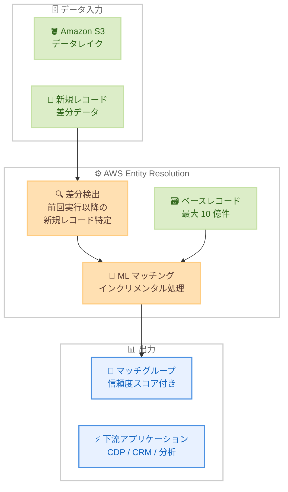

# AWS Entity Resolution - ML ベースインクリメンタルマッチングワークフロー

**リリース日**: 2026 年 5 月 4 日
**サービス**: AWS Entity Resolution
**機能**: Machine Learning ベースインクリメンタルマッチングワークフロー (GA)

📊 [このアップデートのインフォグラフィックを見る](https://takech9203.github.io/aws-news-summary/20260504-aws-entity-resolution-ml.html)

## 概要

AWS Entity Resolution が Machine Learning (ML) ベースのインクリメンタルマッチングワークフローの一般提供 (GA) を開始した。これにより、エンタープライズ規模でのエンティティ解決処理が根本的に変革される。従来、ML マッチングワークフローでは新しいレコードを 1 件追加するだけでもデータセット全体の再処理が必要であったが、本機能によりインクリメンタル (差分) 処理が可能になった。

この機能は、最後のワークフロー実行以降に追加された新しいレコードのみを処理する仕組みを提供する。100 万件のインクリメンタルレコードを 1 時間未満で処理可能であり、従来のフルバッチ処理と比較して処理時間を 95% 削減する。最大 10 億件の履歴ベースレコードに対して、最大 5,000 万件のインクリメンタルレコードをサポートするため、これまで経済的に不可能であった大規模で継続的なエンタープライズワークロードに AWS Entity Resolution を適用できるようになった。

**アップデート前の課題**

- ML マッチングワークフローでは、新しいレコードが 1 件追加されるだけでもデータセット全体を再処理する必要があった
- フルバッチ再処理には最大 2 日間の処理時間と数千ドルのコストが発生していた
- このボトルネックにより、大規模企業はコストの高い回避策や代替ソリューションを模索せざるを得なかった
- インクリメンタル処理は従来ルールベースマッチングにのみ対応しており、ML マッチングでは利用不可であった

**アップデート後の改善**

- ML マッチングワークフローで差分レコードのみを処理するインクリメンタル処理が可能になった
- 100 万件のインクリメンタルレコードを 1 時間未満で処理 (従来比 95% の時間削減)
- インフラコストの大幅な削減により、継続的な大規模ワークロードが経済的に実現可能になった
- 最大 10 億件の履歴レコードに対して最大 5,000 万件の差分処理をサポート

## アーキテクチャ図



ML ベースインクリメンタルマッチングワークフローのデータフローを示す。新規レコードのみが差分検出され、既存のベースレコード (最大 10 億件) に対して ML マッチング処理が実行される。

## サービスアップデートの詳細

### 主要機能

1. **ML ベースインクリメンタルマッチング**
   - 前回のワークフロー実行以降に追加された新規レコードのみを対象に ML マッチングを実行
   - データセット全体の再処理が不要になり、処理時間とコストを大幅に削減
   - 事前構成済み ML モデルによる高精度なマッチング品質を維持

2. **大規模データセット対応**
   - 最大 10 億件の履歴ベースレコードに対するインクリメンタル処理をサポート
   - 1 回のインクリメンタル実行で最大 5,000 万件の新規レコードを処理可能
   - エンタープライズ規模の継続的ワークロードに対応

3. **劇的なパフォーマンス向上**
   - 100 万件のインクリメンタルレコードを 1 時間未満で処理
   - 従来のフルバッチ処理と比較して 95% の処理時間削減
   - インフラコストの大幅な削減

## 技術仕様

### パフォーマンス仕様

| 項目 | 詳細 |
|------|------|
| 最大ベースレコード数 | 10 億件 |
| 最大インクリメンタルレコード数 | 5,000 万件/実行 |
| 処理速度 (100 万件) | 1 時間未満 |
| 処理時間削減率 | 約 95% (フルバッチ比) |
| マッチング手法 | 事前構成済み ML モデル |
| 出力形式 | マッチグループ + 信頼度スコア (0.0 - 1.0) |

### API 変更履歴

| 日付 | サービス | 変更内容 |
|------|----------|----------|
| 2026/05/01 | [entityresolution](https://awsapichanges.com/archive/changes/6338dd-entityresolution.html) | 3 updated api methods - CreateMatchingWorkflow, GetMatchingWorkflow, UpdateMatchingWorkflow に ruleConditionProperties.matchingConfig.enableTransitiveMatching パラメータを追加 |

### incrementalRunConfig の設定

```json
{
  "incrementalRunConfig": {
    "incrementalRunType": "IMMEDIATE"
  }
}
```

`incrementalRunType` を `IMMEDIATE` に設定することで、インクリメンタル処理モードが有効になる。ワークフロー実行時に前回の実行以降に追加されたレコードのみが処理対象となる。

### resolutionTechniques の設定例

```json
{
  "resolutionTechniques": {
    "resolutionType": "ML_MATCHING"
  },
  "incrementalRunConfig": {
    "incrementalRunType": "IMMEDIATE"
  }
}
```

## 設定方法

### 前提条件

1. AWS アカウントと適切な IAM 権限 (entityresolution:CreateMatchingWorkflow 等)
2. Amazon S3 バケットにデータ入力ソースが準備されていること
3. AWS Entity Resolution のスキーママッピングが定義済みであること
4. 初回のフルバッチ ML マッチングワークフローが完了していること

### 手順

#### ステップ 1: ML マッチングワークフローの作成 (インクリメンタル有効)

```bash
aws entityresolution create-matching-workflow \
  --workflow-name "my-incremental-ml-workflow" \
  --input-source-config '[{
    "inputSourceARN": "arn:aws:s3:::my-bucket/input/",
    "schemaName": "my-schema",
    "applyNormalization": true
  }]' \
  --output-source-config '[{
    "outputS3Path": "s3://my-bucket/output/",
    "output": [
      {"name": "first_name", "hashed": false},
      {"name": "last_name", "hashed": false},
      {"name": "email", "hashed": true}
    ]
  }]' \
  --resolution-techniques '{
    "resolutionType": "ML_MATCHING"
  }' \
  --incremental-run-config '{
    "incrementalRunType": "IMMEDIATE"
  }' \
  --role-arn "arn:aws:iam::123456789012:role/EntityResolutionRole"
```

ML マッチングワークフローを作成し、`incrementalRunConfig` で `IMMEDIATE` を指定してインクリメンタル処理を有効にする。

#### ステップ 2: 初回フルバッチ実行

```bash
aws entityresolution start-matching-job \
  --workflow-name "my-incremental-ml-workflow"
```

初回実行ではすべてのレコードがフルバッチで処理され、ベースラインのマッチグループが生成される。

#### ステップ 3: インクリメンタル実行

```bash
# 新しいレコードを S3 に追加した後、同じワークフローを再実行
aws entityresolution start-matching-job \
  --workflow-name "my-incremental-ml-workflow"
```

2 回目以降の実行では、前回の実行以降に追加された新規レコードのみが処理される。既存のベースレコードとの照合が行われ、マッチグループが更新される。

#### ステップ 4: ジョブステータスの確認

```bash
aws entityresolution get-matching-job \
  --workflow-name "my-incremental-ml-workflow" \
  --job-id "job-id-from-start-matching-job"
```

ジョブの進行状況、処理済みレコード数、マッチ数などのメトリクスを確認する。

## メリット

### ビジネス面

- **コスト削減**: 差分レコードのみの課金により、継続的な ML マッチング処理のコストが大幅に削減される
- **リアルタイムに近い鮮度**: 日次または高頻度でのインクリメンタル実行により、マッチ結果を常に最新の状態に維持できる
- **スケーラビリティ**: 10 億件規模のデータセットに対して経済的にエンティティ解決を実行でき、大規模エンタープライズのユースケースに対応

### 技術面

- **処理時間 95% 削減**: 100 万件のインクリメンタルレコードを 1 時間未満で処理可能
- **既存ワークフローとの互換性**: `incrementalRunConfig` の追加のみで既存の ML ワークフローをインクリメンタルに変換可能
- **高精度維持**: フルバッチ処理と同じ事前構成済み ML モデルを使用し、マッチング品質を維持

## デメリット・制約事項

### 制限事項

- インクリメンタルレコード数の上限は 1 回の実行あたり 5,000 万件
- ベースレコード数の上限は 10 億件
- 初回実行は必ずフルバッチ処理が必要 (ベースライン構築)
- ML マッチングモデルはカスタマイズ不可 (事前構成済みモデルのみ)

### 考慮すべき点

- ML マッチングの入力フィールドは名前、メールアドレス、電話番号、住所、生年月日に限定される
- インクリメンタル処理の精度は、ベースレコードの品質に依存する
- データの大幅な変更 (既存レコードの更新や削除) がある場合は、定期的なフルバッチ再処理の実行を検討する必要がある
- AWS Free Tier は AWS Entity Resolution には適用されない

## ユースケース

### ユースケース 1: ロイヤルティプログラムの継続的な重複排除

**シナリオ**: 航空会社が数百万人のロイヤルティプログラム会員データベースを運用しており、日々新規会員が追加される。従来は毎週フルバッチ処理に 2 日間を費やしていたが、インクリメンタル処理により新規会員のみを処理する。

**実装例**:
```json
{
  "workflowName": "loyalty-dedup-incremental",
  "resolutionTechniques": {
    "resolutionType": "ML_MATCHING"
  },
  "incrementalRunConfig": {
    "incrementalRunType": "IMMEDIATE"
  },
  "inputSourceConfig": [{
    "inputSourceARN": "arn:aws:s3:::loyalty-data/members/",
    "schemaName": "loyalty-member-schema",
    "applyNormalization": true
  }]
}
```

**効果**: 日次バッチで新規会員 (約 1 万件/日) のみを処理し、処理時間を 2 日から数分に短縮。年間のインフラコストを 90% 以上削減。

### ユースケース 2: マルチチャネル顧客プロファイルの統合

**シナリオ**: EC サイト、実店舗、モバイルアプリなど複数チャネルから日々追加される顧客データを統合し、統一顧客プロファイルを維持する。8 億件の履歴レコードに対して、毎日 50 万件の新規インタラクションを処理する。

**実装例**:
```bash
# 日次バッチジョブとして EventBridge + Step Functions で自動化
aws entityresolution start-matching-job \
  --workflow-name "customer-360-ml-incremental"

# ジョブ完了後、マッチ結果を下流システムに連携
aws entityresolution get-matching-job \
  --workflow-name "customer-360-ml-incremental" \
  --job-id "$JOB_ID"
```

**効果**: 日次でのカスタマー 360 更新が可能になり、パーソナライゼーション施策の鮮度が向上。フルバッチ処理が不要になりコストを大幅に抑制。

### ユースケース 3: 医療研究データのインクリメンタル名寄せ

**シナリオ**: 複数の医療機関から継続的に収集される患者レコード (氏名、生年月日、住所等) を名寄せし、臨床研究や疫学調査のためのデータセットを構築する。5 億件の既存レコードに対して、月次で 200 万件の新規レコードを追加処理する。

**実装例**:
```json
{
  "workflowName": "clinical-research-matching",
  "resolutionTechniques": {
    "resolutionType": "ML_MATCHING"
  },
  "incrementalRunConfig": {
    "incrementalRunType": "IMMEDIATE"
  },
  "outputSourceConfig": [{
    "outputS3Path": "s3://clinical-data/matched-output/",
    "output": [
      {"name": "patient_name", "hashed": true},
      {"name": "date_of_birth", "hashed": true},
      {"name": "address", "hashed": true}
    ],
    "applyNormalization": true
  }]
}
```

**効果**: 月次のデータ更新を数時間で完了し、研究者が最新のマッチ結果を迅速に活用可能。PHI データのハッシュ化出力によりコンプライアンスも確保。

## 料金

AWS Entity Resolution の ML マッチングワークフローの料金は、処理されたレコード数に基づいて課金される。インクリメンタル処理では、新規に処理されたレコードのみが課金対象となる。

| マッチング手法 | 料金 |
|----------------|------|
| ルールベースまたは ML マッチング | $0.25 / 1,000 レコード |
| データサービスプロバイダーマッチング | $0.10 / 1,000 レコード |

### 料金例

| シナリオ | 月額料金 (概算) |
|----------|------------------|
| 100 万件のインクリメンタルレコード/月 (ML) | $250 |
| 500 万件のインクリメンタルレコード/月 (ML) | $1,250 |
| 1,000 万件のインクリメンタルレコード/月 (ML) | $2,500 |

**重要**: インクリメンタル処理では、前回処理済みのベースレコードに対する再課金は発生しない。課金対象は新規に追加されたインクリメンタルレコードのみである。

## 利用可能リージョン

AWS Entity Resolution が利用可能なすべてのリージョンで本機能を利用できる。

| リージョン | コード |
|------------|--------|
| 米国東部 (バージニア北部) | us-east-1 |
| 米国東部 (オハイオ) | us-east-2 |
| 米国西部 (オレゴン) | us-west-2 |
| カナダ (中部) | ca-central-1 |
| アジアパシフィック (東京) | ap-northeast-1 |
| アジアパシフィック (ソウル) | ap-northeast-2 |
| アジアパシフィック (シンガポール) | ap-southeast-1 |
| アジアパシフィック (シドニー) | ap-southeast-2 |
| 欧州 (フランクフルト) | eu-central-1 |
| 欧州 (アイルランド) | eu-west-1 |
| 欧州 (ロンドン) | eu-west-2 |
| アフリカ (ケープタウン) | af-south-1 |

## 関連サービス・機能

- **Amazon S3**: Entity Resolution のデータ入力ソースおよび出力先として使用
- **AWS Glue**: スキーママッピングの定義やデータカタログとの連携に使用
- **Amazon Connect Customer Profiles**: Entity Resolution の出力を顧客プロファイルに統合して活用
- **AWS Step Functions**: インクリメンタルワークフローの自動化パイプライン構築に活用
- **Amazon EventBridge**: S3 へのデータ到着をトリガーにインクリメンタル処理を自動起動

## 参考リンク

- 📊 [インフォグラフィック](https://takech9203.github.io/aws-news-summary/20260504-aws-entity-resolution-ml.html)
- [公式発表 (What's New)](https://aws.amazon.com/about-aws/whats-new/2026/05/aws-entity-resolution-ml/)
- [AWS Entity Resolution ユーザーガイド](https://docs.aws.amazon.com/entityresolution/latest/userguide/)
- [AWS Entity Resolution 製品ページ](https://aws.amazon.com/entity-resolution/)
- [料金ページ](https://aws.amazon.com/entity-resolution/pricing/)
- [API リファレンス - CreateMatchingWorkflow](https://docs.aws.amazon.com/entityresolution/latest/apireference/API_CreateMatchingWorkflow.html)
- [AWS API Changes - EntityResolution](https://awsapichanges.com/archive/changes/6338dd-entityresolution.html)

## まとめ

AWS Entity Resolution の ML ベースインクリメンタルマッチングワークフローの GA により、大規模データセットに対する ML マッチング処理が劇的に効率化された。処理時間 95% 削減と差分レコードのみの課金モデルにより、これまで経済的に困難であった 10 億件規模のデータセットに対する継続的なエンティティ解決が現実的な選択肢となった。日次や高頻度でのインクリメンタル実行を既存のデータパイプラインに組み込み、カスタマー 360、重複排除、データ品質管理などのユースケースに活用することを推奨する。
