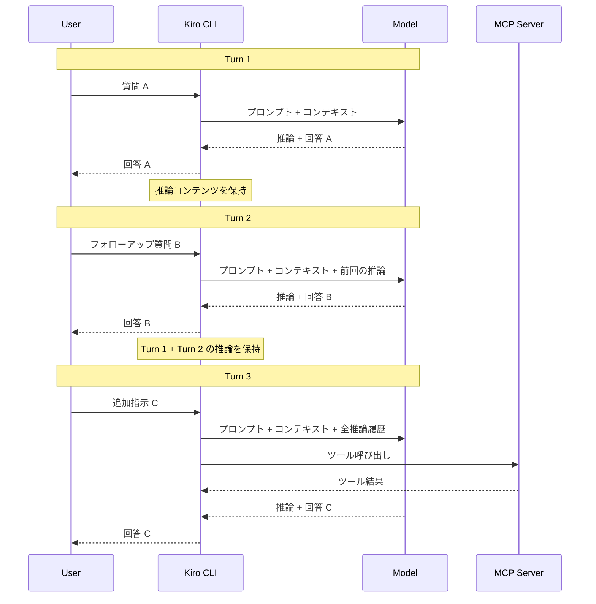

# Kiro CLI - Adaptive Thinking Across Multi-Turn Conversations

**リリース日**: 2026 年 5 月 4 日
**サービス**: Kiro (AWS AI-powered IDE)
**機能**: Adaptive Thinking / Subagent Tool Dispatch Fix (CLI v2.2)

[このアップデートのインフォグラフィックを見る](https://takech9203.github.io/aws-news-summary/20260504-kiro-changelog-2026-05-04.html)

## 概要

Kiro CLI v2.2 では、マルチターン会話におけるモデルの推論を保持する「Adaptive Thinking」機能が導入された。これにより、会話のコンテキストが蓄積される中で、以前のターンで行われた推論内容が後続のターンでも利用可能になり、一貫性のある回答が得られるようになる。

また、MCP サーバーが実行中にツールスペックを更新した際にサブエージェントのツールディスパッチがサイレントに失敗するバグも修正されている。

**アップデート前の課題**

- マルチターン会話において、モデルの推論 (思考プロセス) が各ターンで独立しており、以前の推論結果が失われていた
- 複数ステップのワークフローで、ユーザーが毎回コンテキストを再説明する必要があった
- MCP サーバーがツールスペックを更新した場合、サブエージェントのツール呼び出しがエラーなく失敗し、デバッグが困難だった

**アップデート後の改善**

- モデルの思考コンテンツが会話全体を通じて保持され、後続のターンでも参照可能になった
- コンテキストの再説明なしに、一貫性のあるマルチステップワークフローが実現できるようになった
- MCP サーバーのツールスペック変更時にキャッシュされたスペックが正しく無効化・再取得されるようになった

## アーキテクチャ図



Adaptive Thinking により、各ターンの推論コンテンツが累積的に保持され、モデルが一貫した文脈で応答を生成する流れを示している。

## サービスアップデートの詳細

### 主要機能

1. **Adaptive Thinking (マルチターン推論保持)**
   - Kiro CLI がマルチターン会話全体でモデルの推論を保持するようになった
   - 以前のターンの思考コンテンツ (Thought content) が後続のターンでモデルに引き続き利用可能
   - フォローアップの回答が、以前の回答を生成した推論と整合性を維持
   - コンテキストを再説明せずに、より一貫性のあるマルチステップワークフローを実現

2. **Subagent Tool Dispatch Fix (MCP ツールディスパッチ修正)**
   - MCP サーバーイベントがキャッシュされたツールスペックを無効化した際のサイレント失敗を修正
   - 実行中に MCP サーバーがツールスペックを更新しても、サブエージェントが正しくツールを呼び出せるようになった
   - キャッシュされたツールスペックの自動再取得メカニズムが追加された

## 技術仕様

### Adaptive Thinking の動作仕様

| 項目 | 詳細 |
|------|------|
| 対象 | Kiro CLI v2.2 以降 |
| 保持対象 | モデルの Thought content (推論コンテンツ) |
| スコープ | 単一の会話セッション内 |
| 動作 | 自動 (追加設定不要) |
| 対象プラットフォーム | macOS, Linux, Windows |

### Subagent Tool Dispatch Fix の詳細

| 項目 | 詳細 |
|------|------|
| 修正対象 | サブエージェントのツール呼び出し |
| 発生条件 | MCP サーバーが実行中にツールスペックを変更 |
| 根本原因 | キャッシュされたツールスペックが無効化イベントで更新されなかった |
| 修正内容 | スペック無効化時の自動再取得処理を追加 |

## メリット

### ビジネス面

- **開発効率の向上**: コンテキストの再説明が不要になり、複雑なタスクの会話効率が向上
- **ワークフローの一貫性**: マルチステップの開発作業で、以前の判断や理由が保持されるため手戻りが減少
- **信頼性の向上**: MCP ツール呼び出しのサイレント失敗が解消され、自動化パイプラインの安定性が向上

### 技術面

- **コンテキストウィンドウの有効活用**: 推論履歴の自動保持により、手動でのコンテキスト管理が不要
- **MCP 連携の堅牢性**: ツールスペックの動的変更に対応し、長時間実行セッションでの安定性が向上
- **デバッグ容易性**: サイレント失敗がなくなり、ツール呼び出しの問題を早期に検出可能

## デメリット・制約事項

### 制限事項

- Adaptive Thinking は単一の会話セッション内のみで有効。セッションをまたいだ推論保持は対象外
- コンテキストウィンドウの上限に達した場合、古い推論コンテンツが切り捨てられる可能性がある
- 推論コンテンツの保持によりトークン消費が増加する可能性がある

### 考慮すべき点

- 長時間のマルチターン会話では、累積される推論コンテンツによりレスポンスのレイテンシが増加する場合がある
- MCP サーバー側のツールスペック更新頻度が高い場合、再取得のオーバーヘッドが発生する可能性がある

## ユースケース

### ユースケース 1: 段階的なコードリファクタリング

**シナリオ**: 大規模なコードベースのリファクタリングを複数ターンに分けて実行する場合

**実装例**:
```
Turn 1: 「このモジュールの依存関係を分析して」
Turn 2: 「分析結果に基づいてインターフェースを再設計して」
Turn 3: 「再設計に合わせて実装を更新して」
```

**効果**: 各ターンで以前の分析・設計判断の推論が保持されるため、一貫したリファクタリングが可能。以前は Turn 2 で「先ほどの分析では...」と再度説明する必要があった。

### ユースケース 2: デバッグセッション

**シナリオ**: 複雑なバグの原因調査を段階的に行う場合

**実装例**:
```
Turn 1: 「このエラーログを分析して原因を推測して」
Turn 2: 「関連するコードパスを確認して」
Turn 3: 「修正案を提示して」
```

**効果**: モデルが Turn 1 で行った推論 (仮説の立案、除外した可能性) が Turn 2, 3 でも参照され、一貫した調査が可能。

### ユースケース 3: MCP サーバーと連携した自動化ワークフロー

**シナリオ**: CI/CD パイプラインで MCP サーバーのツールを使用してサブエージェントがタスクを実行中に、サーバー側でツールスペックが更新される場合

**実装例**:
```
# headless モードでの自動実行
kiro --headless "テストを実行し、失敗したテストを修正して再実行して"
```

**効果**: MCP サーバーのツールスペック更新時もサブエージェントのツール呼び出しが正常に続行され、自動化ワークフローが中断しない。

## 利用可能リージョン

Kiro はグローバルサービスとして提供されており、リージョンの制約なく利用可能。

## 関連サービス・機能

- **Kiro CLI Headless Mode**: CI/CD 環境での自動実行に対応したモードで、Adaptive Thinking と組み合わせて利用可能
- **MCP (Model Context Protocol)**: 外部ツールサーバーとの接続プロトコル。今回のツールディスパッチ修正の対象
- **Kiro Subagents**: 並列タスク実行を可能にするサブエージェント機能。ツールディスパッチ修正により安定性が向上

## 参考リンク

- [インフォグラフィック](https://takech9203.github.io/aws-news-summary/20260504-kiro-changelog-2026-05-04.html)
- [Kiro Changelog](https://kiro.dev/changelog/)
- [Kiro ドキュメント](https://kiro.dev/docs/)

## まとめ

Kiro CLI v2.2 の Adaptive Thinking は、マルチターン会話における開発体験を大幅に改善する機能である。推論の保持により、複雑なマルチステップワークフローでの一貫性が向上し、コンテキストの再説明という認知的負荷が軽減される。また、MCP ツールディスパッチのサイレント失敗修正により、MCP サーバーを活用した自動化ワークフローの信頼性も向上している。Kiro CLI を日常的に使用しているユーザーは v2.2 へのアップデートを推奨する。
